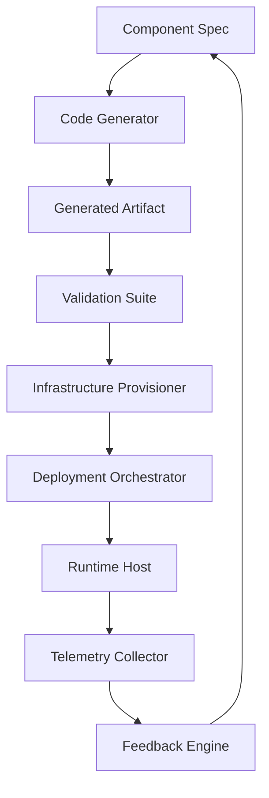

# Generation and Operations Are One Thing

## Introduction
For years teams treated code generation and production operations as separate concerns. A developer would write code, hand it off to a CI system, and then rely on an ops team to monitor and scale the running service. This split created feedback latency, environment drift, and operational debt. Modern web platforms are collapsing that boundary: the act of generating a component, its infrastructure, and its runtime telemetry now flows through a single, continuous loop. This article explains how that loop works, why it matters, and how to implement it safely in production.

## Why This Matters
When generation and ops remain distinct, teams pay a hidden cost every time a change moves from laptop to cloud. Misconfigured environment variables, missing feature flags, or undetected performance regressions surface only after deployment, forcing rollbacks and hotfixes. By treating generation as an operationally aware step—where the emitted artifact carries built‑in health checks, metric hooks, and deployment metadata—you catch problems earlier, reduce mean time to recovery, and free engineers to focus on product logic rather than plumbing. The result is faster iteration cycles with higher confidence in production stability.

## How It Works
The core idea is a closed‑loop pipeline where a specification drives both code creation and provisioning, while runtime data feeds back to refine the specification. The diagram below shows the data flow.



**Step‑by‑step flow**

1. **Component Spec** – A declarative object (JSON, YAML, or TypeScript) that describes the desired UI, behavior, and non‑functional requirements (e.g., latency SLA, allowed bundle size).
2. **Code Generator** – Consumes the spec and emits a deployable artifact: a frontend bundle, a serverless function, or a container image. The generator also injects instrumentation boilerplate (structured logging, metric counters, health‑check endpoints).
3. **Generated Artifact** – The output of the generator, versioned and stored in an artifact registry (e.g., GitHub Packages, ECR).
4. **Validation Suite** – Runs static tests (type checking, linting, security scanning) and contract tests against the spec. Failure halts the pipeline and alerts the author.
5. **Infrastructure Provisioner** – Reads deployment‑related fields from the spec (e.g., required memory, concurrency limits, edge region) and creates or updates the necessary cloud resources (AWS Lambda, Cloudflare Workers, Vercel edge functions).
6. **Deployment Orchestrator** – Takes the validated artifact and the provisioned infra, performs the rollout (canary, blue/green, or instant switch), and records the deployment metadata.
7. **Runtime Host** – The platform where the artifact runs. It emits telemetry via the injected instrumentation.
8. **Telemetry Collector** – Aggregates logs, metrics, and traces, forwarding them to a storage backend (Prometheus, Loki, Datadog).
9. **Feedback Engine** – Analyzes the telemetry against the spec’s SLA fields. If drift is detected (e.g., error rate > threshold), it proposes a spec update—perhaps increasing allocated memory or adjusting a caching rule—and opens a pull request for the developer to review.

Because each step is idempotent and the spec is the single source of truth, the loop can be re‑run safely after any change, ensuring that generation and ops stay aligned.

## Core Concepts
- **Specification‑Driven Generation** – The spec encodes both functional and operational concerns. Changing the spec automatically triggers a new generation cycle.
- **Embedded Observability** – Generated artifacts contain metric emission, structured logs, and health‑check endpoints by default; no manual instrumentation is required.
- **Immutable Artifacts** – Once generated and validated, an artifact is promoted through environments without modification, eliminating “works on my machine” gaps.
- **Telemetry‑First Feedback** – Metrics are not just for dashboards; they directly influence the next generation cycle via automated spec adjustments.
- **Transactional Rollback** – If any stage fails, the orchestrator rolls back provisioning and deployment steps to the last known good state, keeping the system consistent.

## Examples & Code Walkthrough
Below is a simplified TypeScript implementation that illustrates the loop. It is not production‑ready but shows the key pieces: spec definition, generation, provisioning, deployment, telemetry collection, and feedback.

```typescript
// spec.ts
export interface ComponentSpec {
  name: string;
  entryPoint: string; // path to source file
  runtime: 'nodejs18' | 'js';
  memoryMb: number;
  concurrencyLimit: number;
  latencySlaMs: number;
}

// generator.ts
import { ComponentSpec } from './spec';
import { writeFileSync } from 'fs';
import { dirname } from 'path';

export function generateArtifact(spec: ComponentSpec, outDir: string): string {
  // In a real system this would transpile/bundle source code.
  const handlerCode = `
    import { logger, metric } from './telemetry';
    export const handler = async (event) => {
      const start = Date.now();
      try {
        // placeholder business logic
        const result = { ok: true };
        metric('request_latency', Date.now() - start);
        logger.info('request processed', { latencyMs: Date.now() - start });
        return result;
      } catch (err) {
        metric('request_error', 1);
        logger.error('request failed', { error: err.message });
        throw err;
      }
    };
  `;
  const filePath = `${outDir}/${spec.name}.handler.ts`;
  writeFileSync(filePath, handlerCode, { encoding: 'utf8' });
  return filePath;
}

// provisioner.ts
import { ComponentSpec } from './spec';

export async function provisionInfra(spec: ComponentSpec): Promise<string> {
  // Mock call to a cloud API; returns an identifier for the deployed function.
  // Real implementation would use AWS SDK, Cloudflare API, etc.
  console.log(`Provisioning ${spec.name} with ${spec.memoryMb}MB memory`);
  return `arn:aws:lambda:us-east-1:123456789012:function:${spec.name}`;
}

// deployer.ts
import { ComponentSpec } from './spec';

export async function deployArtifact(
  spec: ComponentSpec,
  artifactPath: string,
  functionArn: string
): Promise<void> {
  // Mock deployment: upload artifact and update function configuration.
  console.log(`Deploying ${artifactPath} to ${functionArn}`);
  // In practice: S3 upload + Lambda update-function-code.
}

// telemetryCollector.ts
export interface MetricSnapshot {
  latencyMs: number;
  errorCount: number;
}

export async function collectMetrics(functionArn: string): Promise<MetricSnapshot> {
  // Pull recent metrics from monitoring system.
  // Here we return fake data for illustration.
  return { latencyMs: 85, errorCount: 0 };
}

// feedbackEngine.ts
import { ComponentSpec } from './spec';
import { MetricSnapshot } from './telemetryCollector';

export function evaluateFeedback(
  spec: ComponentSpec,
  snapshot: MetricSnapshot
): Partial<ComponentSpec> | null {
  const updates: Partial<ComponentSpec> = {};
  if (snapshot.latencyMs > spec.latencySlaMs) {
    // Suggest more memory to reduce cold start.
    updates.memoryMb = Math.min(spec.memoryMb + 256, 3072);
  }
  if (snapshot.errorCount > 0) {
    // Suggest lowering concurrency to limit burst errors.
    updates.concurrencyLimit = Math.max(spec.concurrencyLimit - 1, 1);
  }
  return Object.keys(updates).length > 0 ? updates : null;
}

// orchestrator.ts
import { ComponentSpec } from './spec';
import { generateArtifact } from './generator';
import { provisionInfra } from './provisioner';
import { deployArtifact } from './deployer';
import { collectMetrics } from './telemetryCollector';
import { evaluateFeedback } from './feedbackEngine';
import { writeFileSync } from 'fs';

export async function runGenOpLoop(spec: ComponentSpec, workDir: string): Promise<void> {
  try {
    console.log('--- Generation & Operations Loop Start ---');
    const artifactPath = generateArtifact(spec, workDir);
    console.log(`Generated artifact at ${artifactPath}`);

    const functionArn = await provisionInfra(spec);
    console.log(`Provisioned infra: ${functionArn}`);

    await deployArtifact(spec, artifactPath, functionArn);
    console.log('Deployment complete');

    const metrics = await collectMetrics(functionArn);
    console.log(`Collected metrics: ${JSON.stringify(metrics)}`);

    const feedback = evaluateFeedback(spec, metrics);
    if (feedback) {
      const updatedSpec = { ...spec, ...feedback };
      // Persist updated spec (could write to a config repo).
      writeFileSync(`${workDir}/${spec.name}.spec.json`, JSON.stringify(updatedSpec, null, 2), { encoding: 'utf8' });
      console.log(`Updated spec written with feedback: ${JSON.stringify(feedback)}`);
      // Optionally trigger a new loop automatically.
      // await runGenOpLoop(updatedSpec, workDir);
    } else {
      console.log('Spec within SLA; no feedback needed.');
    }
    console.log('--- Loop Completed Successfully ---');
  } catch (err) {
    console.error('Loop failed:', err);
    // In a real system you would trigger rollback procedures here.
    throw err;
  }
}
```

**Explanation of the example**

- The `ComponentSpec` holds both UI‑related fields (`entryPoint`) and ops‑related fields (`memoryMb`, `concurrencyLimit`, `latencySlaMs`).
- `generateArtifact` creates a TypeScript handler that already imports a telemetry shim (`logger`, `metric`). No extra step is needed to add observability.
- `provisionInfra` and `deployArtifact` are thin wrappers around cloud APIs; they treat the artifact as an immutable unit.
- After deployment, `collectMetrics` pulls latency and error counts. `evaluateFeedback` compares those numbers to the SLA and returns a patch to the spec if needed.
- The orchestrator ties everything together in a `try/catch` block, ensuring any failure surfaces clearly and can trigger a compensatory rollback (omitted for brevity).

This snippet demonstrates how a single source of truth (the spec) drives both creation and operation, while runtime data closes the loop.

## Best Practices
- **Keep the spec declarative and version‑controlled.** Treat it like any other source file; changes go through pull request review.
- **Make generated artifacts self‑describing.** Embed a manifest (e.g., a JSON blob) that lists the spec version, generated timestamp, and required telemetry keys.
- **Use idempotent provisioning scripts.** Running the same provision step twice should leave infrastructure unchanged, enabling safe retries.
- **Instrument at the generator level.** Inject metric counters, histograms, and structured logging templates directly into the output code; avoid relying on developers to add them later.
- **Validate before you promote.** Run unit, integration, and contract tests against the generated artifact in an isolated sandbox before touching production infrastructure.
- **Implement circuit‑breaker feedback.** If telemetry shows sustained SLA violation, automatically pause further generations and alert the on‑call engineer.
- **Audit the generator.** Periodically review the generation templates for security issues (e.g., injection vulnerabilities) and keep them locked to a known good commit.
- **Observe the loop itself.** Metrics on loop duration, failure rate, and feedback frequency help you tune the pipeline’s responsiveness.

## Common Mistakes & Anti-Patterns
| Mistake | Why it hurts | Fix |
|---------|--------------|-----|
| **Treating the spec as mutable documentation** | If the spec drifts from what is actually deployed, feedback becomes meaningless. | Enforce spec immutability per version; store specs in a Git repo and tag releases. |
| **Skipping validation of generated code** | Generated output may contain syntax errors or insecure patterns that only appear in production. | Run a mandatory validation suite (lint, type check, security scan) after generation and before provisioning. |
| **Hard‑coding environment values in the generator** | Makes the loop non‑portable across stages (dev, staging, prod). | Pull environment‑specific values from the spec or an external config service; never bake them into the template. |
| **Ignoring telemetry cardinality** | High‑cardinality metrics (e.g., per‑request IDs) can overwhelm monitoring systems and increase cost. | Use aggregation (histograms, summary metrics) in the telemetry shim; reserve high‑cardinality fields for sampled traces. |
| **Creating tight coupling between generator and a single cloud provider** | Limits flexibility and creates vendor lock‑in. | Abstract provisioning behind an interface; implement adapters for AWS, Cloudflare, Vercel, etc., and select via spec field. |

## Performance Considerations
- **CPU overhead of generation** – The generator runs on each spec change. Keep transformation logic lightweight (e.g., template rendering) and cache results when the spec has not changed.
- **Memory usage during validation** – Large artifact bundles can spike memory in CI workers. Stream validation where possible (e.g., incremental type checking).
- **Network latency in provisioning** – Cloud API calls add seconds to the loop. Use bulk operations or parallelize independent provisions (e.g., provision multiple functions concurrently).
- **Telemetry collection interval** – Frequent scraping increases load on the monitoring backend. Align collection windows with the loop cadence (e.g., every 30 seconds) or
