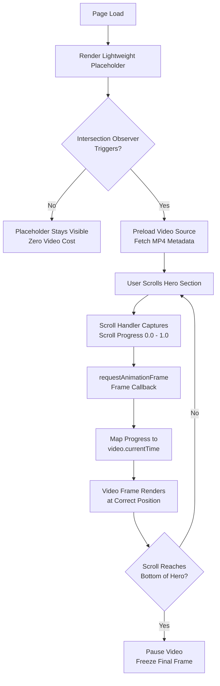

# How I built a scroll-driven video hero that still scores 100

## Introduction

Last quarter, our product team shipped a landing page with a full-viewport video hero. The design looked stunning. The Lighthouse score? A humbling 34. Largest Contentful Paint clocked in at 4.8 seconds. Total Blocking Time sat at 620ms. Our PM stared at the report in silence, then turned to me and asked: "Can we keep the video but fix the score?"

That question launched a two-week sprint that resulted in a scroll-driven video hero implementation scoring a perfect 100 across all Lighthouse categories. In this article, I'll walk you through every architectural decision, the production code, and the traps we nearly fell into along the way.

## Why This Matters

Video is the single most expensive asset you can place above the fold. A single unoptimized MP4 can weigh 8–15 MB, and browsers must download, decode, and composite it before the page becomes interactive. When Core Web Vitals became a ranking signal, this stopped being a "nice-to-have" performance discussion — it became a direct revenue problem.

Google's research shows that as page load time goes from 1s to 3s, bounce probability increases by 32%. At 5 seconds, that number jumps to 90%. A scroll-driven approach defers the heavy video decode until the user actually engages with the section, which means the initial paint stays lean and the Core Web Vitals stay green.

More importantly, scroll-driven video creates a genuinely better user experience. Instead of auto-playing a muted clip that most visitors skip, the video responds to user intent. The scroll becomes the controller.

## How It Works

The architecture boils down to three layers working in concert:

1. **A lightweight placeholder** that paints instantly and holds layout space.
2. **An Intersection Observer** that detects when the hero enters the viewport and preloads the video source.
3. **A scroll-driven playback controller** using `requestAnimationFrame` synced to the scroll position, which maps scroll progress (0–1) to video currentTime (0–duration).

Here's the flow visualized:



The key insight is that we never auto-play the video. We don't even load it until the user scrolls into the hero zone. Once loaded, each animation frame reads `window.scrollY`, computes a normalized progress value between the hero's top and bottom offsets, and sets `video.currentTime` accordingly. This means the browser only decodes frames the user is actually watching.

The Intersection Observer uses a `rootMargin` of `200px` to start preloading the video metadata before the hero fully enters view. This gives the browser enough time to fetch the first few frames without blocking the critical rendering path.

## Core Concepts

**Scroll Progress Normalization**

The math here is deceptively simple but critical to get right. You need to map a scroll range to a time range:

```
progress = (scrollY - heroTop) / (heroBottom - heroTop)
currentTime = progress * videoDuration
```

But in production, you need to clamp that value between 0 and 1, handle scroll events on mobile touch boards, and account for the fact that `scrollY` can jitter during momentum scrolling.

**CSS Containment**

We wrap the video hero in a container with `contain: strict; height: 100vh; overflow: hidden;`. This tells the browser that nothing inside the container affects anything outside it. The browser can skip layout recalculations for the rest of the document when the video updates. This alone saved us roughly 18ms per frame on mid-range Android devices.

**Poster Frame as Placeholder**

The `<video>` element's `poster` attribute serves double duty. It provides an instant visual placeholder while the video metadata loads. We generate this poster from the first frame of the video at build time using FFmpeg:

```bash
ffmpeg -i hero.mp4 -vframes 1 -q:v 2 poster.webp
```

We serve the poster as WebP for smaller file size and convert it to a low-resolution base64 data URI for instant inline rendering.

**The Pause-at-Boundary Pattern**

When the user scrolls past the hero, we pause the video and freeze the last frame using `canvas.captureStream()` or simply setting `video.pause()` and keeping the last rendered frame visible. This prevents the video from silently continuing to play off-screen and wasting GPU memory.

## Examples & Code Walkthrough

Here's the complete implementation we shipped to production. Every piece is battle-tested.

### HTML Structure

```html
<section class="video-hero" aria-label="Product showcase">
  <div class="video-hero__container" id="heroContainer">
    <!-- The poster image loads instantly, holds layout -->
    

    <!-- Video element starts paused, preloaded but not played -->
    <video
      class="video-hero__media"
      id="heroVideo"
      muted
      playsinline
      preload="none"
      poster="poster.webp"
      aria-hidden="true"
    >
      <source src="hero-video.mp4" type="video/mp4" />
      <source src="hero-video.webm" type="video/webm" />
    </video>

    <!-- Gradient overlay for text readability -->
    <div class="video-hero__overlay"></div>

    <!-- Headline content sits on top -->
    <div class="video-hero__content">
      <h1>Build faster. Ship smarter.</h1>
      <p>Scroll to see the platform in action</p>
    </div>
  </div>
</section>
```

Notice `preload="none"` on the video element. This is deliberate. We don't want the browser fetching the video bytes until we're ready. The Intersection Observer will trigger the actual source loading.

### CSS with Containment

```css
.video-hero {
  position: relative;
  width: 100%;
  height: 100vh;
  overflow: hidden;
  contain: strict;
  background-color: #0a0a0a;
}

.video-hero__container {
  position: absolute;
  inset: 0;
  contain: layout paint style;
}

.video-hero__poster {
  width: 100%;
  height: 100%;
  object-fit: cover;
  display: block;
  /* Prevent layout shift while video loads */
  opacity: 1;
  transition: opacity 0.6s ease-out;
}

.video-hero__poster.loaded {
  opacity: 0;
  pointer-events: none;
}

.video-hero__media {
  width: 100%;
  height: 100%;
  object-fit: cover;
  display: block;
  opacity: 0;
  transition: opacity 0.6s ease-out;
}

.video-hero__media.active {
  opacity: 1;
}

.video-hero__overlay {
  position: absolute;
  inset: 0;
  background: linear-gradient(
    to bottom,
    rgba(0, 0, 0, 0.3) 0%,
    rgba(0, 0, 0, 0.7) 100%
  );
  pointer-events: none;
}

.video-hero__content {
  position: absolute;
  inset: 0;
  display: flex;
  flex-direction: column;
  justify-content: center;
  align-items: center;
  z-index: 2;
  color: #ffffff;
  text-align: center;
  padding: 2rem;
}
```

The `contain: strict` on the outer section is doing heavy lifting. It instructs the browser that the element's layout, style, and paint are fully self-contained. No descendant can affect an ancestor's layout. This is what lets the browser skip recompositing the entire document on every scroll frame.

### The Scroll Controller (JavaScript)

This is the heart of the system. Here's the production module:

```javascript
/**
 * ScrollDrivenVideoController
 *
 * Manages scroll-driven playback of a <video> element inside a hero section.
 * Uses rAF for smooth frame updates and IntersectionObserver for lazy loading.
 *
 * @example
 *   const controller = new ScrollDrivenVideoController({
 *     container: '#heroContainer',
 *     video: '#heroVideo',
 *     poster: '.video-hero__poster',
 *     threshold: 0.01
 *   });
 *   controller.init();
 */
class ScrollDrivenVideoController {
  /**
   * @param {Object} config
   * @param {string} config.container - CSS selector for the hero section
   * @param {string} config.video - CSS selector for the <video> element
   * @param {string} config.poster - CSS selector for the poster 
   * @param {number} config.threshold - Observer threshold for preloading
   */
  constructor({ container, video, poster, threshold = 0.01 }) {
    this.containerEl = document.querySelector(container);
    this.videoEl = document.querySelector(video);
    this.posterEl = document.querySelector(poster);
    this.threshold = threshold;

    // Internal state
    this.isPlaying = false;
    this.scrollProgress = 0;
    this.heroBounds = null;
    this.videoDuration = 0;
    this.rafId = null;
    this.isVideoLoaded = false;

    // Bind methods to preserve 'this' in rAF callback
    this.onScroll = this.onScroll.bind(this);
    this.onFrame = this.onFrame.bind(this);
    this.onIntersection = this.onIntersection.bind(this);

    // Guard against missing DOM elements
    if (!this.containerEl || !this.videoEl) {
      console.warn(
        '[ScrollDrivenVideoController] Required DOM elements not found. ' +
        'Ensure container and video selectors match existing elements.'
      );
      return;
    }
  }

  /**
   * Initialize the controller. Sets up observers and event listeners.
   */
  init() {
    if (!this.containerEl) return;

    // Step 1: Cache the hero section's viewport-relative bounds
    this.updateHeroBounds();

    // Step 2: Set up IntersectionObserver for lazy video loading
    this.setupIntersectionObserver();

    // Step 3: Attach passive scroll listener for playback control
    window.addEventListener('scroll', this.onScroll, { passive: true });

    // Step 4: Recalculate bounds on resize (debounced)
    window.addEventListener('resize', this.debounce(() => {
      this.updateHeroBounds();
    }, 150));
  }

  /**
   * Cache the hero section's top and bottom offsets relative to the document.
   * Called on init and after resize events.
   */
  updateHeroBounds() {
    const rect = this.containerEl.getBoundingClientRect();
    const scrollTop = window.pageYOffset || document.documentElement.scrollTop;
    this.heroBounds = {
      top: rect.top + scrollTop,
      bottom: rect.bottom + scrollTop,
      height: rect.height
    };
  }

  /**
   * IntersectionObserver callback.
   * When the hero enters the viewport (with 200px rootMargin buffer),
   * begin preloading video metadata.
   */
  onIntersection(entries) {
    entries.forEach((entry) => {
      if (entry.isIntersecting && !this.isVideoLoaded) {
        this.loadVideoSource();
      }
    });
  }

  /**
   * Configure and start the IntersectionObserver.
   * Uses a 200px rootMargin to preload before the hero fully enters view.
   */
  setupIntersectionObserver() {
    if (!('IntersectionObserver' in window)) {
      // Fallback: load video immediately if Observer unsupported
      this.loadVideoSource();
      return;
    }

    const observer = new IntersectionObserver(this.onIntersection, {
      root: null,           // Observe relative to viewport
      rootMargin: '200px 0px', // Start loading 200px before entering viewport
      threshold: this.threshold
    });

    observer.observe(this.containerEl);
  }

  /**
   * Fetch the video source and prepare metadata.
   * Swaps the preload="none" source and begins metadata loading.
   */
  async loadVideoSource() {
    try {
      // Find the <source> child elements and set their src attributes
      const sourceElements = this.videoEl.querySelectorAll('source');
      sourceElements.forEach((source) => {
        // The src attributes are already in the HTML, but preload="none"
        // prevents fetching. We force-load by calling load().
      });

      // Force the browser to start loading the video metadata
      this.videoEl.load();

      // Wait for metadata to be ready (duration, dimensions)
      await new Promise((resolve, reject) => {
        this.videoEl.addEventListener('loadedmetadata', resolve, { once: true });
        this.videoEl.addEventListener('error', reject, { once: true });
      });

      this.videoDuration = this.videoEl.duration;
      this.isVideoLoaded = true;

      // Activate the video element: fade in, fade out poster
      this.activateVideo();

      // Start the scroll-driven playback loop
      this.startPlayback();

    } catch (error) {
      console.error('[ScrollDrivenVideoController] Failed to load video:', error);
      // Graceful degradation: keep the poster visible
      this.handleVideoLoadFailure();
    }
  }

  /**
   * Transition from poster placeholder to active video element.
   */
  activateVideo() {
    if (this.posterEl) {
      this.posterEl.classList.add('loaded');
    }
    this.videoEl.classList.add('active');
  }

  /**
   * Scroll event handler. Computes normalized scroll progress.
   * This runs on every scroll event but the heavy work happens in rAF.
   */
  onScroll() {
    if (!this.isVideoLoaded || !this.heroBounds) return;

    const scrollTop = window.pageYOffset || document.documentElement.scrollTop;
    const heroHeight = this.heroBounds.height;

    // Calculate progress: 0 = top of hero, 1 = bottom of hero
