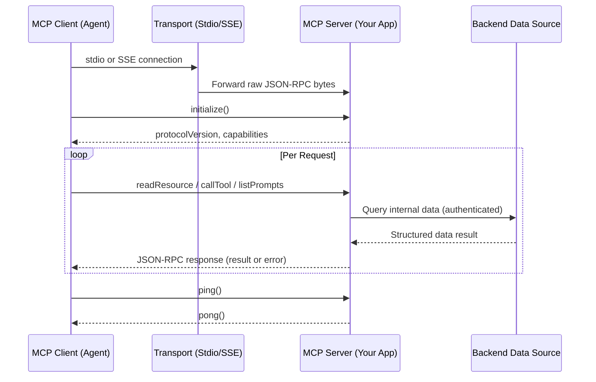

# How to Build Your First MCP Server: Step-by-Step Guide for Developers (2026)

## Introduction

LLMs are stateless by design. They do not know your internal APIs, your production database schema, or the specific state of your deployment pipeline. Before Model Context Protocol (MCP) became the standard, teams built custom connectors for every tool they wanted an agent to touch. We spent months maintaining a bespoke adapter library that broke whenever the underlying API version changed.

MCP solves the transport problem. It defines how an AI client talks to a data source over a standardized JSON-RPC 2.0 layer. Building an MCP server means you write the data access logic once, and any compliant client can use it.

This guide walks through building a production-grade MCP server in TypeScript. We skip the hello-world examples and go straight to a server that exposes codebase resources and executable tools, complete with error handling, schema validation, and security boundaries.

## Why This Matters

In 2024 and 2025, the biggest bottleneck for internal AI agents was context. If an engineer wanted an agent to fix a bug, the agent needed read access to the codebase and write access to the repository. Hardcoding these permissions into the LLM call itself creates a massive security surface.

MCP changes the trust boundary. The server runs on your infrastructure, close to the data. The LLM client only receives the results of authorized queries. This separation allows you to gatekeep access at the transport layer rather than hoping the model follows instructions.

We adopted this pattern because it standardized how our agents interact with legacy systems. Without MCP, every new data source required a new integration script. With MCP, you get the handshake, the capability negotiation, and the error serialization for free.

## How It Works

An MCP deployment consists of three logical pieces: the client (usually the agent or IDE), the transport (how messages move), and the server (your application logic).

The protocol runs over JSON-RPC 2.0. Every interaction starts with an `initialize` request. The client and server agree on protocol version and supported capabilities. After that, the client sends requests to read resources, list prompts, or call tools. The server responds with a result or an error object.



The transport layer is where most deployment decisions happen. For local development, `stdio` (standard input/output) is easiest. The client spawns your server as a child process and pipes data through the terminal. For remote hosting, you use Server-Sent Events (SSE) over HTTP. By 2026, SSE is the default for any server that needs to survive across multiple agent sessions or run in a container.

The server does not talk to the LLM directly. It talks to the client. The client decides how to present the server's output to the model. This decoupling is why you can swap clients without rewriting your server logic.

## Core Concepts

Three primitives drive the entire protocol. Understanding them determines how you structure your code.

**Resources** are data. They are identified by a URI (e.g., `mcp://my-server/repo/main/README.md`). The client reads them like files. You implement this via `setResourceHandler`. Resources are meant for read-only, contextual data. Do not put sensitive credentials here.

**Prompts** are reusable templates. They are not executed by the server; they are sent to the client to be filled in by the user or model. You register these with `setPromptHandler`. This is useful for standardizing how agents ask questions about your system.

**Tools** are executable functions. They take arguments, do work, and return a result. This is where your business logic lives. You register them with `addTool`. Unlike resources, tools mutate state. This is the highest-risk primitive and requires strict validation.

The handshake defines what each side can do. The client advertises what it supports; the server advertises what it offers. If a client doesn't support `tools`, the server must not attempt to expose them. This negotiation prevents runtime errors when a basic client connects to a complex server.

## Examples & Code Walkthrough

We will build a server that exposes a codebase index as a resource and provides a tool to search that index. We use the official `@modelcontextprotocol/sdk` and `zod` for input validation.

First, set up the project and install dependencies:

```bash
npm init -y
npm install @modelcontextprotocol/sdk zod
npm install -D typescript @types/node
```

Configure `tsconfig.json` to use ES modules and target ES2022. Then create `src/server.ts`.

Step 1: Initialize the server and register the transport. We use `stdio` here for local runs, but the structure supports SSE with minimal changes.

```typescript
import { Server } from "@modelcontextprotocol/sdk/server/index.js";
import { StdioServerTransport } from "@modelcontextprotocol/sdk/server/stdio.js";
import {
  CallToolRequestSchema,
  ListResourcesRequestSchema,
  ReadResourceRequestSchema,
  ResourceTemplate,
} from "@modelcontextprotocol/sdk/types.js";
import { z } from "zod";

// Configure the server instance.
// The name identifies this server in the client's registry.
const server = new Server(
  { name: "codebase-index", version: "1.0.0" },
  {
    capabilities: {
      resources: {},
      tools: {},
      prompts: {},
    },
  }
);

// Graceful shutdown handling prevents orphaned processes.
process.on("SIGINT", async () => {
  await server.close();
  process.exit(0);
});
```

Step 2: Define the data layer. In a real app, this connects to your search index or database. Here we mock it with a file read, but the pattern is identical for a PostgreSQL or Elasticsearch client.

```typescript
// Mock data store. Replace with actual DB connection in production.
const REPO_INDEX = new Map<string, string>();

// Load index
