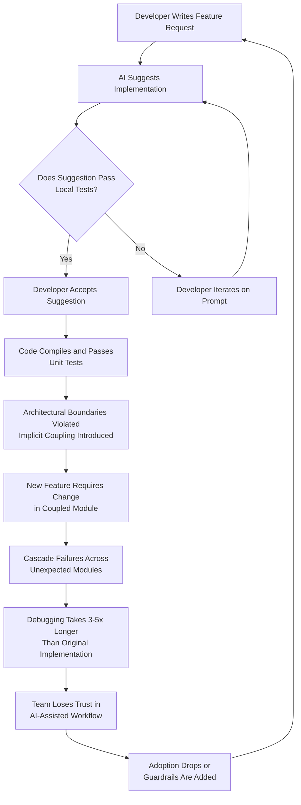

# How to Stop Cursor and Copilot from Turning Your Codebase into Spaghetti

## Introduction

I watched it happen over six months. Our team of eight adopted Cursor aggressively — accepting 70-80% of suggestions without pausing. The velocity was real. Our commit frequency went up. Our bug count did too. When we finally audited the codebase in month seven, we found 340 files that violated our module boundaries, duplicated logic that shouldn't have been duplicated, and three "utility" classes with 47 methods each.

This isn't an anti-AI rant. Cursor and Copilot are genuinely powerful. But they optimize for local code correctness — "does this function work?" — not for global architectural health. They don't know your domain boundaries. They don't understand why you chose anemic models over rich domain models last quarter. They see a pattern, they complete it, and they do it well. The problem is when that pattern is wrong for your system.

This article is about the concrete mechanisms by which AI-assisted coding degrades architecture, and the specific, battle-tested guardrails our team put in place to stop it.

## Why This Matters

The real production pain point is this: AI-generated code passes compilation and unit tests but rots the structural integrity of your system. You don't notice until a seemingly unrelated change cascades through six modules because an AI silently coupled them together via shared mutable state or a generic utility function that does too much.

In our case, a payment processing change broke invoice generation — not because the code was wrong in isolation, but because an AI had introduced a shared `TransactionHelper` class that both modules depended on, with implicit assumptions about transaction state that made sense in one context but were dangerous in another. Debugging that took three days. The original code that AI modified had been clean. The AI added twelve lines that created the coupling.

This matters for every engineering team using these tools right now. The velocity gains are real, but they come with a hidden architectural debt that compounds silently.

## How It Works

To understand how to prevent architectural degradation, you first need to understand the mechanism by which it happens. AI coding tools operate on a local context window. They predict the next token based on surrounding code, learned patterns from their training data, and your natural language prompt. They have no model of your system-level architecture.

Here is the degradation cycle as we observed it:



The critical failure point is at step C. The AI's success metric is "does this compile and pass the visible tests?" — not "does this preserve the architectural contract between modules." Your unit tests likely don't cover cross-module coupling. Your integration tests might not either, because they test through public APIs, not internal module boundaries.

The step-by-step technical breakdown:

1. **Context Window Limitations**: Cursor and Copilot typically see 10-50KB of context. That's enough to understand a single file or a small cluster, but not enough to understand how a change ripples across your service boundaries. When the AI suggests code for `PaymentService.ts`, it doesn't see that `InvoiceGenerator.ts` depends on `PaymentService`'s internal state shape.

2. **Pattern Matching Over Domain Reasoning**: The model has seen thousands of repositories with similar function names. It completes based on statistical similarity, not domain correctness. If your domain requires that `TransactionStatus` transitions follow strict rules, and the model has seen looser patterns in training data, it will suggest the looser pattern.

3. **Implicit Contract Violation**: When the AI introduces a shared utility or modifies a return type, it doesn't check downstream consumers. It treats each file as a semi-isolated unit. Real systems are graphs of dependencies, and AI tools don't maintain that graph.

4. **Test Coverage Illusion**: Your tests pass because they test what the code now does, not what it should do. The AI writes code and tests that are locally consistent but globally incoherent.

## Core Concepts

**Token-Level Generation vs. Architecture-Level Reasoning**: AI coding tools generate tokens. They don't reason about bounded contexts, aggregate boundaries, or coupling surfaces. Understanding this distinction is fundamental. Every line of AI-generated code is a local decision. Architectural health is a global property. You need a mechanism that connects the two.

**Architectural Fitness Functions**: These are automated checks that encode your architectural rules as executable tests. Think of them as the guardrails on a highway — they don't tell you where to drive, but they prevent you from driving off the cliff. We use three types: structural tests (check module boundaries), dependency analysis (detect forbidden imports), and contract tests (verify interfaces between modules).

**The Accept-Review-Refuse Workflow**: Not all AI suggestions should be accepted. We categorize suggestions into three buckets based on what file they modify and what domain boundary they touch. Suggestions in core domain files get reviewed line by line. Suggestions in infrastructure files get accepted if they pass automated checks. Suggestions that touch shared utilities get refused until a human verifies the impact.

**Coupling Surface Area**: Every AI-generated function, class, or module has a coupling surface — the set of other modules that could be affected by changes to it. AI tools don't minimize this surface. They often maximize it, because generating a generic helper that "could be useful" is statistically favorable over creating a module-specific solution.

## Examples & Code Walkthrough

Let me show you the actual problem and the actual fix. This is from our payment module, before and after we added architectural guardrails.

### The AI-Generated Spaghetti Pattern

Here's what Cursor produced when we asked it to "add a refund feature to the payment service":

```typescript
// paymentService.ts — AI-generated, 47 lines added to existing file
import { db } from '../database';
import { sendEmail } from '../email';
import { logEvent } from '../analytics';
import { cache } from '../cache';
import { formatCurrency } from '../utils/formatting';

// PROBLEM: This function now handles payment logic, email notifications,
// analytics logging, cache invalidation, AND currency formatting.
// AI tools love this pattern because each import is "relevant" to the task.
export async function processRefund(
  paymentId: string,
  refundAmount: number,
  reason: string
): Promise<RefundResult> {
  // AI wrote correct logic here — that's not the issue
  const payment = await db.payments.findById(paymentId);
  if (!payment) throw new PaymentNotFoundError(paymentId);

  if (refundAmount > payment.amount) {
    throw new RefundExceedsPaymentError(refundAmount, payment.amount);
  }

  // PROBLEM: Direct mutation of payment status — this is a domain rule
  // that should live in the Payment aggregate, not in a service function.
  payment.status = 'refunded';
  payment.refundedAt = new Date();
  payment.refundReason = reason;

  // PROBLEM: Side effects mixed into domain logic.
  // The AI doesn't know that sending email should happen AFTER
  // the transaction commits, not inside the same function.
  await sendEmail({
    to: payment.customerEmail,
    subject: 'Your refund has been processed',
    body: `Refund of ${formatCurrency(refundAmount)} has been initiated.`,
  });

  // PROBLEM: Analytics logging creates another implicit dependency.
  // If analytics goes down, refund processing fails.
  await logEvent('refund_processed', {
    paymentId,
    amount: refundAmount,
    customerId: payment.customerId,
  });

  // PROBLEM: Cache invalidation scattered across modules.
  // This cache key is used by the reporting module too.
  await cache.del(`customer:${payment.customerId}:balance`);

  await db.payments.update(paymentId, payment);

  return { success: true, refundId: generateRefundId(paymentId) };
}
```

Every individual line is reasonable. The function does the right thing. But look at what it actually does: it couples payment processing to email delivery, analytics, caching, and formatting. Change any one of those systems and you risk breaking refunds. This is the AI pattern of "grab everything you might need from the imports."

### The Architectural Fix

Here's how we refactored it with explicit boundaries and dependency direction:

```typescript
// domain/payment/Payment.ts — Domain model with invariants
// This file is off-limits to AI suggestions. Domain rules are human decisions.

export class Payment {
  private constructor(
    public readonly id: string,
    public readonly amount: number,
    public readonly customerId: string,
    public readonly customerEmail: string,
    public status: PaymentStatus,
    private refundedAt?: Date,
    private refundReason?: string
  ) {}

  // Domain rule: only PENDING or PROCESSING payments can be refunded
  // AI tools don't know this rule. It must be explicit in the model.
  requestRefund(amount: number, reason: string): RefundRequest {
    if (amount > this.amount) {
      throw new RefundExceedsPaymentError(amount, this.amount);
    }

    if (this.status !== 'pending' && this.status !== 'processing') {
      throw new InvalidPaymentStateError(this.status, 'refund');
    }

    // Return a domain event, don't execute side effects
    return new RefundRequested(
      this.id,
      this.customerId,
      this.customerEmail,
      amount,
      reason
    );
  }

  // State transition driven by domain events, not by service functions
  applyRefund(refundId: string, reason: string): void {
    this.status = 'refunded';
    this.refundedAt = new Date();
    this.refundReason = reason;
  }
}

// domain/payment/RefundRequested.ts — Domain event carrying data only
export class RefundRequested {
  constructor(
    public readonly paymentId: string,
    public readonly customerId: string,
    public readonly customerEmail: string,
    public readonly amount: number,
    public readonly reason: string
  ) {}
}

// application/refund/RefundService.ts — Application service, orchestrates side effects
// AI CAN suggest implementations here, but the orchestration pattern is ours.

import { PaymentRepository } from '../../infrastructure/payment/PaymentRepository';
import { EmailSender } from '../../infrastructure/email/EmailSender';
import { EventPublisher } from '../../infrastructure/events/EventPublisher';
import { Cache } from '../../infrastructure/cache/Cache';

export class RefundService {
  constructor(
    private payments: PaymentRepository,
    private email: EmailSender,
    private events: EventPublisher,
    private cache: Cache
  ) {}

  async execute(request: RefundRequested): Promise<void> {
    // Step 1: Load aggregate — AI can help with query construction
    const payment = await this.payments.findById(request.paymentId);
    if (!payment) throw new PaymentNotFoundError(request.paymentId);

    // Step 2: Apply domain logic — NO AI involvement. This is the boundary.
    // The aggregate itself decides if refund is valid.
    payment.applyRefund(request.paymentId, request.reason);

    // Step 3: Persist — AI can help with the repository call
    await this.payments.save(payment);

    // Step 4: Publish events for side effects — AI CAN implement handlers
    // but the orchestration order is a human decision
    await this.events.publish(new RefundProcessed(
      request.paymentId,
      request.customerId,
      request.amount,
    ));

    // Step 5: Cache invalidation happens in the event handler, not here
    // This separation is what AI misses.
  }
}

// infrastructure/events/RefundProcessedHandler.ts — Side effect handler
// AI tools are safe here because they can't break the domain.

import { Cache } from '../cache/Cache';

export class RefundProcessedHandler {
  constructor(private cache: Cache) {}

  async handle(event: RefundProcessed): Promise<void> {
    // Cache invalidation for reporting module — isolated concern
    await this.cache.del(`customer:${event.customerId}:balance`);
  }
}
```

The critical architectural difference: the domain model owns the business rules. The application service orchestrates. The infrastructure handles side effects. AI tools can contribute inside each layer, but the boundaries between layers are human decisions encoded as architectural fitness functions.

### The Fitness Function That Catches This

We wrote this ArchUnit-style test in TypeScript using the `arch-audit` library:

```typescript
// tests/architecture/paymentArchitecture.test.ts
// This test FAILS if AI tools reintroduce the coupling pattern above.
// Run as part of CI. Fails the build on architectural violations.

import { audit } from 'arch-audit';

describe('Payment module architecture', () => {
  it('must not import infrastructure modules directly', () => {
    const result = audit({
      // Define the rule: files in domain/ must not import from infrastructure/
      from: { path: 'src/domain/**/*.ts' },
      to: { path: 'src/infrastructure/**/*.ts' },
      allow: [], // Empty array means zero tolerance
    });

    expect(result.violations).toHaveLength(0);
    // If AI adds `import { sendEmail } from '../infrastructure/email'`
    // to a domain file, this test catches it immediately.
  });

  it('must not have domain files importing analytics or cache', () => {
    const result = audit({
      from: { path: 'src/domain/**/*.ts' },
      to: { path: 'src/**/analytics/**' },
      allow: [],
    });

    expect(result.violations).toHaveLength(0);
  });

  it('must enforce that Payment class has no side-effect imports', () => {
    const result = audit({
      from: { path: 'src/domain/payment/Payment.ts' },
      to: { path: 'src/infrastructure/**' },
      allow: [],
    });

    expect(result.violations).toHaveLength(0);
  });
});
```

This test runs in under 200ms in CI. If any AI-assisted commit introduces a forbidden dependency, the pull request is blocked.

### The ESLint Rule for Shared Utility Explosion

AI tools love creating shared utility files. Here's a custom rule we wrote to catch the "God Utility" pattern
