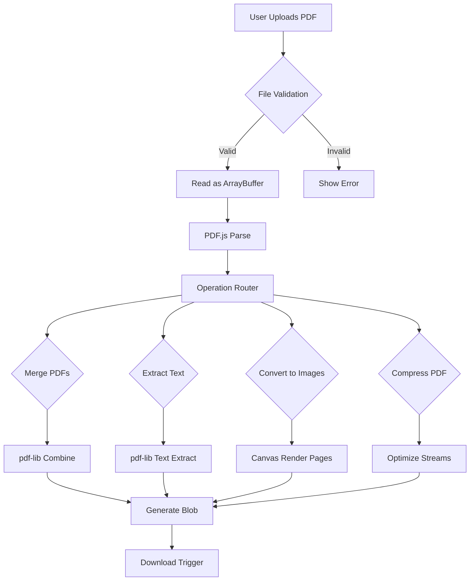

# I built a free online PDF toolbox that runs entirely in the browser

## Introduction

Six months ago, I hit a wall with a simple request: convert a PDF to images, extract text, merge a few documents, and compress one file. Every online tool I tried either required uploading sensitive documents or spit out corrupted files. I decided enough was enough—I'd build a PDF toolbox that lives entirely in the user's browser. No servers, no uploads, no privacy concerns. Just pure client-side JavaScript doing the heavy lifting.

## Why This Matters

PDF manipulation is one of those universal workplace tasks that everyone groans about. Whether you're merging contracts, extracting signatures from scanned documents, or converting invoices to searchable text, engineers and non-engineers alike waste time hunting for reliable tools. The catch? Most solutions either compromise privacy or deliver subpar results.

Client-side PDF processing solves three critical problems at once: privacy preservation, offline capability, and eliminating server costs. When your financial reports contain PII or legal documents with trade secrets, uploading them to a third-party service creates liability that many organizations simply cannot accept.

## How It Works

The architecture relies on three core libraries working in concert: PDF.js for rendering and text extraction, pdf-lib for manipulation operations, and browser APIs for file handling. Here's the flow:



The user drops a file into the browser. We validate it's actually a PDF, then read it into memory as an ArrayBuffer. PDF.js parses this into a traversable structure. Based on the selected operation, we route to the appropriate handler—all processing happens in Web Workers to keep the UI responsive. Finally, we generate a downloadable Blob URL.

## Core Concepts

**ArrayBuffer and Typed Arrays**: Everything starts with converting the uploaded file into binary data. An ArrayBuffer is a generic fixed-length container for binary data, while Uint8Array provides a view for byte-level operations.

**Web Workers**: Heavy PDF operations block the main thread, freezing the UI. Web Workers run in separate threads, allowing the interface to remain responsive during processing.

**PDF.js Pipeline**: Mozilla's PDF.js uses a content pipeline where each page goes through parsing, rendering, and text extraction stages. Understanding this pipeline helps optimize performance.

**pdf-lib Operations**: Unlike PDF.js, pdf-lib focuses on manipulation—merging, splitting, encryption. It works directly with PDF structure objects rather than rendering them.

## Examples & Code Walkthrough

Here's the core file reading and validation logic:

```javascript
async function handleFileUpload(file) {
  // Validate file type
  if (!file.type.includes('pdf')) {
    throw new Error('Only PDF files are supported');
  }

  // Check file size (limit to 100MB)
  if (file.size > 100 * 1024 * 1024) {
    throw new Error('File size exceeds 100MB limit');
  }

  // Read file as ArrayBuffer
  const arrayBuffer = await file.arrayBuffer();
  
  // Verify PDF signature
  const header = new Uint8Array(arrayBuffer, 0, 8);
  const pdfSignature = '%PDF-1.';
  
  if (!String.fromCharCode(...header).startsWith(pdfSignature)) {
    throw new Error('Invalid PDF file format');
  }

  return arrayBuffer;
}
```

For PDF merging, we leverage pdf-lib's `PDFDocument` class:

```javascript
async function mergePDFs(pdfBuffers) {
  const mergedDoc = await PDFDocument.create();
  
  for (const buffer of pdfBuffers) {
    const sourceDoc = await PDFDocument.load(buffer);
    const pages = await mergedDoc.copyPages(sourceDoc, sourceDoc.getPageIndices());
    pages.forEach(page => mergedDoc.addPage(page));
  }

  return await mergedDoc.save();
}
```

Text extraction uses PDF.js with a custom promise wrapper:

```javascript
function extractTextFromPDF(arrayBuffer) {
  return new Promise((resolve, reject) => {
    const worker = new Worker('pdf.worker.js');
    
    worker.postMessage({
      action: 'open',
      data: arrayBuffer
    });

    worker.onmessage = function(e) {
      if (e.data.action === 'document') {
        const textContent = [];
        const numPages = e.data.numPages;
        
        for (let i = 0; i < numPages; i++) {
          worker.postMessage({ action: 'extractText', pageIndex: i });
        }
        
        worker.onmessage = function(textEvent) {
          if (textEvent.data.items) {
            textContent.push(...textEvent.data.items.map(item => item.str));
          }
          
          if (textContent.length === numPages) {
            worker.terminate();
            resolve(textContent.join('\n'));
          }
        };
      }
    };

    worker.onerror = reject;
  });
}
```

## Best Practices

1. **Use Web Workers for all heavy operations**. Even 50-page PDFs can freeze the browser if processed on the main thread.

2. **Implement progressive loading**. For large files, show a progress indicator and process pages as they load rather than waiting for the entire document.

3. **Cache frequently used assets**. Keep PDF.js worker scripts in localStorage or IndexedDB to avoid repeated downloads.

4. **Validate early and fail fast**. Check file types, sizes, and basic PDF signatures before investing computational resources.

5. **Use Transferable Objects**. When passing ArrayBuffers between workers, use `postMessage(data, [data])` to transfer ownership rather than copy, reducing memory usage.

## Common Mistakes & Anti-Patterns

**Loading entire PDFs into memory before processing**: This approach works for small files but crashes browsers with large documents. Process streams incrementally instead.

```javascript
// Bad: Loading everything at once
const fullPdf = await loadCompletePDF(largeFile);

// Better: Stream processing
const pdfStream = await createPDFStream(file);
for await (const page of pdfStream.pages()) {
  await processPage(page);
}
```

**Blocking the main thread with synchronous operations**: Even seemingly fast operations like `PDFDocument.load()` should run in workers.

**Ignoring memory cleanup**: Web Workers and object URLs accumulate in memory. Always call `worker.terminate()` and `URL.revokeObjectURL()` when done.

**Not handling malformed PDFs gracefully**: Real-world PDFs often have corrupted metadata or missing objects. Wrap operations in try-catch blocks and provide meaningful error messages.

## Performance Considerations

Memory usage scales linearly with PDF complexity and page count. A 100-page document with images can consume 200-500MB during processing. Monitor `performance.memory` in Chrome to track usage.

CPU-intensive operations like image conversion have O(n×m) complexity where n is page count and m is resolution. Rendering a 300 DPI page at 2000×3000 pixels requires processing 6 million pixels.

Network transfer happens only at the edges—uploading the original file and downloading the result. For a 50MB PDF merge operation, total bandwidth equals input size plus output size.

Web Workers improve perceived performance but don't reduce computational complexity. They're essential for UX but don't change Big O characteristics.

## Real-World Usage

Companies like Adobe have experimented with client-side PDF processing in Acrobat DC, though their implementation still relies heavily on server-side operations for complex tasks. Figma processes images entirely in-browser using similar Web Worker patterns. Privacy-focused applications like Tresorit build their entire document handling pipeline client-side to ensure zero-knowledge architecture.

Financial institutions use client-side PDF redaction to ensure sensitive data never leaves secure environments. Legal tech companies process discovery documents in-browser to comply with attorney-client privilege requirements.

## Frequently Asked Questions (FAQ)

**Q: Can this handle password-protected PDFs?**
A: PDF.js can read encrypted documents with user passwords, but pdf-lib requires the password during load. We prompt users for passwords and handle decryption transparently.

**Q: What's the maximum file size supported?**
A: Limited by available RAM. With 4GB memory, you can process roughly 200-300MB files. Implement chunked processing for larger documents.

**Q: How does performance compare to server solutions?**
A: Single-operation speed matches server processing. But eliminating network latency (typically 100-500ms) often makes client-side faster for interactive use cases.

**Q: Does this work on mobile devices?**
A: Yes, though memory constraints on older phones may limit file sizes. iOS Safari particularly struggles with large ArrayBuffers due to memory management differences.

**Q: Can I extend this for custom operations?**
A: Absolutely. The modular architecture lets you plug in additional Web Workers for custom PDF manipulations using the same ArrayBuffer interface.

## Conclusion

Building a browser-based PDF toolbox taught me that client-side processing isn't just possible—it's often preferable. The privacy benefits alone justify the engineering effort. While we sacrifice some computational power compared to server farms, we gain something more valuable: trust. Users can process sensitive documents without second-guessing where their data goes.

The key insights: Web Workers are non-negotiable for performance, PDF.js and pdf-lib complement each other well, and progressive enhancement makes complex features accessible. Most importantly, sometimes the best architecture is the one that keeps user data in user hands.
