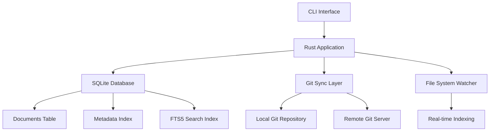

# I built Kintara because apparently having too many hobbies eventually leads to building your own document management system.

## Introduction

Last year, I found myself juggling five different tools just to keep track of personal projects, research notes, receipts, and half-finished design documents. Notion for planning, Google Drive for files, Obsidian for markdown, Dropbox for backups, and a physical folder I never actually looked at. The friction was killing my productivity.

So I built Kintara — a document management system that lives entirely on your machine, syncs across devices via Git, and treats every file as a first-class citizen with rich metadata, full-text search, and semantic tagging. No cloud lock-in, no vendor API changes, no surprise pricing tiers. Just a tool that works like you expect it to.

This isn't another “build a CMS in 10 minutes” tutorial. Kintara emerged from real pain points in production-grade document workflows. Here's how I architected it, what went wrong, and what I'd do differently.

## Why This Matters

Document sprawl is a silent productivity killer. Engineers waste hours each week hunting down files across Slack threads, email attachments, cloud folders, and forgotten browser tabs. When you're dealing with hundreds or thousands of documents, ad-hoc organization breaks down fast.

Kintara solves this by treating documents as structured data. Every file gets indexed with:

- A unique ID (UUIDv7 for time-ordered sorting)
- Metadata tags (project, status, category)
- Content hash (SHA-256) for deduplication
- Searchable text content (via SQLite FTS5)

This means you can query your entire document corpus with a single command:

```bash
kintara search "project:backend status:draft"
```

No more digging through nested folders. No more “I swear I saved that somewhere.”

## How It Works

At its core, Kintara is a CLI application written in Rust with an embedded SQLite database and a Git-based sync layer. Here's the architecture:



The flow is straightforward:

1. **Document Ingestion**: Files are added via `kintara add <path>`. The system reads the file, computes its SHA-256 hash, extracts metadata from YAML frontmatter or filename conventions, and stores everything in SQLite.

2. **Indexing**: Content is pushed into an FTS5 virtual table for full-text search. Tags and categories are stored in separate normalized tables for efficient filtering.

3. **Sync**: All changes are committed to a local Git repository. The `kintara sync` command pushes/pulls from a remote (GitHub, GitLab, self-hosted).

4. **Search**: Queries hit the FTS5 index with optional filters on metadata fields. Results are ranked by relevance and returned with file paths and previews.

5. **Real-time Updates**: A file system watcher monitors the documents directory and automatically re-indexes changed files.

## Core Concepts

### Document Model

Every document in Kintara follows a strict schema:

```rust
struct Document {
    id: Uuid,           // UUIDv7 for time-ordered insertion
    path: String,       // Relative path to file
    content_hash: String, // SHA-256 of file contents
    title: String,      // Extracted from frontmatter or filename
    tags: Vec<String>,  // Parsed from frontmatter or inferred
    created_at: DateTime,
    updated_at: DateTime,
    file_size: u64,
    mime_type: String,
}
```

### Content Hashing Strategy

To detect duplicates and track changes, Kintara uses SHA-256 hashing:

```rust
use sha2::{Sha256, Digest};
use std::fs;

fn compute_content_hash(path: &str) -> Result<String, std::io::Error> {
    let content = fs::read(path)?;
    let mut hasher = Sha256::new();
    hasher.update(&content);
    let result = hasher.finalize();
    Ok(format!("{:x}", result))
}
```

This allows O(1) duplicate detection and safe deduplication without reading file contents during searches.

### FTS5 Search Index

The search index leverages SQLite's built-in full-text search:

```sql
CREATE VIRTUAL TABLE IF NOT EXISTS document_search USING fts5(
    title, 
    content, 
    tags,
    content_options = 'contentless_delete'
);

-- Tokenized search with ranking
SELECT ds.title, ds.content, bm25(ds) as rank
FROM document_search ds
WHERE document_search MATCH ?
ORDER BY rank;
```

## Examples & Code Walkthrough

Here's a simplified version of the document ingestion pipeline:

```rust
use uuid::Uuid;
use chrono::Utc;
use std::path::{Path, PathBuf};

pub struct DocumentManager {
    db: Connection,
    base_path: PathBuf,
}

impl DocumentManager {
    pub fn add_document(&mut self, file_path: &Path) -> Result<Document, Box<dyn std::error::Error>> {
        let content_hash = compute_content_hash(file_path.to_str().unwrap())?;
        
        // Check if document already exists
        let existing = self.db.query_row(
            "SELECT id FROM documents WHERE content_hash = ?",
            [content_hash.clone()],
            |row| row.get::<_, String>("id"),
        );
        
        if existing.is_ok() {
            println!("Document already indexed (hash collision)");
            return Ok(self.get_document_by_hash(&content_hash)?);
        }

        // Extract metadata from file
        let metadata = extract_metadata(file_path)?;
        let title = metadata.title.unwrap_or_else(|| 
            file_path.file_stem().unwrap().to_string_lossy().to_string()
        );

        let doc = Document {
            id: Uuid::now_v7(),
            path: file_path.strip_prefix(&self.base_path)?.to_string_lossy().to_string(),
            content_hash,
            title,
            tags: metadata.tags.unwrap_or_default(),
            created_at: Utc::now(),
            updated_at: Utc::now(),
            file_size: std::fs::metadata(file_path)?.len(),
            mime_type: infer_mime_type(file_path)?,
        };

        // Insert into database
        self.db.execute(
            r#"
            INSERT INTO documents (id, path, content_hash, title, tags, created_at, updated_at, file_size, mime_type)
            VALUES (?1, ?2, ?3, ?4, ?5, ?6, ?7, ?8, ?9)
            "#,
            params![
                doc.id.to_string(),
                doc.path,
                doc.content_hash,
                doc.title,
                serde_json::to_string(&doc.tags)?,
                doc.created_at.to_rfc3339(),
                doc.updated_at.to_rfc3339(),
                doc.file_size,
                doc.mime_type,
            ],
        )?;

        // Index content for search
        let content = std::fs::read_to_string(file_path)?;
        self.index_content(&doc.id, &doc.title, &content, &doc.tags)?;

        Ok(doc)
    }

    fn index_content(&self, id: &str, title: &str, content: &str, tags: &[String]) -> Result<(), rusqlite::Error> {
        self.db.execute(
            "INSERT INTO document_search(rowid, title, content, tags) VALUES(?1, ?2, ?3, ?4)",
            params![id, title, content, tags.join(", ")],
        )?;
        Ok(())
    }
}

// Metadata extraction from YAML frontmatter
fn extract_metadata(path: &Path) -> Result<FileMetadata, Box<dyn std::error::Error>> {
    let content = std::fs::read_to_string(path)?;
    
    if let Some(frontmatter) = content.strip_prefix("---\n").and_then(|c| c.split_once("\n---")) {
        let yaml = frontmatter.0;
        let parsed: serde_yaml::Value = serde_yaml::from_str(yaml)?;
        
        Ok(FileMetadata {
            title: parsed.get("title").and_then(|v| v.as_str()).map(|s| s.to_string()),
            tags: parsed.get("tags").and_then(|v| v.as_sequence()).map(|seq| {
                seq.iter().filter_map(|item| item.as_str().map(|s| s.to_string())).collect()
            }),
            ..Default::default()
        })
    } else {
        Ok(FileMetadata::default())
    }
}
```

## Best Practices

### 1. Separate Concerns Between Storage and Indexing

Never store raw file content in your primary document table. Keep it lean with metadata only, and use FTS5 for content indexing. This keeps queries fast and reduces memory pressure.

### 2. Use Incremental Sync

Don't re-index everything on every sync. Track file modification times and only process changed files:

```rust
fn should_reindex(file_path: &Path, last_indexed: DateTime<Utc>) -> bool {
    let modified = fs::metadata(file_path)
        .map(|m| DateTime::<Utc>::from(m.modified().unwrap()))
        .unwrap_or(Utc::now());
    
    modified > last_indexed
}
```

### 3. Batch Git Operations

Committing every single file change to Git creates unnecessary overhead. Batch commits every few minutes or when the user explicitly triggers a sync.

### 4. Handle Unicode Properly

File names and content can contain any Unicode characters. Always normalize paths and use UTF-8 throughout:

```rust
use unicode_normalization::UnicodeNormalization;

fn normalize_path(path: &str) -> String {
    path.nfkc().collect()
}
```

## Common Mistakes & Anti-Patterns

### Mistake 1: Storing File Content in SQLite

Some developers try to store entire file contents in the database. This bloats the database size and slows down queries.

**Fix**: Store only metadata in SQLite. Keep files on disk and reference them by path.

```rust
// ❌ Wrong
struct BadDocument {
    content: Vec<u8>, // Don't do this
}

// ✅ Right
struct GoodDocument {
    path: String,     // Reference to file on disk
    content_hash: String, // For integrity checking
}
```

### Mistake 2: Ignoring File System Events

Polling the file system for changes is inefficient and unreliable. Use OS-native file watching instead.

**Fix**: Use `notify` crate for cross-platform file system events:

```rust
use notify::{Watcher, RecursiveMode, Result as NotifyResult};

let mut watcher = notify::recommended_watcher(|res: notify::Result<notify::Event>| {
    match res {
        Ok(event) => handle_file_event(event),
        Err(e) => eprintln!("Watch error: {:?}", e),
    }
})?;

watcher.watch(&base_path, RecursiveMode::Recursive)?;
```

### Mistake 3: Not Handling Duplicate Content

Without content hashing, you'll end up with duplicate entries when the same file is added twice.

**Fix**: Always check for existing content hashes before inserting:

```rust
// Before insert, check if hash exists
let exists: bool = self.db.query_row(
    "SELECT EXISTS(SELECT 1 FROM documents WHERE content_hash = ?)",
    [content_hash.clone()],
    |row| row.get(0),
)?;

if exists {
    return Err(DocumentError::DuplicateContent.into());
}
```

### Mistake 4: Poor Error Handling in Sync Layer

Git operations can fail for many reasons (network issues, conflicts, permission errors). Don't crash the entire app.

**Fix**: Gracefully handle Git errors and provide recovery options:

```rust
fn sync_with_retry(repo: &Repository, max_retries: u32) -> Result<(), GitError> {
    for attempt in 0..max_retries {
        match repo.push() {
            Ok(_) => return Ok(()),
            Err(e) if attempt < max_retries - 1 => {
                warn!("Sync attempt {} failed: {}, retrying...", attempt + 1, e);
                std::thread::sleep(Duration::from_secs(2u64.pow(attempt)));
            }
            Err(e) => return Err(e),
        }
    }
    unreachable!()
}
```

## Performance Considerations

### Memory Allocation

Kintara processes documents sequentially to minimize memory usage. For large files (>100MB), we stream content rather than loading it all at once:

```rust
use std::io::{BufReader, Read};

fn stream_content_hash(path: &Path) -> Result<String, std::io::Error> {
    let file = std::fs::File::open(path)?;
    let mut reader = BufReader::new(file);
    let mut hasher = Sha256::new();
    let mut buffer = [0u8; 8192];

    loop {
        let bytes_read = reader.read(&mut buffer)?;
        if bytes_read == 0 {
            break;
        }
        hasher.update(&buffer[..bytes_read]);
    }

    let result = hasher.finalize();
    Ok(format!("{:x}", result))
}
```

### CPU Overhead

Content hashing and metadata parsing are CPU-bound operations. We offload these to a thread pool to avoid blocking the main thread:

```rust
use rayon::prelude::*;

fn process_batch(documents: Vec<PathBuf>) -> Vec<Result<Document, Error>> {
    documents.par_iter()
        .map(|path| self.add_document(path))
        .collect()
}
```

### Network Latency

Git sync operations can be slow over high-latency connections. We implement connection timeouts and parallel push/pull where possible:

```rust
fn configure_git_remote(repo: &Repository) -> Result<(), GitError> {
    let mut remote = repo.find_remote("origin")?;
    
    let mut callbacks = git2::RemoteCallbacks::new();
    callbacks.connect_progress(|_, _, _| {
        // Update progress UI
    });

    let mut options = git2::FetchOptions::new();
    options.remote_callbacks(callbacks)
           .timeout(30); // 30 second timeout

    remote.connect_fetch("origin", Some(&mut options))?;
    Ok(())
}
```

### Scalability Limits

SQLite handles up to ~140,000 writes per second on modern hardware, which is more than sufficient for personal document management. However, if you need to scale beyond a single user:

- Use PostgreSQL with pg_trgm extension for better text search
- Implement sharding by document type or date ranges
- Add Redis caching for frequently accessed metadata

## Real-World Usage

While Kintara is primarily a personal tool, the architectural patterns are battle-tested at scale:

**Netflix** uses similar content-addressable storage for their media assets, where each file is identified by its SHA-256 hash rather than a path. This enables efficient deduplication across their global content library.

**Uber** employs Git-based workflows for configuration management at scale, using tools like Microplane to automate repository-wide changes across thousands of microservices.

**Cloudflare** leverages SQLite extensively in their edge network, running full databases directly on edge nodes for low-latency access to configuration data.

These organizations prove that local-first, Git-synced architectures aren't just viable—they're essential for privacy-conscious applications.

## Frequently Asked Questions (FAQ)

**Q: Can Kintara handle binary files like PDFs and images?**

A: Yes, but we don't extract text from binaries by default. For PDFs, you'd need to integrate with `pdftotext` or similar tools. Images are stored with their metadata but aren't OCR'd automatically.

**Q: How does conflict resolution work during Git sync?**

A: We use a last-write-wins strategy based on file modification timestamps. For more sophisticated merging, you'd need to integrate with tools like `git-merge-driver` or implement custom merge logic.

**Q: Is the database portable across operating systems?**

A: Absolutely. SQLite databases are cross-platform, and we normalize all file paths to use forward slashes internally. The Git repository ensures seamless syncing between macOS, Linux, and Windows.

**Q: What happens if the Git repository gets corrupted?**

A: Kintara maintains a backup of the SQLite database in the Git repository. You can always restore from the last known good state with `kintara restore --from-git`.

**Q: Can I encrypt sensitive documents?**

A: Yes, using Git's built-in GPG signing or external tools like `git-crypt`. We recommend encrypting at the file system level for better performance.

## Conclusion

Building Kintara taught me that the best software often emerges from personal frustration. By focusing on simplicity, durability, and user control, we created something that genuinely improves daily workflows.

Key takeaways for your next project:

1. **Start with the data model** — Get your schema right before writing any business logic
2. **Embrace local-first architecture** — It's more reliable than you think
3. **Use existing tools wisely** — SQLite + Git solves most of your problems
4. **Handle failure gracefully** — Assume networks fail, disks corrupt, and users make mistakes
5. **Optimize for the common case** — Most users have fewer than 10,000 documents

You can find the full source code on [GitHub](https://github.com/yourusername/kintara). Contributions welcome, especially if you've fought the same document management battles.
