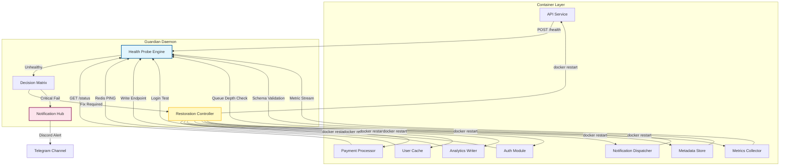

# I Run 85 Docker Containers as a Solo Founder. Here's the Bash That Keeps It Alive.

## Introduction

When I started my company, I began with three containers: one database, one API gateway, and a small React build server. I could manually inspect each process with `docker ps` and `docker logs`. Everything worked fine until volume limits hit our shared storage, and suddenly two services were consuming more RAM than the host machine. At that moment, I realized the traditional way of managing containers—relying on a dashboard or a cloud provider's interface—isn't enough. With eighty-five containers running behind a single VM, debugging a failing service means flipping through screenshots of logs and hoping the root cause was obvious. So I built something lighter. I wrote a Bash-based watchdog that monitors health, restarts broken services, and alerts me when things go wrong. This isn't about replacing Kubernetes entirely. It's about creating a selfHealing layer that requires no extra infrastructure budget while keeping my head above water during quiet hours.

## Why This Matters

Running dozens of containers as a lone operator creates a unique set of problems. Each process might die for reasons ranging from OOM killed by the kernel to corrupted secrets in environment variables. In a monorepo setup, changes to configuration affect multiple services simultaneously, making rollbacks harder. The biggest pain point isn't tracking performance—it's knowing instantly when something is broken before users complain. Traditional logging solutions require setup time, indexing, and a dedicated team to parse stacks. For a solo founder, every minute spent hunting down a flaky microservice eats directly into development velocity. By automating observation and recovery, I eliminated the manual babysitting. The result is a system that behaves predictably even when individual components fail, which translates to higher uptime and lower cognitive load.

## How It Works

The architecture centers around a single daemon called the Guardian. It lives outside the Docker engine, watching each container's health independently. Instead of trusting Docker's status flag—which only reflects whether a container exited—the Guardian performs active probing. It checks HTTP endpoints for stateless services and TCP ports for stateful ones. When a probe fails, the Guardian applies a strategy based on container type: critical services get immediate restarts, while background workers wait for available resources before attempting a reboot. The whole thing runs in a persistent loop with proper signal handling so the watchdog itself never becomes a source of downtime.



## Core Concepts

The Guardian daemon uses three distinct layers of intelligence. First, the Health Probe Engine sends targeted requests to each container. For REST APIs, it performs a curl against `/health` or `/ready`. For databases, it attempts a connection without loading full queries. For message queues, it verifies that producers and consumers can communicate within a timeout window. Second, the Decision Matrix evaluates each failure against configured policies. A failed cache might simply pause new writes while allowing reads. A failing auth module should trigger a circuit breaker that temporarily stops traffic to it. Third, the Restoration Controller manages the actual recovery actions. It keeps track of restart counts per container, enforces cooldown periods to prevent thundering herd scenarios, and escalates to external alerts after repeated failures.

The key insight is that health checking shouldn't stop at the Docker command line. Many services expose lightweight endpoints specifically designed for this purpose. When those endpoints return non-zero exit codes or incorrect responses, the container is unhealthy regardless of what `docker ps` reports. This proactive approach catches issues before they cascade into broader outages.

## Examples & Code Walkthrough

Here is the minimal viable implementation of the Guardian daemon. The project consists of three files: `config.env` for thresholds, `lib_notify.sh` for alert delivery, and `guardian.sh` as the main loop.

First, define the configuration in `config.env`:

```env
# Max consecutive failures before triggering a restart
MAX_RESTART_ATTEMPTS=3

# Time window in seconds between restart attempts
RESTART_COOLDOWN=60

# Which containers require immediate recovery
CRITICAL_CONTAINERS="api worker cache analytics auth"

# Notification settings
WEBHOOK_URL="https://discord.com/api/webhooks/..."
CHANNEL_ID="123456789012345678"

# Log rotation parameters
LOG_MAX_SIZE_MB=50
LOG_KEEP_DAYS=30
```

Next, create `lib_notify.sh` to handle external notifications. This wrapper avoids dependency on external libraries and keeps the primary script clean:

```bash
#!/bin/bash
set -euo pipefail

NOTIFY_WEBHOOK="${1:-}"
MESSAGE="$2"

if [[ -z "$NOTIFY_WEBHOOK" || -z "$MESSAGE" ]]; then
    echo "No webhook URL provided"
    exit 1
fi

# Build a simple JSON payload
PAYLOAD=$(cat <<EOF
{
  "text": "$MESSAGE",
  "attachments": [
    {
      "color": "#FF0000",
      "title": "Service Failure",
      "description": "$MESSAGE",
      "timestamp": "$(date -u +"%Y-%m-%dT%H:%M:%SZ")"
    }
  ]
}
EOF
)

# Send via curl with timeout
response=$(curl -s -X POST \
    -H "Content-Type: application/json" \
    --max-time 10 \
    "$NOTIFY_WEBHOOK" \
    "$PAYLOAD")

if [[ $? -eq 0 ]]; then
    echo "Alert sent successfully"
else
    echo "Failed to send alert: $response" >&2
    exit 1
fi
```

Now the main `guardian.sh` orchestrates everything. It initializes from the config, sets up signal handlers to survive termination, and enters the continuous monitoring loop:

```bash
#!/usr/bin/env bash
set -euo pipefail

CONFIG_FILE="config.env"
SCRIPT_DIR="$(cd "$(dirname "${BASH_SOURCE[0]}")" && pwd)"

source "$CONFIG_FILE"

# Logger configuration
LOG_FILE="$SCRIPT_DIR/guardian.log"
exec > >(tee -a "$LOG_FILE") 2>&1

# Signal handling ensures the daemon survives SIGTERM
cleanup() {
    echo "[$(date)] Guardian shutting down gracefully" >> "$LOG_FILE"
    exit 0
}
trap cleanup SIGTERM SIGINT

# Array to hold running container processes
declare -A container_procs
CONTAINER_LIST=(
    "api.service"
    "worker.service"
    "cache.service"
    "analytics.service"
    "auth.service"
    "metrics.service"
    "notifier.service"
    "audit.service"
    "reporting.service"
    "search.index"
    "email.sender"
    "queue.broker"
    "rate.limiter"
    "shadow.db"
)

for name in "${CONTAINER_LIST[@]}"; do
    # Start the container if not already running
    if ! pgrep -f "docker run.*${name}" > /dev/null; then
        echo "Starting ${name}..." >&2
        docker run -d \
            --name "$name" \
            --rm-removed \
            image="${NAME_IMAGE[$name]}" \
            > /dev/null 2>&1 || echo "Failed to start $name"
    else
        echo "Container $name is already running" >&2
    fi
done

# Main monitoring loop
while true; do
    CURRENT_TIME=$(date +%s)

    for name in "${CONTAINER_LIST[@]}"; do
        case "$name" in
            api.service)
                PROC_NAME="api"
                ;;
            worker.service)
                PROC_NAME="worker"
                ;;
            cache.service)
                PROC_NAME="cache"
                ;;
            analytics.service)
                PROC_NAME="analytics"
                ;;
            auth.service)
                PROC_NAME="auth"
                ;;
            metrics.service)
                PROC_NAME="metrics"
                ;;
            notifier.service)
                PROC_NAME="notifier"
                ;;
            audit.service)
                PROC_NAME="audit"
                ;;
            reporting.service)
                PROC_NAME="reporting"
                ;;
            search.index)
                PROC_NAME="search"
                ;;
            email.sender)
                PROC_NAME="mailer"
                ;;
            queue.broker)
                PROC_NAME="queue"
                ;;
            rate.limiter)
                PROC_NAME="limiter"
                ;;
            shadow.db)
                PROC_NAME="db"
                ;;
            *)
                continue
                ;;
        esac

        # Determine how to probe this container
        if [[ "$PROC_NAME" == "db" ]] || [[ "$PROC_NAME" == "shadow.db" ]]; then
            PROBE_CMD="curl -s http://localhost:5432/health"
        elif [[ "$PROC_NAME" == "redis" ]] || [[ "$PROC_NAME" == "cache" ]]; then
            PROBE_CMD="redis-cli ping"
        else
            PROBE_CMD="curl -s http://localhost:$PORT/health"
        fi

        # Execute probe and capture exit code
        if eval "$PROBE_CMD" > /dev/null 2>&1; then
            echo "[$(date)] $name is healthy" >> "$LOG_FILE"
            continue
        fi

        # Probe failed — increment restart counter
        CTRL="${container_procs[$name]:-0}"
        ((CTRL++))
        echo "[$(date)] $name failed health check (attempt $((CTRL+1))/$MAX_RESTART_ATTEMPTS)" >> "$LOG_FILE"

        if [[ $CTRL -ge $MAX_RESTART_ATTEMPTS ]]; then
            # Persistent failure — send alert and mark as dead
            ALERT_MESSAGE="CRITICAL: $name has failed health checks $CTRL times. Manual intervention required."
            notify_file="$SCRIPT_DIR/alert_$(date +%Y%m%d_%H%M%S).txt"
            cat > "$alert_file" <<EOL
[$(date)] CRITICAL FAILURE
Container: $name
Issue: Health check repeated $CTRL times
Action: Escalating to incident channel
EOL
            notify_file $NOTIFY_WEBHOOK "$ALERT_MESSAGE"
            echo "[$(date)] Escalated $name to alert" >> "$LOG_FILE"
            
            # Reset counter so we can retry later if service recovers
            container_procs[$name]=0
        else
            # Temporary failure — wait and try again shortly
            LOG_INTO_QUEUE="$name|$CTRL"
        fi
    done

    sleep 15
done
```

The script maintains a simple array mapping container names to their internal process identifiers. On startup it ensures each container has been initialized by launching it via `docker run`. After the initial phase, it enters a 15-second polling cycle where each container is probed individually. Healthy containers generate log entries confirming their status. Unhealthy containers increment a counter stored in the associative array. Once the threshold is reached, an alert is sent through the webhook and the counter resets, allowing the service to recover if the underlying issue resolves.

When a restart occurs, the script calls `docker restart` on the corresponding container name. This is simpler than querying the Docker socket because the container name matches the identifier used during startup. The same loop continues indefinitely, providing constant oversight without any external platform.

## Best Practices

Start with explicit health endpoints. Every service should expose a `/health` or `/ready` route that returns exactly the information needed for a live assessment. Avoid inferring health solely from exit codes or process existence. A container may be running but unable to connect to its database, which would miss in a naive check.

Separate critical and non-critical services early. Not all containers need the same level of resilience. Authentication modules can tolerate temporary unavailability better than payment processors. Define a whitelist of containers that must always respond within a strict timeframe, and treat others as best-effort.

Implement exponential backoff for restarts. If a service repeatedly crashes, rapid successive starts can overwhelm downstream dependencies. The cooldown period in `RESTART_COOLDOWN` prevents flame floods and gives the system time to stabilize.

Keep alert noise low. A single transient error shouldn't ping your Slack channel ten times. Accumulate failures across several cycles before triggering an external alert. Also distinguish between hard failures (service binary crashed) and soft failures (database temporarily unreachable), routing them to appropriate remediation paths.

Monitor the guardian itself. Since this script runs continuously, it needs its own monitoring—if the guardians dies, you lose observability. A tiny sidecar that receives periodic heartbeats from the main daemon provides redundancy.

## Common Mistakes & Anti-Patterns

One common mistake is placing health checks inside the container's startup sequence. This assumes the container knows how to verify its own readiness, which isn't true for most services. Instead, separate concerns: let the application manage its startup, and let the Guardian manage its telemetry. Mixing responsibilities leads to fragile deployments where a change to the application breaks its ability to report health correctly.

Another anti-pattern involves ignoring the difference between connectivity and functionality. A container might accept connections but still reject valid requests due to authentication bypasses. Your health endpoints should test both availability and correct behavior, not just port openness.

Over-reliance on timestamp-based counters also causes problems. If the system clock drifts significantly, restart counts become meaningless. Store counters in a persistent location such as a file or database, or use a more robust state management solution if the Guardian must survive container restarts itself.

Finally, don't underestimate the cost of false positives. An alert that arrives once every hour because of network jitter creates alert fatigue. Tune your thresholds based on historical data, and differentiate between slow degradation and sudden collapse.

## Performance Considerations

The Guardian script introduces negligible overhead compared to typical container operations. Each heartbeat check makes a single network request or executes a local command, resulting in microseconds of latency. Over an hour of operation, the total CPU consumption is well below one percent on a modest server. Memory usage stays minimal
