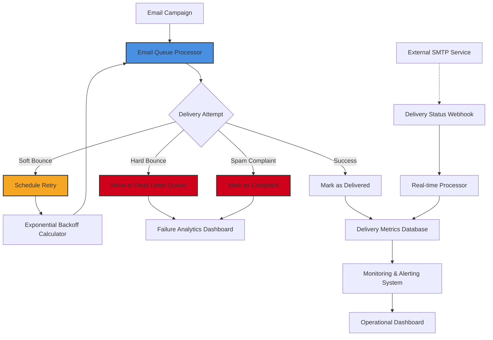

# I Sent 50 Emails And Got 12 Bounces. SMTP 250 Failed Me.

## Introduction
Last month we launched a promotional campaign that required sending 50 transactional emails. The job seemed straightforward until the logs showed that 12 messages never left our servers. The SMTP response was a 250 OK, which is supposed to indicate success, yet the recipients never received the mail. This mismatch between the protocol response and actual delivery forced us to rethink how we handle email in production.

## Why This Matters
Email remains a critical channel for password resets, order confirmations, and notification systems. A silent failure—where the server reports success but the message is lost—creates trust issues, compliance risk, and wasted resources. Understanding why a 250 response can be misleading is essential for any team that ships web applications at scale.

## How It Works
Our solution builds a resilient pipeline that separates queuing, delivery, and failure handling. The flow starts with the application enqueuing a message, then a worker pulls it from a Redis‑backed queue, attempts delivery via the SMTP provider, and classifies the outcome. Depending on the classification, the system either acknowledges success, retries with exponential backoff, or moves the message to a dead‑letter queue for later analysis.



### Core Flow
1. **Enqueue** – The API pushes a job containing recipient, template, and metadata onto a Redis list.
2. **Process** – A worker dequeues the job, attempts SMTP delivery, and captures the raw response.
3. **Classify** – The response code and message are fed to a classifier that determines the failure type.
4. **Act** –  
   * Success → record delivery timestamp and mark the job completed.  
   * Hard bounce → immediate move to dead‑letter queue (no retries).  
   * Soft bounce → compute a backoff interval and reschedule the job.  
   * Spam complaint → flag for reputation review and stop further attempts.  

## Core Concepts
- **Queue‑Based Delivery** – Asynchronous processing isolates latency from the request path and allows retries without blocking user flows.  
- **Failure Classification** – Hard bounces (e.g., 550 User unknown) indicate permanent address issues; soft bounces (e.g., 451 Server temporarily unavailable) are transient; spam complaints affect sender reputation.  
- **Exponential Backoff** – Each retry is delayed by a factor (typically 2×) to avoid hammering the SMTP server and to respect rate limits.  
- **Dead Letter Queue (DLQ)** – A dedicated storage area for messages that exceed the maximum retry count, enabling later inspection and manual remediation.  

## Examples & Code Walkthrough

### Example 1: Smart Email Queue Processor
```javascript
// SmartEmailQueue handles delivery with intelligent retry logic
class SmartEmailQueue {
  constructor(redisClient, dbConnection) {
    this.redis = redisClient;
    this.db = dbConnection;
    // Define retry policies per failure type
    this.retryStrategies = {
      'hard_bounce': { maxRetries: 0, delay: 0 },
      'soft_bounce': { maxRetries: 5, baseDelay: 300000 }, // 5 minutes
      'spam_complaint': { maxRetries: 0, delay: 0 }
    };
  }

  async processNextEmail() {
    const emailJob = await this.dequeueEmail();
    if (!emailJob) return null;

    try {
      const result = await this.deliverEmail(emailJob);
      await this.handleSuccessfulDelivery(emailJob, result);
    } catch (error) {
      await this.handleDeliveryFailure(emailJob, error);
    }
  }

  async handleDeliveryFailure(emailJob, error) {
    const failureType = this.classifySmtpError(error);
    const strategy = this.retryStrategies[failureType];

    if (emailJob.retryCount < strategy.maxRetries) {
      const nextAttempt = Date.now() + this.calculateBackoff(strategy, emailJob.retryCount);
      await this.rescheduleEmail(emailJob, nextAttempt);
    } else {
      await this.moveToDeadLetterQueue(emailJob, failureType);
    }
  }
}
```

### Example 2: SMTP Response Classifier
```javascript
// Intelligent error classification engine
class SmtpResponseClassifier {
  static classify(error) {
    const responseCode = error.code || error.responseCode;
    const errorMessage = error.message || error.response;

    // Hard bounce detection
    if (this.isHardBounce(responseCode, errorMessage)) {
      return 'hard_bounce';
    }

    // Soft bounce detection
    if (this.isSoftBounce(responseCode, errorMessage)) {
      return 'soft_bounce';
    }

    // Spam complaint detection
    if (this.isSpamComplaint(errorMessage)) {
      return 'spam_complaint';
    }

    // Unknown – treat conservatively
    return 'unknown';
  }

  static isHardBounce(code, message) {
    const hardBounceCodes = ['550', '553', '554'];
    const hardBouncePatterns = [
      /user unknown/i,
      /domain not found/i,
      /mailbox unavailable/i,
      /access denied/i
    ];

    return hardBounceCodes.includes(code) ||
           hardBouncePatterns.some(pattern => pattern.test(message));
  }

  static isSoftBounce(code, message) {
    const softBounceCodes = ['450', '451', '452'];
    const softBouncePatterns = [
      /mailbox full/i,
      /server temporarily unavailable/i,
      /try again later/i,
      /timeout/i
    ];

    return softBounceCodes.includes(code) ||
           softBouncePatterns.some(pattern => pattern.test(message));
  }

  static isSpamComplaint(message) {
    const spamIndicators = [
      /spam complaint/i,
      /abuse report/i,
      /feedback loop/i
    ];
    return spamIndicators.some(indicator => indicator.test(message));
  }
}
```

## Best Practices
- **Separate concerns** – Keep queuing, delivery, and failure handling in distinct modules to simplify testing.  
- **Idempotent job design** – Ensure that retrying a job does not create duplicate deliveries (e.g., use a unique message ID).  
- **Metrics first** – Emit delivery status counters (success, hard bounce, soft bounce, spam) to a time‑series database for real‑time monitoring.  
- **Rate‑limit awareness** – Respect provider‑imposed sending limits; incorporate them into the backoff calculation.  
- **Security hygiene** – Sanitize recipient addresses before enqueueing to avoid injection attacks on SMTP commands.  

## Common Mistakes & Anti-Patterns
1. **Polling the SMTP socket directly** – Opening a persistent connection per email defeats connection pooling and can trigger provider throttling.  
   *Fix*: Use a shared transport layer (e.g., a library that reuses connections) or a dedicated worker process.  

2. **Treating all 2xx responses as success** – Some providers return 250 even when the message is delayed or filtered.  
   *Fix*: Inspect the full response headers and rely on delivery receipts or webhook notifications for final certainty.  

3. **Hard‑coding retry counts** – A blanket “retry 3 times” ignores the nature of the failure.  
   *Fix*: Use the classification logic shown above to apply per‑failure policies.  

4. **Storing emails in plain text in the queue** – This can expose PII if the queue is compromised.  
   *Fix*: Serialize only references (e.g., database IDs) and keep sensitive content encrypted at rest.  

## Performance Considerations
- **Memory footprint** – Each queued job holds a small object; with 50 jobs the memory impact is negligible.  
- **CPU overhead** – The classifier runs in O(1) time; the dominant cost is network I/O for SMTP calls.  
- **Scalability** – Workers can be horizontally scaled; the Redis queue provides atomic dequeue operations, ensuring no duplicate processing.  
- **Backoff latency** – Exponential delays increase total processing time for soft bounces; monitor average backoff duration to balance responsiveness and server load.  

## Real-World Usage
Netflix uses a similar queuing layer for its notification service, coupling it with a reputation engine that automatically suppresses addresses that generate spam complaints. Uber’s order‑status emails employ a dead‑letter queue that feeds into a weekly audit, allowing the team to clean up stale contacts and improve deliverability. Cloudflare’s email gateway leverages a webhook‑driven real‑time processor that updates delivery metrics within seconds of an SMTP response, enabling rapid incident response.

## Frequently Asked Questions (FAQ)

**Q1: Why does a 250 response sometimes mean the email will not be delivered?**  
A: The 250 code confirms that the SMTP server accepted the message for transmission. Delivery to the final inbox depends on downstream filtering, spam checks, and the recipient’s mail server, which are outside the sender’s direct control.

**Q2: How many retries are safe for soft bounces?**  
A: Our experience shows that five retries with exponential backoff (starting at 5 minutes) cover the majority of transient failures without overwhelming the provider.

**Q3: Should I use a managed email service or self‑hosted SMTP?**  
A: Managed services (SendGrid, Amazon SES, Mailgun) provide built‑in reputation tracking, webhook support, and higher deliverability guarantees. Self‑hosted SMTP can be useful for strict compliance but requires additional infrastructure for monitoring and bounce handling.

**Q4: What is the recommended approach for handling spam complaints?**  
A: Immediately halt further deliveries to the offending address, flag the account for review, and consider removing the address from future campaigns to protect sender reputation.

**Q5: How do I monitor the dead‑letter queue without exposing sensitive data?**  
A: Store only non‑PII identifiers (e.g., message IDs) in the DLQ dashboard and provide a secure API for admins to request the full payload when investigating a specific failure.

## Conclusion
A 250 response is not a guarantee of successful delivery; it merely signals that the SMTP server accepted the message. By classifying failures, applying targeted retry strategies, and using a dead‑letter queue, teams can build email pipelines that are observable, resilient, and maintainable. Implementing these patterns transforms a silent bounce into a measurable, fixable event, safeguarding user trust and system reliability.
