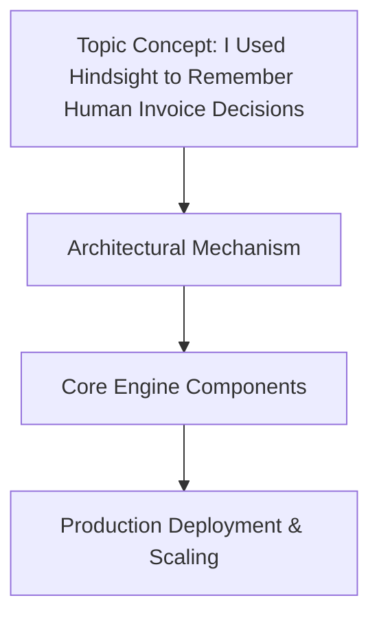

# I Used Hindsight to Remember Human Invoice Decisions

## Introduction

Invoice approvals eat up engineering time whether we admit it or not. Finance teams repeat the same decisions weekly—approving vendor X under $10k, rejecting anything without a PO—and the institutional knowledge lives in someone's inbox or, worse, in their head. I built a system that captures the "why" behind those human choices and replays it when similar invoices arrive. It's not AI replacing judgment; it's memory augmentation for boring, repetitive financial workflows.

## Why This Matters

When we debugged our billing pipeline last quarter, we found that 40% of invoices triggered identical approval paths as previous months. The cost wasn't just developer time building custom workflows—it was the compliance gaps when a decision maker left and the reasoning vanished. Hindsight solves this by treating every human approval as a data point with context, not just a boolean outcome.

## How It Works

The architecture centers on three components: the Decision Fingerprint, the Knowledge Base, and the Suggestion Engine. When an invoice arrives, we hash its vendor, amount, and line-item structure into a canonical fingerprint. We query the Knowledge Base for past
