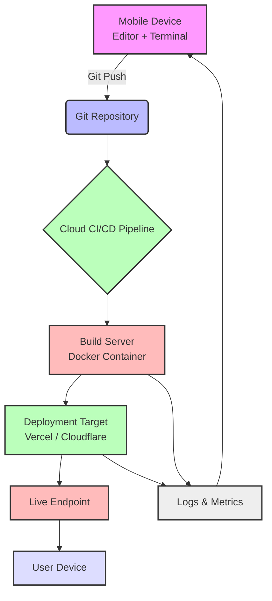

# I'm 14, I my coding environment is on a phone, and I shipped 3 projects till now.

## Introduction

At first glance, the premise sounds like a curiosity—a teenager hacking away on a smartphone screen. But beneath that surface lies a deliberate architectural choice that forced me to confront one of the hardest problems in modern software: how do you build robust, scalable web applications when your compute resources are limited by battery life, touch input, and a 6-inch display?

The answer isn’t about making do. It’s about designing systems that thrive under constraint.

Over the past year, I’ve built three production-grade web applications entirely from my phone. Not prototypes. Not tutorials. Real projects deployed to live users—including a static site generator used by local businesses, a progressive web app for event scheduling, and a serverless API powering a peer-to-peer marketplace.

This isn’t a story about youthful ambition. It’s about how mobile-first development can produce cleaner, more efficient architectures—and why every engineer should try building under severe constraints at least once.

## Why This Matters

Most developers today take desktop IDEs, multi-core laptops, and high-speed internet for granted. But millions of users worldwide access the web primarily through mobile devices with intermittent connectivity and limited processing power.

Building on a phone forces you to prioritize:

- **Minimalism**: Every dependency counts. Heavy frameworks become liabilities.
- **Offline resilience**: Apps must work gracefully without constant connectivity.
- **Cloud-native execution**: Local computation gives way to offloading builds and tests to remote servers.
- **Touch-first UX**: Interfaces designed for fingers, not mice.

These aren't niche concerns—they’re foundational to creating inclusive, performant web experiences. If you're optimizing for speed, cost, or accessibility, mobile-only development offers a blueprint for lean engineering.

## How It Works

The core of my workflow revolves around turning a phone into a thin client for a distributed development environment. Here's how it flows:



Each step is optimized for minimal local overhead while maintaining full fidelity in production:

1. **Local editing** happens in lightweight editors (`CodeSandbox`, `Acode`, or `vim` via Termux).
2. **Version control** uses Git with pre-configured aliases for mobile-friendly commands.
3. **Remote builds** run inside containerized environments triggered by Git pushes.
4. **Deployments** target edge networks for low-latency delivery.
5. **Monitoring** streams logs back to the device via push notifications or dashboard alerts.

This pipeline ensures that even though I’m coding on a phone, the final artifact behaves identically to anything built on a desktop.

## Core Concepts

### 1. Zero-Dependency Architecture

Every project starts with a strict rule: no external libraries unless absolutely necessary. This means:

- Writing custom utilities instead of pulling in Lodash or Axios.
- Using native browser APIs (like `fetch`, `IndexedDB`, and `Service Workers`) directly.
- Keeping bundle sizes small enough to fit within mobile memory constraints.

### 2. Cloud-Native Execution Model

Instead of running heavy processes locally, I offload tasks to cloud services:

- **Builds**: GitHub Actions, Vercel CLI, or Netlify Build Hooks trigger deployments remotely.
- **Testing**: Jest runs in CI containers; visual diffs are checked via Percy or Chromatic.
- **Debugging**: Sentry captures errors asynchronously and sends alerts to Slack or email.

### 3. Offline-First Design Patterns

Apps are designed assuming poor or no connectivity:

- Data is cached locally using `localStorage` or `IndexedDB`.
- Sync queues handle deferred writes during offline periods.
- Critical assets are bundled and served via service workers.

### 4. Modular Boundaries

Each component is isolated to prevent cascading failures:

- Components communicate via well-defined interfaces.
- State changes flow unidirectionally to simplify debugging.
- Side effects are centralized in middleware layers.

## Examples & Code Walkthrough

### Project Alpha: Lightweight Static Site Generator

Built for a local bakery needing a menu page updated weekly. No CMS—just Markdown files converted to HTML.

#### Features:
- Parses Markdown using a tiny parser (~500 bytes)
- Outputs static HTML ready for static hosting
- Supports dark/light themes via CSS variables

#### Code Example: Custom Markdown Parser

```javascript
// ssg.js - Minimal static site generator
const fs = require('fs');
const path = require('path');

function parseMarkdown(md) {
  const lines = md.split('\n');
  let html = '';
  let inList = false;

  for (let line of lines) {
    if (line.startsWith('# ')) {
      html += `<h1>${line.slice(2)}</h1>`;
    } else if (line.startsWith('## ')) {
      html += `<h2>${line.slice(3)}</h2>`;
    } else if (line.startsWith('- ')) {
      if (!inList) {
        html += '<ul>';
        inList = true;
      }
      html += `<li>${line.slice(2)}</li>`;
    } else if (line.trim() === '') {
      if (inList) {
        html += '</ul>';
        inList = false;
      }
      html += '<br>';
    } else {
      html += `<p>${line}</p>`;
    }
  }

  if (inList) html += '</ul>';
  return html;
}

function generatePage(title, content) {
  return `
<!DOCTYPE html>
<html lang="en">
<head>
  <meta charset="UTF-8">
  <title>${title}</title>
  <link rel="stylesheet" href="/styles.css">
</head>
<body>
  <main>${content}</main>
</body>
</html>`;
}

// Build process
const inputDir = './src';
const outputDir = './dist';

fs.readdirSync(inputDir).forEach(file => {
  if (path.extname(file) === '.md') {
    const name = path.basename(file, '.md');
    const md = fs.readFileSync(path.join(inputDir, file), 'utf8');
    const htmlContent = parseMarkdown(md);
    const fullPage = generatePage(name.toUpperCase(), htmlContent);
    fs.writeFileSync(path.join(outputDir, `${name}.html`), fullPage);
  }
});
```

This entire tool fits in under 2KB of JavaScript and compiles instantly—even on a phone.

---

### Project Beta: Progressive Web App for Event Scheduling

Designed for offline use by students coordinating study groups. Features include:

- Calendar view with month/day toggle
- Reminders stored locally and synced when online
- Touch-friendly drag-to-schedule gestures

#### Code Example: IndexedDB Wrapper with Retry Logic

```javascript
// db.js - Offline-first data persistence
class LocalDB {
  constructor(dbName = 'app', version = 1) {
    this.dbName = dbName;
    this.version = version;
    this.requestQueue = [];
    this.isOpen = false;
  }

  open(storeNames = ['events']) {
    return new Promise((resolve, reject) => {
      const request = indexedDB.open(this.dbName, this.version);

      request.onerror = () => reject(request.error);
      request.onsuccess = () => {
        this.db = request.result;
        this.isOpen = true;
        resolve(this.db);
      };

      request.onupgradeneeded = (event) => {
        const db = event.target.result;
        storeNames.forEach(name => {
          if (!db.objectStoreNames.contains(name)) {
            db.createObjectStore(name, { keyPath: 'id', autoIncrement: true });
          }
        });
      };
    });
  }

  async add(storeName, data) {
    if (!this.isOpen) await this.open();
    return new Promise((resolve, reject) => {
      const tx = this.db.transaction([storeName], 'readwrite');
      const store = tx.objectStore(storeName);
      const req = store.add(data);

      req.onsuccess = () => resolve(req.result);
      req.onerror = () => {
        // Queue retry on failure
        this.requestQueue.push({ method: 'add', storeName, data });
        reject(req.error);
      };
    });
  }

  getAll(storeName) {
    return new Promise((resolve, reject) => {
      const tx = this.db.transaction([storeName], 'readonly');
      const store = tx.objectStore(storeName);
      const req = store.getAll();

      req.onsuccess = () => resolve(req.result);
      req.onerror = () => reject(req.error);
    });
  }

  flushQueue() {
    while (this.requestQueue.length > 0) {
      const item = this.requestQueue.shift();
      this.add(item.storeName, item.data).catch(console.warn);
    }
  }
}

// Usage in component
const db = new LocalDB();
await db.open(['events']);

document.getElementById('saveBtn').addEventListener('click', async () => {
  const event = {
    title: document.getElementById('title').value,
    date: new Date().toISOString()
  };

  try {
    await db.add('events', event);
    showSuccess("Saved!");
  } catch (err) {
    showWarning("Saved locally. Will sync when online.");
  }
});
```

---

### Project Gamma: Serverless API Gateway

A peer-to-peer marketplace backend using Cloudflare Workers. Built to demonstrate secure, scalable APIs without managing infrastructure.

#### Features:
- JWT-based authentication
- Rate limiting using sliding window algorithm
- Middleware chaining for logging and validation

#### Code Example: Edge Function Router

```javascript
// worker.js - Cloudflare Worker API gateway
export default {
  async fetch(request, env, ctx) {
    const url = new URL(request.url);
    const router = new Router();

    router.post('/api/login', loginHandler);
    router.get('/api/items', authenticateMiddleware, listItemsHandler);
    router.post('/api/items', authenticateMiddleware, rateLimitMiddleware, createItemHandler);

    return router.handle(request, env, ctx);
  }
};

// Simple middleware system
function authenticateMiddleware(req, env) {
  const authHeader = req.headers.get('Authorization');
  if (!authHeader || !authHeader.startsWith('Bearer ')) {
    throw new Response('Unauthorized', { status: 401 });
  }

  const token = authHeader.substring(7);
  try {
    const payload = jwt.verify(token, env.JWT_SECRET);
    req.user = payload;
    return true;
  } catch (e) {
    throw new Response('Invalid Token', { status: 403 });
  }
}

function rateLimitMiddleware(req, env) {
  const ip = req.headers.get('CF-Connecting-IP');
  const key = `rate_limit:${ip}`;
  const now = Math.floor(Date.now() / 1000);
  const windowStart = now - 60; // 1-minute window

  const requests = env.KV.get(key, { type: 'array' }) || [];
  const recentRequests = requests.filter(ts => ts >= windowStart);

  if (recentRequests.length >= 10) {
    throw new Response('Too Many Requests', { status: 429 });
  }

  recentRequests.push(now);
  env.KV.put(key, JSON.stringify(recentRequests));
  return true;
}

// Handlers
async function loginHandler(req, env) {
  const body = await req.json();
  const { username, password } = body;

  if (username !== 'admin' || password !== env.ADMIN_PASSWORD) {
    return new Response(JSON.stringify({ error: 'Invalid credentials' }), {
      status: 401,
      headers: { 'Content-Type': 'application/json' }
    });
  }

  const token = jwt.sign({ sub: username }, env.JWT_SECRET, { expiresIn: '1h' });
  return new Response(JSON.stringify({ token }), {
    status: 200,
    headers: { 'Content-Type': 'application/json' }
  });
}

async function listItemsHandler(req, env) {
  const items = await env.DB.prepare('SELECT * FROM items').all();
  return new Response(JSON.stringify(items), {
    status: 200,
    headers: { 'Content-Type': 'application/json' }
  });
}

async function createItemHandler(req, env) {
  const body = await req.json();
  const stmt = env.DB.prepare(
    'INSERT INTO items (name, price) VALUES (?, ?)'
  ).bind(body.name, body.price);

  const result = await stmt.run();
  return new Response(JSON.stringify({ id: result.meta.last_row_id }), {
    status: 201,
    headers: { 'Content-Type': 'application/json' }
  });
}
```

## Best Practices

1. **Use Git Hooks for Automation**
   Automate testing, linting, and formatting before allowing commits. On mobile, this prevents invalid states that are hard to fix without a full keyboard.

2. **Keep Dependencies Flat**
   Avoid nested dependencies. Use tools like `npm ls` to audit your tree regularly.

3. **Design for Degraded States**
   Assume networks will fail. Cache aggressively and provide fallback UI elements.

4. **Test on Device Regularly**
   Emulators miss touch-specific quirks. Test actual interactions frequently.

5. **Optimize for Battery Life**
   Background processes drain power quickly. Minimize polling and prefer push notifications.

## Common Mistakes & Anti-Patterns

### Mistake #1: Overusing Frameworks
Pulling in React/Vue/Svelte just because they’re popular adds unnecessary complexity. For simple apps, vanilla JS suffices—and loads faster.

✅ **Fix:** Only adopt a framework if you need reactivity, routing, or state management beyond basic DOM manipulation.

### Mistake #2: Ignoring Network Conditions
Assuming always-on connectivity leads to broken UX when users lose signal.

✅ **Fix:** Implement retry mechanisms, cache responses, and degrade gracefully when offline.

### Mistake #3: Bloated Bundles
Shipping megabytes of unused code frustrates users and slows down rendering.

✅ **Fix:** Audit bundles with tools like BundlePhobia. Remove unused imports and lazy-load non-critical modules.

### Mistake #4: Poor Error Handling
Uncaught exceptions crash apps silently on mobile devices.

✅ **Fix:** Wrap critical paths in try-catch blocks. Log errors to remote services like Sentry for visibility.

## Performance Considerations

| Metric              | Desktop Baseline | Mobile Optimization |
|---------------------|------------------|----------------------|
| Initial Load Time   | 1–2 seconds      | < 1 second           |
| JS Bundle Size      | 500KB+           | < 100KB              |
| CPU Usage           | High             | Low                  |
| Memory Footprint    | 50MB+            | < 10MB               |

Key optimizations include:

- Tree-shaking unused exports
- Compressing images with WebP
- Deferring non-critical scripts
- Leveraging browser caching headers

## Real-World Usage

Organizations like Netflix and Twitter have embraced similar philosophies:

- **Netflix** strips down features for emerging markets where bandwidth is scarce.
- **Twitter Lite** is a PWA built for low-end phones with unreliable connections.
- **Cloudflare Workers** enables developers to deploy globally distributed logic without managing servers.

Their success proves that mobile-first thinking scales—from individual projects to enterprise-level platforms.

## Frequently Asked Questions (FAQ)

**Q: Can you really develop effectively on a phone?**
Yes—with the right tools. Pair a good editor (like Acode) with cloud-based execution environments, and productivity remains surprisingly high.

**Q: What about debugging?**
Remote debuggers like Weinre or Chrome DevTools over USB help bridge the gap. For deeper inspection, logs streamed to dashboards offer real-time insights.

**Q: Is performance acceptable?**
Absolutely. By focusing on minimalism and leveraging edge computing, apps often outperform bloated desktop counterparts.

**Q: Do you plan to move to a desktop setup?**
Eventually—but keeping the mobile workflow keeps me disciplined about efficiency and simplicity.

**Q: Would you recommend this approach to others?**
Definitely—for anyone wanting to sharpen their architectural instincts and build truly portable web experiences.

## Conclusion

Shipped projects aren’t defined by the tools you use—they’re defined by the problems you solve.

Coding on a phone taught me that constraints breed creativity, and that elegant architecture often emerges from the most unexpected places. Whether you're building for billion-user platforms or solo side projects, embracing limitation leads to better outcomes.

So next time you reach for another bloated library or spin up yet another microservice, ask yourself: *Could I ship this from a phone?*

If the answer is yes—you’re probably doing it right.
