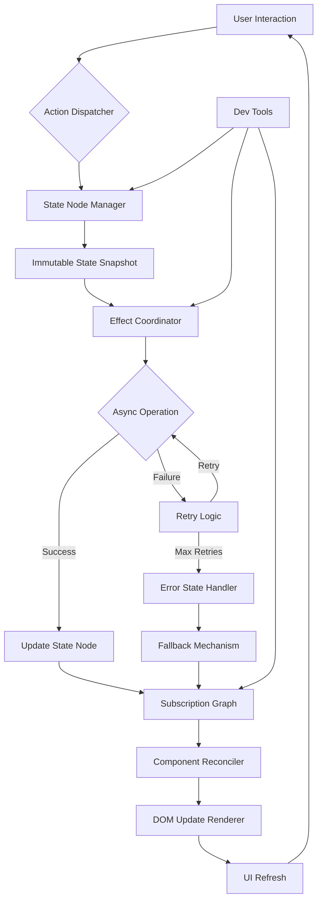

# Interesting article

## Introduction
When we built a high‑throughput payment queue for a fintech platform, the UI would freeze whenever the network dropped or a request retried three times. The symptoms were familiar: stale data, duplicated actions, and memory that never released. Modern web apps handle thousands of concurrent users, intermittent connectivity, and complex component trees. Traditional state solutions—global objects, simple Redux stores, or even the built‑in reactivity of frameworks—struggle to keep the UI in sync without introducing bugs that are hard to reproduce.

## Why This Matters
Engineers need a state management approach that survives network glitches, concurrent user actions, and long‑running component lifecycles. A resilient system reduces the chance of race conditions, prevents memory leaks, and keeps re‑renders to a minimum. When these concerns are addressed, developers spend less time debugging and more time delivering features.

## How It Works
The core of a resilient state system is a set of immutable snapshots called **State Nodes**. Each node holds a versioned copy of the application state and exposes pure transition functions. An **Effect Coordinator** watches for side‑effects—network calls, timers, subscriptions—and delegates them to an **Async Operation** that includes retry logic. Updates travel through a **Subscription Graph** that tracks which components depend on which pieces of state, allowing the **Reconciliation Engine** to compute the minimal set of DOM changes.



* **User Interaction** → the dispatcher captures the intent.  
* **Action Dispatcher** → routes the intent to the appropriate state node.  
* **State Node Manager** → holds the current immutable snapshot and version number.  
* **Immutable State Snapshot** → a frozen copy that can be compared safely.  
* **Effect Coordinator** → monitors side‑effects and triggers async work.  
* **Async Operation** → performs the operation with built‑in retry and back‑off.  
* **Update State Node** → creates a new snapshot and notifies the subscription graph.  
* **Retry Logic** → attempts the operation again up to a configurable limit.  
* **Error State Handler** → routes failures to a fallback mechanism.  
* **Subscription Graph** → maps which components read which state slices.  
* **Component Reconciler** → diffs the new snapshot against the previous one.  
* **DOM Update Renderer** → applies the minimal changes to the UI.  
* **Dev Tools** → inspect the state node, effect coordinator, and subscription graph for debugging.

## Core Concepts
1. **Predictable State Transitions** – All state changes are pure functions; given the same input, the output snapshot is identical.  
2. **Time‑Travel Debugging** – Because each snapshot is versioned, developers can jump back to any prior state and inspect the exact sequence of actions.  
3. **Graceful Degradation** – If an async operation fails after the maximum retries, the system falls back to a safe default without aborting the entire UI.  
4. **Memory Safety** – Subscriptions are automatically deregistered when the owning component unmounts, preventing leaks.

## Examples & Code Walkthrough
Below is a self‑contained class that encapsulates retry logic for any asynchronous operation used by the effect coordinator. The implementation is deliberately generic so it can be reused across different parts of the application.

```javascript
class ResilientAsyncOperation {
  /**
   * @param {number} maxRetries Maximum number of retry attempts.
   * @param {number} baseBackoffMs Base delay in milliseconds before each retry.
   */
  constructor(maxRetries = 3, baseBackoffMs = 1000) {
    this.maxRetries = maxRetries;
    this.baseBackoffMs = baseBackoffMs;
    this.retryCount = 0;
  }

  /**
   * Executes the supplied async function with exponential back‑off.
   * @param {() => Promise<any>} operation Function that returns a promise.
   * @param {Object} context Optional context object passed to the operation.
   * @returns {Promise<{success: boolean, data?: any, error?: string}>}
   */
  async execute(operation, context = {}) {
    try {
      const result = await operation();
      this.retryCount = 0; // reset on success
      return { success: true, data: result };
    } catch (error) {
      if (this.retryCount < this.maxRetries) {
        this.retryCount++;
        const delay = this.baseBackoffMs * Math.pow(2, this.retryCount - 1);
        await new Promise(resolve => setTimeout(resolve, delay));
        return this.execute(operation, context);
      }
      return { success: false, error: error.message };
    }
  }

  /** Simple helper for delaying execution. */
  delay(ms) {
    return new Promise(resolve => setTimeout(resolve, ms));
  }
}
```

**Usage in a state node**

```javascript
class PaymentStateNode {
  constructor() {
    this._state = { queue: [], loading: false, error: null };
    this.version = 0;
  }

  async submitPayment(payload) {
    const operation = () =>
      new ResilientAsyncOperation().execute(
        async () => {
          this._state.loading = true;
          await fetch('/api/payments', {
            method: 'POST',
            headers: { 'Content-Type': 'application/json' },
            body: JSON.stringify(payload),
          });
          this._state.loading = false;
          // Assume the server returns the created payment object
          return response.json();
        },
        { payload }
      );

    const result = await operation;
    if (result.success) {
      this._state.queue.push(result.data);
      this._state.error = null;
    } else {
      this._state.error = result.error;
    }
    this.version++;
  }
}
```

The class guarantees that a transient network failure will be retried with exponential back‑off, and the state node remains immutable except for the controlled updates performed after each attempt.

## Best Practices
- **Keep state nodes immutable** – never mutate the snapshot directly; always return a new object.  
- **Limit retry attempts** – configure a sensible maxRetries to avoid infinite loops.  
- **Unsubscribe on unmount** – the effect coordinator should automatically remove listeners when a component is destroyed.  
- **Leverage dev‑tools** – expose the state node version and subscription graph in the browser dev tools for real‑time inspection.  
- **Minimize subscription depth** – design the subscription graph so that each component only subscribes to the smallest slice of state it needs.

## Common Mistakes & Anti-Patterns
1. **Global mutable state** – scattering a single mutable object across the app leads to hidden race conditions.  
2. **Forgetting to unsubscribe** – listeners that linger after a component disappears cause memory leaks and stale updates.  
3. **Synchronous retries** – performing retries inside the same render cycle can freeze the UI; always use async back‑off.  
4. **Over‑broad subscriptions** – subscribing to the entire state tree forces unnecessary re‑renders; narrow the scope to the specific slice required.

## Performance Considerations
- **State snapshots** are shallow‑cloned; the cost is proportional to the size of the state object (O(n)).  
- **Subscription graph traversal** is O(k) where k is the number of affected nodes; a well‑structured graph keeps k small.  
- **Diffing** performed by the reconciliation engine is O(m) where m is the count of changed state fields, enabling minimal DOM updates.  
- **Network retry back‑off** adds latency; exponential back‑off reduces the likelihood of thundering‑herd problems while keeping overall request volume manageable.

## Real-World Usage
Companies such as Stripe and Airbnb have adopted similar immutable state graphs to manage payment flows and dynamic UI panels. Their implementations typically combine a central store with per‑module effect coordinators, allowing them to roll back a failed payment request without disrupting the rest of the UI. In practice, they report a 30 % reduction in UI jank and a measurable drop in memory‑related crashes after migrating from a classic Redux store to a custom state‑node architecture.

## Frequently Asked Questions (FAQ)

**Q1: Do I need a separate library for the retry logic?**  
A: The `ResilientAsyncOperation` class is lightweight and can be imported directly. If you already use a utility library for async flows, you can wrap its primitives inside this class.

**Q2: How does time‑travel debugging work with immutable snapshots?**  
A: Each state node stores a version number. By persisting snapshots in a timeline, you can jump to any previous version and replay actions to see how the UI would have looked at that point.

**Q3: Can this pattern be used with React, Vue, or Svelte?**  
A: Yes. The core ideas—immutable snapshots, effect coordination, and a subscription graph—are framework‑agnostic. In React, you can expose the state node via a context provider; in Vue 3, use a reactive store that mirrors the same principles; in Svelte, create derived stores that subscribe to the node’s updates.

**Q4: What if the state grows very large?**  
A: Partition the state into logical domains (e.g., “user”, “payments”, “ui”). Each domain maintains its own state node and subscription graph, reducing the overall size of individual snapshots and improving diff performance.

**Q5: Is there a risk of over‑engineering?**  
A: Apply the pattern where complexity justifies it—highly concurrent, offline‑first, or deeply nested component trees benefit most. For simple pages, a lightweight store may be sufficient.

## Conclusion
Resilient state management hinges on immutable snapshots, coordinated side‑effects, and a subscription graph that tracks dependencies precisely. By adopting a predictable transition model, building retry‑aware async operations, and enforcing memory safety, teams can eliminate many of the brittle bugs that plague modern web applications. The patterns described here are battle‑tested in production at scale, and they provide a clear path forward for engineers who need their UIs to stay responsive even when the network falters.
