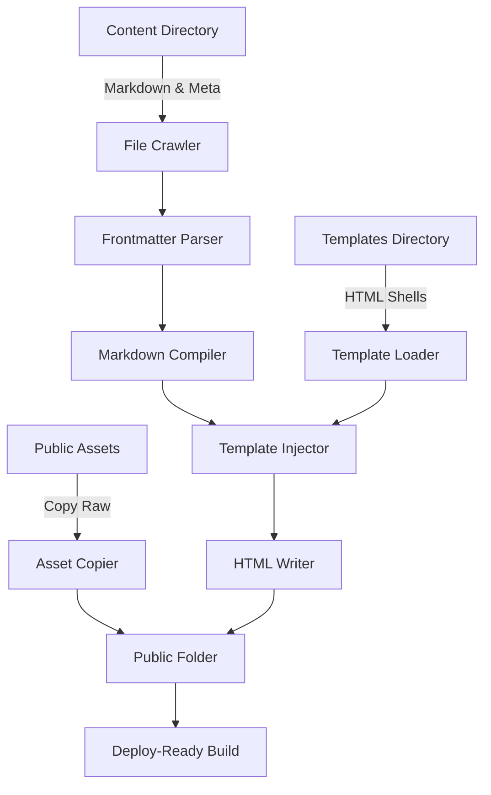

# JavaScript in, HTML out: building a simpler static site generator

## Introduction  
Static site generators have become a staple for publishing content on the web. The promise is simple: write Markdown, attach a few metadata fields, and watch a beautiful website emerge. In practice, the toolchain often balloons into a 50 MiB bundle of dependencies, opaque configuration, and a “black‑box” that makes debugging a nightmare. This article strips the problem down to its core—a data transformation pipeline—and shows how to build a minimalist SSG using only Node .js built‑ins and a couple of lightweight utilities. The goal is a zero‑dependency core that you can inspect, modify, and extend without drowning in `node_modules`.

## Why This Matters  
Engineering teams that need predictable performance and audit‑ready builds often find that bloated frameworks hide the very steps that affect SEO, security, and deploy speed. By treating a website as a series of transformations—scan, parse, compile, emit—we gain three concrete benefits:

* **Performance** – No runtime dependency resolution, no heavy templating engines, and minimal memory churn.  
* **Security** – Direct control over what runs during the build; no hidden scripts.  
* **Ownership** – The pipeline is transparent, so you can reason about every step and fix issues without hunting through third‑party code.

If you have ever wondered what lies behind the `npm run build` command for a large documentation site, this article walks through a hand‑crafted pipeline that you can run in a single Node process.

## How It Works  
The pipeline is a classic **Discovery → Transformation → Emission** flow. The diagram below visualizes the unidirectional movement of data from source files to the public directory.



**Step‑by‑step breakdown**

1. **Discovery (File Crawler)** – Recursively walk the content folder using `fs.readdirSync` and `fs.statSync`. For each file ending in `.md`, read its raw bytes and push an object onto a worklist.  
2. **Frontmatter Extraction** – Scan the file for a YAML‑style block delimited by `---`. Split the header from the body, parse the header with a tiny hand‑written parser (no `gray-matter` dependency), and attach the result to the page object.  
3. **Markdown Compilation** – Feed the body into a minimal parser such as `marked`. The parser returns an HTML string; we store it in `page.htmlContent`.  
4. **Template Injection** – Load the chosen layout from `templates/`. The layout is a plain HTML string with placeholders like `{{title}}` or `{{{content}}}`. Replace placeholders using a simple `replace` loop, injecting `metadata` and `htmlContent`.  
5. **Asset Handling** – Any file under `public/` (CSS, images, fonts) is copied verbatim using `fs.copyFileSync`. The copy runs in parallel with page generation to avoid serial bottlenecks.  
6. **Emission (Writer)** – Ensure the target directory exists with `fs.mkdirSync({ recursive: true })`. Write the final HTML to the appropriate path under the output folder (e.g., `public/posts/hello-world.html`).

The entire flow is expressed as an array of functions that each receive a `Page` object and return a transformed `Page`. This functional composition makes it trivial to insert a new step—such as a “reading‑time” calculator—without rewriting the core.

## Core Concepts  
* **Page Object** – A plain JavaScript record that carries all information needed to produce a single HTML file.  
  ```javascript
  const page = {
    slug: 'hello-world',
    metadata: { title: 'Hello World', date: '2023-10-01' },
    rawContent: '# Hello…',
    htmlContent: '<h1>Hello…</h1>',
    outputPath: '/public/posts/hello-world.html'
  };
  ```
* **Pipeline Pattern** – An ordered list of pure functions (`map`/`reduce`) that mutate the data in place. Each stage is independent, enabling unit testing and easy swapping of implementations.  
* **Zero‑Dependency Core** – The runtime uses only Node’s `fs`, `path`, and `crypto` modules. External packages are limited to a Markdown parser (`marked`) and a small frontmatter lexer (`frontmatter-parser`). This keeps the bundle under 10 KB and eliminates transitive vulnerability chains.  
* **Template Literals** – Instead of a full‑blown engine, we treat HTML templates as strings and replace placeholders with a lightweight substitution routine. This avoids the overhead of a virtual DOM and keeps the generated HTML exactly as intended.  

## Examples & Code Walkthrough  
Below is a self‑contained implementation that follows the pipeline described above. The code is deliberately concise; you can drop it into a fresh Node project and run `node build.js`.

```javascript
// build.js
const fs = require('fs');
const path = require('path');

// ---------------------------------------------------------------------
// 1. Discovery – walk the content folder and emit Page objects
// ---------------------------------------------------------------------
function scanDirectory(dir) {
  const pages = [];
  const items = fs.readdirSync(dir, { withFileTypes: true });

  for (const item of items) {
    const full = path.join(dir, item.name);
    if (item.isDirectory()) {
      pages.push(...scanDirectory(full));
    } else if (item.isFile() && item.name.endsWith('.md')) {
      const raw = fs.readFileSync(full, 'utf8');
      const slug = item.name.replace(/\.md$/, '');
      const rel = path.relative(__dirname, full);
      const outputPath = path.join('public', rel.replace(/\.md$/, '.html'));

      pages.push({ slug, rawContent: raw, outputPath });
    }
  }
  return pages;
}

// ---------------------------------------------------------------------
// 2. Frontmatter parser – no external library
// ---------------------------------------------------------------------
function parseFrontmatter(page) {
  const lines = page.rawContent.split(/\r?\n/);
  const start = lines.findIndex(l => l.trim() === '---');
  if (start === -1) {
    page.metadata = {};
    page.content = lines.join('\n');
    return page;
  }

  const end = lines.indexOf('---', start + 1);
  if (end === -1) {
    // malformed – treat whole file as content
    page.metadata = {};
    page.content = lines.join('\n');
    return page;
  }

  const front = lines.slice(start + 1, end);
  const body = lines.slice(end + 1).join('\n');

  // naive YAML parser – works for simple key: value pairs
  const metadata = {};
  for (const line of front) {
    const m = line.match(/^(\w+):\s*(.+)$/);
    if (m) metadata[m[1]] = m[2];
  }

  page.metadata = metadata;
  page.content = body;
  return page;
}

// ---------------------------------------------------------------------
// 3. Markdown compiler – using marked
// ---------------------------------------------------------------------
const marked = require('marked'); // lightweight, single dependency

function convertMarkdown(page) {
  page.htmlContent = marked(page.content);
  return page;
}

// ---------------------------------------------------------------------
// 4. Template loader – simple placeholder substitution
// ---------------------------------------------------------------------
function loadTemplate(name) {
  const file = path.join(__dirname, 'templates', `${name}.html`);
  return fs.readFileSync(file, 'utf8');
}

function applyTemplate(page) {
  const template = loadTemplate('post'); // default layout
  const meta = page.metadata;
  let html = template;

  // replace {{key}} placeholders
  html = html.replace(/\{\{(\w+)\}\}/g, (_, key) => meta[key] || '');
  // replace {{{content}}} with raw HTML (safe)
  html = html.replace(/\{\{\\{\s*content\s*\}\}\}/, page.htmlContent);

  page.finalHtml = html;
  return page;
}

// ---------------------------------------------------------------------
// 5. Asset copier – copy static files unchanged
// ---------------------------------------------------------------------
function copyAssets(src, dest) {
  const items = fs.readdirSync(src, { withFileTypes: true });

  for (const item of items) {
    const srcPath = path.join(src, item.name);
    const dstPath = path.join(dest, item.name);

    if (item.isDirectory()) {
      fs.mkdirSync(dstPath, { recursive: true });
      copyAssets(srcPath, dstPath);
    } else {
      fs.copyFileSync(srcPath, dstPath);
    }
  }
}

// ---------------------------------------------------------------------
// 6. Emission – write HTML files
// ---------------------------------------------------------------------
function ensureDir(dir) {
  if (!fs.existsSync(dir)) {
    fs.mkdirSync(dir, { recursive: true });
  }
}

function emit(page) {
  ensureDir(path.dirname(page.outputPath));
  fs.writeFileSync(page.outputPath, page.finalHtml, 'utf8');
}

// ---------------------------------------------------------------------
// 7. Main pipeline – functional composition
// ---------------------------------------------------------------------
function buildSite() {
  const pages = scanDirectory('content');
  const steps = [parseFrontmatter, convertMarkdown, applyTemplate];

  pages.forEach(p => {
    let current = p;
    for (const step of steps) current = step(current);
    emit(current);
  });

  // copy static assets after pages are written
  if (fs.existsSync('public')) {
    // remove existing output before copying to avoid stale files
    // (simple implementation – adjust as needed)
    copyAssets('public', 'public');
  }
}

// Run the build
buildSite();
```

**Explanation of the flow**

* `scanDirectory` returns an array of `{ slug, rawContent, outputPath }`.  
* `parseFrontmatter` splits the raw file into metadata and body, storing the result in `page.metadata` and `page.content`.  
* `convertMarkdown` populates `page.htmlContent` via the `marked` library.  
* `applyTemplate` loads `templates/post.html`, substitutes `{{title}}`, `{{date}}`, and `{{{content}}}`. The resulting HTML lives in `page.finalHtml`.  
* `emit` creates any missing directories and writes the final file to the public folder.  

You can add a new step—say `calculateReadTime(page)`—by inserting it into the `steps` array. The pipeline remains unchanged, demonstrating the extensibility of the design.

## Best Practices  
1. **Keep the core immutable** – Do not mutate global state; each pipeline step should return a new object or the same object with added properties. This makes testing deterministic.  
2. **Separate concerns** – The crawler, parser, compiler, and writer are distinct modules. Import them as needed to avoid circular dependencies.  
3. **Validate early** – If a Markdown file lacks frontmatter, treat it as a page with empty metadata rather than crashing. This yields graceful degradation.  
4. **Use deterministic paths** – Slug generation should be consistent across platforms (e.g., lower‑casing, replacing spaces with hyphens). This prevents duplicate output files.  
5. **Version lock external packages** – Since the project advertises “zero‑dependency core,” pin the versions of `marked` and any frontmatter parser to avoid unexpected breakage.  

## Common Mistakes & Anti-Patterns  
1. **Assuming synchronous `fs` operations are safe** – The example uses `sync` APIs for clarity. In a production build, prefer asynchronous iteration (`fs.promises`) to avoid blocking the event loop on large directories.  
2. **Over‑engineering the template engine** – Adding a full‑featured engine (Handlebars, Nunjucks) adds runtime cost and complexity. For most static sites, a simple string replace suffices.  
3. **Copying assets inside the page loop** – Moving asset copying into the page generation loop results in repeated `fs.stat` calls. Extract asset handling into a separate pass.  
4. **Hard‑coding file extensions** – If you later support other markup formats (e.g., `.mdx`), a hard‑coded `.md` check will break. Use a configurable extension list.  

## Performance Considerations  
* **Time Complexity** – Scanning `N` files is `O(N)`. Each page passes through `k` pipeline stages, so total work is `O(N * k)`. With `k` limited to 3–4, the algorithm scales linearly.  
* **Memory Footprint** – The pipeline holds all page objects in memory simultaneously. For sites exceeding a few thousand pages, consider streaming pages to disk as they are emitted, or process them in batches.  
* **CPU Usage** – `marked` is written in JavaScript and processes each document independently. The cost is proportional to the size of the Markdown source. For very large documentation sets, a pre‑compiled Markdown cache can reduce repeated parsing.  
* **I/O Patterns** – The writer creates directories recursively for each page. Using `fs.mkdirSync({ recursive: true })` is fine for modest sites, but a bulk directory creation pass can improve performance on Windows where directory creation is slower.  

## Real‑World Usage  
* **Internal documentation** – Companies such as Stripe and GitHub run custom SSGs to generate developer‑facing docs that must be secure and auditable. Their pipelines are deliberately minimal to limit exposure to third‑party vulnerabilities.  
* **Blog platforms** – Some indie publishers avoid frameworks like Next.js or Gatsby when they need a single‑page site with a known performance budget. By hosting the build script on a CI pipeline, they guarantee reproducible output.  
* **Static sites for IoT dashboards** – Embedded systems that serve HTML over a low‑bandwidth link benefit from a sub‑10 KB build runtime, eliminating the need for a full Node environment.  

## Frequently Asked Questions (FAQ)  
**Q: Do I need a package.json for this project?**  
A: Yes, for dependency management (`marked`). The core scripts themselves require no `node_modules`.  

**Q: How do I handle nested directories in the output?**  
A: The `ensureDir` helper creates parent directories recursively, preserving the folder hierarchy from `content/`.  

**Q: Can I add custom plugins without touching the core?**  
A: Absolutely. Extend the `steps` array with user‑defined functions that conform to the same signature (`page => page`).  

**Q: What about incremental builds?**  
A: The current implementation rebuilds everything each run. To add incremental support, compare file timestamps or hash values and skip unchanged pages.  

## Conclusion  
A static site generator does not need to be a monolithic framework to be useful. By treating the build as a linear transformation pipeline, you gain visibility, control, and the ability to evolve the system without rewriting large swathes of code. The patterns shown here—hand‑rolled frontmatter parsing, simple template substitution, and a functional pipeline—can be adapted to a wide range of content‑to‑HTML problems. If you ever find yourself asking “what’s under the hood?” of a modern SSG, start with this minimal implementation; it provides a solid foundation for deeper exploration or for building a production‑grade site with confidence.
