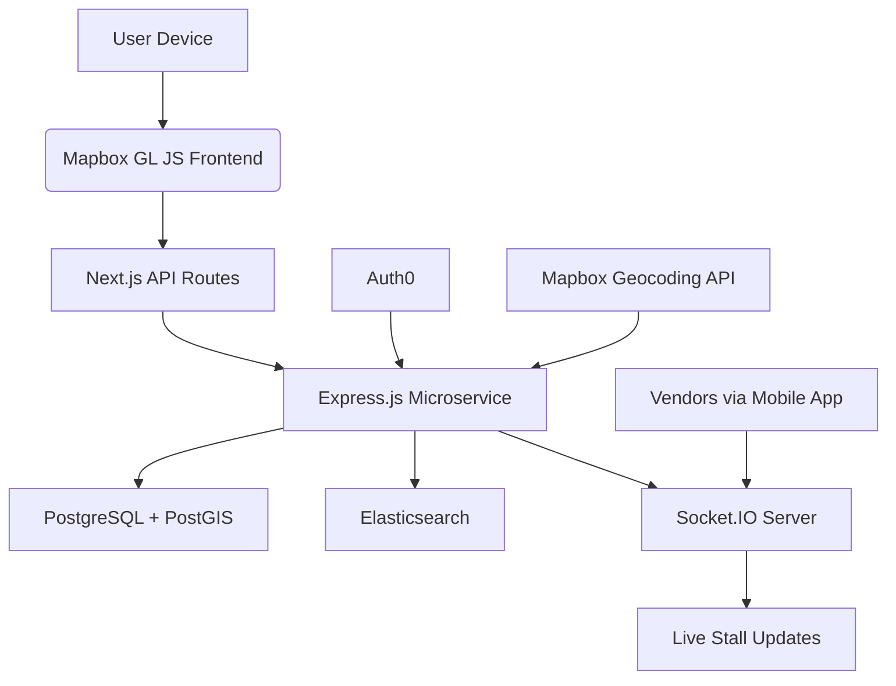

# Karachi Ki Raatein: A Love Letter to Midnight Street Food

## Introduction

Karachi doesn’t sleep — it sizzles. At 2 a.m., when most cities are quiet, the streets come alive with the smoky aroma of charcoal-grilled kebabs, the hiss of oil hitting hot pans, and the chatter of night owls hunting their next bite. This isn’t just about food; it’s about culture, community, and connection.

But finding these hidden gems? That’s still a gamble. You either rely on word-of-mouth or drive around hoping to catch the right whiff. So we built *Karachi Ki Raatein* — a real-time web app that maps Karachi’s midnight street food scene, complete with live stall statuses, user reviews, and turn-by-turn navigation.

This article walks through how we engineered a resilient, scalable platform that bridges the gap between tradition and technology.

## Why This Matters

Street food vendors form the backbone of Karachi’s nighttime economy. They feed students after late-night shifts, families on evening strolls, and travelers seeking authentic flavors. Yet many operate informally, invisible to mainstream platforms.

By building a dedicated digital hub for these vendors, we’re not only empowering them economically but also preserving a vital part of Karachi’s identity. For developers, this project offers lessons in geospatial data modeling, real-time communication, and balancing performance with usability — all within a familiar stack.

## How It Works

At its core, *Karachi Ki Raatein* connects food seekers with nearby stalls using location-based discovery, real-time updates, and community-driven insights.



Here's what happens behind the scenes:

1. **Discovery**: Users search for nearby stalls using filters like cuisine type, ratings, or operating hours. The frontend queries Elasticsearch for fast text-based searches.
2. **Mapping**: Results are rendered on an interactive Mapbox map, showing precise locations and real-time availability.
3. **Real-Time Updates**: Vendors push status changes (open/closed, busy/empty) via WebSockets handled by Socket.IO, which broadcasts updates instantly to connected clients.
4. **Reviews & Ratings**: Users submit reviews stored in PostgreSQL, enriched with photo uploads and sentiment analysis for better filtering.
5. **Navigation**: Users tap into Mapbox Navigation SDK for turn-by-turn directions directly to the stall.

Each component scales independently, ensuring smooth performance even during peak hours.

## Core Concepts

Before diving deeper, let’s break down the key concepts powering the system:

- **Geospatial Indexing**: Using PostGIS extensions in PostgreSQL to store and query geographic coordinates efficiently.
- **Faceted Search**: Leveraging Elasticsearch to enable rich filtering across multiple dimensions (e.g., price range, popularity).
- **WebSockets vs Polling**: Choosing Socket.IO over HTTP polling for low-latency, bidirectional communication.
- **JWT Authentication**: Securely managing sessions with short-lived tokens issued through Auth0.
- **Offline Fallback**: Caching critical data locally using Service Workers so users can browse stalls without internet access.

These aren’t just buzzwords — they’re foundational tools that shape how modern web apps handle dynamic, location-sensitive workflows.

## Examples & Code Walkthrough

Let’s peek under the hood at some actual implementation details.

### Geospatial Query in PostgreSQL (PostGIS)

To find stalls within a 1 km radius of the user’s current position:

```sql
SELECT 
    s.id,
    s.name,
    s.category,
    ST_Distance(s.location::geography, ST_Point(:lng, :lat)::geography) AS distance_meters
FROM stalls s
WHERE ST_DWithin(
    s.location::geography,
    ST_Point(:lng, :lat)::geography,
    1000
)
ORDER BY distance_meters ASC;
```

We index the `location` column with a GiST index to ensure logarithmic lookup times.

### Real-Time Status Update Handler (Node.js + Socket.IO)

When a vendor toggles their stall’s open/close switch:

```ts
io.on('connection', (socket: Socket) => {
  console.log(`Vendor ${socket.id} connected`);

  socket.on('updateStatus', async ({ stallId, isOpen }: UpdatePayload) => {
    try {
      await db.query(
        'UPDATE stalls SET is_open = $1, last_updated = NOW() WHERE id = $2',
        [isOpen, stallId]
      );

      // Broadcast updated status to all nearby users
      const nearbySockets = getNearbySockets(stallId);
      nearbySockets.forEach((sockId) => {
        io.sockets.sockets.get(sockId)?.emit('stallStatusChanged', { stallId, isOpen });
      });
    } catch (err) {
      logger.error(err);
      socket.emit('error', 'Failed to update stall status');
    }
  });
});
```

This keeps everyone informed instantly, without constant API calls.

### Client-Side Map Rendering (React + Mapbox)

Rendering stalls dynamically on the map:

```tsx
function StallMarkers({ stalls }: { stalls: Stall[] }) {
  const map = useMap();

  useEffect(() => {
    stalls.forEach((stall) => {
      new mapboxgl.Marker({ color: stall.isOpen ? 'green' : 'red' })
        .setLngLat([stall.longitude, stall.latitude])
        .setPopup(new mapboxgl.Popup().setText(`${stall.name}\n${stall.isOpen ? 'Open' : 'Closed'}`))
        .addTo(map);
    });
  }, [stalls]);

  return null;
}
```

Simple, yet effective.

## Best Practices

After deploying this in production, here are the rules we now swear by:

1. **Cache Geospatial Queries Locally**: Store frequently accessed stall lists in Redis with TTLs based on activity levels.
2. **Use Cursor-Based Pagination**: Especially useful for large result sets pulled from Elasticsearch.
3. **Implement Graceful Degradation**: If WebSockets fail, fall back to periodic REST polling.
4. **Validate Everything at the Edge**: Don’t trust GPS inputs blindly; validate coordinates before storing them.
5. **Leverage CDNs for Static Assets**: Photos and static assets should always go through Cloudflare or similar services.

## Common Mistakes & Anti-Patterns

Even seasoned teams trip up on these traps:

1. **Over-fetching Data**: Loading entire datasets instead of paginating or filtering server-side leads to bloated payloads and slow UX.
2. **Ignoring Offline Scenarios**: Not accounting for dropped connections means frustrated users when they lose signal mid-search.
3. **Mixing Concerns in One Service**: Putting auth logic alongside business logic makes testing harder and increases coupling.
4. **Hardcoding Lat/Lng Thresholds**: Proximity calculations must account for Earth’s curvature — flat-plane assumptions break down quickly.

Avoiding these pitfalls early saves weeks of debugging later.

## Performance Considerations

Scalability was non-negotiable from day one. Here’s how we optimized each layer:

| Component       | Optimization Strategy                          |
|------------------|------------------------------------------------|
| Database         | Spatial indexes, read replicas, connection pooling |
| Search Engine    | Shard allocation, caching layers, query tuning |
| WebSocket Server | Sticky sessions, heartbeat monitoring, message batching |
| Frontend         | Lazy loading components, image compression, ISR |

With proper sharding strategies, our Elasticsearch cluster handles millions of daily searches with sub-second response times. Similarly, our PostGIS-backed database serves thousands of concurrent geospatial queries per second.

## Real-World Usage

Companies like Uber Eats and DoorDash have long used similar architectures to power hyperlocal delivery networks. But *Karachi Ki Raatein* brings that same sophistication to informal vendors who lack the resources to compete otherwise.

Startups such as Swvl and Careem have also adopted hybrid models combining centralized dispatch systems with decentralized vendor interfaces — much like our approach to integrating mobile apps with the main web service.

## Frequently Asked Questions (FAQ)

**Q: Is it hard to integrate Mapbox with React?**  
A: Not really. Libraries like `react-map-gl` abstract away much of the boilerplate. Just remember to lazy-load maps until needed to reduce bundle size.

**Q: Why choose Socket.IO over raw WebSockets?**  
A: Socket.IO provides automatic reconnection, fallback transports, and built-in rooms — essential features when dealing with unstable mobile networks.

**Q: Can I run this stack on AWS Lambda?**  
A: Partially. While serverless works well for stateless APIs, WebSocket handling typically requires dedicated infrastructure due to connection limits.

**Q: What happens if PostGIS goes down?**  
A: We've set up automated failover clusters with streaming replication. Downtime is minimized, though recovery time depends on the nature of failure.

**Q: How do you manage vendor onboarding?**  
A: Through a lightweight admin panel built with React Admin, allowing quick registration and verification workflows.

## Conclusion

Building *Karachi Ki Raatein* taught us that great software doesn’t need flashy frameworks or exotic languages. It needs empathy, clarity, and thoughtful architecture. By combining proven technologies like PostgreSQL/PostGIS, Elasticsearch, and Socket.IO, we created something meaningful — a bridge between tradition and innovation.

Whether you're mapping food trucks in São Paulo or tracking artisans in Lahore, the principles remain the same: listen closely to your users, optimize ruthlessly, and never forget the human story behind every line of code.

So next time you're craving nihari at midnight, maybe skip the drive — fire up the app instead.
