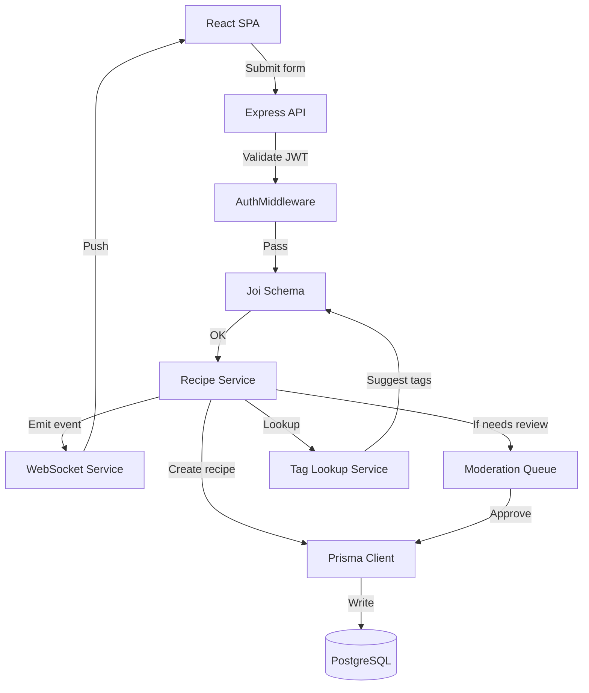

# Kitchen-Sune: A Community Cookbook

## Introduction
A shared cookbook built by developers for developers solves a simple but recurring problem: finding reliable, version‑controlled recipes that can be forked, tweaked, and contributed back. On Dev.to the conversation around open‑source food‑tech projects has been picking up, showing that engineers enjoy treating cooking like another collaborative codebase. Kitchen‑Sune is our answer—a lightweight, community‑driven platform where anyone can submit a recipe, discuss variations, and keep the collection under source‑control‑like governance.

## Why This Matters
Software teams already rely on platforms like GitHub for code, npm for packages, and Docker Hub for images. Yet when it comes to something as everyday as a meal, we fall back to scattered PDFs, personal blogs, or proprietary apps that lock data away. A community cookbook gives us:

* **Transparency** – every change is visible, attributable, and revertible.  
* **Reusability** – a recipe can be imported into meal‑planning tools or CI pipelines that provision dev‑box lunches.  
* **Extensibility** – tags, ingredient substitutions, and nutrition notes become first‑class entities that anyone can extend.  

In short, it treats culinary knowledge as a first‑class artifact in our engineering toolbox.

## How It Works
Kitchen‑Sune splits concerns into four loosely coupled layers: a React frontend, an Express/Node API, a PostgreSQL data store powered by Prisma, and a set of community services (moderation, tag suggestion, activity feed). The diagram below shows the request flow from a user submitting a new recipe to its appearance on the public list.



**Step‑by‑step**

1. **User interaction** – The React app presents a form. When the user hits “Save”, an optimistic UI update shows the new recipe instantly while a POST request is sent to `/api/recipes`.  
2. **Authentication** – The Express router runs `AuthMiddleware`, which verifies a JWT issued at login and attaches `req.user`.  
3. **Input validation** – A Joi schema checks required fields (title, ingredients array, steps), sanitizes strings, and enforces tag limits.  
4. **Business logic** – The `Recipe Service` creates a Prisma `Recipe` record, links it to the user, and attaches any supplied tags. If the recipe contains flagged ingredients (e.g., allergens marked for moderation), it is placed in a moderation queue instead of going live immediately.  
5. **Persistence** – Prisma translates the call into SQL, writes to PostgreSQL, and returns the generated ID.  
6. **Real‑time notification** – After commit, a Socket.io event broadcasts the new recipe to all connected clients, allowing the UI to replace the optimistic placeholder with the real record.  
7. **Tag suggestion** – As the user types ingredients, a lightweight tag‑lookup service (backed by a trie in Redis) returns likely cuisine or diet tags, which the frontend shows as autocomplete options.

## Core Concepts
* **Optimistic UI** – The frontend updates state before the server responds, rolling back only on error. This reduces perceived latency.  
* **Middleware pipeline** – Express chains `auth → validation → business logic → response`. Each step can short‑circuit (e.g., failed auth returns 401).  
* **Prisma schema as contract** – The Prisma file defines tables, relations, and default values; migrations keep the DB in sync with the model.  
* **Moderation workflow** – Recipes enter a “pending” state; an admin dashboard shows a queue, allows approving/rejecting, and writes to a `moderation_logs` table for audit.  
* **Tag taxonomy** – Tags are stored in a separate table with a many‑to‑many link to recipes. A lookup service suggests tags based on ingredient name similarity (Levenshtein distance < 2) and pre‑defined mapping.

## Examples & Code Walkthrough

### React – Optimistic Recipe Card
```tsx
import { useState } from "react";
import { useMutation, useQueryClient } from "@tanstack/react-query";

interface Recipe {
  id: string;
  title: string;
  imageUrl: string;
  description: string;
  likes: number;
}

export const RecipeCard = ({ recipe }: { recipe: Recipe }) => {
  const queryClient = useQueryClient();
  const [liked, setLiked] = useState<boolean>(recipe.likes > 0);

  const likeMutation = useMutation({
    mutationFn: async (id: string) => {
      const res = await fetch(`/api/recipes/${id}/like`, {
        method: "POST",
        headers: { "Content-Type": "application/json" },
      });
      if (!res.ok) throw new Error("Like failed");
    },
    onMutate: async (id) => {
      // Cancel any outgoing refetches to avoid overwriting optimistic update
      await queryClient.cancelQueries({ queryKey: ["recipes"] });
      const previous = queryClient.getQueryData<Recipe[]>(["recipes"]);
      // Optimistically update the cache
      queryClient.setQueryData<Recipe[]>(["recipes"], (old) =>
        old?.map((r) => (r.id === id ? { ...r, likes: r.likes + 1 } : r)) ?? []
      );
      return { previous };
    },
    onError: (err, variables, context) => {
      // Rollback to previous data on error
      if (context?.previous) {
        queryClient.setQueryData(["recipes"], context.previous);
      }
      console.error(err);
    },
    onSettled: () => {
      queryClient.invalidateQueries({ queryKey: ["recipes"] });
    },
  });

  const handleLike = () => {
    likeMutation.mutate(recipe.id);
    setLiked(true);
  };

  return (
    <div className="border rounded p-4 shadow-sm">
      
      <h3 className="text-lg font-semibold">{recipe.title}</h3>
      <p className="text-gray-600">{recipe.description}</p>
      <div className="flex items-center space-x-2 mt-2">
        <button
          onClick={handleLike}
          disabled={likeMutation.isLoading}
          className={`px-3 py-1 rounded ${
            liked ? "bg-yellow-200 text-yellow-800" : "bg-gray-200"
          }`}
        >
          {liked ? "Liked" : "Like"}
        </button>
        <span className="text-sm text-gray-500">{recipe.likes}</span>
      </div>
    </div>
  );
};
```

*Notes*  
* We use **React‑Query** for caching and mutation handling. The `onMutate` hook rolls the optimistic change into the cache instantly; on error we revert to the previous snapshot.  
* The button reflects the optimistic state (`liked`) immediately, giving a snappy feel.

### Prisma Schema
```prisma
// schema.prisma
generator client {
  provider = "prisma-client-js"
}

datasource db {
  provider = "postgresql"
  url      = env("DATABASE_URL")
}

model User {
  id            String   @id @default(uuid())
  email         String   @unique
  name          String?
  recipes       Recipe[]
  moderationLogs ModerationLog[]
  createdAt     DateTime @default(now())
}

model Recipe {
  id            String   @id @default(uuid())
  title         String
  description   String?
  imageUrl      String?
  authorId      String
  author        User     @relation(fields: [authorId], references: [id])
  tags          Tag[]    @relation("RecipeTags")
  likes         Int      @default(0)
  status        Status   @default(PENDING) // PENDING, APPROVED, REJECTED
  createdAt     DateTime @default(now())
  updatedAt     DateTime @updatedAt
}

model Tag {
  id   String   @id @default(uuid())
  name String   @unique
  recipes Recipe[] @relation("RecipeTags")
}

model ModerationLog {
  id        String   @id @default(uuid())
  recipeId  String
  recipe    Recipe   @relation(fields: [recipeId], references: [id])
  moderator String   // userId of moderator
  action    ModerationAction // APPROVE, REJECT
  comment   String?
  createdAt DateTime @default(now())
}

enum Status {
  PENDING
  APPROVED
  REJECTED
}

enum ModerationAction {
  APPROVE
  REJECT
}
```

*Key points*  
* `status` drives the moderation flow; only `APPROVED` recipes appear in the public feed.  
* `moderation_logs` provides an immutable audit trail.  
* UUIDs are used for all IDs to avoid leakage of sequential identifiers.

### Express Auth Middleware
```js
// middleware/auth.js
const jwt = require("jsonwebtoken");

function authMiddleware(req, res, next) {
  const auth = req.headers.authorization;
  if (!auth?.startsWith("Bearer ")) {
    return res.status(401).json({ error: "Missing token" });
  }
  const token = auth.split(" ")[1];
  try {
    const payload = jwt.verify(token, process.env.JWT_SECRET);
    req.user = { id: payload.sub, email: payload.email };
    next();
  } catch (err) {
    return res.status(401).json({ error: "Invalid token" });
  }
}

module.exports = authMiddleware;
```

*Usage*  
```js
const express = require("express");
const auth = require("./middleware/auth");
const recipeRouter = require("./routes/recipes");

const app = express();
app.use(express.json());

app.use("/api/recipes", auth, recipeRouter);
// other routes...
```

## Best Practices
1. **Keep the UI stateless where possible** – rely on React‑Query or SWR for server state; local UI state (like a button’s pressed flag) should be derived from the cache.  
2. **Validate at the edge** – Joi schemas catch malformed payloads before they hit Prisma, preventing costly DB errors and providing clear 400 responses.  
3. **Use database constraints** – unique indexes on `User.email` and `Tag.name` guarantee integrity even if middleware fails.  
4. **Log moderation actions** – store who did what and why; this aids compliance and helps resolve disputes.  
5. **Version your API** – prefix routes with `/v1/` so future breaking changes can be introduced without breaking existing clients.  
6. **Automate migrations** – hook `prisma migrate deploy` into your CI pipeline; never run migrations manually on production.  
7. **Health checks** – expose `/ready` and `/live` endpoints that verify DB connectivity and JWT secret presence; orchestrators (Kubernetes, Docker Swarm) can use them for liveness/readiness probes.

## Common Mistakes & Anti-Patterns
| Mistake | Why it hurts | Fix |
|---------|--------------|-----|
| **Mutating state directly in React** (e.g., `recipe.likes++`) | Breaks React’s reconciliation, leads to stale UI and hard‑to‑trace bugs. | Use state setters or immutable update patterns; prefer caching libraries. |
| **Skipping JWT expiration checks** | Tokens can be used forever, increasing risk if leaked. | Set `expiresIn` when signing and verify `exp` claim in middleware. |
| **Hard‑coding image URLs** | Makes the app inflexible when moving to a CDN or changing storage provider. | Store URLs in DB; serve images via a dedicated static service or S3 with signed URLs. |
| **Running Prisma generate on every container start** | Adds unnecessary CPU overhead and can cause version drift. | Generate client once during image build (`RUN npx prisma generate`). |
| **Allowing unlimited tag creation** | Leads to tag proliferation, hurting search relevance. | Pre‑approve tags via a lookup service; require moderator approval for new tags. |

## Performance Considerations
* **Read path** – Fetching the recipe list uses a simple `SELECT * FROM Recipe WHERE status = 'APPROVED' ORDER BY createdAt DESC LIMIT 20`. With proper indexes on `status` and `createdAt`, this is O(log N) + O(K) where K is page size.  
* **Write path** – A recipe insert touches three tables (`User`, `Recipe`, `RecipeTags`). Each insert is O(log N) thanks to B‑tree indexes; the many‑to‑many relation uses a join table with composite primary key (`recipeId`, `tagId`).  
* **Image loading** – The `RecipeCard` uses `loading="lazy"` on the `` tag, deferring offscreen images and reducing initial payload.  
* **WebSocket fan‑out** – Socket.io rooms are scoped to “global feed”; each new recipe triggers a single broadcast, O(1) per connected client. For thousands of clients consider scaling Socket.io with a Redis adapter.  
* **Database connection pooling** – Prisma’s default pool size (10) works well for modest traffic; tune based on expected concurrent requests and DB max connections.

## Real-World Usage
* **Internal hackathons** – Teams at a mid‑size SaaS company used Kitchen‑Sune to share quick lunch recipes during remote sprints, cutting down on Slack food‑photo spam.  
* **Open‑source meetups** – A local JavaScript group deployed the stack on a Raspberry Pi cluster; the low‑resource footprint (Node + PostgreSQL) allowed them to run the service on a single 2 GB VM.  
* **Educational courses** – A university web‑dev class adopted Kitchen‑Sune as a capstone project, giving students hands‑on experience with auth, ORM, and real‑time updates.  

## Frequently Asked Questions (FAQ)

**Q: How do we handle recipe images that exceed a few megabytes?**  
A: The frontend checks file size before upload; if >2 MB it prompts the user to resize. On the server we stream the upload to an S3 bucket and store only the URL in the DB, keeping the PostgreSQL row lean.

**Q: Can I run Kitchen‑Sune without Docker?**  
A: Yes. The repo includes a `docker-compose.yml` for convenience, but you can start the API with `node dist/index.js` after building the TypeScript source, and run the React app via `vite preview`. Just ensure `DATABASE_URL` points to a reachable Postgres instance.

**Q: What if we want to support private recipes visible only to certain groups?**  
A: Add a `visibility` enum (`PUBLIC`, `PRIVATE`, `GROUP`) and a `groupId` foreign key on `Recipe`. Adjust the GET `/recipes` endpoint to filter by the requester’s membership. The current modular design makes this a localized change.

**Q: How do we prevent spammy tag creation?**  
A: The tag‑lookup service only suggests from a curated list. To add a new tag, a user must submit a moderation request; a moderator approves or rejects it, logging the action in `moderation_logs`.

**Q: Is the socket.io server a scaling bottleneck?**  
A: For typical community sizes (<10 k concurrent users) a single Node process with the Redis adapter handles the load easily. Beyond that, you can run multiple socket.io instances behind a sticky‑session load balancer or switch to a purpose‑built service like Apache Pulsar for
