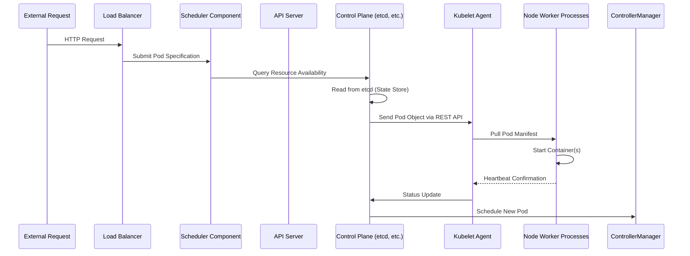

# Kubernetes Architecture

## Introduction

When we provision cloud infrastructure for modern applications, the choice of orchestration platform fundamentally shapes system reliability and operational efficiency. We've moved beyond monolithic deployments; containers enable rapid iteration, but they also demand sophisticated coordination across distributed nodes. At the heart of this ecosystem sits Kubernetes, a system designed to manage workloads at scale while abstracting away the complexities of hardware and networking. Understanding its architecture is essential for anyone designing resilient production systems, because the choices made around component configuration directly influence uptime and resource utilization.

## Why This Matters

Cloud-native development teams face constant pressure to deliver features quickly while maintaining stability across massive scale. The primary challenge is not merely running code but orchestrating thousands of instances across heterogeneous environments. Kubernetes addresses this by providing declarative scheduling, automated load balancing, and self-healing capabilities. Without understanding its internal mechanics, engineers risk misconfigurations that lead to cascading failures, unpredictable scaling behaviors, or inefficient resource consumption. Real organizations cannot afford assumptions—they need precise knowledge of how the control plane interacts with worker nodes to avoid subtle bugs that only surface during production incidents.

## How It Works

Kubernetes operates through a distinct separation of concerns between the control plane and worker nodes. The control plane manages workload distribution, while workers execute the assigned tasks. Below is a visual representation of this flow:



**Step-by-Step Breakdown:**

1. **Request Ingestion**: When traffic arrives, a client-side load balancer routes requests to the API server. The API server acts as the single entry point for all Kubernetes operations—creating, updating, deleting, or modifying resources.

2. **Resource Discovery**: Before scheduling, the control plane queries etcd for current node conditions. Each node runs a kubelet process that continuously watches for pod events.

3. **Scheduling Decision**: The scheduler algorithm evaluates available nodes based on taints, priorities, resource quotas, and affinity rules. It selects an optimal node and returns a placement decision to the API server.

4. **Pod Creation Flow**: Upon receiving placement instructions, the API server translates them into pod specifications. These are transmitted to kubelets running on target nodes. Each kubelet pulls container images from registries, starts the runtime, and reports readiness status back to the control plane.

5. **Lifecycle Management**: Containers run in pods, which represent one or more tightly coupled processes. Health checks (liveness, readiness) determine when the system considers a pod healthy. Failed containers trigger restart policies managed by the controller components.

This architecture ensures that even if individual nodes fail, remaining nodes can sustain the workload through replication and rescheduling.

## Core Concepts

The Kubernetes architecture revolves around several fundamental components, each responsible for distinct responsibilities:

**API Server** serves as the gateway for all interaction with the cluster state. It exposes a rich RESTful interface backed by etcd. Every operation—whether creating a Deployment or observing a Pod's status—is mediated through this layer, providing a consistent programming model for developers.

**Scheduler** determines where to place new workloads. It implements various algorithms (First-Fit, Best-Fit, Weighted Round Robin) depending on classifying labels and constraints. Modern schedulers support topology-aware placement to distribute workloads across multi-zone clusters and respect node capacity limits.

**Controller Manager** maintains desired state consistency. Controllers watch for changes to resources and react accordingly—such as spawning new ReplicaSets when a Pod becomes ready or terminating excess replicas beyond configured limits.

**Kubelet** executes the actual work on each node. It communicates with the API server via the etcd-backed REST API, pulling pod specs, configuring containers, and reporting metrics. On the worker side, it also handles node-level operations like GPU assignment or storage provisioning.

**etcd** provides the distributed key-value store that stores all cluster state. Its strong consistency guarantees make it ideal for managing configurations and timestamps required for ordering decisions across the cluster.

Additional components include the **Cluster Autoscaler**, which monitors resource utilization and triggers scaling events for master or worker nodes, and **CoreDNS**, which resolves service names to IP addresses within the cluster namespace.

## Examples & Code Walkthrough

Below is a production-oriented example demonstrating how to define a reliable deployment with proper resource management, health probes, and networking configuration. This manifests a web application that requires at least two active replicas and includes readiness probes to prevent premature traffic routing.

```yaml
apiVersion: apps/v1
kind: Deployment
metadata:
  name: webservice-prod
  namespace: production
  labels:
    app: webservice
    version: v2
spec:
  replicas: 3
  strategy:
    type: RollingUpdate
    rollingUpdate:
      maxUnavailable: 1
      maxSurge: 1
  selector:
    matchLabels:
      app: webservice
  template:
    metadata:
      labels:
        app: webservice
        version: v2
    spec:
      containers:
      - name: frontend
        image: registry.example.com/webservice:v2
        ports:
        - containerPort: 8080
          name: http
        resources:
          requests:
            cpu: "100m"
            memory: "128Mi"
          limits:
            cpu: "500m"
            memory: "512Mi"
        livenessProbe:
          httpGet:
            path: /healthz
            port: 8080
          initialDelaySeconds: 30
          periodSeconds: 10
          timeoutSeconds: 5
          failureThreshold: 3
        readinessProbe:
          httpGet:
            path: /ready
            port: 8080
          initialDelaySeconds: 10
          periodSeconds: 5
          timeoutSeconds: 3
          failureThreshold: 5
        env:
        - name: LOG_LEVEL
          value: "info"
        - name: DATABASE_URL
          valueFrom:
            secretRef:
              name: db-credentials
              key: url
        volumeMounts:
        - name: tmp
          mountPath: /tmp/app
      volumes:
      - name: tmp
        emptyDir: {}
```

**Line-by-Line Analysis:**

- The `replicas` field defines the desired number of pod instantiation. In our case, three concurrent instances provide fault tolerance against individual node failures.
- `rollingUpdate` with `maxUnavailable: 1` and `maxSurge: 1` ensures seamless upgrades—new pods start before old ones terminate, preventing total outage during deployments.
- Liveness probe `/healthz` verifies the service is responsive after initialization. A failure threshold of three consecutive non-responses causes the controller to restart the container.
- Readiness probe `/ready` confirms dependencies (like database connectivity) are satisfied before routing traffic. Without this, users would see timeouts despite the application being technically alive.
- Resource requests guarantee minimum allocations, while limits prevent a single pod from starving others on shared nodes—a critical guardrail in multi-tenant environments.
- Secrets management demonstrates secure credential handling; plaintext environment variables expose sensitive data, whereas sealed secrets stored in the instance store keep credentials encrypted at rest.

When deploying such a definition, the API server persists the object in etcd, triggering the scheduler to locate suitable nodes. If a node goes offline due to hardware failure, the kubelet immediately detects the missing heartbeat and notifies the scheduler to migrate or replace the affected pod.

## Best Practices

Adopting proven patterns reduces operational burden and improves resilience:

- **Define explicit resource requests and limits** for every container. This enables accurate binpacking by the scheduler and prevents noisy neighbor scenarios where one workload monopolizes node capacity.
- **Implement both liveness and readiness probes** rather than relying on either alone. A stale pod may still receive traffic until the readiness gate opens, causing 5xx errors.
- **Use pod disruption budgets** to control controlled disruptions during maintenance windows. These settings specify the maximum fraction of a deployment that can be unavailable simultaneously, protecting against partial outages.
- **Leverage native DNS labels** for service discovery. Centralized naming conventions (`service-name.namespace.svc.cluster.local`) allow dynamic endpoint generation without external services.
- **Enable admission controllers** early in the pipeline. Validators that reject malformed requests or enforce policy violations act as a safety net before traffic reaches lower layers.
- **Monitor control-plane health independently**. The API server and scheduler experience degradation separately from worker node issues; dedicated alerting on these subsystems catches silent failures before they cascade.

## Common Mistakes & Anti-Patterns

Several recurring pitfalls undermine cluster stability:

1. **Hardcoding node IPs in pod specifications** – This breaks cluster portability and makes failover impossible. Instead, rely on Kubernetes-native networking with Services and Ingress objects.

2. **Missing resource limits** – Unbounded containers can cause OOM kills that propagate through the system, taking down unrelated workloads. Always set limits even for bursty traffic patterns.

3. **Overly permissive security contexts** – Running containers with the root user grants excessive privileges. Define fine-grained roles using the Pod Security Standards and validate them at admission time.

4. **Ignoring horizontal pod autoscaling thresholds** – Default HPA settings often miss true traffic spikes, leaving users unaware of latent capacity issues. Tune min-replicas to handle baseline load and adjust max based on observed peak throughput.

A typical fix involves adding resource limits and implementing a proper HorizontalPodAutoscaler:

```yaml
apiVersion: autoscaling/v2
kind: HorizontalPodAutoscaler
metadata:
  name: webservice-hpa
  namespace: production
spec:
  scaleTargetRef:
    apiVersion: apps/v1
    kind: Deployment
    name: webservice-prod
  minReplicas: 2
  maxReplicas: 15
  metrics:
  - type: Resource
    resource:
      name: cpu
      target:
        type: Utilization
        averageUtilization: 70
```

## Performance Considerations

From a systems perspective, Kubernetes introduces measurable overhead that must be accounted for:

- **CPU Overhead**: The control plane consumes significant resources running multiple daemonsets. Minimalist architectures sometimes deploy a lightweight control plane variant to reduce per-node footprint on commodity hardware.
- **Network Latency**: Inter-node communication relies on the CNI plugin's tunneling mechanism. High-latency networks degrade scheduling fairness and increase pod startup times.
- **Memory Consumption**: etcd grows over time as the dataset expands; regular pruning jobs and proper TTL settings help maintain stable memory usage.
- **Scale Limits**: While Kubernetes can theoretically host millions of pods, practical limits arise from etcd query performance and scheduler throttling. For ultra-high-scale deployments, consider splitting workloads across multiple clusters using federation.

Big-O analysis reveals that basic operations (list, get, create) are linear with cluster size relative to watched resources, thanks to efficient caching mechanisms within the API server.

## Real-World Usage

Major companies have refined Kubernetes patterns for enterprise success:

- **Netflix** runs over 60,000 containers across hundreds of regions. They employ hierarchical scheduling—local clusters schedule micro-clusters that collectively uphold global SLOs—alongside advanced observability pipelines that feed metrics directly into their auto-scaling engines.
- **Uber** integrates Kubernetes with a proprietary service mesh that handles mTLS encryption, retries, and circuit breaking at the sidecar level. Their adoption emphasizes immutable infrastructure and GitOps workflows where every change flows through pull requests reviewed by platform teams.
- **Cloudflare** leverages Kubernetes for edge computing functions, distributing workloads globally through a geographically aware scheduler that places pods near end-users while respecting regional compliance zones.

These organizations share common traits: rigorous access controls, automated drift detection, and proactive chaos engineering practices that simulate failures to validate recovery procedures.

## Frequently Asked Questions

**What is the difference between kubectl and kubectl proxy?**  
kubectl connects directly to the API server and requires persistent authentication; kubectl proxy creates a long-lived gRPC stream, useful for debugging or when the main connection drops unexpectedly. Both interact with the same backend, so choosing between them depends on connectivity patterns.

**How do I debug a stuck pod?**  
Check pod status via `kubectl describe pod <name>` to view events and logs. Examine the kubelet log file on the node for kernel panics or resource exhaustion warnings. Inspect the scheduler logs to identify whether pod scheduling failed due to capacity or conflict.

**Can I run Kubernetes on a single machine?**  
Yes, the `minikube` or `kind` projects simplify local development. However, single-machine clusters lack the isolation needed for production testing, especially when simulating network partitions or node failures.

**Why does my deployment update slowly?**  
If `maxUnavailable` is too low relative to `maxSurge`, the rollout pauses waiting for the required number of new pods before removing old ones. Adjust these values based on your blast radius tolerance versus downtime risk.

## Conclusion

Understanding Kubernetes architecture empowers engineers to make informed decisions about scaling, reliability, and security. The decoupled design separates concerns cleanly, allowing teams to optimize each layer independently. By adhering to established best practices—explicit resource definitions, comprehensive probing, and vigilant monitoring—you transform
