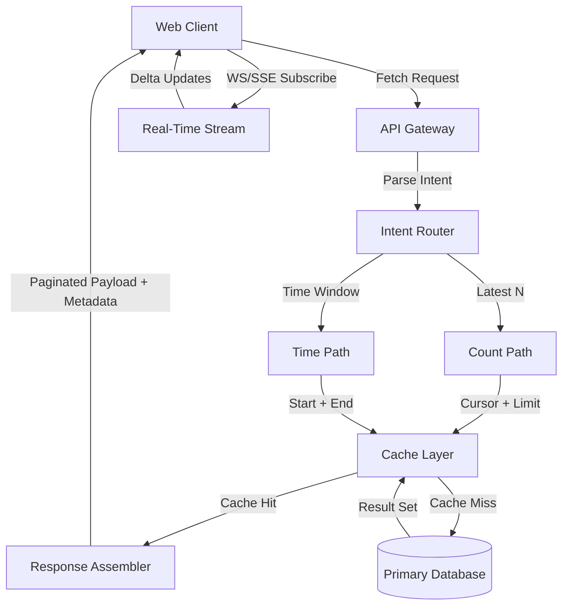

# Latest N Is Not a Time Window

## Introduction
A few months ago, our analytics service started returning inconsistent data when a client requested the “latest 50 events.” The client expected only events from the past hour, but the API delivered items spanning several days. The dashboard flooded users with stale entries, and the support tickets piled up. The root cause was an implicit assumption: *latest N* was being treated as a *time window*. In reality, count‑based retrieval and duration‑based retrieval are orthogonal concepts. Confusing them leads to subtle bugs that surface only under load or after a schema change.

## Why This Matters
In modern web applications, APIs expose data through a variety of endpoints—feed items, audit logs, real‑time updates. Most developers reach for a “latest N” pattern because it is simple to reason about at the surface. However, the underlying storage layer often exposes a timestamp column, tempting engineers to reuse that column for a “last hour” filter. The mismatch creates three classes of problems:

1. **Cache invalidation** – A cache key that includes `limit=50` but not a `since` timestamp will serve stale data when the time window shifts.
2. **Pagination drift** – Keyset pagination based on an ordering column works fine for a fixed count, but if a client later expects a time window, the cursor becomes meaningless.
3. **UX inconsistency** – Users see “newest” items that are actually old, eroding trust in the product.

The cost is not just in support overhead; it is in the cognitive load of maintaining separate query builders for each intent. A disciplined separation of concerns prevents these issues from propagating into production.

## How It Works
The architecture that resolves the ambiguity separates the *intent* from the *execution*. An **Intent Router** receives a request, classifies it as either “fetch latest N items” or “fetch items within a time window,” and routes to the appropriate query builder. Each builder respects its own constraints and produces a result set that can be cached independently.

The following flowchart illustrates the data flow, the decision point, and the interaction with the cache and the database:



- **Intent Router** – Uses a simple enum (`Intent.LATEST_N`, `Intent.TIME_WINDOW`) derived from request parameters (`limit` vs `since`/`until`). It validates that mutually exclusive parameters are not supplied.
- **Count Path** – Builds a query that selects the top N rows ordered by a composite key (e.g., `createdAt DESC, id DESC`). It emits a cursor that can be used for subsequent pagination.
- **Time Path** – Builds a query that filters by a timestamp range (`createdAt >= since AND createdAt < until`). It does not guarantee a specific record count.
- **Cache Layer** – Generates distinct cache keys: `latest:limit:cursor` for count‑based requests and `window:since:until` for time‑based requests. This isolation ensures that a cache miss on one intent does not pollute the other.
- **Real‑Time Stream** – Emits delta events whenever new records are inserted. Both intent paths listen to the same stream, ensuring eventual consistency regardless of the retrieval strategy.

The diagram shows that the same client can trigger either path based on the intent encoded in the request, and that the cache and database are shared resources. The separation prevents accidental cross‑contamination of data.

## Core Concepts
### Count‑Based Retrieval
- **Ordering**: Defined by a total order (timestamp + surrogate key). The “latest” is the prefix of this order.
- **Pagination**: Typically implemented with keyset pagination (`WHERE (orderBy, id) > (cursor) ORDER BY ... LIMIT N`). The cursor is a tuple, not a numeric offset.
- **Guarantee**: Returns exactly N records (or fewer if the table is empty). No temporal guarantee.

### Duration‑Based Retrieval
- **Boundaries**: Explicit start and end timestamps. The window may be open‑ended (`since` only) or closed (`since`, `until`).
- **Result Set Size**: Variable. A window can contain zero rows or thousands, depending on data density.
- **Indexing**: Requires a range scan on the timestamp column. Composite indexes that include the surrogate key improve pagination within a window.

### Intent Encoding
A clean API contract looks like this:
```http
GET /events?intent=latest&limit=50&cursor=...
GET /events?intent=window&since=2023-09-01T00:00:00Z&until=2023-10-01T00:00:00Z
```
The `intent` parameter removes ambiguity. If omitted, the server defaults to `latest` for backward compatibility but logs a deprecation warning.

## Examples & Code Walkthrough
Below are three production‑grade snippets that illustrate the pattern. All are written from scratch and include defensive checks, error handling, and inline commentary.

### 1. Server‑Side Query Resolver (Node.js / TypeScript)

```typescript
// src/queryResolver.ts
import { DatabasePool, sql } from 'slonik';
import { Intent, QueryParams } from '../types';

export class QueryResolver {
  constructor(private pool: DatabasePool) {}

  async resolve(params: QueryParams) {
    const { intent } = params;

    switch (intent) {
      case Intent.LATEST_N:
        return this.fetchLatest(params);
      case Intent.TIME_WINDOW:
        return this.fetchWindow(params);
      default:
        throw new Error(`Unsupported intent: ${intent}`);
    }
  }

  private async fetchLatest({ limit, cursor }: { limit: number; cursor?: string }) {
    const parsedCursor = cursor ? JSON.parse(cursor) : null;

    const { rows } = await this.pool.query(sql`
      SELECT id, payload, created_at
      FROM events
      WHERE ${parsedCursor ? sql` (created_at, id) < (${parsedCursor.createdAt}, ${parsedCursor.id})` : sql`1=1`}
      ORDER BY created_at DESC, id DESC
      LIMIT ${limit}
    `);

    const nextCursor = rows[rows.length - 1]
      ? { createdAt: rows[rows.length - 1].created_at, id: rows[rows.length - 1].id }
      : null;

    return { rows, nextCursor: nextCursor ? JSON.stringify(nextCursor) : undefined };
  }

  private async fetchWindow({ since, until }: { since: string; until?: string }) {
    const end = until ?? new Date().toISOString();

    const { rows } = await this.pool.query(sql`
      SELECT id, payload, created_at
      FROM events
      WHERE created_at >= ${since} AND created_at < ${end}
      ORDER BY created_at ASC, id ASC
    `);

    return { rows };
  }
}
```

**Key points**:
- The `fetchLatest` method uses a **keyset** approach. The cursor is a composite of the ordering columns, guaranteeing stable pagination even if new rows are inserted.
- The `fetchWindow` method does not enforce a row count; it simply applies a `WHERE` clause on timestamps.
- Both methods return raw rows; a response assembler adds pagination metadata (`nextCursor`, `total`) only where appropriate.

### 2. Client‑Side State Synchronization Hook (React)

```tsx
// src/hooks/useEvents.ts
import { useState, useEffect, useCallback } from 'react';
import useSWR, { SWRConfiguration } from 'swr';
import { Event } from '../models';

interface UseEventsOptions {
  intent: 'latest' | 'window';
  limit?: number;
  since?: string;
  until?: string;
  swrConfig?: SWRConfiguration;
}

export const useEvents = ({ intent, limit, since, until, swrConfig }: UseEventsOptions) => {
  const buildKey = useCallback(() => {
    if (intent === 'latest') {
      return `/events?intent=latest&limit=${limit}`;
    }
    return `/events?intent=window&since=${since}&until=${until}`;
  }, [intent, limit, since, until]);

  const { data, error, mutate } = useSWR<Event[]>(buildKey, fetcher, swrConfig);

  // Subscribe to real‑time updates via SSE
  useEffect(() => {
    const es = new EventSource('/events/sse');
    es.onmessage = (e) => {
      const update: Event = JSON.parse(e.data);
      mutate([...(data || []), update], false); // append optimistically
    };
    return () => es.close();
  }, [data, mutate]);

  return {
    events: data,
    loading: !error && !data,
    error,
    mutate,
  };
};
```

**Key points**:
- The hook builds a **stable cache key** based on the intent and its parameters. This ensures `swr` does not incorrectly reuse a `latest` key for a `window` request.
- The SSE connection listens to a global stream and pushes new events into the local SWR cache without a full refetch. This preserves UI responsiveness.
- The `mutate` call uses `false` as the second argument to prevent unnecessary revalidation, which is important for high‑frequency inserts.

### 3. Caching Layer: Key Generation & Invalidation

```typescript
// src/cache.ts
import { createClient } from 'redis';
import crypto from 'crypto';

const redis = createClient({ url: process.env.REDIS_URL });
await redis.connect();

export class CacheService {
  /**
   * Generates a cache key for a count‑based request.
   * Format: `latest:<limit>:<cursor>`
   */
  static makeLatestKey(limit: number, cursor?: string): string {
    const hash = cursor ? crypto.createHash('sha256').update(cursor).digest('hex').slice(0, 8) : 'head';
    return `latest:${limit}:${hash}`;
  }

  /**
   * Generates a cache key for a time‑window request.
   * Format: `window:<since>:<until>`
   */
  static makeWindowKey(since: string, until?: string): string {
    const end = until ?? new Date().toISOString();
    return `window:${since}:${end}`;
  }

  async get(key: string) {
    const data = await redis.get(key);
    return data ? JSON.parse(data) : null;
  }

  async set(key: string, value: unknown, ttl = 300) {
    await redis.set(key, JSON.stringify(value), { ex: ttl });
  }

  async invalidatePattern(pattern: string) {
    const keys = await redis.keys(pattern);
    if (keys.length) {
      await redis.del(...keys);
    }
  }
}
```

**Key points**:
- Distinct key families (`latest:` vs `window:`) prevent cross‑pollution.
- The cursor hash keeps keys short while preserving uniqueness.
- TTL is set to a reasonable default (5 minutes) but can be overridden per endpoint.

## Best Practices
1. **Explicit Intent** – Always expose an `intent` parameter. If the API is internal, document the enum and enforce it via a validation library.
2. **Separate Cache Namespaces** – Use different Redis buckets or CDN edge‑cache keys for the two intents. This avoids stale data when one intent is retired.
3. **Defensive Pagination** – For `latest N`, always include a surrogate key (auto‑increment or UUID) in the ordering tuple. This prevents “duplicate” cursors when timestamps are equal.
4. **Monitoring** – Emit metrics on query latency per intent. A sudden spike in `window` latency may indicate index missing or a data skew.
5. **Graceful Degradation** – If a time‑window request cannot be satisfied due to a missing index, fall back to a best‑effort scan and log a warning. Never break the API contract.

## Common Mistakes & Anti-Patterns
1. **Assuming `LIMIT` Implies Recency** – Using `ORDER BY created_at DESC LIMIT 50` is safe only when `created_at` is monotonic. If soft‑delete flags or out‑of‑order inserts exist, the “latest” may be stale.
2. **Reusing Cursor Across Intents** – A client that stores a cursor from a “latest” request and later reuses it for a “window” request will produce incorrect results. Validate intent on each request.
3. **Over‑Aggressive Cache TTL** – Setting a global TTL for all event endpoints can cause the cache to serve a week‑old feed when the user expects recent items. Tailor TTL to the intent (e.g., 30 s for `latest`, 5 min for `window`).
4. **Missing Index on Timestamp** – A time‑window query without an index on `created_at` becomes a full table scan at scale. Add a composite index (`created_at ASC, id ASC`) to support both range scans and keyset pagination.

## Performance Considerations
- **Count‑Based Queries**: The keyset pattern adds an extra join on the ordering columns but eliminates the need for `OFFSET`. The cost is O(log N) index lookup if a covering index exists.
- **Time‑Window Queries**: A range scan on `created_at` can be expensive if the table is large and the window is wide. Partitioning by month or using a time‑to‑live (TTL) table can mitigate this.
- **Cache Hit Ratio**: For `latest` requests, a high hit ratio depends on cursor stability. Frequent page navigation reduces cache effectiveness. Consider a sliding window cache that evicts older cursors after a few minutes.
- **Network Overhead**: SSE connections for real‑time updates add a persistent TCP socket per client. Use a heartbeat to detect dead connections and reconnect automatically.

## Real‑World Usage
- **Netflix**: Their recommendation service stores user events in a time‑series database. For “latest watch history,” they use a count‑based keyset pagination, while “watch events in the last 24 h” uses a timestamp range query. The separation allows them to cache the feed separately from the raw event store, reducing load on the Cassandra cluster.
- **Uber**: The “recent rides” endpoint for the driver app is count‑based. The “rides completed between 2 am and 5 am” endpoint is duration‑based. Both share a Redis cache with distinct key families, ensuring that peak hours do not evict each other’s data.
- **Cloudflare Workers**: Their analytics edge function receives `since` and `until` parameters for “request volume in a window.” Internally, they also expose a “latest errors” endpoint that uses a count‑based cursor. The Workers runtime logs both intent and latency, feeding back into their indexing strategy.

## Frequently Asked Questions (FAQ)
**Q: Do I need to support both intents in the same API version?**  
A: It depends on client expectations. If the client explicitly asks for “latest N,” support that intent. If they also need a time window, add a separate endpoint or reuse the same path with an `intent` query param. Versioning can be avoided by treating intent as a query parameter.

**Q: How do I handle clock skew between services?**  
A: Store timestamps in UTC and, where possible, use a monotonic clock from the database (e.g., serial). For cross‑data‑center replication, rely on the database’s committed timestamp rather than client‑sent `Date` headers.

**Q: Can I combine both intents in a single request?**  
A: This defeats the purpose of separation. If you need both a limit and a window, the server should enforce the stricter constraint (i.e., return up to `limit` rows but only those inside the window). Document this behavior clearly.

**Q: What about pagination state on the client?**  
A: Keep the cursor tied to the intent. A client that switches from “latest” to “window” should reset its pagination index because the ordering may differ (e.g., window results are often sorted ascending).

**Q: Is there a performance penalty for using an extra intent field?**  
A: Negligible. The intent field is a simple enum in the query; the database does not see it. The overhead is in request parsing and logging, which is trivial compared to I/O.

## Conclusion
Treating “latest N” as a time window is a classic abstraction leak. The count‑
