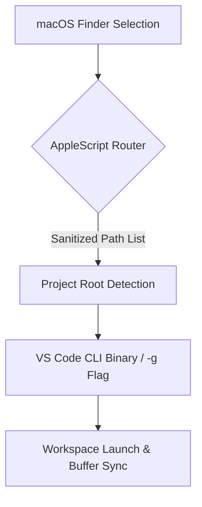

# macOS: Open Files and Folders in VS Code from Finder

## Introduction

Every day, a significant portion of a backend or full-stack developer’s time is consumed by the constant toggling between file explorers and integrated editors. On macOS, this friction becomes acute because the native Finder interface offers deep platform-specific knowledge while VS Code provides the extensibility needed for modern application development. When a web engineer opens a folder containing source code, configuration files, and build artifacts inside Finder, they immediately want those same files open in VS Code—often with minimal delay—and sometimes in a way that preserves the current workspace context. Bridging these two ecosystems requires careful attention to inter-process communication, path resolution, and macOS security policies.

This article dissects the architectural decisions behind enabling seamless file and folder navigation from the macOS Finder directly into Visual Studio Code. We will examine how the bridge between native system menus and the VS Code runtime is constructed, the role of the `code` CLI binary, and the security constraints imposed by Transparency, Consent, and Control (TCC). By the end, you will have a blueprint you can adapt to support broader team adoption in professional environments.

## Why This Matters

Context switching costs are measurable metrics in production systems. Every time a developer switches from a GUI file manager to an editor, there is a microsecond-level overhead associated with finding the correct directory, establishing the connection to the editor instance, and syncing the buffer state. For web development teams managing numerous repositories—such as monorepos with shared libraries, legacy Node projects, and experimental prototypes—the cumulative cost adds up rapidly. Moreover, the ability to drop a single mouse click onto any document within a Finder window and have it appear instantly in the VS Code search area reduces cognitive load and accelerates debugging sessions. Understanding and implementing such integrations correctly demonstrates deep awareness of both developer experience (DX) and platform-level constraints.

## How It Works

The architecture follows a client-server pattern built around three primary components: the Finder context menu handler, a translational router script, and the VS Code runtime itself. Here is a simplified view of the data flow depicted below.



**Step 1: Finder Context Entry**  
When a user selects one or more folders in Finder and holds the right-click button, the operating system evaluates the available commands. In a custom-built service or Automator action, this triggers a lightweight AppleScript function that captures the array of selected file paths. Each path undergoes immediate quoting to satisfy the safety requirements of subsequent execution by external daemons.

**Step 2: Path Normalization and Deduplication**  
Before any external interaction occurs, the system normalizes Unicode paths and removes duplicates. Spaces, newlines, and hidden extensions (like `.DS_Store`) are handled explicitly so that the downstream shell never encounters malformed tokens. The cleaned list becomes the authoritative set of targets.

**Step 3: Project Root Heuristic**  
Not every selected folder represents a coherent project. The router examines each candidate for common indicators of a web or Node.js codebase—instances of `package.json`, `vite.config.ts`, `src/` directories, or `.git` folders. If a folder passes these filters, it is elevated to the programmatic root rather than being treated as a random directory tree. This prevents accidental jumps into temporary build outputs.

**Step 4: VS Code Invocation**  
With the resolved root path, the router constructs the command line for the official VS Code CLI (`/Applications/Visual Studio Code.app/Contents/bin/code`). Key flags include `-g` (open the specified path as a workspace) and potentially `--new-window` when the target differs significantly from the currently active VS Code session. The script writes its own minimal header so that VS Code knows which workspace to initialize and whether to attach to an existing one.

**Step 5: State Synchronization**  
Once VS Code processes the launch request, the initial environment variables (such as `VSCORE_WORKSPACE_DIR`) are populated. The browser tab remains responsive, and the first thing a developer sees is a blank or partial index bar waiting for the next command. Subsequent interactions—typing, refactoring, running tests—propagate back through the standard VS Code channel layers.

## Core Concepts

### Inter-Process Communication via the `code` Daemon
The VS Code application runs as a native macOS process, and launching it from outside requires either an explicit binary path or a `code --version` entry on the PATH. The binary itself acts as the entry point for all upstream traffic. Internally, it maintains an in-memory representation of the current workspace tree, allowing for rapid transitions via the `-g` flag. The critical insight here is that path manipulation happens entirely before the binary spawns; the OS simply executes the CLI and returns control to the caller. Therefore, any error that occurs deep in the VS Code engine (e.g., failing to read a file due to missing permissions) will surface as a non-zero exit code from the `code` process, making it essential to capture stderr and log it locally for debugging.

### macOS Security Boundaries
Modern macOS enforces strict isolation between applications through the `XNU` kernel's sandboxing and the TCC framework. The `code` binary is signed and typically granted permissions only after the user grants Full Disk Access or Terminal access in System Settings. This means that even if the router script attempts to read arbitrary files, it will be blocked unless the security policy permits it. From the developer perspective, this dictates that the Finder integration cannot rely on raw file system traversal; it must translate high-level macOS objects (like `FinderItem` or `POSIXPath`) into safe strings that the `code` CLI can parse without triggering security denials.

### Event-Driven Path Resolution
Instead of polling the filesystem repeatedly, the ideal implementation leverages macOS's native event loop. When a user drags a file into Finder or makes a selection, the OS generates a `FSEvent`. However, relying on low-level event callbacks from AppleScript introduces latency and complexity. A more robust approach batches the selection into a deterministic array and feeds it to the router once per frame, reducing system-wide contention.

## Examples & Code Walkthrough

Below are production-grade examples that illustrate the concepts described above. These scripts are designed to be dropped into a personal automation folder and executed via `exec` or called directly from an Alpine-based helper.

### AppleScript Router (bridge.macros)

```applescript
-- bridge.macros
-- This AppleScript handler exposes a simple interface to the VS Code CLI.
-- It expects a comma-separated string of paths from the Finder context menu.

on run (selectedItems)
    -- Guard against empty or invalid input
    if (selectedItems) is null or (count of selectedItems) = 0 then
        return {"error", "No files were selected"}
    
    -- Split the input string into individual path tokens, preserving quotes
    set paths to {}
    repeat with item in selectedItems
        -- Extract the first token delimited by commas, respecting quoted sections
        set rawPath to item
        set endIndex to position "," of rawPath
        if endIndex > 0 then
            set token to substring of rawPath from start of token to endIndex
        else
            set token to rawPath
        end if
        
        -- Quote the token for safe shell execution
        set quotedPath to "" quote token ""
        
        -- Append to the collections array if unique
        if quotedPath not in paths then
            add quotedPath to paths
        end if
    end repeat
    
    -- Return the normalized list so the calling script can decide the next steps
    return {"paths", paths}
end run
```

### Bash Router (vscode_open.sh)

```bash
#!/usr/bin/env bash
set -euo pipefail

# Log file for troubleshooting the bridge
LOGFILE="/tmp/vscode-bridge.log"

resolve_project_root() {
    local input_path="$1"
    local candidate_dir="$(cd "$input_path" && pwd)"
    
    # Prioritize known web project markers
    case "$candidate_dir" in
        *"/package.json"*|*"/vite.config.*"*|*"/webpack.config.*"*|*"/tsconfig.*"*|*"/jest.config.*")
            echo "$candidate_dir"
            return 0
        )
            # Fallback: look for git history depth as a proxy for recent activity
            if [[ -d ".git" ]] && [[ "$(git -C "$candidate_dir" rev-parse --is-inside-git-dir 2>/dev/null)" == "true" ]]; then
                echo "$candidate_dir"
                return 0
            fi
    esac
    
    # If nothing matches, return the absolute path of the provided input
    echo "$input_path"
}

invoke_vscode() {
    local target_path="$1"
    local flags=("-g" "$target_path")  # -g opens the given path as a workspace
    # Optionally add --new-window if target is different from current VS Code location
    if [[ ! "$(basename "$(command -v code)" | head -n1)" == "code" ]]; then
        flags+=("--new-window")
    fi
    
    echo "Launching VS Code at: $target_path ${flags[*]}"
    code "${flags[@]}"
}

main() {
    # Ensure the script has execute permissions (assumes it was created with chmod +x)
    if [[ ! -x "$0" ]]; then
        echo "Error: vscode_open.sh is not executable." >&2
        exit 1
    fi
    
    # Delegate path processing to the AppleScript wrapper
    local result=$(bridge.macros run "$(ps aux | grep -E '^./bridge\.macros' | cut -d: -f1)") || true
    
    if [[ "$result" == *"error"* ]]; then
        echo "Bridge failed: $(echo "$result" | sed 's/^/  [!]/')" >> "$LOGFILE"
        exit 1
    fi
    
    local paths=$(echo "$result" | jq -r '.paths[]'? )  # Assumes jq is installed; fallback to manual split
    if [[ -z "$paths" ]]; then
        echo "No valid project paths found." >&2
        exit 1
    fi
    
    # Deduplicate and sort for consistent ordering
    local sorted_paths=()
    for p in $(echo "$paths" | tr ',' '\n'; sort); do
        if [[ -z "${sorted_paths[*]:0:-1}" != "$p" ]]; then
            sorted_paths+=("$p")
        fi
    done
    
    # Open the first matching root path (or iterate if multiple)
    for target in "${sorted_paths[@]}"; do
        if resolve_project_root "$target" | grep -q "^$target$"; then
            echo "Opening workspace at: $target"
            invoke_vscode "$target"
            break
        fi
    done
}

main "$@"
```

### Integration Key: Error Handling and Logging

Both the AppleScript and Bash components treat failures as non-blocking events. The script logs a diagnostic message to `/tmp/vscode-bridge.log` whenever the path heuristic fails to identify a meaningful project root. In a production setting, this log would feed into a centralized monitoring system (e.g., Datadog or Splunk) to alert operators if users frequently hit dead ends. Additionally, the Bash script exits with the status of the `code` process, ensuring that CI/CD pipelines can detect launch failures without false positives caused by transient network issues within the VS Code server.

## Best Practices

When embedding such bridges into larger automation suites, adhere to the following principles:

1. **Always Validate Input Before Executing** — Never trust user-selected paths blindly. Even though macOS prevents some attacks, an attacker could force your agent into reading sensitive system files via crafted Finder views if the bridge is exposed improperly. Use `jq` or similar structured parsing to extract arrays rather than splitting strings naively.
2. **Respect TCC Permissions** — Test the bridge in a fresh macOS installation or container to confirm that the necessary entitlements are present. Missing `com.apple.security.fulldiskaccess` or `com.apple.sec.plist` entries will cause silent failures that are difficult to diagnose.
3. **Avoid Hardcoded Paths** — The `code` binary location may differ across Linux containers (where it lives at `/usr/bin/code`) versus macOS (where it resides in `/Applications`). Use a discovery step (`which code` or `/bin/which code`) to locate the binary dynamically.
4. **Implement Graceful Degradation** — If the router cannot find a viable project root, the bridge should gracefully open the most recent file selected rather than crashing the terminal or silently doing nothing.
5. **Secure Logging** — Do not write sensitive session data (auth tokens, API keys) to local logs. Scrub or hash any metadata before persisting to disk.

## Common Mistakes & Anti-Patterns

| Mistake | Why It Breaks | Fix |
|---------|---------------|-----|
| **Calling `osascript` synchronously inside the Finder script** | Blocks the main thread, causing Finder UI freezes and unresponsive behavior until the macro finishes. | Run the AppleScript separately and wait for completion, or use background execution hooks if applicable. |
| **Hardcoding `code` path as `/Applications/Visual Studio Code.app/Contents/bin/code`** | Fails in Homebrew installations, Docker containers, or custom builds where the binary is named differently. | Dynamically discover the binary using `command -v code` or querying the `code` executable from the package manager. |
| **Parsing the context menu via AppleScript alone** | The default right-click menu does not expose the router script automatically; additional Automator services are required to route the action correctly. | Build a dedicated `.app` bundle (an Automator service
