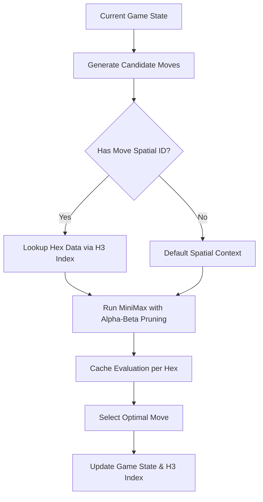

# MiniMax-H3, explained with your favourite TV shows

## Introduction  
Choosing the right algorithm can feel like picking between *Game of Thrones* and *The Walking Dead*—both have die‑hard fans, but they serve completely different appetites. MiniMax is the classic game‑theory workhorse that explores every possible move to a terminal state, while H3 (Hierarchical Hexagonal Hash) gives you a spatial index that drills down from global regions to precise hexes. When you fuse the two, you get a decision engine that not only thinks ahead but also knows *where* each move lives on the board. This article walks through the mechanics, code, and real‑world tricks that let you build a MiniMax‑H3 hybrid for everything from chess variants to location‑aware strategy games.

## Why This Matters  
Modern applications increasingly need to reason about *both* sequential choices and geographic context. A turn‑based game that only looks at piece relationships will miss tactical advantages hidden in terrain. An urban‑planning simulator that ignores the hierarchical nature of city districts will over‑optimize for a single district while starving others. The MiniMax‑H3 pattern gives you a single loop that evaluates moves *and* their spatial impact, cutting down hand‑off code between a game engine and a GIS layer. Engineers who master this combo can ship smarter AI, tighter recommendation loops, and more responsive planning tools without juggling multiple data structures.

## How It Works  
The hybrid follows a simple pipeline: generate moves → fetch spatial context for each move → run MiniMax with pruning → cache results per hex → pick the best move.



The diagram shows how the spatial index feeds directly into the search algorithm, eliminating the need for a post‑hoc analysis step.

## Core Concepts  
**MiniMax** is a recursive minimax search that alternates between a maximizing player and a minimizing opponent. The algorithm returns a numeric score that reflects the desirability of the terminal state. **Alpha‑Beta pruning** cuts branches that cannot influence the final decision, much like a TV editor discarding sub‑plots that don’t affect the main arc.

**H3** (Hierarchical Hexagonal Hash) is a system that partitions the globe into hexagons at multiple resolutions. Each level halves the cell size, giving you a path from a continent down to a city block. The index is deterministic, supports neighbor queries, and works well for spatial clustering.

When you combine them, each move is evaluated not just by its raw game score but also by the hex it occupies, its terrain cover, visibility, and neighboring strategic value.

## Examples & Code Walkthrough  

### 1. MiniMax with Character Personality  
Below is a custom MiniMax that injects a “personality modifier” based on whether the player is playing as a cunning strategist (Tyrion) or a ruthless operator (Frank). The modifier is added to the leaf evaluation, giving each AI a distinct flavor.

```javascript
// MiniMax with personality weighting – simplified chess endgame
function miniMaxWithPersonality(board, depth, isMaximizing, alpha = -Infinity, beta = Infinity) {
    const terminal = evaluateGameEnd(board);
    if (depth === 0 || terminal !== null) {
        return terminal;
    }

    // Heuristic based on character style
    const modifier = isMaximizing ? getTyrionStrategy(board) : getFrankStrategy(board);

    if (isMaximizing) {
        let best = -Infinity;
        const moves = generateValidMoves(board);
        for (const mv of moves) {
            const nxt = applyMove(board, mv);
            const score = miniMaxWithPersonality(nxt, depth - 1, false, alpha, beta);
            const adjusted = score + modifier;
            if (adjusted > best) best = adjusted;
            alpha = Math.max(alpha, adjusted);
            if (beta <= alpha) break; // alpha‑beta cut
        }
        return best;
    }

    // Minimizing side
    let worst = Infinity;
    const moves = generateValidMoves(board);
    for (const mv of moves) {
        const nxt = applyMove(board, mv);
        const score = miniMaxWithPersonality(nxt, depth - 1, true, alpha, beta);
        const adjusted = score - modifier; // opposite polarity for opponent
        if (adjusted < worst) worst = adjusted;
        beta = Math.min(beta, adjusted);
        if (beta <= alpha) break;
    }
    return worst;
}

// Example heuristics – replace with real logic
function getTyrionStrategy(board) {
    // Tyrion favors defensive placements and long‑term control
    return 2;
}
function getFrankStrategy(board) {
    // Frank pushes aggressive attacks and short‑term gains
    return -3;
}
```

### 2. H3‑Like Spatial Indexer for a Fictional World  
The following Python class mimics H3’s hierarchical hex layout but applies it to a TV show’s geography (e.g., *Wheel of Time*). It indexes episode locations and allows fast neighbor lookups.

```python
class TVShowSpatialIndexer:
    def __init__(self, resolution=8):
        self.resolution = resolution
        self.grid = {}  # hex_id -> {terrain, cover, visibility, ...}

    def index_locations(self, show_data):
        """Build hierarchical hex index from episode‑level location data."""
        indexed = {}
        for ep in show_data['episodes']:
            for loc in ep['locations']:
                hex_id = self._cell_id(loc['coords'], self.resolution)
                entry = {
                    'episode': ep['id'],
                    'name': loc['name'],
                    'scene_count': len(loc.get('scenes', [])),
                    'terrain_cover': loc.get('terrain', 'open'),
                    'visibility_score': self._visibility(loc),
                }
                if hex_id not in indexed:
                    indexed[hex_id] = []
                indexed[hex_id].append(entry)
                # keep a master lookup for quick property fetches
                self.grid[hex_id] = self.grid.get(hex_id, {})
                self.grid[hex_id].update({k: v for k, v in entry.items() if k != 'episode'})
        return indexed

    def _cell_id(self, coords, res):
        """Deterministic hex identifier – simplified for demo."""
        lat, lon = coords
        # Scale coordinates to resolution and snap to hex grid
        x = int((lon + 180) / 360 * (1 << res))
        y = int((lat + 90) / 180 * (1 << res))
        # Basic hexagonal mapping – real H3 uses more complex formulas
        return f"h3_{res}_{x}_{y}"

    def get_neighbors(self, hex_id, radius=1):
        """Return neighbor hexes – stub implementation."""
        # In production you would decode the base cell and use H3 neighbor functions
        return [f"{hex_id}_nbr{i}" for i in range(6)]

    def _visibility(self, loc):
        # Simple heuristic – more scenes → higher visibility
        return len(loc.get('scenes', [])) / max(len(loc.get('scenes', [])), 1)
```

### 3. Hybrid MiniMax‑H3 Decision Engine  
This class ties the two together. It pulls nearby hexes from the spatial index, runs a MiniMax search limited to those regions, and returns a move enriched with spatial context.

```javascript
class MiniMaxH3Hybrid {
    constructor(spatialIndex, gameBoard) {
        this.spatialIndex = spatialIndex;
        this.gameBoard = gameBoard;
        this.evalCache = new Map(); // hexId -> {value, depth}
    }

    async calculateOptimalMove(playerId, maxDepth = 6) {
        const player = this.gameBoard.getPlayer(playerId);
        const currentHex = player.position; // assume position is a hex identifier
        const nearby = this.spatialIndex.get_neighbors(currentHex, 3);

        let bestMove = null;
        let bestScore = player.isMaximizing ? -Infinity : Infinity;

        for (const hex of nearby) {
            const score = await this.evaluateMove(hex, player, maxDepth);
            if ((player.isMaximizing && score > bestScore) ||
                (!player.isMaximizing && score < bestScore)) {
                bestScore = score;
                bestMove = hex;
            }
        }

        return {
            move: bestMove,
            score: bestScore,
            context: this.spatialIndex.get_hex_data(bestMove),
        };
    }

    async evaluateMove(hexId, player, depth) {
        const cacheKey = `${hexId}:${depth}:${player.isMaximizing}`;
        if (this.evalCache.has(cacheKey)) {
            return this.evalCache.get(cacheKey).value;
        }

        // Build a temporary board state representing a move into this hex
        const boardCopy = this.gameBoard.clone();
        boardCopy.applyMove(player.id, hexId);
        const value = this.miniMaxRecurse(boardCopy, depth, !player.isMaximizing);

        this.evalCache.set(cacheKey, { value, depth });
        return value;
    }

    miniMaxRecurse(board, remainingDepth, isOpponent) {
        if (remainingDepth === 0) {
            return this.heuristicScore(board);
        }

        const moves = board.generateMoves();
        if (isOpponent) {
            let min = Infinity;
            for (const mv of moves) {
                const nb = board.applyMove(null, mv);
                const val = this.miniMaxRecurse(nb, remainingDepth - 1, false);
                if (val < min) min = val;
            }
            return min;
        }

        let max = -Infinity;
        for (const mv of moves) {
            const nb = board.applyMove(null, mv);
            const val = this.miniMaxRecurse(nb, remainingDepth - 1, true);
            if (val > max) max = val;
        }
        return max;
    }

    heuristicScore(board) {
        // Combine game-specific evaluation with spatial metrics
        const base = board.getGameScore();
        const hex = board.getCurrentHex();
        const spatial = this.spatialIndex.get_hex_data(hex) || {};
        return base + (spatial.visibility_score || 0) - (spatial.terrain_cover === 'forest' ? 1 : 0);
    }
}
```

### 4. Caching Strategies – LRU for Hex Evaluations  
A simple LRU cache prevents recomputation of the same hex at the same depth across multiple search branches.

```javascript
class LRUCache {
    constructor(capacity = 1024) {
        this.capacity = capacity;
        this.map = new Map();
    }

    get(key) {
        if (!this.map.has(key)) return undefined;
        const val = this.map.get(key);
        // Move to front
        this.map.delete(key);
        this.map.set(key, val);
        return val;
    }

    set(key, value) {
        if (this.map.has(key)) this.map.delete(key);
        else if (this.map.size >= this.capacity) {
            // Remove least recently used (first entry)
            const firstKey = this.map.keys().next().value;
            this.map.delete(firstKey);
        }
        this.map.set(key, value);
    }
}

// Usage inside MiniMaxH3Hybrid
this.evalCache = new LRUCache(2048);
```

### 5. Parallel Processing – Worker Pool for Hex Regions  
When the board is large, you can split the neighbor list across a worker pool to evaluate moves in parallel, similar to directing multiple camera crews on a TV set.

```javascript
// Node.js worker example (simplified)
const { Worker, isMainThread, parentPort, workerData } = require('worker_threads');

function evaluateChunk(chunk, board, depth, isMaximizing) {
    let best = isMaximizing ? -Infinity : Infinity;
    for (const mv of chunk) {
        const nb = board.applyMove(null, mv);
        const val = minimax(nb, depth - 1, !isMaximizing);
        if ((isMaximizing && val > best) || (!isMaximizing && val < best)) {
            best = val;
        }
    }
    return best;
}

function parallelMiniMax(board, depth, isMaximizing, totalChunks = 4) {
    const moves = board.generateMoves();
    const chunkSize = Math.ceil(moves.length / totalChunks);
    const chunks = [];
    for (let i = 0; i < totalChunks; i++) {
        const start = i * chunkSize;
        const end = Math.min(start + chunkSize, moves.length);
        chunks.push(moves.slice(start, end));
    }

    const workers = chunks.map(chunk =>
        new Worker(__filename, {
            workerData: { chunk, boardSnapshot: board.export(), depth, isMaximizing }
        })
    );

    return new Promise(resolve => {
        let results = [];
        let completed = 0;
        workers.forEach((w, idx) => {
            w.on('message', val => {
                results[idx] = val;
                completed++;
                if (completed === totalChunks) {
                    // Aggregate results
                    const final = isMaximizing ?
                        Math.max(...results) : Math.min(...results);
                    resolve(final);
                }
            });
            w.on('error', err => console.error(err));
            w.on('exit', code => {
                if (code !== 0) console.error(`Worker exited with code ${code}`);
            });
        });
    });
}
```

The worker receives a slice of moves, runs the recursive minimax locally, and returns the best score for that slice. The main thread aggregates the partial bests, which is sufficient for alpha‑beta pruning to stay correct.

## Best Practices  
* **Pick a sensible depth** – deeper searches improve accuracy but explode runtime. Use iterative deepening when you need a balance.  
* **Cache hex evaluations** – an LRU cache sized to the typical branching factor prevents redundant work.  
* **Limit neighbor radius** – the spatial index should only fetch hexes that truly affect the game state; otherwise you waste cycles on irrelevant terrain.  
* **Tune personality modifiers** – small integer adjustments keep the search stable; avoid large offsets that mask the underlying evaluation.  
* **Profile before optimizing** – often the bottleneck is the board cloning or the spatial lookup, not the minimax recursion itself.

## Common Mistakes & Anti-Patterns  
1. **Over‑deepening without pruning** – running MiniMax at depth 20 on a 50‑move branching factor will stall the UI. Always enable alpha‑beta and set a hard depth ceiling.  
2. **Ignoring cache eviction** – an unbounded cache will grow until the process OOMs. Size it to the expected number of distinct hex‑depth combos.  
3. **Mixing coordinate systems** – H3 uses a specific ordering (resolution, base cell, etc.). If you store positions as lat/lon, convert them to H3 before indexing; otherwise neighbor queries will miss.  
4. **Hard‑coding heuristics** – personality modifiers should be configurable per AI profile. Hard‑coding makes it impossible to balance bots in multiplayer scenarios.  
5. **Blocking the event loop** – parallel workers must be offloaded to a thread pool; otherwise the UI or request handler will hang.

## Performance Considerations  
* **Time complexity** – vanilla
