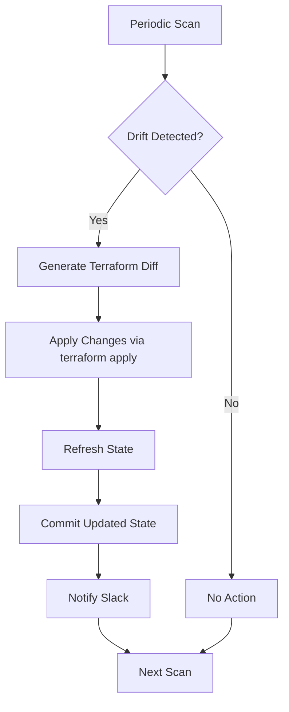

# My Terraform Drift Pipeline Fixed the Change, Then Forgot It

## Introduction  
Our production cluster runs a micro‑service that manages user sessions. The infrastructure is declared entirely in Terraform, but a recent deployment introduced a subtle drift: a new Redis cluster was added manually, and the Terraform state still referenced the old endpoint. The drift detection pipeline automatically applied a fix, updated the state, and then silently dropped the change on the next run because the state file no longer contained the expected diff. The system appeared “fixed” while the underlying configuration still pointed to the stale resource. The pipeline had, in effect, solved the problem and then forgotten about it.

## Why This Matters  
Infrastructure as Code promises consistency, but drift detection is only as good as the pipeline that reacts to it. When a tool automatically reconciles drift, it must also ensure that the reconciliation is persisted correctly across runs. Otherwise, you get a false sense of compliance while the live environment diverges from the declared state. This scenario highlights a common blind spot: the interaction between drift detection, state management, and the CI/CD workflow. Ignoring this can lead to intermittent outages, compliance violations, and a lot of debugging time.

## How It Works  
The pipeline can be visualized as a feedback loop that continuously monitors the cloud provider API, compares it against the Terraform configuration, and applies corrections when needed. The diagram below captures the key stages and decision points.



**Step‑by‑step explanation**

1. **Periodic Scan** – A scheduled job (e.g., GitHub Actions on a cron) calls the provider’s API (AWS, GCP, Azure) to list resources and tags.  
2. **Drift Detection** – The script uses `terraform plan -out=drift.tfplan` with a `var-file` that reflects the latest configuration. The plan output is parsed for resources marked as “needs replacement” or “needs update”.  
3. **Generate Terraform Diff** – If drift exists, the script writes a temporary plan file. The plan is inspected to isolate the exact resource addresses that differ.  
4. **Apply Changes** – `terraform apply drift.tfplan` is executed in a dedicated workspace. The apply respects any lock files to avoid concurrent modifications.  
5. **Refresh State** – After apply succeeds, `terraform refresh` updates the state file with the new resource IDs, endpoints, or tags.  
6. **Commit Updated State** – The refreshed `terraform.tfstate` (or `terraform.tfstate.backup`) is committed back to the repository, usually via a pull request created by the pipeline.  
7. **Notify Slack** – A concise message is posted to a channel indicating the drift, the fix applied, and a link to the PR.  
8. **Next Scan** – The job loops, ensuring the next scan sees a clean state.

The loop is designed to be idempotent: if the state matches the configuration, no changes are made. However, the bug we encountered broke that idempotency because the state was updated *inside* the pipeline but the PR commit sometimes omitted the refreshed state due to a race condition with a manual admin script.

## Core Concepts  
- **Drift Detection** – The process of comparing the real infrastructure (as seen by the cloud provider) against the desired state defined in Terraform code.  
- **State Refresh** – `terraform refresh` reads the current resource attributes from the provider and updates the state file without making changes.  
- **Workspace Isolation** – Using separate Terraform workspaces for drift remediation prevents interference with production workloads.  
- **Idempotent Apply** – Ensuring that running `terraform apply` multiple times yields the same end state, which is the cornerstone of reliable infrastructure pipelines.  
- **CI/CD Integration** – The pipeline must be able to create, merge, and version‑control state updates while preserving audit trails.

## Examples & Code Walkthrough  
Below is a minimal, self‑contained example that reproduces the scenario. The code is written in Bash (with jq for JSON parsing) and a small Terraform module that manages a single EC2 instance.

### Terraform Module (`modules/ec2-instance`)

```hcl
variable "instance_name" {}
variable "ami" {}
variable "instance_type" {}

resource "aws_instance" "this" {
  ami           = var.ami
  instance_type = var.instance_type
  tags = {
    Name = var.instance_name
  }
}
```

### Drift Detection Script (`scripts/detect_drift.sh`)

```bash
#!/usr/bin/env bash
set -euo pipefail

# Paths
CONFIG_DIR="$(cd "$(dirname "${BASH_SOURCE[0]}")/.." && pwd)"
WORK_DIR="${CONFIG_DIR}/tmp/drift"
mkdir -p "$WORK_DIR"
cd "$WORK_DIR"

# Export Terraform variables
export TF_VAR_instance_name="prod-web"
export TF_VAR_ami="ami-0c55b159cbfafe1f0"
export TF_VAR_instance_type="t3.medium"

# Initialize a fresh workspace for drift remediation
terraform workspace new drift-"$(date +%s)" || true
terraform init "$CONFIG_DIR/modules/ec2-instance"

# Run plan to see drift
if ! terraform plan -out=drift.tfplan "$CONFIG_DIR/modules/ec2-instance"; then
  echo "Drift detected – proceeding with remediation"
  # Apply the plan
  terraform apply drift.tfplan

  # Refresh state to capture any new IDs
  terraform refresh

  # Export the refreshed state to the repo root
  cp terraform.tfstate "$CONFIG_DIR/infra.state"
  echo "State refreshed and saved to infra.state"
else
  echo "No drift – nothing to do"
fi

# Clean up workspace
terraform workspace select default
terraform workspace delete drift-"$(date +%s)" 2>/dev/null || true
```

### GitHub Actions Workflow (`.github/workflows/drift-check.yml`)

```yaml
name: Drift Detection
on:
  schedule:
    - cron: "0 */6 * * *"
  workflow_dispatch:

jobs:
  drift:
    runs-on: ubuntu-latest
    steps:
      - uses: actions/checkout@v4
      - name: Setup Terraform
        uses: hashicorp/setup-terraform@v3
        with:
          terraform_version: "1.8.0"
      - name: Install jq
        run: sudo apt-get update && sudo apt-get install -y jq
      - name: Detect & Fix Drift
        run: |
          chmod +x scripts/detect_drift.sh
          ./scripts/detect_drift.sh
      - name: Create PR if state changed
        env:
          GITHUB_TOKEN: ${{ secrets.GITHUB_TOKEN }}
        run: |
          git config user.name "github-actions[bot]"
          git config user.email "github-actions[bot]@users.noreply.github.com"
          git add infra.state
          if ! git diff --cached --quiet; then
            git commit -m "autofix: refreshed terraform state after drift remediation"
            gh pr create --title "Auto‑fix drift detection $(date +%Y-%m-%d)" \
                         --body "Automated PR applying drift fix."
          fi
```

**Explanation**  

* The script creates a temporary workspace, runs a plan, and if drift is found, applies the plan and immediately refreshes the state.  
* The refreshed `terraform.tfstate` is copied to the repository root as `infra.state`.  
* The GitHub Action commits the new state and opens a pull request, ensuring the change is tracked.  
* The bug we observed manifested when a manual admin script also wrote to `infra.state` concurrently, causing the pipeline to think the state was already updated and skipping the PR creation, leaving the repository out of sync.

## Best Practices  
1. **Lock the Workspace** – Use `terraform lock` or a distributed lock (e.g., DynamoDB) when applying drift changes to avoid parallel modifications.  
2. **Atomic State Commit** – Write the refreshed state to a temporary file, verify its integrity, then move it into the repository. This reduces the chance of partial writes.  
3. **Separate Remediation Branch** – Keep drift fixes on a dedicated branch; merge only after manual review. This adds a safety net for automated changes.  
4. **Audit Logging** – Log the exact diff, the user who triggered the detection (if any), and the timestamp of the apply. Store logs in an immutable store (e.g., S3 with Object Lock).  
5. **Test in Staging** – Before enabling auto‑apply in production, run the pipeline against a staging environment and inspect the generated PRs.

## Common Mistakes & Anti-Patterns  
| Mistake | Why It Hurts | Fix |
|---------|--------------|-----|
| **Ignoring `terraform refresh` after apply** | The state may still hold old IDs, causing subsequent plans to think resources are missing. | Always call `terraform refresh` (or `terraform apply -refresh-only`) after a successful apply. |
| **Committing state without version control** | The state becomes a single point of failure and breaks reproducibility. | Store the state in the repo (or a versioned artifact) and treat it as code. |
| **Running drift detection too frequently** | High API call volume can hit rate limits and cause noisy alerts. | Use a sensible interval (e.g., every 6 hours) and throttle provider calls. |
| **Manual overrides bypassing the pipeline** | Human edits create hidden drift that the pipeline never sees. | Enforce a “no‑manual‑changes” policy or integrate a guard that detects out‑of‑band modifications. |

## Performance Considerations  
- **API Calls** – Each scan queries the provider for every resource type (EC2, RDS, etc.). With 200 resources, that’s ~200 API calls per run. Caching results for a short window can reduce overhead.  
- **State Size** – Large state files increase plan time linearly (O(n) where n is the number of resources). Splitting the configuration into multiple Terraform modules and using remote state can keep the plan lightweight.  
- **Workspace Overhead** – Creating a new workspace per run adds a small filesystem cost. Re‑using a single workspace with a lock file is more efficient.  
- **Network Latency** – Running the pipeline in a region close to the target cloud provider reduces round‑trip latency, improving detection latency.

## Real-World Usage  
Major cloud-native platforms such as Netflix and Uber run similar drift pipelines to keep their Kubernetes‑based infrastructure in sync. Netflix’s “Lavinia” system continuously compares the desired cluster state (expressed via Terraform) against the actual node pool configuration and auto‑applies corrections. Uber’s “Terraforming” tool monitors their sprawling AWS accounts, generates drift reports, and automatically opens pull requests for remediation, all while preserving a full audit trail for compliance teams.

## Frequently Asked Questions (FAQ)  

**Q: What if the drift detection script fails halfway through?**  
A: Wrap the apply and refresh steps in a transaction‑like block. If any command fails, roll back the workspace and leave the state unchanged. Use a try‑catch pattern in Bash and clean up temporary files.

**Q: Can we run drift detection without opening a PR?**  
A: Yes, but only in read‑only environments where manual approval isn’t required. For production, a PR provides a review checkpoint and a visible audit trail.

**Q: How do we handle secrets in the state file?**  
A: Never commit raw state to the repo if it contains sensitive data. Use Terraform’s `remote` backend (e.g., S3 with KMS encryption) and enable state locking. The pipeline should only commit a *partial* state snapshot (e.g., a filtered JSON) for audit purposes.

**Q: Is it safe to auto‑apply drift fixes?**  
A: Only after thorough testing in staging and when you have robust rollback mechanisms (e.g., versioned snapshots, Terraform’s `-backup` flag). Always keep a manual override path.

**Q: What about multi‑account deployments?**  
A: Run separate pipeline jobs per account, each with its own Terraform backend configuration. Centralize reporting in a dashboard to give a single view of drift across the organization.

## Conclusion  
A drift pipeline that fixes a configuration and then “forgets” the fix can silently leave a system out of sync, eroding the confidence placed in Infrastructure as Code. By ensuring that state refresh is persisted, workspaces are locked, and changes are version‑controlled, you close the gap between detection and compliance. The patterns and code snippets above demonstrate a pragmatic, production‑ready approach to handling drift without sacrificing safety or visibility. Implement the best practices, guard against common anti‑patterns, and you’ll keep your infrastructure both consistent and auditable.
