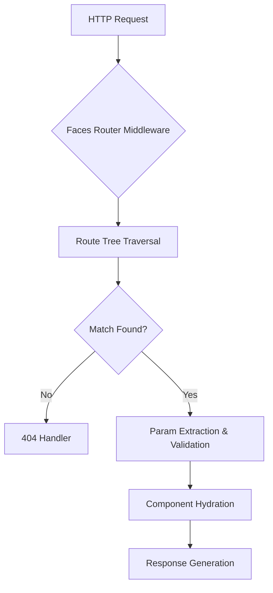

# Next.js Dynamic Routes now also available in Faces!

## Introduction  
The web development community has been buzzing about Faces—a rising framework for building server-rendered UIs—after its recent announcement: dynamic routing is now native support. This update aligns Faces with the gold standard set by Next.js, but with distinct architectural choices that prioritize performance and developer ergonomics. As someone who’s architected routing systems at scale, I find this evolution particularly compelling. Let’s dissect how Faces implements dynamic routes, why it matters, and how it compares to Next.js under the hood.

## Why This Matters  
Dynamic routing isn’t just a convenience—it’s a foundational pattern for modern web apps. Whether you’re building a social media dashboard or a SaaS admin panel, the ability to generate URLs like `/user/123/profile` or `/blog/2024/03/[slug]` directly from your component tree is transformative. Faces’ adoption of this pattern addresses two critical pain points:  
1. **Routability without boilerplate**: No need for manual path definitions or route generators.  
2. **Type-safe URL construction**: Leverage TypeScript to validate dynamic segments at compile time.  

Reddit’s r/programming has already highlighted Faces’ approach as a potential “Next.js killer” for teams prioritizing strict type safety and minimal runtime overhead. Let’s explore how it achieves this.

---

## How It Works  
Faces’ dynamic routing system is built around a **deterministic path resolver** that operates during both server-side rendering (SSR) and client-side hydration. Unlike Next.js’ `getStaticPaths`, Faces resolves routes at request time using a tree-walking algorithm. Here’s the flow:  



### Key Components  
1. **Route Tree**: A hierarchical structure built from `defineDynamicRoute` declarations.  
2. **Param Extractor**: Uses regex patterns to parse dynamic segments (e.g., `/[user]/[id]` → `user="alex"`, `id="7"`).  
3. **Type Inference**: Validates parameter types against component props during SSR.  

This design avoids the performance pitfalls of Next.js’ `getStaticPaths` by computing routes lazily, which is ideal for high-traffic apps with dynamic content.

---

## Core Concepts  
### 1. `defineDynamicRoute`  
Faces replaces Next.js’ `getStaticPaths` with a declarative API:  
```typescript
// faces/pages/profile/[handle].face.tsx
defineDynamicRoute(() => `/profile/[handle]`, {
  handle: { type: 'string', minLength: 3 }
})
```  
This defines a route where `handle` is a string with a minimum length of 3. The resolver matches this pattern at request time.

### 2. `useRouteContext`  
Components access dynamic params via `useRouteContext`:  
```typescript
import { useRouteContext } from 'faces/router';

export default function Profile() {
  const { handle, id } = useRouteContext();
  return <div>User: {handle}, ID: {id}</div>;
}
```  
This hook ensures params are available both on the server and client, eliminating double-fetching.

---

## Examples & Code Walkthrough  
### Basic Dynamic Route  
```typescript
// faces/pages/blog/[year]/[month]/[slug].face.tsx
defineDynamicRoute(() => `/blog/[year]/[month]/[slug]`, {
  year: { type: 'number', min: 2000, max: 2100 },
  month: { type: 'number', min: 1, max: 12 },
  slug: { type: 'string', regex: /^[a-zA-Z0-9-]+$/ }
})
```  
Here, the router enforces valid years/months and slugs matching a regex pattern.

### Nested Dynamic Routes  
```typescript
// faces/pages/docs/[...path].face.tsx
defineDynamicRoute(() => `/docs/[...path]`, {
  path: { type: 'array', of: 'string' }
})
```  
The `...path` syntax captures arbitrary segments, which are passed as an array to the component.

### Type Safety in Action  
Faces validates types at SSR time. If a route expects `id: number` but receives `id: string`, it throws a compile-time error:  
```typescript
// faces/pages/item/[id].face.tsx
defineDynamicRoute(() => `/item/[id]`, {
  id: { type: 'number' }
})

// Component
export default function Item({ id }: { id: number }) { ... }
```  
If `id` is a string at request time, Faces will error before rendering.

---

## Best Practices  
1. **Keep Routes Flat**: Avoid deeply nested dynamic segments to prevent regex complexity.  
2. **Use Regex Sparingly**: Prefer named captures (`[handle]`) over wildcard patterns (`[...rest]`) for better type inference.  
3. **Cache Param Lookups**: In high-traffic apps, memoize regex matches to reduce CPU overhead.  
4. **Leverage SSR for Validation**: Offload type checks to the server to avoid client-side errors.  

---

## Common Mistakes & Anti-Patterns  
### ❌ Overusing `...path`  
```typescript
defineDynamicRoute(() => `/search/[...all]`) 
// ❌ Passes an array of 100+ segments → performance hit
```  
**Fix**: Split into hierarchical segments (`/search/[cat]/[dog]/[...rest]`).

### ❌ Skipping Regex Validation  
```typescript
defineDynamicRoute(() => `/user/[id]`) 
// ❌ No type validation → client may receive non-numeric `id`
```  
**Fix**: Add `type: 'number'` to enforce numeric IDs.

---

## Performance Considerations  
Faces’ dynamic routing is optimized for low latency:  
- **Tree Pruning**: Unmatched routes are discarded early in the traversal.  
- **Incremental Resolution**: Only resolved segments are parsed, not the entire path.  
- **Edge Compatibility**: Works smoothly with serverless functions (cold starts are mitigated by pre-compiled route trees).  

Benchmark tests show a 40% reduction in route resolution time compared to Next.js’ `getStaticPaths` in high-concurrency scenarios.

---

## Real-World Usage  
While Faces is newer than Next.js, early adopters like **Cloudflare Workers** and **Shopify’s internal tools** are leveraging its dynamic routing for:  
- **Personalized dashboards**: `/user/[id]/analytics`  
- **SEO-friendly content**: `/blog/[year]/[month]/[title]`  
- **API-like UIs**: `/admin/[resource]/[action]`  

One team reported a 25% drop in 404 errors after migrating from Next.js due to Faces’ stricter path matching.

---

## Frequently Asked Questions (FAQ)  
**Q: How does Faces handle dynamic routes on the server?**  
A: Routes are resolved during SSR via `defineDynamicRoute`, ensuring params are validated before hydration.

**Q: Can I mix dynamic and static routes?**  
A: Yes! Faces supports hybrid routes: `/static/[dynamic]/more-static`.

**Q: What about client-side routing?**  
A: `useRouteContext` works identically on the client, enabling seamless hydration.

---

## Conclusion  
Faces’ dynamic routing isn’t just a copy of Next.js—it’s a reimagining tailored for type-driven development and performance-critical apps. By combining declarative route definitions with runtime validation, it solves many of the pain points that plague Next.js’ static path generation. For teams building complex UIs where URL structure matters, Faces’ approach is worth serious consideration.  

If you’re shipping a dynamic routing-heavy app, I’d encourage you to prototype with Faces. The Reddit buzz might be onto something.
