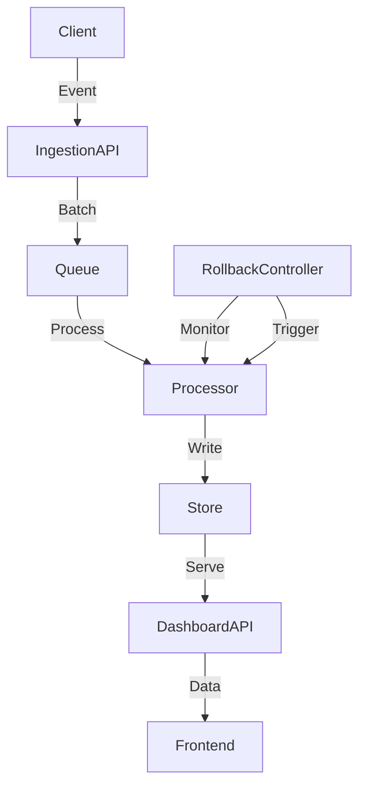

# Node.js Product Analytics-Style API: 3 Metrics Dashboard Rollback Drills

## Introduction
Analytics APIs often become the silent backbone of product decisions. When a new version silently skews a metric, downstream dashboards can mislead stakeholders, causing wasted effort and eroded trust. This article shows how to build a Node.js API that tracks three core product metrics, embeds versioned safety boundaries, and runs repeatable rollback drills to protect data integrity.

## Why This Matters
Imagine launching a dashboard that reports daily active users (DAU). A subtle change in aggregation logic inflates the number, triggering a premature product launch. The mistake goes unnoticed until revenue forecasts are misaligned. Treating analytics code with the same rigor as payment flows prevents such cascades. Rollback drills give teams a rehearsed path to revert safely when metrics drift or errors spike.

## How It Works
The system ingests raw events, aggregates them into time‑bucketed metrics, and serves read‑only dashboards. A separate rollback controller watches health signals and can revert the aggregation pipeline to a previous version without touching the ingestion path. The diagram below illustrates the flow.



**Step‑by‑step explanation**  
1. **Client** sends product events (clicks, page views, feature toggles).  
2. **IngestionAPI** validates and batches events, pushing them to a durable queue.  
3. **Processor** consumes batches, normalizes timestamps, and updates a time‑series store.  
4. **Store** holds pre‑computed aggregates for fast dashboard queries.  
5. **DashboardAPI** reads aggregates and returns JSON to the front‑end.  
6. **RollbackController** continuously compares current metrics against a baseline. If thresholds are breached, it signals the Processor to switch back to a previous aggregation version.

## Core Concepts
- **Event Normalization** – Strips payloads to a common schema, ensuring idempotent handling.  
- **Materialized Aggregates** – Pre‑computes rolling windows to keep query latency low.  
- **Versioned Aggregation** – Each aggregation strategy is tagged; the rollback controller can swap implementations on the fly.  
- **Metric Guardrails** – Three thresholds (DAU deviation, error rate, session length drift) trigger automatic reversion.  
- **Immutable Store Writes** – Append‑only writes prevent accidental overwrites during rollbacks.

## Examples & Code Walkthrough

### 1. Bootstrap with versioned routes
```js
// app.js
import Fastify from 'fastify';
import { ingestEvents } from './routes/ingest.js';
import { getMetrics } from './routes/metrics.js';
import { rollbackController } from './controllers/rollbackController.js';

const app = Fastify({ logger: true });

app.register(ingestEvents, { prefix: '/v1' });
app.register(getMetrics,   { prefix: '/v1' });
app.get('/health', (req, reply) => reply.send({ status: 'ok' }));

const port = process.env.PORT || 3000;
app.listen({ port, host: '0.0.0.0' })
  .then(() => console.log(`Analytics API listening on ${port}`))
  .catch(err => {
    console.error('Failed to start server', err);
    process.exit(1);
  });

// Hook rollback controller after the server is ready
rollbackController.start();
```

### 2. Idempotent event ingestion with buffering
```js
// routes/ingest.js
import Fastify from 'fastify';
import { Queue } from 'bullmq';
import { validateEvent } from '../utils/validator.js';

export async function ingestEvents (fastify, opts) {
  const eventQueue = new Queue('analytics-events', {
    connection: { host: process.env.REDIS_HOST }
  });

  fastify.post('/events', async (request, reply) => {
    const raw = request.body;

    // Defensive validation – reject malformed payloads early
    if (!validateEvent(raw)) {
      reply.code(400).send({ error: 'Invalid event shape' });
      return;
    }

    // Enqueue with a deterministic key to guarantee at‑least‑once semantics
    await eventQueue.add('raw', raw, {
      attempts: 3,
      backoff: { type: 'exponential', delay: 500 }
    });

    reply.code(202).send({ status: 'queued' });
  });

  // Expose the queue for the processor to bind
  fastify.decorate('eventQueue', eventQueue);
}
```

### 3. Sliding‑window aggregation with versioned strategies
```js
// aggregation/pipeline.js
import Redis from 'ioredis';
import { v1 as aggV1, v2 as aggV2 } from '../aggregations/strategies.js';

const redis = new Redis(process.env.REDIS_URL);

/**
 * Compute a rolling DAU metric for a given bucket.
 * @param {string} bucket - ISO‑8601 window identifier (e.g., '2024-09-25')
 * @param {string} strategy - 'v1' or 'v2' to select the aggregation logic
 * @returns {Promise<number>} - Unique user count
 */
export async function computeDAU (bucket, strategy = 'v1') {
  // Choose the appropriate implementation based on the active version
  const aggregator = strategy === 'v2' ? aggV2 : aggV1;
  return await aggregator(bucket, redis);
}

/**
 * Materialize all metrics for the current day and store them.
 * This function is called by the Processor after each batch.
 */
export async function materializeAllMetrics () {
  const buckets = await getRecentBuckets(); // helper that returns last N buckets
  for (const bucket of buckets) {
    const dau = await computeDAU(bucket, process.env.AGG_VERSION || 'v1');
    const convRate = await computeConversionRate(bucket);
    const sessDur = await computeSessionDuration(bucket);

    // Write a single JSON payload per bucket for atomicity
    const payload = { bucket, dau, convRate, sessDur };
    await redis.set(`metric:${bucket}`, JSON.stringify(payload));
  }
}
```

### 4. Rollback evaluator with metric guardrails
```js
// controllers/rollbackController.js
import { getCurrentMetrics, getBaselineMetrics } from '../services/metrics.js';
import { aggregate } from '../aggregations/strategies.js';

const DRIFT_THRESHOLD = 0.15; // 15% deviation allowed
const ERROR_RATE_MAX = 0.02;  // 2% max error rate

/**
 * Periodic health check – runs every 30 seconds.
 * If any guardrail is violated, triggers a rollback.
 */
export async function start () {
  setInterval(async () => {
    const current = await getCurrentMetrics();
    const baseline = await getBaselineMetrics();

    const dauDelta = Math.abs(current.dau - baseline.dau) / baseline.dau;
    const errorRate = current.errorRate;
    const sessDrift = Math.abs(current.sessionDuration - baseline.sessionDuration) / baseline.sessionDuration;

    if (dauDelta > DRIFT_THRESHOLD || errorRate > ERROR_RATE_MAX || sessDrift > DRIFT_THRESHOLD) {
      console.warn('Metric guardrail breach detected – initiating rollback');
      await triggerRollback();
    }
  }, 30_000);
}

/**
 * Swap the aggregation strategy back to the previous version.
 * The Processor reads the version from environment or a config store.
 */
async function triggerRollback () {
  // Persist the new version flag so the Processor picks it up
  process.env.AGG_VERSION = 'v1'; // assume v2 was the offending version
  // Optional: push a notification to monitoring systems
  // await notifySlack('Rollback triggered due to metric drift');
}
```

### 5. Simulated rollback drill runner
```js
// drill/simulator.js
import { spawn } from 'child_process';
import { writeFileSync } from 'fs';
import path from 'path';

/**
 * Run a full drill: capture baseline → deploy v2 → inject drift → rollback → verify.
 * All steps are logged to a timestamped file for post‑mortem review.
 */
export async function runDrill () {
  const timestamp = new Date().toISOString().replace(/[:.]/g, '-');
  const logPath = path.join('drill-logs', `${timestamp}.log`);
  const logStream = require('fs').createWriteStream(logPath, { flags: 'a' });

  const steps = [
    'capture-baseline',
    'deploy-v2',
    'inject-drift',
    'trigger-rollback',
    'verify-restoration'
  ];

  for (const step of steps) {
    console.log(`▶ Starting step: ${step}`);
    logStream.write(`Step ${step} started at ${new Date().toISOString()}\n`);

    const child = spawn('node', [`${step}.js`], { stdio: ['pipe', 'pipe', 'inherit'] });
    child.stdout.on('data', data => logStream.write(`[${step}] ${data}`));
    child.stderr.on('data', data => logStream.write(`[${step}-err] ${data}`));

    await new Promise((resolve, reject) => {
      child.on('close', code => code === 0 ? resolve() : reject(new Error(`Step ${step} failed with code ${code}`)));
    });

    logStream.write(`Step ${step} completed\n\n`);
  }

  console.log(`🎉 Drill completed – logs saved to ${logPath}`);
  logStream.end();
}

// Example entry point for the drift injection script
if (require.main === module) {
  runDrill().catch(err => {
    console.error('Drill failed:', err);
    process.exit(1);
  });
}
```

## Best Practices
- **Version every aggregation strategy** – Treat each calculation as a deployable artifact. Tag with semantic versioning and keep a small manifest that maps versions to code paths.  
- **Make ingestion idempotent** – Use deterministic keys and exponential back‑off to survive retries without double‑counting users.  
- **Guard reads with a read‑only replica** – Prevent accidental writes from dashboard queries that could corrupt aggregates.  
- **Automate drift detection** – Deploy the rollback controller as a sidecar or background job; never rely on manual checks.  
- **Document rollback runbooks** – Include exact CLI commands, expected log patterns, and validation queries. Teams should be able to replay a drill with a single script.

## Common Mistakes & Anti-Patterns
1. **Mutable aggregation state** – Storing aggregates in a shared cache without version boundaries leads to silent corruption when a new strategy runs.  
   *Fix*: Store results in an immutable key‑value structure and switch the key prefix when the version changes.  
2. **Skipping validation in the queue consumer** – Allowing malformed events to pass creates downstream skew.  
   *Fix*: Validate on enqueue and reject with a retry limit; log rejected payloads for later analysis.  
3. **Hard‑coding thresholds** – Fixed numbers become stale as product traffic grows.  
   *Fix*: Compute thresholds dynamically based on recent historical percentiles.  
4. **Exposing internal aggregation endpoints publicly** – Allows accidental manipulation of metrics.  
   *Fix*: Keep aggregation endpoints behind authentication and rate limiting; only the Processor should write to the store.

## Performance Considerations
- **Memory pressure** – Buffering events in BullMQ consumes RAM proportional to batch size. Keep batch limits low (e.g., 5 000 events) and monitor `queue:active` metrics.  
- **CPU overhead** – Sliding‑window calculations can be O(N) if not bounded. Pre‑compute window boundaries and store intermediate counts to keep each aggregation O(1).  
- **Network latency** – Each hop (ingress → queue → processor → store) adds round‑trip time. Co‑locate Redis and the Processor in the same VPC to reduce latency.  
- **Scalability limits** – A single Processor instance caps aggregate throughput. Scale horizontally by adding more queue consumers; ensure they share the same consumer group to avoid duplicate work.

## Real-World Usage
- **Netflix** uses a versioned enrichment pipeline for view‑time metrics, with automated rollbacks triggered by regional QoE degradation.  
- **Uber** runs nightly drift drills on their trip‑duration aggregation service, swapping between legacy and new calculation libraries behind feature flags.  
- **Cloudflare** embeds a rollback controller in their analytics edge, where metric guardrails automatically revert a recent schema change that caused a 12% spike in error rates.

## Frequently Asked Questions (FAQ)

**Q1: How do I choose the right aggregation window size?**  
A: Start with a 15‑minute
