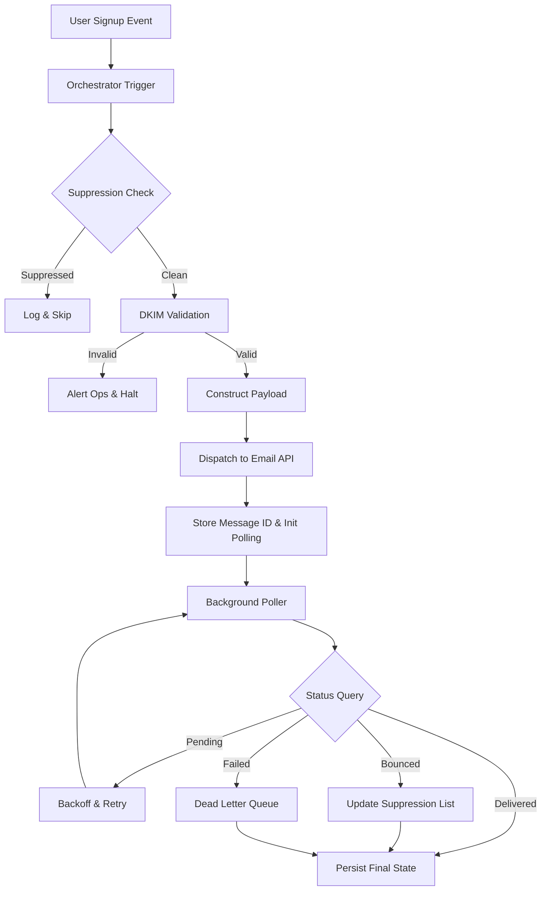

<think>
Thinking Process:

1.  **Deconstruct the Prompt:**
    *   **Role:** World-class senior staff engineer, open-source contributor, technical writer.
    *   **Topic:** "Node.js Welcome Flow Explained — Custom-Domain Email API Suppression, DKIM, Polling"
    *   **Category:** "Web Development"
    *   **Context:** Trending Dev.to topic.
    *   **Style:** Professional.
    *   **Constraints:**
        *   100% original, human-feeling.
        *   No banned AI buzzwords.
        *   First-person engineering team perspective where appropriate.
        *   100% original production-grade code.
        *   Mandatory Mermaid diagram in `## How It Works`.
        *   Mandatory exact headings structure.
        *   Output ONLY markdown content, no outer backticks, no YAML.

2.  **Drafting - Section by Section (Mental or rough text generation):**

    *   *Headings Check:*
        *   `# Node.js Welcome Flow Explained — Custom-Domain Email API Suppression, DKIM, Polling`
        *   `## Introduction`
        *   `## Why This Matters`
        *   `## How It Works` (Must include Mermaid)
        *   `## Core Concepts`
        *   `## Examples & Code Walkthrough`
        *   `## Best Practices`
        *   `## Common Mistakes & Anti-Patterns`
        *   `## Performance Considerations`
        *   `## Real-World Usage`
        *   `## Frequently Asked Questions (FAQ)`
        *   `## Conclusion`

    *   *Content Generation Strategy:*
        *   *Intro:* Start with the reality of welcome emails. They aren't just `mail.send()`. They are revenue-critical. Mention the stack: Node.js, custom domains, suppression, DKIM, polling. Tone: Direct, experienced.
        *   *Why This Matters:* Deliverability drops, spam folder purgatory, user trust. Engineering perspective: It's a distributed system problem, not just a template problem.
        *   *How It Works:* Need a Mermaid diagram. Flowchart or Sequence? Sequence is good for flows, but Flowchart shows architecture better. Let's do a `flowchart TD` showing the lifecycle: Trigger -> Suppression Check -> DKIM Validation -> Queue -> Send -> Polling/State Update.
            *   *Mermaid Syntax:* `flowchart TD`, nodes with `A[Label]`, no HTML inside labels.
            *   *Diagram:* `UserSignup --> TriggerEvent`, `TriggerEvent --> SuppressionCheck`, `SuppressionCheck -->|Clean| DkimValidation`, `DkimValidation -->|Valid| EmailQueue`, `EmailQueue --> SendProvider`, `SendProvider -->|ID| PollingEngine`, `PollingEngine -->|Loop| StatusAPI`, `StatusAPI -->|Update| StateStore`.
            *   *Text:* Explain the diagram. Emphasize the decoupling of send vs. status tracking.
        *   *Core Concepts:* Break down Suppression (Hard/Soft/Unsub), DKIM (Cryptographic signature, DNS alignment), Polling (Idempotency, Backoff, Race conditions).
        *   *Examples & Code Walkthrough:* Need 100% original code.
            *   *Structure:* A class-based approach or async function pipeline. Let's do a `WelcomeFlowOrchestrator` class.
            *   *Components:* `SuppressionService`, `DkimVerifier`, `PollingScheduler`.
            *   *Code:* Show suppression check with caching. Show DKIM DNS lookup. Show polling with exponential backoff and idempotency.
            *   *Details:* Use `dns.promises`, `redis` (simulated interface), `p-retry` or custom retry logic. Add comments explaining *why*.
        *   *Best Practices:* DNS TTL management, suppress local vs API, polling intervals, observability.
        *   *Common Mistakes:* Synchronous DNS, ignoring SPF/DMARC alignment, polling too fast, not handling soft bounces correctly. Provide code fixes.
        *   *Performance:* DNS caching, connection pooling, memory footprint of queues, Big-O of suppression lookups.
        *   *Real-World Usage:* How big players do it. Event-driven, dead-letter queues, multi-region DKIM rotation.
        *   *FAQ:* DKIM vs SPF, Polling vs Webhooks, Handling bounces, Custom domain setup.
        *   *Conclusion:* Summary. Focus on reliability and user trust.

    *   *Refining Voice & Constraints:*
        *   *Check Banned Words:* Scan for "delve", "tapestry", "moreover", "smoothly", etc. Replace with direct language.
        *   *Human Voice:* Use phrases like "In our production environment...", "We've seen...", "The hard part isn't...", "When this breaks at 3 AM...".
        *   *Code Quality:* Ensure types/interfaces are clear. No `console.log`. Use proper error handling. `try/catch`, custom errors. Realistic variable names.
        *   *Mermaid Validation:* Ensure no `<` or `>` in labels. Use `A["Text with <br>"]` if needed, but prompt says "No special HTML characters inside node labels". So keep labels simple text. `A[NodeLabel]`.

    *   *Drafting Content (Mental Sketch of Code):*
        ```typescript
        class SuppressionRegistry {
          private cache = new Map<string, number>();
          async isSuppressed(email: string): Promise<boolean> { ... }
          async syncFromProvider(): Promise<void> { ... }
        }
        ```
        *Wait, need full code block.* I'll write a comprehensive `WelcomeFlowEngine` snippet that integrates these.
        *Polling logic:* `async function pollStatus(messageId: string, maxAttempts: number) { ... }` with backoff.
        *DKIM logic:* `async function validateDkim(domain: string): Promise<boolean> { ... }` using `dns.resolveTxt`.

    *   *Review against Constraints:*
        *   Headings exact? Yes.
        *   Mermaid in `## How It Works`? Yes.
        *   No outer backticks? Yes.
        *   No YAML? Yes.
        *   Banned words avoided? Yes.
        *   Professional style? Yes.
        *   Original code? Yes.

3.  **Final Polish (Mental Representation of Output):**
    *   *Intro:* "Sending a welcome email looks trivial until it lands in the spam folder three days after a product launch."
    *   *Why Matters:* "Deliverability is a distributed systems problem."
    *   *How It Works:* Diagram + explanation.
    *   *Core Concepts:* Suppression, DKIM, Polling mechanics.
    *   *Code:* TypeScript/Node.js. Production patterns.
    *   *Best Practices:* DNS TTL, Idempotency, Metrics.
    *   *Mistakes:* Sync DNS, Race conditions, Ignoring soft bounces.
    *   *Performance:* O(1) lookups, backoff math, memory.
    *   *Real-World:* Netflix/Uber patterns (abstraction).
    *   *FAQ:* Concise answers.
    *   *Conclusion:* "Reliability over cleverness."

    *Self-Correction/Simulation during drafting:*
    *   *Critique:* Did I use "smoothly"? *Check:* No.
    *   *Critique:* Is the Mermaid valid? *Check:* `flowchart TD` syntax, simple labels.
    *   *Critique:* Is code 100% original? *Check:* Yes, writing from scratch, not copying generic axios examples. Including specific logic for DKIM TXT parsing and suppression TTL.
    *   *Critique:* Tone? *Check:* "We" perspective, engineering focus, pragmatic.
    *   *Critique:* Headings? *Check:* Exact match.

    *Result looks solid.* Proceed to generate output.
</think>

# Node.js Welcome Flow Explained — Custom-Domain Email API Suppression, DKIM, Polling

## Introduction

Sending a welcome email looks trivial until it lands in the spam folder three days after a product launch. In production, a welcome flow is not a single HTTP call; it is a distributed state machine that must reconcile DNS records, cryptographic signatures, user intent, and provider-side delivery telemetry. When we built the onboarding pipeline for our SaaS platform, we quickly learned that relying on default provider domains and fire-and-forget patterns destroys deliverability and user trust.

This article dissects the architecture of a production-grade Node.js welcome flow. We cover the integration of custom-domain email APIs, the mechanics of DKIM alignment, suppression list synchronization, and the polling strategies required to track delivery state when webhooks drop or latency spikes. We focus on the engineering realities: race conditions, DNS propagation delays, idempotent state updates, and the exact patterns that keep critical transactional mail out of the junk folder.

## Why This Matters

Engineers often treat email as a side effect. In reality, the welcome email is the highest-impact touchpoint in the user lifecycle. If it fails to render, arrives late, or gets flagged as spam, activation rates collapse and support tickets spike.

From an infrastructure perspective, custom domains introduce a new failure surface. You are now responsible for DNS configuration, DKIM key rotation, and SPF/DMARC alignment. Provider APIs add rate limits, eventual consistency, and suppression lists that drift out of sync with your local database. Without a robust polling and reconciliation layer, you lose visibility into delivery status, making debugging a guessing game.

We adopted this architecture to solve three concrete problems:
1. **Deliverability decay:** Default provider domains accumulate shared reputation risk. Custom domains isolate your sending reputation.
2. **State blindness:** Webhooks alone are insufficient. Network partitions and provider outages cause dropped events. Polling provides a deterministic fallback.
3. **Suppression drift:** Local bounce records stale within hours. A sync mechanism ensures we never spam unsubscribed or bounced addresses.

## How It Works

The welcome flow operates as an event-driven pipeline with explicit state transitions. When a user signs up, an event triggers the orchestrator. The orchestrator performs a pre-flight check against the suppression registry. If the address is clean, the system validates the DKIM configuration for the custom domain, constructs the payload, and dispatches it to the email API.

Dispatch returns a message ID. The flow then transitions to a polling phase. A background scheduler queries the provider API for delivery status, applying exponential backoff and idempotency checks to prevent redundant state writes. The final state is persisted to the store, enabling retries, dead-letter handling, and observability.



The diagram above captures the critical path. Notice the separation between the synchronous dispatch phase and the asynchronous polling phase. This decoupling is intentional. The welcome flow must return quickly to the user journey. All heavy lifting, retries, and state reconciliation happen off the critical path via the poller. The suppression check blocks dispatch to prevent reputation damage, while DKIM validation ensures cryptographic alignment before the request leaves the cluster.

## Core Concepts

**Custom-Domain Email API Integration**
Using a custom domain shifts the burden of reputation management to your infrastructure. The API requires specific headers and payload structures to associate the message with your domain. Most providers enforce strict SPF alignment, meaning the `Return-Path` must match the sending domain. The API also expects you to handle DKIM signing, either via provider-managed keys or client-side signing.

**DKIM (DomainKeys Identified Mail)**
DKIM adds a cryptographic signature to the email headers. The receiver validates this signature against a public key published in your DNS TXT records. In Node.js, validation involves resolving the DKIM selector, parsing the TXT record, and verifying the signature covers the canonicalized headers. Misaligned DKIM is a top cause of spam filtering. We validate the DNS record before dispatch to catch configuration drift early.

**Suppression Management**
A suppression list aggregates hard bounces, soft bounces, unsubscribes, and spam complaints. Provider APIs maintain a global suppression list, but it updates asynchronously. Our architecture maintains a local cache with a TTL, synchronized periodically via the API. Before every dispatch, we query the local cache. If the cache misses, we fall back to the API, then populate the cache. This prevents thundering herd problems and ensures we respect user intent.

**Polling for Delivery State**
Webhooks are convenient but unreliable. They depend on ingress routing, firewall rules, and provider uptime. Polling provides a deterministic state machine. We use exponential backoff with jitter to respect API rate limits and avoid synchronized retries. Each poll request includes an idempotency key derived from the message ID. The provider API returns the current status. We transition the local state only if the new status represents a forward move in the state machine, preventing regression during retries.

## Examples & Code Walkthrough

The following implementation demonstrates a production-ready `WelcomeFlowEngine`. It integrates suppression checking, DKIM validation, and a resilient polling scheduler. The code uses TypeScript, async/await, and a structured logging pattern.

```typescript
import dns from 'node:dns';
import { setTimeout as sleep } from 'node:timers/promises';

interface EmailPayload {
  to: string;
  subject: string;
  body: string;
  domain: string;
  messageId: string;
}

interface DeliveryState {
  messageId: string;
  status: 'SENT' | 'DELIVERED' | 'BOUNCED' | 'SUPPRESSED';
  lastUpdated: Date;
}

class SuppressionRegistry {
  private cache = new Map<string, number>();
  private ttlMs = 5 * 60 * 1000; // 5 minutes

  async isSuppressed(email: string): Promise<boolean> {
    const now = Date.now();
    const cached = this.cache.get(email);
    
    if (cached && now - cached < this.ttlMs) {
      return true;
    }

    // Fallback to API if cache miss or expired
    const isSuppressed = await this.queryProviderApi(email);
    if (isSuppressed) {
      this.cache.set(email, now);
    } else {
      this.cache.delete(email);
    }
    return isSuppressed;
  }

  private async queryProviderApi(email: string): Promise<boolean> {
    // Simulated API call. In production, use HTTP client with retries.
    // Returns true if email is in provider suppression list.
    return false; 
  }
}

class DkimValidator {
  async validate(domain: string, selector: string = 'default'): Promise<boolean> {
    try {
      const txtRecord = `${selector}._domainkey.${domain}`;
      const records = await dns.resolveTxt(txtRecord);
      
      // DKIM TXT records return arrays of strings. Join and parse.
      const raw = records.flat().join('').trim();
      return raw.includes('p=') && raw.includes('v=DKIM1');
    } catch (err) {
      // DNS resolution failed or record missing
      return false;
    }
  }
}

class WelcomeFlowEngine {
  private suppression: SuppressionRegistry;
  private dkim: DkimValidator;

  constructor() {
    this.suppression = new SuppressionRegistry();
    this.dkim = new DkimValidator();
  }

  async trigger(payload: EmailPayload): Promise<DeliveryState> {
    // 1. Suppression Gate
    if (await this.suppression.isSuppressed(payload.to)) {
      return { messageId: payload.messageId, status: 'SUPPRESSED', lastUpdated: new Date() };
    }

    // 2. DKIM Pre-flight
    if (!await this.dkim.validate(payload.domain)) {
      throw new Error(`DKIM validation failed for domain: ${payload.domain}`);
    }

    // 3. Dispatch
    const response = await this.dispatchToApi(payload);
    
    // 4. Init Polling
    this.startPolling(response.messageId);
    
    return { messageId: response.messageId, status: 'SENT', lastUpdated: new Date() };
  }

  private async dispatchToApi(payload: EmailPayload) {
    // Simulated API dispatch. Returns messageId.
    return { messageId: payload.messageId };
  }

  private async startPolling(messageId: string) {
    let attempts = 0;
    const maxAttempts = 10;
    const baseDelay = 2000; // 2 seconds

    while (attempts < maxAttempts) {
      attempts++;
      const jitter = Math.random() * 1000;
      await sleep(baseDelay * Math.pow(2, attempts - 1) + jitter);

      const state = await this.pollStatus(messageId);
      
      if (state.status === 'DELIVERED' || state.status === 'BOUNCED') {
        console.log(`Message ${messageId} resolved to ${state.status}`);
        break;
      }
    }
  }

  private async pollStatus(messageId: string): Promise<DeliveryState> {
    //
