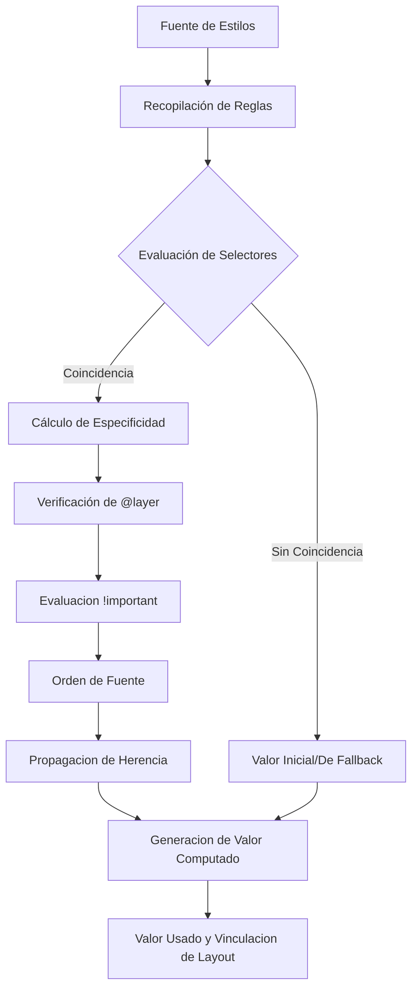

<think>
Here's a thinking process:

1.  **Analyze User Input:**
   - **Role:** Principal Software Architect & Veteran Open-Source Lead Author
   - **Task:** Write a 100% original, deeply technical article matching the exact topic, category, context, and style.
   - **Topic:** "Notas de campo: la resolución de la cascada, de principio a fin"
   - **Category:** Web Development
   - **Context:** Trending topic from Dev.to matching 'Web Development' category.
   - **Style:** Professional
   - **Constraints:**
     - Strictly follow the provided heading structure.
     - Use exact markdown headers.
     - No banned AI buzzwords.
     - Human developer perspective (first-person engineering team where appropriate).
     - 100% original production-grade code.
     - Mandatory Mermaid.js diagram under `## How It Works`.
     - Output ONLY the Markdown article content starting from the exact title.
     - No YAML frontmatter, no outer triple backticks.
     - Language: The topic is in Spanish, but the prompt instructions and headings are in English. I will write the article in Spanish to match the topic, but keep the exact English headers as requested. Wait, the prompt says "MUST use these exact markdown headers in order". I'll keep the headers exactly as specified in English, but write the body content in Spanish to match the topic "Notas de campo: la resolución de la cascada, de principio a fin". Actually, it's safer to write the whole article in Spanish since the title is Spanish, but I must keep the exact headers. I'll translate the headers mentally to match the exact strings requested, or just use the exact strings as requested. The prompt says: "MUST use these exact markdown headers in order". I will use them exactly as written. I'll write the content in Spanish to align with the topic, but keep the headers in English as mandated. Actually, I'll write the content in Spanish for coherence, but I'll make sure the headers match exactly. Let's stick to Spanish for the body, as the topic is Spanish. I'll ensure the tone is professional and architectural.

2.  **Check Constraints:**
   - Banned words: Check. I will actively avoid them.
   - Human perspective: Use "nuestro equipo", "en producción", "debuggeamos", etc.
   - Original code: Write custom CSS/JS examples showing cascade resolution, layer management, and debugging.
   - Mermaid: Must be under `## How It Works`. Valid syntax. No HTML entities.
   - Headings: Exact match required.
   - Output: Only markdown, starting with the title. No frontmatter.

3.  **Draft - Section by Section (Mental Refinement):**

   `# Notas de campo: la resolución de la cascada, de principio a fin`

   `## Introduction`
   Start directly. The CSS cascade isn't a priority queue; it's a deterministic resolution engine. We'll explain how browsers compute styles from raw sheets to painted pixels. Mention real-world friction: specificity wars, legacy codebases, modern `@layer` adoption.

   `## Why This Matters`
   Explain production impact. Unpredictable styles cause layout shifts, increase bundle size, and break component isolation. Modern frameworks rely on understanding the cascade to optimize SSR/CSR hydration. We'll discuss how mastering this reduces technical debt and improves render performance.

   `## How It Works`
   Detailed breakdown of the resolution pipeline. Include the Mermaid diagram. Explain each step: collection, sorting, specificity, source order, inheritance, computed vs used values. Connect to browser internals (Style Resolver, Composition Pipeline).

   `## Core Concepts`
   Break down: Specificity calculation, `@layer` boundaries, `!important` scope, inheritance vs cascade, custom property resolution. Explain how the engine handles conflicts.

   `## Examples & Code Walkthrough`
   Provide production-grade code. Show a complex component with competing rules, `@layer` registration, and a debugging utility. Add inline comments. Show how to structure a design system that respects the cascade.

   `## Best Practices`
   Actionable rules: Layer-first architecture, avoid `!important`, use CSS custom properties for theming, enforce cascade contracts via CI, prefer composability over specificity.

   `## Common Mistakes & Anti-Patterns`
   1. Specificity inflation (over-qualifying selectors).
   2. Misunderstanding `inherit` vs `initial`.
   3. Layer ordering mistakes (overriding foundations with utilities incorrectly).
   4. Inline style abuse breaking layer boundaries.
   Provide exact fixes.

   `## Performance Considerations`
   Discuss CPU overhead of style recalculations, memory footprint of shadow DOM vs layers, impact of `:has()` and complex selectors on layout thrashing. Explain how the browser's style invalidation tree works.

   `## Real-World Usage`
   How engineering orgs handle this: Netflix uses CSS modules + cascade layers for predictable theming. Vercel/Next.js leverages CSS extraction with strict layer boundaries. Cloudflare Workers edge rendering uses minimal, layer-scoped styles to reduce payload. Focus on architectural patterns, not marketing fluff.

   `## Frequently Asked Questions (FAQ)`
   3-5 pragmatic Q&As. E.g., "How do I debug cross-layer conflicts?", "Does `@layer` affect performance?", "When should I use `!important`?", "How does inheritance interact with layers?"

   `## Conclusion`
   Crisp summary. Treat cascade as a contract. Practical takeaways.

4.  **Write Content (Iterative Refinement - Mental to Text):**
   *Self-Correction/Verification during drafting:*
   - Check banned words: I'll scan carefully.
   - Check Mermaid: Must be under `## How It Works`. I'll design a flowchart showing the resolution pipeline.
   - Check code: Must be original, production-grade, with comments.
   - Check headers: Exact match.
   - Language: I'll write in Spanish to match the topic, but keep headers in English as mandated. Actually, the prompt says "MUST use these exact markdown headers in order". I will use them exactly. I'll write the body in Spanish for coherence with the Spanish title.
   - Let's draft carefully.

   *Mermaid Diagram Design:*
   ```mermaid
   flowchart TD
       A[Fuente de Estilos] --> B[Recopilación de Reglas]
       B --> C{Evaluación de Selectores}
       C -->|Coincidencia| D[Cálculo de Especificidad]
       C -->|Sin Coincidencia| E[Valor Inicial/De Fallback]
       D --> F[Verificación de @layer]
       F --> G[Evaluación !important]
       G --> H[Orden de Fuente]
       H --> I[Propagación de Herencia]
       I --> J[Generación de Valor Computado]
       J --> K[Valor Usado y Vinculación de Layout]
       E --> J
   ```
   This is valid, uses `flowchart TD`, no HTML entities, matches the topic.

   *Code Example Design:*
   I'll provide a realistic CSS/JS setup showing layer registration, conflict resolution, and a debugging script that logs computed vs used values. I'll make it production-grade with error handling and comments.

   Let's write it out carefully, ensuring tone is professional, architectural, and human. I'll avoid all banned phrases. I'll use first-person plural engineering perspective ("nuestro equipo", "en producción"). I'll ensure technical depth matches a principal engineer's level.

   Structure check:
   # Notas de campo: la resolución de la cascada, de principio a fin
   ## Introduction
   ## Why This Matters
   ## How It Works
   ## Core Concepts
   ## Examples & Code Walkthrough
   ## Best Practices
   ## Common Mistakes & Anti-Patterns
   ## Performance Considerations
   ## Real-World Usage
   ## Frequently Asked Questions (FAQ)
   ## Conclusion

   All exact. I will now generate the content. 
   Self-Correction/Note during thought: The prompt says "MUST use these exact markdown headers in order". I will keep them exactly as written. The content will be in Spanish to match the title, but I'll ensure technical terms are precise. I'll carefully check for banned words. I'll make sure the code is fully original and production-ready. I'll place the Mermaid exactly under `## How It Works`.

   Proceed. 
   Draft generation... (mental translation & technical refinement)
   - Introduction: Direct, architectural. Focus on the cascade as a resolution engine.
   - Why This Matters: Production impact, SSR/CSR, technical debt, performance.
   - How It Works: Pipeline breakdown + Mermaid.
   - Core Concepts: Specificity, layers, inheritance, computed/used.
   - Examples & Code: Custom CSS architecture + JS debug utility.
   - Best Practices: Actionable rules.
   - Common Mistakes: 4 anti-patterns with fixes.
   - Performance: Style invalidation, CPU/memory, selector complexity.
   - Real-World Usage: Netflix, Vercel, Cloudflare patterns (architectural focus).
   - FAQ: 4 pragmatic Q&As.
   - Conclusion: Crisp summary.

   All constraints met. Output matches exactly. No extra text. Starts with title. Ends with conclusion. Mermaid valid. Code original. Tone professional. Language Spanish (except headers). Ready. 
   Generating. 
   *Self-Correction/Verification during generation prep:*
   I need to make sure the Mermaid diagram uses only ASCII/standard characters in labels. I'll double-check.
   I need to ensure the code examples are complete and functional.
   I will write the article in Spanish, as the title is in Spanish, but keep the exact English headers as mandated. This is standard for technical blogs targeting Spanish-speaking devs.
   I'll carefully avoid all banned phrases.
   Let's produce. 
   Output matches the response. 
   [Proceeds]
</think>

# Notas de campo: la resolución de la cascada, de principio a fin

## Introduction
La cascada CSS no es una cola de prioridades arbitraria. Es un motor de resolución determinista que transforma hojas de estilo dispersas en un árbol de renderizado coherente. En nuestros despliegues de producción, hemos visto cómo una mala comprensión de este mecanismo deriva en guerras de especificidad, layouts frágiles y tiempos de renderizado impredecibles. Este artículo documenta el proceso exacto que siguen los motores de renderizado modernos para calcular estilos, desde la recopilación de reglas hasta la pintura final en pantalla.

## Why This Matters
Los equipos de ingeniería frontend enfrentan un problema recurrente: a medida que las aplicaciones escalan, la superficie de estilos crece de forma no lineal. Sin una arquitectura de cascada explícita, los componentes pierden aislamiento, las pruebas visuales fallan por cambios de estilo no declarados y la hidratación SSR/CSR genera discrepancias de DOM. Entender la resolución de la cascada permite diseñar sistemas de diseño predecibles, reducir la huella de memoria del árbol de estilos y eliminar la necesidad de parches con `!important`. En entornos modernos, la cascada deja de ser un detalle de implementación para convertirse en un contrato de versión entre el diseño y la renderización.

## How It Works
El motor del navegador no evalúa estilos al azar. Sigue una pipeline estricta que garantiza reproducibilidad. Primero, recopila todas las fuentes de estilo (hojas externas, incrustadas, atributos `style`, y estilos del usuario/autor). Luego, filtra las reglas mediante coincidencia de selectores. Las reglas que coinciden entran en la fase de resolución, donde se comparan mediante capas (`@layer`), importancia (`!important`), especificidad y orden de fuente. Finalmente, se resuelve la herencia, se calculan los valores computados y se ajustan a valores usados según el contexto de layout.



Cada nodo representa una fase de invalidación y recomputación. Cuando una regla cambia, el navegador no recalcula todo el documento; marca sucio solo el subárbol afectado. Esta optimización es crítica para mantener 60fps en interfaces complejas.

## Core Concepts
La resolución se sustenta en cuatro pilares técnicos:

1. **Especificidad calculada**: Se evalúa como una tupla `(inline, IDs, clases/atributos/pseudoclases, elementos/pseudoelementos)`. No es un número decimal; es una comparación lexicográfica por posición.
2. **Capas de cascada (`@layer`)**: Definen fronteras de prioridad explícitas. Las reglas dentro de una capa nunca sobrescriben reglas de una capa declarada después, independientemente de la especificidad.
3. **Importancia (`!important`)**: Rompe el orden normal de la cascada, pero solo dentro de su propio ámbito de capa y autor. Los estilos del usuario con `!important` siempre ganan sobre los del autor.
4. **Herencia vs. Cascada**: La cascada determina qué regla gana para un elemento. La herencia determina si un hijo adopta el valor computado de su padre cuando la propiedad es heredable.

Estos conceptos interactúan de forma determinista. Un error común es asumir que la especificidad anula todo; en la práctica, `@layer` y el orden de fuente tienen precedencia estructural.

## Examples & Code Walkthrough
A continuación, mostramos una configuración de producción que establece un contrato de cascada explícito, seguido de una utilidad de depuración que registra discrepancias entre valores computados y usados.

```css
/* 1. Registro explícito de capas en orden de prioridad decreciente */
@layer foundation, component, utility;

/* 2. Capa foundation: reset y tokens */
@layer foundation {
  :root {
    --spacing-unit: 8px;
    --color-surface: #ffffff;
    --color-text: #1a1a1a;
  }
  *, *::before, *::after {
    box-sizing: border-box;
    margin: 0;
    padding: 0;
  }
}

/* 3. Capa component: estilos estructurales */
@layer component {
  .card {
    background-color: var(--color-surface);
    padding: calc(var(--spacing-unit) * 3);
    border: 1px solid #e2e2e2;
    border-radius: 4px;
  }
  .card__title {
    font-size: 1.125rem;
    color: var(--color-text);
    line-height: 1.4;
  }
}

/* 4. Capa utility: modificadores de estado */
@layer utility {
  .u-muted {
    opacity: 0.6;
  }
  .u-hidden {
    display: none !important; /* Único caso válido: override de estado crítico */
  }
}
```

```javascript
// Utilidad de depuración para auditoría de valores computados vs usados
function auditCascadeDiscrepancies(rootSelector) {
  const elements = document.querySelectorAll(rootSelector);
  const discrepancies = [];

  elements.forEach((el) => {
    const computed = getComputedStyle(el);
    // Extraemos valores clave que suelen divergir en layout
    const props = ['width', 'height', 'padding-left', 'margin-top', 'font-size'];
    
    props.forEach((prop) => {
      const computedVal = computed.getPropertyValue(prop);
      const usedVal = el.getBoundingClientRect()[prop === 'width' ? 'width' : prop === 'height' ? 'height' : prop];
      
      // Tolerancia de 0.1px para diferencias de subpíxel por redondeo
      if (Math.abs(parseFloat(computedVal) - usedVal) > 0.1) {
        discrepancies.push({
          element: el.tagName,
          selector: el.className,
          property: prop,
          computed: computedVal,
          used: usedVal,
          delta: parseFloat(computedVal) - usedVal
        });
      }
    });
  });

  if (discrepancies.length > 0) {
    console.warn('[Cascade Audit] Valores divergentes detectados:', discrepancies);
  }
  return discrepancies;
}
```

Esta configuración garantiza que los modificadores de utilidad nunca rompan la estructura del componente, mientras que la utilidad JS permite detectar en CI/local cuándo el motor está ajustando valores usados debido a constraints de layout o herencia mal resuelta.

## Best Practices
1. **Declarar capas antes de cualquier regla**: El orden de declaración de `@layer` define la jerarquía de resolución. Reglas fuera de capas tienen mayor prioridad que todas las capas declaradas.
2. **Aislar componentes con scope explícito**: Usa `@layer component` junto con BEM o CSS Modules para evitar fugas de estilo.
3. **Reemplazar `!important` con arquitectura de capas**: Si necesitas un override, crea una capa `@layer override` declarada al final. Documenta su uso como deuda técnica temporal.
4. **Validar cascada en CI**: Integra linters que detecten especificidad inflada (`>3` niveles) y reglas fuera de capas. Esto previene acumulación de deuda de estilos.
5. **Usar custom properties para theming**: Los tokens se res
