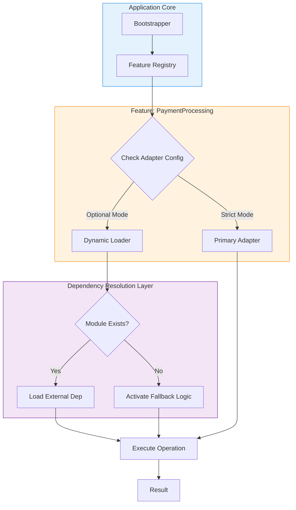

# Nothing could start without the dependency we had filed as optional

## Introduction

In the spring of 2023, our team deployed what we believed was a stable release of our e-commerce platform. The build pipeline passed, automated tests green-flagged every module, and the deployment script executed without error. Yet when users navigated to the checkout page, the application crashed with a cryptic `Module not found` error. The culprit? A dependency we had explicitly marked as `optionalDependencies` in `package.json`. This story isn’t unique. It’s a cautionary tale about the perils of implicit assumptions in dependency management and the fragile nature of "optional" code paths in production systems.

## Why This Matters

Modern applications rely on hundreds of dependencies, many of which are optional. Whether it’s a plugin system for extensibility, a feature flag for experimental modules, or platform-specific adapters (e.g., `node-crypto` vs. browser-native crypto), developers often mark dependencies as optional to reduce installation overhead or enable graceful degradation. However, when these "optional" dependencies are actually mandatory for critical paths, the consequences can be severe: runtime crashes, silent failures, or degraded user experiences.

The problem is exacerbated by tooling inconsistencies. Package managers like npm and Yarn treat `optionalDependencies` leniently—they won’t fail the install if they can’t resolve the dependency. But bundlers like Webpack, Vite, or esbuild may statically analyze imports and fail during the build or runtime. This disconnect between build-time and runtime environments is a recurring nightmare for full-stack engineers.

## How It Works

To understand why this happens, let’s dissect the lifecycle of an "optional" dependency:

1. **Package Installation**: npm/Yarn installs the package and skips `optionalDependencies` if they fail, but only logs a warning.
2. **Bundling**: Tools like Webpack or Vite may statically resolve imports in `require()` or `import` statements, potentially including or excluding the dependency based on their resolution logic.
3. **Runtime**: If the bundler includes the dependency but it’s not installed (due to the optional flag), the application crashes when the code tries to load it. Conversely, if the bundler excludes it, features relying on it may silently fail.

Here’s a visual representation of a resilient architecture that avoids this pitfall:



### Key Mechanisms

- **Feature Registry**: Centralizes feature initialization, allowing runtime checks for dependency availability.
- **Dynamic Loader**: Uses `import()` or `require()` with error handling to defer resolution until runtime.
- **Fallback Logic**: Provides alternative implementations (e.g., mock adapters, degraded modes) when dependencies are missing.

## Core Concepts

1. **Optional Dependencies vs. Peer Dependencies**:  
   - `optionalDependencies` are installed by package managers but not enforced. They’re ideal for platform-specific code (e.g., `fsevents` on macOS).  
   - `peerDependencies` require consumers to install compatible versions, common in plugin ecosystems (e.g., Babel plugins).  
   The confusion arises when developers treat `optionalDependencies` as a way to avoid hard dependencies without considering runtime implications.

2. **Static vs. Dynamic Imports**:  
   - Static `import` statements are resolved at build time. If a dependency is missing, the bundler may fail.  
   - Dynamic `import()` allows runtime resolution with error handling, enabling graceful degradation.

3. **Feature Flags and Dependency Injection**:  
   Feature flags (e.g., `process.env.FEATURE_X_ENABLED`) and dependency injection patterns allow conditional loading of modules without exposing fragile `try/catch require` logic.

## Examples & Code Walkthrough

### Anti-Pattern: The Fragile Try/Catch Require

```javascript
// Bad: Relies on try/catch to handle missing dependencies
let crypto;
try {
  crypto = require('optional-crypto');
} catch (e) {
  console.warn('Falling back to built-in crypto');
  crypto = {
    hash: (data) => data.toString(), // Simplified fallback
  };
}

function generateChecksum(data) {
  return crypto.hash(data);
}
```

**Why This Fails**:  
- Modern bundlers like Vite may statically analyze `require('optional-crypto')` and fail during the build.  
- Even if the build succeeds, the fallback logic might not match the expected interface, leading to runtime errors.

### Solution: Dynamic Import with Fallback

```javascript
// Good: Uses dynamic import and async error handling
async function loadCryptoAdapter() {
  try {
    const module = await import('optional-crypto');
    return module.default || module;
  } catch (e) {
    return {
      hash: (data) => data.toString(),
    };
  }
}

export async function generateChecksum(data) {
  const crypto = await loadCryptoAdapter();
  return crypto.hash(data);
}
```

### Production-Grade Example: Dependency Injection

```javascript
// config.js
const config = {
  useExternalCrypto: true,
  fallbackCrypto: () => ({
    hash: (data) => data.toString(),
  }),
};

// cryptoAdapter.js
export async function getCryptoAdapter() {
  if (config.useExternalCrypto) {
    try {
      const module = await import('optional-crypto');
      return module.default || module;
    } catch (e) {
      console.error('External crypto failed:', e.message);
      return config.fallbackCrypto();
    }
  }
  return config.fallbackCrypto();
}

// usage.js
import { getCryptoAdapter } from './cryptoAdapter.js';

async function processPayment(data) {
  const crypto = await getCryptoAdapter();
  const checksum = crypto.hash(data);
  // ... rest of payment logic
}
```

## Best Practices

1. **Avoid Implicit Dependencies**: Treat `optionalDependencies` as a last resort. If a dependency is critical for a feature, make it a hard dependency or implement robust fallbacks.
2. **Use Dynamic Imports for Optional Features**: This defers resolution to runtime and allows graceful degradation.
3. **Implement Feature Flags**: Allow toggling of features and their dependencies via environment variables.
4. **Test in Multiple Environments**: Ensure your build and runtime environments mirror production as closely as possible.
5. **Document Dependency Contracts**: Clearly specify which dependencies are optional and under what conditions they’re required.

## Common Mistakes & Anti-Patterns

1. **Assuming `optionalDependencies` Are Truly Optional**:  
   ```javascript
   // Mistake: Expecting the dependency to always exist at runtime
   const logger = require('optional-logger'); // Crashes if module missing
   logger.info('User logged in');
   ```
   **Fix**: Use dynamic import with a fallback logger.

2. **Overusing `try/catch require`**:  
   This pattern can mask real errors and make debugging harder. Prefer explicit error types.

3. **Ignoring Bundler Behavior**:  
   Webpack and Vite may hoist imports, causing unexpected bundling. Test builds with `--mode production` to catch these issues early.

4. **Neglecting Peer Dependencies**:  
   For plugin systems, misconfiguring `peerDependencies` can lead to version conflicts. Always validate peer versions.

## Performance Considerations

- **Startup Latency**: Dynamic imports (`import()`) introduce async overhead. Cache resolved modules to avoid repeated lookups.  
- **Bundle Size**: Including optional dependencies in bundles can bloat the final artifact. Use tree-shaking-friendly patterns (e.g., named exports) and lazy-load modules.  
- **Memory Overhead**: Storing fallback implementations increases memory usage. Profile your application to ensure trade-offs are justified.

## Real-World Usage

Netflix leverages feature flags extensively to manage optional dependencies in its microservices architecture. Their deployment pipeline includes runtime checks for critical services, ensuring backward compatibility even when optional components are missing. Similarly, Cloudflare uses dependency injection to gracefully degrade features in regions where certain libraries are unavailable due to platform constraints.

## Frequently Asked Questions (FAQ)

**Q: Why does my app crash in production when I used `optionalDependencies`?**  
A: Package managers don’t enforce optional dependencies, so they might not be installed. Bundlers may also exclude them, leading to runtime errors if code assumes their presence.

**Q: Should I use `optionalDependencies` or `peerDependencies`?**  
A: Use `optionalDependencies` for platform-specific code. Use `peerDependencies` for plugins or packages that require version alignment with the consumer’s environment.

**Q: How can I test optional dependencies?**  
A: Simulate missing modules by deleting them from `node_modules` or using tools like `mock-fs`. Run integration tests in containerized environments that exclude optional dependencies.

## Conclusion

The phrase "nothing could start without the dependency we had filed as optional" encapsulates a fundamental tension in software architecture: the gap between intent and reality. Optional dependencies are not a silver bullet—they’re a responsibility. By embracing explicit contracts, dynamic imports, and resilient fallback strategies, we can build systems that start reliably, even when the dependencies we thought were optional turn out to be anything but.

In production systems, assumptions are liabilities. The path to stability lies not in hiding dependencies but in making their presence or absence a conscious, tested part of our architecture.
