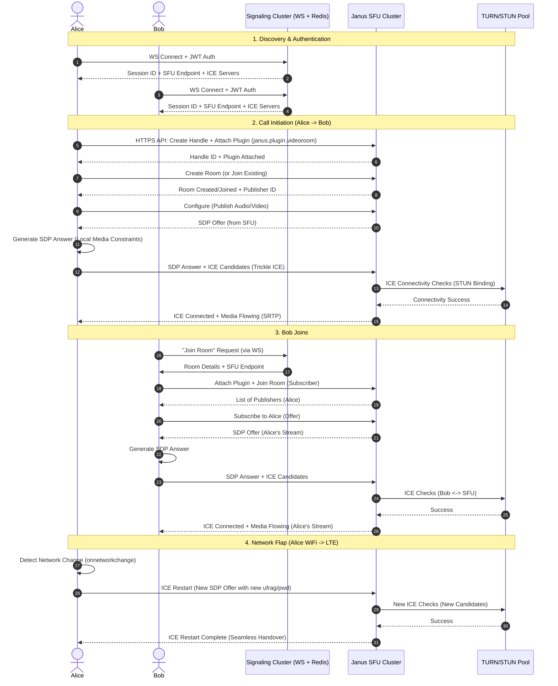

# orbitdesk-modern-workplace-operations-lab-webrtc-team-calls

## Introduction

Building real-time communication into a workplace platform sounds straightforward until you hit the reality of corporate networks: symmetric NATs, aggressive UDP throttling, and the dreaded "it works on my machine" syndrome. When we started the Orbitdesk Modern Workplace Operations Lab, the requirement wasn't just "video calls." It was deterministic, low-latency media delivery across heterogeneous networks without requiring VPN hairpinning or proprietary plugins.

We chose WebRTC because it's the only standards-based stack that handles the nightmare of NAT traversal, congestion control, and media encryption natively in the browser. But the spec is only half the battle. The other half is the signaling orchestration, the media server topology (SFU vs. MCU), and the operational tooling to debug a frozen frame at 3 AM. This article dissects the architecture we shipped for Orbitdesk's team calling feature—specifically the signaling state machine, the SFU integration, and the client-side resilience patterns that keep calls stable when the network isn't.

## Why This Matters

Most engineering teams reach for a CPaaS provider (Twilio, Agora, Vonage) and call it a day. That works until you need:
1.  **Data sovereignty**: Media cannot leave specific geographic boundaries (GDPR, HIPAA, FedRAMP).
2.  **Custom media pipelines**: Real-time transcription, sentiment analysis, or background blur running on your own GPUs.
3.  **Cost predictability at scale**: Per-minute pricing models explode when you have 500 concurrent internal standups daily.

Rolling your own WebRTC infrastructure gives you control over the media plane, but it shifts the operational burden to you. You become responsible for TURN server capacity planning, ICE candidate gathering latency, and the signaling reliability that keeps the session alive when a laptop lid closes. Orbitdesk's lab was built to solve exactly this: a reference architecture for *self-hosted, observable, production-grade WebRTC* that doesn't require a PhD in VoIP to maintain.

## How It Works

The core insight is separating **signaling** (control plane) from **media** (data plane) completely. Our signaling layer is a stateless WebSocket cluster backed by Redis for session affinity. The media layer is a fleet of Janus SFU (Selective Forwarding Unit) instances. Clients never talk directly to each other; they negotiate via the signaling server and push/pull media to/from the SFU.

This topology gives us:
*   **Horizontal scaling**: Add SFU nodes behind a load balancer; signaling stays stateless.
*   **Observability**: Every SDP offer/answer and ICE state transition is logged as a structured event.
*   **Resilience**: Client reconnection logic reuses the existing media session on the SFU via ICE restart.



**Step-by-step breakdown:**

1.  **Authentication & Discovery**: Clients authenticate via short-lived JWTs. The signaling gateway returns a curated list of ICE servers (STUN + TURN) specific to the client's geo-region, plus the SFU endpoint URL. This avoids hardcoding TURN credentials in the frontend bundle.
2.  **Publisher Setup**: The initiator (Alice) creates a Janus handle, attaches the `videoroom` plugin, and publishes her media. The SFU generates an SDP *Offer* (reverse of typical P2P), the client answers. We use **Trickle ICE** aggressively—candidates are sent as they are gathered, reducing setup latency by ~300-500ms vs. vanilla ICE.
3.  **Subscriber Join**: Bob joins the same room ID. The SFU sends him the list of active publishers. He sends a `subscribe` request for Alice's feed. The SFU forwards Alice's existing RTP streams (no transcoding) to Bob after re-encrypting with Bob's DTLS keys.
4.  **Network Migration**: When Alice switches WiFi to LTE, the browser fires `onnetworkchange`. We trigger an **ICE Restart** by creating a new Offer with fresh `ice-ufrag`/`ice-pwd` but the *same* media `mid` lines. The SFU treats this as a path migration, not a new stream. Zero media gap if TURN is reachable.

## Core Concepts

### 1. The Signaling State Machine
We model the call lifecycle as a strict state machine on the client. This prevents race conditions like "user clicks 'mute' before `onnégotiationneeded` fires."

```typescript
// client/src/signaling/CallStateMachine.ts
export enum CallState {
  IDLE = 'IDLE',
  CONNECTING_SIGNALING = 'CONNECTING_SIGNALING',
  NEGOTIATING = 'NEGOTIATING',
  ICE_GATHERING = 'ICE_GATHERING',
  CONNECTED = 'CONNECTED',
  RECONNECTING = 'RECONNECTING', // ICE Restart in progress
  DISCONNECTING = 'DISCONNECTING',
  FAILED = 'FAILED'
}

interface StateTransition {
  from: CallState | CallState[];
  to: CallState;
  action?: () => Promise<void>;
  guard?: () => boolean;
}

const transitions: StateTransition[] = [
  { from: CallState.IDLE, to: CallState.CONNECTING_SIGNALING },
  { from: CallState.CONNECTING_SIGNALING, to: CallState.NEGOTIATING, guard: () => !!sfuHandle },
  { from: CallState.NEGOTIATING, to: CallState.ICE_GATHERING },
  { from: CallState.ICE_GATHERING, to: CallState.CONNECTED, guard: () => iceConnectionState === 'connected' },
  { from: [CallState.CONNECTED, CallState.RECONNECTING], to: CallState.RECONNECTING, action: triggerIceRestart },
  { from: CallState.RECONNECTING, to: CallState.CONNECTED, guard: () => iceConnectionState === 'connected' },
  { from: '*', to: CallState.FAILED, action: cleanup },
];

export class CallStateMachine {
  private state: CallState = CallState.IDLE;
  private listeners: Map<CallState, Set<() => void>> = new Map();

  transition(to: CallState): boolean {
    const valid = transitions.some(t => 
      (t.from === '*' || t.from === this.state || (Array.isArray(t.from) && t.from.includes(this.state))) 
      && t.to === to
      && (!t.guard || t.guard())
    );
    if (!valid) {
      console.warn(`[CallFSM] Invalid transition: ${this.state} -> ${to}`);
      return false;
    }
    const prev = this.state;
    this.state = to;
    // Fire exit/enter hooks
    this.emit(prev, 'exit');
    this.emit(to, 'enter');
    return true;
  }
  // ... listener management omitted for brevity
}
```

### 2. SFU Topology: Janus Videoroom
We use Janus because it's battle-tested, plugin-based, and exposes a sane HTTP/WebSocket API. The `videoroom` plugin implements an SFU: it receives one RTP stream per publisher and forwards it to every subscriber. Crucially, it **does not transcode**. This saves massive CPU but requires clients to handle simulcast (sending multiple spatial layers) so the SFU can downswitch subscribers on poor bandwidth.

### 3. TURN as a First-Class Citizen
STUN works for ~85% of connections. The remaining 15% (symmetric NAT, enterprise firewalls blocking UDP) require TURN. We deploy **coturn** on dedicated `c5.xlarge` instances (AWS) / `n2-standard-4` (GCP) in every region we operate.
*   **Credential Rotation**: TURN credentials are short-lived (TTL 1 hour), generated by the signaling server on WS connect using a shared secret with coturn (`static-auth-secret`).
*   **TCP/TLS Fallback**: We enable TURN over TLS (port 443) to bypass deep packet inspection that blocks UDP/3478.

## Examples & Code Walkthrough

### 1. Signaling Gateway (Node.js/TypeScript)
Stateless WebSocket server. Handles auth, room routing, and SFU proxy for API calls that require shared secrets (like creating rooms).

```typescript
// signaling-gateway/src/server.ts
import { WebSocketServer, WebSocket } from 'ws';
import { createClient, RedisClientType } from 'redis';
import jwt from 'jsonwebtoken';
import { v4 as uuidv4 } from 'uuid';

const redis: RedisClientType = createClient({ url: process.env.REDIS_URL });
await redis.connect();

const wss = new WebSocketServer({ port: 8080, path: '/signal' });

// In-memory map: userId -> { ws, sfuEndpoint, rooms: Set<roomId> }
const sessions = new Map<string, SessionData>();

interface SessionData {
  ws: WebSocket;
  userId: string;
  tenantId: string;
  sfuEndpoint: string; // Assigned by LB logic
  iceServers: RTCIceServer[];
}

wss.on('connection', async (ws, req) => {
  const token = new URL(req.url!, `http://${req.headers.host}`).searchParams.get('token');
  if (!token) return ws.close(4001, 'Missing token');

  let payload: JwtPayload;
  try {
    payload = jwt.verify(token, process.env.JWT_SECRET!) as JwtPayload;
  } catch (e) {
    return ws.close(4002, 'Invalid token');
  }

  const userId = payload.sub;
  const tenantId = payload.tenant_id;

  // Assign SFU endpoint (simple round-robin for lab; use consistent hashing in prod)
  const sfuEndpoints = (process.env.SFU_ENDPOINTS || '').split(',');
  const sfuEndpoint = sfuEndpoints[Math.floor(Math.random() * sfuEndpoints.length)];

  // Generate TURN credentials (coturn shared secret auth)
  const turnCreds = generateTurnCredentials(tenantId);
  const iceServers: RTCIceServer[] = [
    { urls: 'stun:stun.l.google.com:19302' },
    { urls: `turn:${turnCreds.host}:3478?transport=udp`, username: turnCreds.username, credential: turnCreds.password },
    { urls: `turns:${turnCreds.host}:443?transport=tcp`, username: turnCreds.username, credential: turnCreds.password }, // TLS fallback
  ];

  const session: SessionData = { ws, userId, tenantId, sfuEndpoint, iceServers };
  sessions.set(userId, session);

  ws.send(JSON.stringify({ type: 'WELCOME', payload: { sessionId: userId, sfuEndpoint, iceServers } }));

  ws.on('message', async (data) => {
    try {
      const msg = JSON.parse(data.toString());
      await routeMessage(userId, msg);
    } catch (e) {
      console.error('[Signal] Parse error', e);
    }
  });

  ws.on('close', () => {
    sessions.delete(userId);
    // Publish presence leave event to Redis Pub/Sub for other nodes
    redis.publish(`presence:${tenantId}`, JSON.stringify({ type: 'LEAVE', userId }));
  });
});

async function routeMessage(senderId: string, msg: any) {
  const senderSession = sessions.get(senderId);
  if (!senderSession) return;

  switch (msg.type) {
    case 'JOIN_ROOM': {
      const { roomId } = msg.payload;
      // 1. Verify room exists/permissions via Redis (source of truth for room metadata)
      const roomKey = `room:${senderSession.tenantId}:${roomId}`;
      const roomExists = await redis.exists(roomKey);
      if (!roomExists) return senderSession.ws.send(JSON.stringify({ type: 'ERROR', payload: { code: 'ROOM_NOT_FOUND' } }));

      // 2. Add user to room set
      await redis.sAdd(`${roomKey}:participants`, senderId);
      
      // 3. Notify others in room (via Redis Pub/Sub for multi-node scaling)
      await redis.publish(`room:${roomId}`, JSON.stringify({ type: 'USER_JOINED', payload: { userId: senderId, roomId } }));

      // 4. Respond with current participants
      const participants = await redis.sMembers(`${roomKey}:participants`);
      senderSession.ws.send(JSON.stringify({ 
        type: 'ROOM_STATE', 
        payload: { roomId, participants: participants.filter(p => p !== senderId) } 
      }));
      break;
    }
    case 'SIGNAL': { // Proxy SDP/ICE to target user
      const { targetId, payload: signalPayload } = msg.payload;
      const targetSession = sessions.get(targetId);
      if (targetSession?.ws.readyState === WebSocket.OPEN) {
        targetSession.ws.send(JSON.stringify({ 
          type: 'SIGNAL', 
          payload: { from: senderId, ...signalPayload } 
        }));
      }
      break;
    }
    // ... HANDLE_LEAVE, M
