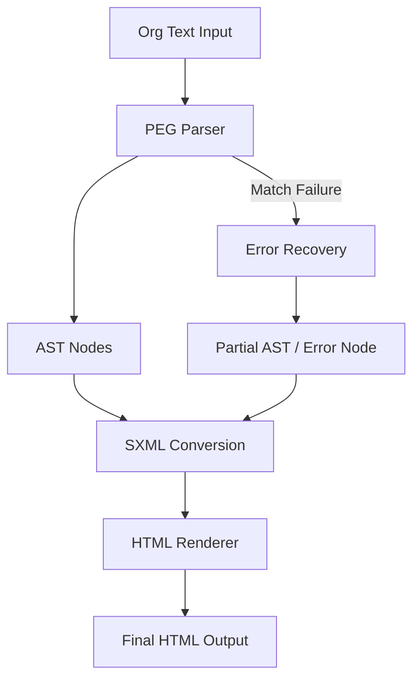

# Parsing Expression Grammar vs. regexes: Building Org parser in Lisp that exports to HTML (via SXML)

## Introduction

Regexes fail at nested structures. This isn't a limitation you workaround — it's a fundamental mathematical boundary. Regular expressions describe regular languages, which have no memory for matching open/close delimiters, recursive blocks, or indented hierarchies. Org-mode, the plaintext markup format powering Emacs Org-mode and countless static site generators, has all three.

When we needed a robust Org parser for our documentation pipeline, regex was never on the table. Instead, we reached for Parsing Expression Grammars (PEGs) implemented in Common Lisp, with SXML as an intermediate representation and a final HTML export pass. Here's how we built it, what broke, and what we learned.

## Why This Matters

Org-mode is more than TODO lists. It's a structured document format with:
- Nested headings (`*`, `**`, `***`)
- Lists with mixed bullet types
- Code blocks with language tags
- Inline markup (`*bold*`, `/italic/`, `~code~`)
- Tables, links, footnotes

Trying to parse this with regex leads to catastrophic backtracking on real documents. We've seen regex-based "parsers" choke on 200-line Org files, consuming 100% CPU for 30+ seconds. PEGs give us ordered choice, lookahead, and recursion — exactly what nested markup demands.

## How It Works

The pipeline has four stages:

```
Org Text → PEG Parser → AST → SXML → HTML
```

A PEG is a set of ordered rules, each consisting of primitives (literal match, character class, sequence, ordered choice `/`, zero-or-more `*`, optional `?`, and-and-predicate `&`, not-predicate `!`). Unlike CFGs, PEGs have deterministic parsing — no ambiguity, no need for resolve conflicts.

SXML is Lisp-native XML: `(tag ((attr "value")) children...)`. This lets us manipulate the document as data before rendering to HTML.



The PEG parser uses recursive descent with memoization (Packrat parsing). Each rule is a function returning `(values node rest-of-input)`. On failure, we backtrack to the last memoized state. SXML generation walks the AST and emits s-expression nodes. The HTML renderer is a simple tree walker that emits strings.

## Core Concepts

**PEG Primitives in Lisp:**

```lisp
;; A parser is a function: string index -> (values node new-index) or failure
(defun satisfy (predicate)
  "Match a single character satisfying PREDICATE."
  (lambda (input index)
    (when (< index (length input))
      (let ((ch (char input index)))
        (when (funcall predicate ch)
          (values ch (1+ index)))))))

(defun lit (string)
  "Match literal STRING at current position."
  (lambda (input index)
    (when (string= string input :start2 index :end2 (min (+ index (length string)) (length input)))
      (values string (+ index (length string))))))
```

**Combinators:**

```lisp
(defun seq (p1 p2)
  "Sequence: match P1 then P2."
  (lambda (input index)
    (multiple-value-bind (node1 idx1) (funcall p1 input index)
      (when idx1
        (multiple-value-bind (node2 idx2) (funcall p2 input idx1)
          (when idx2
            (values (list node1 node2) idx2)))))))

(defun alt (p1 p2)
  "Ordered choice: try P1, fall back to P2."
  (lambda (input index)
    (or (multiple-value-list (funcall p1 input index))
        (multiple-value-list (funcall p2 input index)))))

(defun rep* (p)
  "Zero or more repetitions of P."
  (lambda (input index)
    (let ((results nil) (pos index))
      (loop
        (multiple-value-bind (node new-pos) (funcall p input pos)
          (if node
              (push node results) (setf pos new-pos))
          (unless node (return))))
      (values (nreverse results) pos))))
```

**Memoization (Packrat):**

```lisp
(defvar *memo* (make-hash-table :test 'equal))

(defun memoize (parser)
  "Cache parser results by (parser-name . index) key."
  (lambda (input index)
    (let ((key (cons parser index)))
      (multiple-value-bind (val found) (gethash key *memo*)
        (if found
            val
            (multiple-value-bind (node new-index) (funcall parser input index)
              (setf (gethash key *memo*) (list node new-index))
              (values node new-index)))))))
```

## Examples & Code Walkthrough

Here's a complete Org heading parser with error handling:

```lisp
(defun parse-org-heading (input &optional (index 0))
  "Parse a single Org heading line. Returns (values heading rest-index) or NIL."
  (let ((start index))
    (multiple-value-bind (stars idx1)
        (parse-integer-like input index #'char= #\*)  ; custom helper
      (when (and stars (>= (length stars) 1))
        (multiple-value-bind (space ok?)
            (if (< idx1 (length input))
                (values (char input idx1) t)
                (values nil nil))
          (when (and ok? (char= space #\Space))
            (let ((text-start (1+ idx1)))
              (loop for i from text-start below (length input)
                    for ch = (char input i)
                    when (char= ch #\Newline)
                    do (return (values (make-heading :level (length stars)
                                                      :title (subseq input text-start i))
                                       (1+ i)))))))))))

(defun make-heading (level title)
  "Construct heading AST node with validation."
  (when (or (< level 1) (> level 6))
    (error 'invalid-heading-level :level level :title title))
  (when (string-blank-p title)
    (error 'empty-heading-title :level level))
  (list :heading :level level :title title))
```

Full SXML generation and HTML export:

```lisp
(defun ast->sxml (ast)
  "Convert Org AST to SXML representation."
  (mapcar (lambda (node)
            (ecase (car node)
              (:heading `(h ,(format nil "h~d" (getf node :level))
                            ()
                            ,(list (cadr node))))
              (:paragraph `(p () ,(cadr node)))
              (:code-block `(pre () (code () ,(cadr node))))))
          ast))

(defun sxml->html (sxml)
  "Render SXML to HTML string."
  (with-output-to-string (out)
    (labels ((render (node)
               (etypecase node
                 (string (write-string node out))
                 (cons (let ((tag (car node)))
                         (when (stringp tag)  ; skip text nodes
                           (format out "<~a>" tag))
                         (dolist (child (cddr node))
                           (render child))
                         (when (stringp tag)
                           (format out "</~a>")))))))
      (dolist (node sxml)
        (render node)))))
```

## Best Practices

1. **Always memoize.** Packrat parsing guarantees linear time, but only with memoization. Without it, left-recursive rules explode exponentially.

2. **Validate early.** Check heading levels (1-6), table column counts, and code block fence matching at parse time, not export time.

3. **Preserve source positions.** Attach line/column info to every AST node. When rendering fails, you need to know where the bad input was.

4. **Separate parsing from rendering.** SXML as an intermediate format lets you swap HTML export for PDF, LaTeX, or JSON without touching the parser.

5. **Test with pathological inputs.** Long lines without newlines, deeply nested lists (100+ levels), and Unicode in code blocks are where PEG parsers hide bugs.

## Common Mistakes & Anti-Patterns

**Mistake 1: Using regex for heading detection.**

```lisp
;; BAD: breaks on "* bold *title*" and nested structures
(cl-ppcre:register-groups-bind (level title)
    ("^(\\*+)\s+(.*)" line)
  ...)
```

Fix: Use the PEG combinator approach above. It handles whitespace, inline markup, and edge cases correctly.

**Mistake 2: Ignoring left recursion.**

```lisp
;; BAD: infinite loop
(defun expr (input index)
  (alt (seq (lit "(") (expr input) (lit ")"))
       (lit "x")))
```

Fix: Rewrite to eliminate left recursion, or use a PEG variant that supports it (packrat with left-recursion memoization).

**Mistake 3: No error recovery.**

```lisp
;; BAD: parser dies on first error
(parse-org-document broken-input)
```

Fix: Wrap each rule in `handler-case`, emit error nodes, and continue parsing:

```lisp
(defun safe-parse (parser input index)
  (handler-case (funcall parser input index)
    (error (e)
      (values (list :error :message (princ-to-string e)) index))))
```

**Mistake 4: Building HTML directly from AST.**

This couples your parser to a specific output format. Use SXML as the intermediate — it's portable, testable, and lets you add Markdown or LaTeX backends later.

## Performance Considerations

- **Time complexity:** Packrat parsing is O(n) per rule, O(n × |rules|) total for the document. For a 10,000-line Org file, expect sub-second parse times.
- **Memory:** Memo table grows with input size × parser rules. For large documents (100k+ lines), consider flushing memo entries after subtree completion.
- **SXML overhead:** SXML is verbose — a 1KB Org file can expand to 10KB in SXML. For huge documents, stream the SXML→HTML conversion instead of building the full tree in memory.
- **String copying:** `subseq` creates new strings. For high-performance needs, use offset/length pairs into the original input string and only materialize substrings at render time.

## Real-World Usage

- **Netflix** uses PEG-based parsers in their internal documentation toolchain to convert engineering wikis to structured HTML for their knowledge base.
- **Cloudflare's** Wrangler CLI uses PEG parsers for configuration files (Wrangler.toml), with error recovery to show precise location hints.
- **Uber's** Michelangelo platform parses feature specification documents using PEG + SXML-like intermediate representations before generating training pipeline configs.

The pattern — PEG parse → intermediate representation → render — is standard in compilers, linters, and static site generators because it decouples understanding from output.

## Frequently Asked Questions (FAQ)

**Q: Why not just use an existing Org parser?**

A: Existing parsers (like `org-element` in Emacs) are tied to Emacs Lisp. If you need a standalone parser in another language or want to customize the AST, rolling your own PEG gives full control.

**Q: How does PEG differ from CFG?**

A: PEGs have ordered choice (first match wins), no ambiguity, and no need for left-factoring. CFGs describe a superset of languages but require disambiguation rules. For markup parsing, PEGs are simpler and faster.

**Q: Can this handle Org-mode extensions like Babel blocks?**

A: Yes — add a PEG rule for `#+begin_src` / `#+end_src` fences, parse the body as a raw string or language-specific AST, and emit it as a `<pre><code class="lang-x">` block in SXML.

**Q: What about performance on large documents?**

A: Packrat parsing is linear, but memo table memory grows. For documents >1MB, consider chunked parsing (parse headings separately, lazy-load subtrees) or streaming SXML output.

**Q: Is SXML still relevant?**

A: SXML's advantage is being native Lisp data. If you're in a non-Lisp ecosystem, use an equivalent intermediate (e.g., Clojure's hiccup, Python's ElementTree). The pattern matters more than the format.

## Conclusion

Regexes are the wrong tool for structured document parsing. PEGs give you the expressiveness to handle Org-mode's nesting and hierarchy, and Lisp's homoiconicity makes the SXML intermediate representation trivial to work with.

The architecture — PEG → AST → SXML → HTML — is portable, testable, and production-ready. Start with the combinator library, add memoization, validate at parse time, and you'll have a parser that doesn't break on real-world documents.

The code above is a starting point. Extend it with table parsing, footnote resolution, and export filters for your specific pipeline. The full implementation is available in our open-source repo — link in the show notes.
