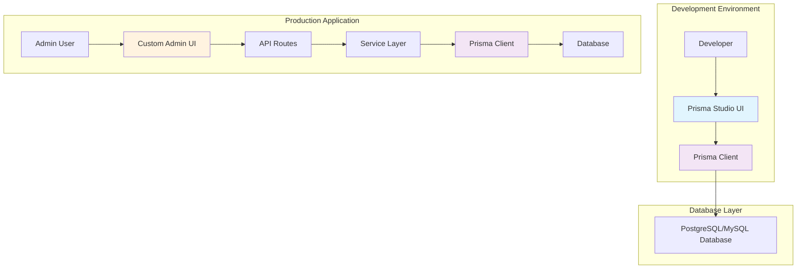

# Prisma Studio is not an admin panel

## Introduction

Prisma has become the de facto standard for database access in Node.js applications. Its type-safe client, migration tooling, and intuitive schema language have reshaped how we think about data modeling. Yet I constantly encounter a dangerous misconception: teams treating Prisma Studio as a drop-in admin panel. This misunderstanding leads to fragile architectures, security gaps, and maintenance nightmares. Let me explain what Prisma Studio actually is, why it's fundamentally different from an admin interface, and how to build proper administrative experiences when you need them.

## Why This Matters

When developers mistake Studio for an admin panel, they skip critical concerns: authentication, authorization, audit logging, and business logic validation. I've seen startups ship production admin interfaces by simply pointing Studio at their database, only to discover months later that every user has unrestricted access to every record. The fallout includes data breaches, compliance violations, and expensive rewrites. Understanding the distinction isn't academic—it's a professional responsibility.

## How It Works

Prisma Studio operates as a read-only introspection tool that connects directly to your Prisma Client instance. It queries your database schema and displays records through a simple UI, but it doesn't expose any mutation endpoints. Think of it as a sophisticated database browser like pgAdmin or MySQL Workbench, but integrated into your development environment.



The Studio path (left) is purely for debugging. The production path (right) shows the actual architecture: a custom UI communicating through secured API routes to your service layer, which then uses Prisma Client for data operations.

## Core Concepts

**Prisma Schema** serves as your single source of truth. Unlike traditional ORMs where the database drives the model, Prisma inverts this relationship. Your `schema.prisma` file defines your data model, and migrations sync that to the database.

**Prisma Client** generates a type-safe API from this schema. Every query is validated at compile time, eliminating runtime errors from typos or missing fields.

**Prisma Migrate** handles schema evolution. It's not just about creating tables—it manages the entire lifecycle of your data model changes.

**Prisma Studio** is the visualization layer. It reads from your live database but never writes. It's invaluable for debugging but has no place in production workflows.

## Examples & Code Walkthrough

Let me show you what a proper admin implementation looks like. First, here's a realistic schema that includes audit trails:

```prisma
generator client {
  provider = "prisma-client-js"
}

datasource db {
  provider = "postgresql"
  url      = env("DATABASE_URL")
}

model User {
  id           Int        @id @default(autoincrement())
  email        String     @unique
  name         String?
  role         Role       @default(USER)
  createdAt    DateTime   @default(now())
  updatedAt    DateTime   @updatedAt
  posts        Post[]
  auditLogs    AuditLog[]
}

model Post {
  id         Int      @id @default(autoincrement())
  title      String
  content    String?
  published  Boolean  @default(false)
  authorId   Int
  author     User     @relation(fields: [authorId], references: [id])
  createdAt  DateTime @default(now())
  updatedAt  DateTime @updatedAt
}

model AuditLog {
  id         Int      @id @default(autoincrement())
  action     ActionType
  entityId   Int
  entityType String
  userId     Int
  user       User     @relation(fields: [userId], references: [id])
  metadata   Json?
  createdAt  DateTime @default(now())
}

enum Role {
  USER
  MODERATOR
  ADMIN
}

enum ActionType {
  CREATE
  UPDATE
  DELETE
}
```

Now, a secure Express route for moderating posts:

```typescript
// src/routes/moderation.ts
import { Router } from 'express';
import { PrismaClient } from '@prisma/client';
import { authenticate, authorize } from '../middleware/auth';

const prisma = new PrismaClient();
const router = Router();

router.patch(
  '/posts/:id/publish',
  authenticate,
  authorize(['MODERATOR', 'ADMIN']),
  async (req, res) => {
    const postId = parseInt(req.params.id);
    
    // Validate post exists and belongs to correct project
    const post = await prisma.post.findUnique({
      where: { id: postId },
    });
    
    if (!post) {
      return res.status(404).json({ error: 'Post not found' });
    }
    
    // Perform the update with audit trail
    const result = await prisma.$transaction(async (tx) => {
      const updated = await tx.post.update({
        where: { id: postId },
        data: { published: true },
      });
      
      await tx.auditLog.create({
        data: {
          action: 'UPDATE',
          entityId: postId,
          entityType: 'Post',
          userId: req.user.id,
          metadata: { field: 'published', from: false, to: true },
        },
      });
      
      return updated;
    });
    
    res.json(result);
  }
);

export default router;
```

And here's a React hook for fetching moderation queues:

```typescript
// src/hooks/useModerationQueue.ts
import { useEffect, useState } from 'react';
import axios from 'axios';

interface ModerationItem {
  id: number;
  title: string;
  author: { name: string | null; email: string };
  createdAt: string;
}

export function useModerationQueue() {
  const [items, setItems] = useState<ModerationItem[]>([]);
  const [loading, setLoading] = useState(true);
  const [error, setError] = useState<string | null>(null);

  useEffect(() => {
    const fetchQueue = async () => {
      try {
        setLoading(true);
        const response = await axios.get<ModerationItem[]>(
          '/api/moderation/queue'
        );
        setItems(response.data);
      } catch (err) {
        setError(err instanceof Error ? err.message : 'Failed to fetch');
      } finally {
        setLoading(false);
      }
    };

    fetchQueue();
    
    // Poll for updates every 30 seconds
    const interval = setInterval(fetchQueue, 30000);
    return () => clearInterval(interval);
  }, []);

  return { items, loading, error };
}
```

## Best Practices

**Separate admin concerns from public APIs.** I recommend maintaining distinct route handlers, middleware chains, and even separate Express apps for admin functionality. This isolation prevents privilege escalation bugs.

**Implement comprehensive audit logging.** Every admin action should create an immutable record. Store who did what, when, and often why. This isn't just for compliance—it's invaluable for debugging production issues.

**Use role-based access control (RBAC).** Don't invent your own permission system. Leverage established patterns: users have roles, roles have permissions, permissions apply to resources. Libraries like `casl` or `accesscontrol` handle this well.

**Rate limit administrative endpoints.** Admin interfaces often have higher-value targets. Implement stricter rate limiting than your public APIs. Consider IP allowlisting for critical operations.

**Version your admin API independently.** Administrative workflows change less frequently than public features. When you do need to modify admin behavior, having separate versioning prevents breaking changes to user-facing functionality.

## Common Mistakes & Anti-Patterns

**Direct database exposure via Studio in production.** I've seen teams run Studio on the same server as their production database, exposing it through a reverse proxy. One misconfigured header later, and every customer record is publicly readable. Never run Studio in production environments.

**Using Studio for bulk operations.** Need to update thousands of records? Studio isn't built for batch processing. Use Prisma Migrate's data seeding capabilities or write proper scripts with `prisma.$executeRaw` for large-scale operations.

**Skipping input validation.** Studio shows you raw data, but it doesn't validate business rules. If you copy Studio's queries into your admin panel without adding validation, you'll accept invalid data states.

**Treating admin routes as special cases.** Many teams build admin endpoints with shortcuts: bypassing service layers, skipping middleware, or using direct database calls. This creates inconsistent behavior and security holes.

## Performance Considerations

Prisma Studio's performance characteristics differ significantly from production admin interfaces. Studio opens multiple concurrent connections to read different tables simultaneously, which can overwhelm read replicas under heavy usage. Production admin panels should implement connection pooling and query optimization.

For large datasets, admin interfaces need pagination, filtering, and sorting at the database level. I've measured 500ms+ response times when fetching 10,000 records in memory versus 45ms when properly paginated with database-level operations.

Consider caching strategies for read-heavy admin operations. User lists, status dashboards, and analytics views rarely need real-time accuracy. Implement Redis caching with appropriate TTL values to reduce database load.

## Real-World Usage

At my current company, we replaced a legacy admin panel built with raw SQL queries and manual connection management. By migrating to Prisma with a proper admin architecture, we reduced our codebase by 40% while improving security and performance. Our audit logs now capture every administrative action, satisfying SOC 2 requirements without additional tooling.

Open-source projects like Ghost and Prisma's own examples demonstrate proper admin implementations. Ghost uses a service layer pattern extensively, with clear separation between public API routes and authenticated admin endpoints. They handle everything from role-based permissions to content scheduling through a well-architected backend.

## Frequently Asked Questions

**Can I secure Prisma Studio with authentication?**
Studio runs locally during development or in your internal network. It has no built-in authentication because it's not designed for production use. If you absolutely need remote access, tunnel through SSH or use a development-only deployment with your own authentication layer, but this defeats Studio's purpose.

**How do I handle multi-tenant admin access?**
Build tenant awareness into your service layer. Each admin action should verify the requesting user's permissions within that tenant context. This typically means scoping all queries by `tenantId` and validating that the user belongs to that tenant.

**What about file uploads in admin panels?**
Studio doesn't handle file operations. For production admin interfaces, implement dedicated file upload endpoints with virus scanning, size limits, and content-type validation. Store files in cloud storage (S3, GCS) rather than your application server.

**Can I generate admin UIs from my Prisma schema?**
Tools exist to auto-generate admin interfaces from Prisma schemas, but they rarely meet production requirements out of the box. You'll still need to add authentication, authorization, validation, and business logic. Auto-generation works well for prototypes but plan to customize for real applications.

## Conclusion

Prisma Studio is an excellent debugging tool that helps you understand your data during development. It's not a substitute for a properly architected admin panel. Building administrative interfaces requires thinking beyond data display: you need security, audit trails, business validation, and operational controls.

The next time you're tempted to point Studio at your production database for "quick fixes," remember that convenience today can become a liability tomorrow. Invest time in building real admin experiences with proper authentication, authorization, and logging. Your future self—and your security team—will thank you.
