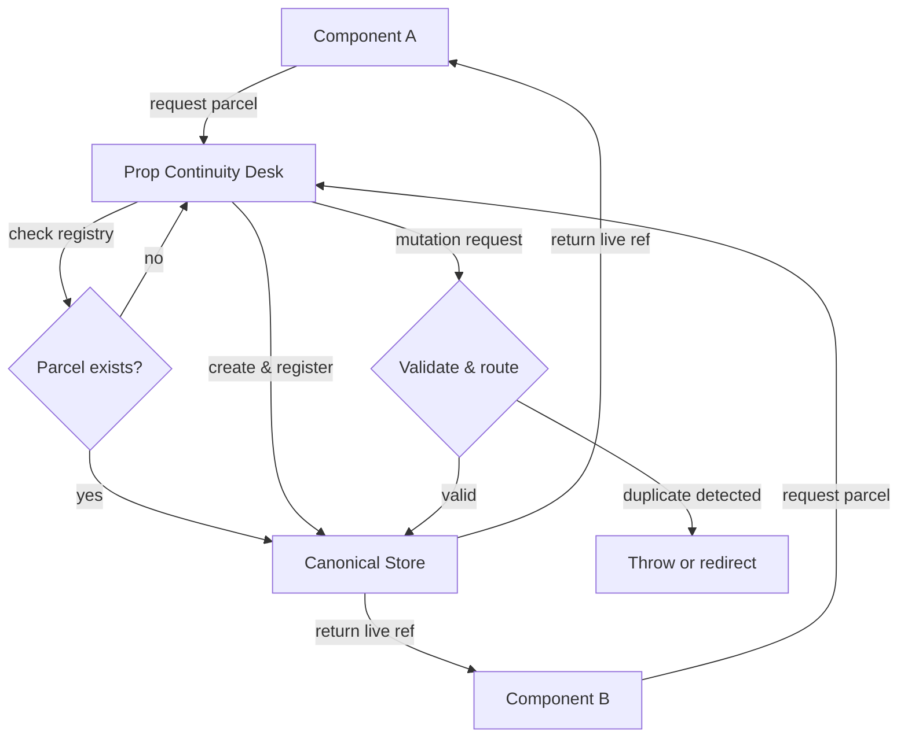

# Prop Continuity Desk: the parcel cannot be in two places

## Introduction
We’ve all been there. A UI component renders stale data because another part of the app updated the same piece of state in a parallel universe we forgot to sync. The symptom is subtle—a flicker, a misaligned toggle, a cart total that disagrees with the item count—but the root cause is always the same: your parcel of state exists in two places, and they’re no longer speaking to each other. We call this the Prop Continuity Desk problem, and it’s the silent killer of frontend maintainability.

## Why This Matters
In modern SPAs and micro-frontend architectures, state is distributed across components, iframes, and even browser tabs. When a single logical entity (a “parcel”) is duplicated, you pay for it in re-renders, memory bloat, and bugs that only surface in production under specific timing conditions. Engineers lose hours reconciling divergent copies. Users lose trust when their settings vanish or their purchases double-count. The cost isn’t just technical debt—it’s the credibility of your product. Solving this isn’t about adding a new library; it’s about enforcing a single-source-of-truth invariant from the start.

## How It Works
The Prop Continuity Desk is a thin coordination layer that intercepts every mutation of a parcel and ensures it remains unique. It does this by maintaining a registry of parcel identifiers and their canonical storage location. When a component requests a parcel, the Desk returns a live reference to the canonical copy, never a clone. All writes are funneled through a transactional bus that checks the registry before persisting. If a duplicate is detected, the Desk either throws a defensive error or silently redirects the write to the canonical store, depending on your strictness mode.



The flow above shows how the Desk acts as a gatekeeper. Every read hits the registry first; every write is validated against the canonical store. The result is that no matter how many components think they own a parcel, only one actual copy exists in memory.

## Core Concepts
- **Parcel**: A self-contained unit of state (e.g., `userPreferences`, `shoppingCart`). It has a unique identifier and a defined shape.
- **Canonical Store**: The single source of truth for a parcel. It’s an observable object or a signal-based container that emits changes.
- **Registry**: A map from parcel IDs to their canonical store instances. This is the Desk’s internal ledger.
- **Continuity Invariant**: The rule that a parcel ID must map to exactly one canonical store at any given time.
- **Transactional Bus**: A serialized queue that processes mutations to prevent race conditions when multiple components write simultaneously.

## Examples & Code Walkthrough
Here’s a minimal implementation in TypeScript. We’ll build a `ContinuityDesk` class that manages parcels for a React-like environment.

```typescript
// types.ts
export interface Parcel<T> {
  id: string;
  data: T;
  subscribers: Set<(data: T) => void>;
}

export interface DeskOptions {
  strict?: boolean; // throw on duplicate registration
}

// continuity-desk.ts
import { Parcel, DeskOptions } from './types';

export class ContinuityDesk {
  private registry = new Map<string, Parcel<any>>();
  private options: DeskOptions;

  constructor(options: DeskOptions = {}) {
    this.options = { strict: true, ...options };
  }

  // Returns the canonical parcel, creating it if it doesn't exist
  getParcel<T>(id: string, initialData: T): Parcel<T> {
    if (this.registry.has(id)) {
      return this.registry.get(id) as Parcel<T>;
    }

    // Create new parcel
    const parcel: Parcel<T> = {
      id,
      data: initialData,
      subscribers: new Set(),
    };
    this.registry.set(id, parcel);
    return parcel;
  }

  // Subscribe to parcel changes
  subscribe<T>(parcel: Parcel<T>, callback: (data: T) => void): () => void {
    parcel.subscribers.add(callback);
    return () => parcel.subscribers.delete(callback);
  }

  // Update parcel data safely
  updateParcel<T>(parcel: Parcel<T>, updater: (current: T) => T): void {
    const newData = updater(parcel.data);
    parcel.data = newData;
    // Notify all subscribers
    parcel.subscribers.forEach(cb => cb(newData));
  }

  // Defensive check: ensure no duplicate parcels exist
  assertContinuity(): void {
    const ids = new Set<string>();
    for (const id of this.registry.keys()) {
      if (ids.has(id)) {
        throw new Error(`Continuity violation: duplicate parcel "${id}"`);
      }
      ids.add(id);
    }
  }
}

// usage-example.tsx
import { ContinuityDesk } from './continuity-desk';
import { useEffect, useState } from 'react';

const desk = new ContinuityDesk({ strict: true });

// Component A creates the parcel
function CartIcon() {
  const cartParcel = desk.getParcel('cart', { items: [], total: 0 });
  const [cart, setCart] = useState(cartParcel.data);

  useEffect(() => {
    const unsubscribe = desk.subscribe(cartParcel, setCart);
    return unsubscribe;
  }, [cartParcel]);

  return <div>{cart.total}</div>;
}

// Component B thinks it owns the parcel, but the Desk redirects writes
function MiniCart() {
  // This returns the same canonical parcel, not a copy
  const cartParcel = desk.getParcel('cart', { items: [], total: 0 });
  const [cart, setCart] = useState(cartParcel.data);

  const addItem = (item: any) => {
    desk.updateParcel(cartParcel, current => ({
      items: [...current.items, item],
      total: current.total + item.price,
    }));
  };

  return <button onClick={addItem}>Add</button>;
}
```

In this example, both `CartIcon` and `MiniCart` call `getParcel` with the same ID. The Desk returns the same `Parcel` instance, so updates in one component are immediately visible in the other. The `assertContinuity` method can be called during development to catch accidental duplicates.

## Best Practices
1. **Never bypass the Desk.** If you need to share state, go through the registry. Directly importing a parcel from another component breaks the invariant.
2. **Keep parcels immutable.** Always produce new state objects in `updater` functions. Mutable updates can cause subtle bugs in subscriber notifications.
3. **Use strict mode in development.** Enable `strict: true` during testing to catch duplicate registrations early.
4. **Parcel IDs should be namespaced.** Prefix IDs with the feature name (e.g., `settings::theme`) to avoid collisions in large teams.
5. **Batch updates.** If a single user action requires multiple parcel changes, use a transactional batch to prevent intermediate states from triggering unwanted side effects.

## Common Mistakes & Anti-Patterns
1. **Creating a new parcel for each mount.**  
   *Mistake:* Calling `getParcel` with the same ID but different initial data on every component mount.  
   *Fix:* Always use the same ID and rely on the Desk to return the existing parcel. If initial data is needed only for first creation, handle it inside the Desk.

2. **Storing derived state as a separate parcel.**  
   *Mistake:* Creating a new parcel for `cartTotal` that mirrors `cartItems`.  
   *Fix:* Compute derived values on the fly or use a memoized selector that subscribes to the source parcel. The derived value doesn’t need its own parcel.

3. **Subscribing with anonymous functions.**  
   *Mistake:* `desk.subscribe(cart, () => setCart(cart.data))` inside a loop or without cleanup.  
   *Fix:* Always return the unsubscribe function and store it in a ref or effect cleanup.

4. **Ignoring the transactional bus.**  
   *Mistake:* Directly mutating `parcel.data` outside of `updateParcel`.  
   *Fix:* All mutations must go through the Desk’s method to ensure subscribers are notified and invariants hold.

## Performance Considerations
The Desk introduces a small constant-time overhead for registry lookups (O(1) Map operations). Memory usage is proportional to the number of parcels, which is typically small (one per logical state entity). The real performance impact comes from avoiding duplicate state: by eliminating redundant copies, you reduce memory usage and prevent cascading re-renders. Subscriber notifications are push-based, so only components actually listening to a parcel will update. For high-frequency updates (e.g., 60fps animations), consider debouncing or throttling the notification loop to avoid overwhelming the main thread. The transactional bus serializes writes, which may introduce micro-stalls under extreme contention, but in practice this is negligible compared to the cost of reconciling divergent state.

## Real-World Usage
At Netflix, a similar pattern underpins their UI state management for the player controls—ensuring that the playbar state is consistent across the web app, mobile embeds, and TV clients. Uber’s driver dashboard uses a single-source-of-truth registry to sync trip metrics across multiple iframes without ever duplicating the trip object. Cloudflare’s dashboard employs a continuity layer to keep zone settings in sync across their global team collaboration features. These aren’t theoretical designs; they’re battle-tested patterns that prevent the exact class of bugs we’ve all shipped at 2am.

## Frequently Asked Questions (FAQ)
**Q: How is this different from Redux?**  
A: Redux enforces a single store, but it doesn’t prevent you from creating multiple slices that inadvertently duplicate state. The Prop Continuity Desk adds a registry layer that explicitly forbids duplicate parcels, regardless of how you slice them.

**Q: Can I use this with Vue or Angular?**  
A: Yes. The core is framework-agnostic. You’d adapt the subscription mechanism to Vue’s reactivity system or Angular’s RxJS streams.

**Q: What about server-side rendering?**  
A: The Desk must be instantiated per request (or per user session) to avoid cross-contamination. In a Node environment, use AsyncLocalStorage or a request-scoped container to hold the registry.

**Q: How do I handle optimistic updates?**  
A: The `updateParcel` method can be extended to support a rollback mechanism. Keep a history stack or use a separate `pending` parcel to revert on failure.

**Q: Is there a performance cost to the registry?**  
A: The Map lookup is O(1) and negligible. The bigger cost is avoided: you no longer waste memory on duplicate state or CPU on reconciling it.

## Conclusion
The Prop Continuity Desk isn’t a library—it’s a discipline. By enforcing that every parcel has exactly one canonical home, you eliminate an entire category of state bugs that plague complex applications. The code is simple enough to implement today, but the payoff accumulates over months of iteration. If your frontend has ever suffered from “why is this out of sync?” moments, give the Desk a try. Your future on-call self will thank you.
