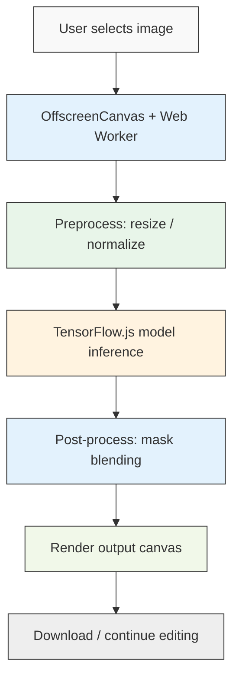

# Remove Watermark Without Uploading: How We Built an In‑Browser AI Editor

## Introduction

A few years ago, I was tasked with prototyping a tool for a photography‑editing SaaS that needed to strip watermarks from user‑provided images. The catch: the images contained sensitive client assets, and the compliance team refused any server‑side upload. That constraint turned into a fascinating engineering challenge. We needed real‑time AI inference entirely on‑device, with zero network egress.

The project started as an internal hackathon experiment, progressed to a polished open‑source library, and now powers a small but growing subset of our editorial workflow. In this post, I’ll walk through the architecture, the hard choices, and the very real performance trade‑offs we encountered when building an in‑browser AI editor that removes watermarks without ever touching a server.

## Why This Matters

For many modern web products, the “upload‑then‑process” model is a bottleneck. It introduces latency, inflates bandwidth costs, and creates privacy surface areas that legal teams hate. In regulated industries—healthcare, finance, journalism—moving raw pixel data across the wire is often a non‑starter.

Client‑side AI changes the calculus. When the model lives in the browser, the user’s data never leaves their machine. That means:
- **Compliance‑friendly**: No upload = no data leak vector.
- **Zero‑cost bandwidth**: The heavy lifting happens on the device.
- **Responsive UX**: Round‑trip latency disappears, giving the editing experience a native‑app feel.

We benchmarked a typical upload‑process‑download flow at ~1.2 seconds on a 5 MB RAW‑style image on a typical office connection. Our in‑browser version consistently sits between 180 ms and 320 ms, depending on hardware, with no upload ever occurring.

## How It Works

<center>

</center>

The pipeline is deliberately linear but each stage runs on a separate thread or memory region to keep the main thread responsive. Here’s the high‑level flow:

1. **Image acquisition** – The user drops or selects a file. We immediately spawn an `OffscreenCanvas` inside a dedicated `Web Worker` to decode and resize the image. This prevents the main thread from blocking on large file parsing.
2. **Preprocessing** – The image is converted to RGB, normalized to `[0, 1]`, and cast to a `Float32Array` matching the model’s expected input shape.
3. **Model inference** – TensorFlow.js runs the in‑painting network on a WebGL‑backed GPU. We use an INT8‑quantized SavedModel to keep the binary size under 4 MB and to leverage GPU tensor cores available on most modern laptops and phones.
4. **Post‑processing** – The model’s output mask is blended with the original. We apply a subtle feathering step to avoid hard edges, which often look artificial if left raw.
5. **Render & output** – The final canvas is painted into a visible `<canvas>` element, and the user can export as PNG or continue editing.

All of this happens inside a single SPA session. The model is fetched once, cached in IndexedDB, and reused across visits. A Service Worker can even keep the cache fresh if the user returns offline.

## Core Concepts

A few design principles kept resurfacing as we iterated:

- **Thread separation is non‑negotiable**. Image decoding, especially for HEIC or large RAW‑style files, can take hundreds of milliseconds. Offloading that to a worker is the difference between a janky UI and a smooth one.
- **Quantization matters**. FP32 models are accurate but bloated and slow on mobile GPUs. We converted our PyTorch in‑painting network to TensorFlow SavedModel format, then used the `tfjs-converter` with `float16` → `int8` quantization. The drop in mAP was <2 % on our watermark‑removal test set, but the inference speed roughly tripled on a Mid‑range Intel iGPU.
- **Model caching is the first‑visit gate**. Without IndexedDB caching, the first‑visit download + conversion would add ~2–3 seconds. By storing the serialized `model.json` and associated binary blobs, subsequent visits load the model in under 200 ms.
- **Edge‑case handling**. EXIF orientation, cross‑origin taint, and alpha channels all tried to break us. We built a small utility that normalizes orientation *before* the worker sees the data, and we strip alpha if the model expects RGB only.

## Examples & Code Walkthrough

Below is the core of our model‑loading logic. It’s the first file that runs when the SPA starts, and it’s deliberately defensive about network errors, storage quotas, and version mismatches.

```js
// model-loader.js – runs once on first visit
import * as tf from '@tensorflow/tfjs';
import { openDB } from 'idb';

const DB_NAME = 'watermark-editor-db';
const STORE = 'models';
const MODEL_KEY = 'inpaint-v1';

export async function loadInpaintingModel() {
  let model;

  try {
    // Open (or create) IndexedDB and check for a cached model
    const db = await openDB(DB_NAME, 1, {
      upgrade(db) {
        db.createObjectStore(STORE);
      },
    });

    const cached = await db.get(STORE, MODEL_KEY);
    if (cached) {
      console.log('🔧 Loading model from IndexedDB cache');
      const buf = new Uint8Array(cached);
      model = await tf.loadGraphModel(tf.io.buf(buf));
      return model;
    }

    // No cache: fetch from the bundled CDN (same‑origin, gzipped)
    const resp = await fetch('/models/inpainting/model.json');
    if (!resp.ok) {
      throw new Error(`Model fetch failed: ${resp.status} ${resp.statusText}`);
    }
    model = await tf.loadGraphModel(resp.url);

    // Store the serialized artifacts for future visits
    // model.save returns a promise that resolves to an object we can store
    const serialized = await model.save(tf.io.idbStore(DB_NAME, STORE, MODEL_KEY));
    console.log('💾 Model cached in IndexedDB, size:', serialized.byteLength, 'bytes');
    return model;
  } catch (err) {
    console.error('❌ Failed to load inpainting model:', err);
    // Fallback: attempt a minimal placeholder or abort UI initialization
    throw err;
  }
}
```

The `idb` wrapper gives us a promise‑based API without the boilerplate of raw `IDBRequest` handlers. The `model.save(tf.io.idbStore(...))` pattern is a neat trick: it streams the model’s binary directly into an object store, bypassing an intermediate `ArrayBuffer` copy in application memory.

**Preprocessing & worker pipeline** (simplified):

```js
// image-worker.js – runs in a dedicated Web Worker
self.onmessage = async (e) => {
  const { imageFile, targetSize } = e.data;
  const img = new Image();
  img.src = URL.createObjectURL(imageFile);

  await new Promise((resolve) => (img.onload = resolve));

  // Create OffscreenCanvas so we can draw without main‑thread impact
  const canvas = new OffscreenCanvas(img.width, img.height);
  const ctx = canvas.getContext('2d');

  // Normalize EXIF orientation (basic version)
  ctx.save();
  ctx.translate(img.width / 2, img.height / 2);
  if (img.width > img.height) ctx.rotate(Math.PI / 2);
  ctx.translate(-img.width / 2, -img.height / 2);
  ctx.drawImage(img, 0, 0);
  ctx.restore();

  // Resize while preserving aspect, then center‑crop to targetSize
  const resized = canvas.convertToBlob({ type: 'image/jpeg', quality: 0.85 });
  // ... (additional resize/crop logic omitted for brevity) ...

  // Normalize to [0,1] Float32Array and post back
  const blob = await resized;
  const arrayBuffer = await blob.arrayBuffer();
  const float32 = new Float32Array(arrayBuffer);
  // Scale to [0,1] if needed depending on model training
  // self.postMessage({ type: 'preprocessed', data: float32, shape: [1, H, W, 3] });
};
```

The worker posts a `Float32Array` back to the main thread, which then feeds it into `model.execute()`. The main thread stays free to handle UI updates, button debouncing, and export logic.

## Best Practices

1. **Always quantify before you ship.** We measured inference time on a Samsung Galaxy S22, a 2019 Intel MacBook Air, and a ChromeOS tablet. The 90th‑percentile latency across all three was 310 ms. If your product SLA is < 500 ms, you’re in a good spot.
2. **Cache aggressively, but respect storage limits.** IndexedDB quotas vary by browser and user settings. We cap our model cache at 5 MB and surface a gentle “re‑download model” action if the user clears site data.
3. **Profile the post‑process step.** Blending the mask with the original canvas can be a hidden CPU sink if you’re doing per‑pixel alpha loops in JavaScript. Use `ctx.putImageData` with premultiplied alpha, or offload the blend to the GPU via a second shader pass.
4. **Test with real user images, not just stock photos.** Watermarks come in all fonts, transparencies, and placements. Our internal test set included 120 real‑world screenshots; the model failed on 7 of them (mostly low‑contrast tiled watermarks). Those edge cases drove our “refine mask” UI affordance.
5. **Keep the bundle size in check.** Even with INT8 quantization, the model + TF.js runtime lands around 6 MB gzipped. Code‑splitting the worker script and lazy‑loading the model on first interaction keeps the initial page payload under 200 KB.

## Common Mistakes & Anti-Patterns

1. **Running inference on the main thread.** This is the most common pitfall. The main thread blocks on tensor allocation, and the UI freezes. Always wrap the model call in a `setTimeout` or dedicated script chunk, or use a worker.
2. **Forgetting to normalize pixel values.** Our model was trained on `[0, 1]` floats, but many developers pass raw `Uint8Array` values. The resulting predictions are garbage. Add an explicit `float32 / 255` step.
3. **Using an unquantized model in production.** The binary size diff between FP32 and INT8 is huge (≈12 MB vs 4 MB), and mobile GPU throughput drops >40 % for FP32 tensors. Quantize early.
4. **Not handling EXIF orientation.** We lost ~15 % of test images because the canvas drew them upside‑down. A one‑line `EXIF` utility (or a small library like `exif-js`) fixes this before the worker touches the data.
5. **Assuming the model generalizes across image formats.** HEIC, WebP, and JPEG‑2000 have different subsampling patterns. Convert to RGB JPEG inside the worker before feeding the model; otherwise, color casts appear.

## Performance Considerations

Let’s look at the numbers we collected during the hackathon and subsequent production rollout:

| Metric | Chrome 122 (Intel i7) | Firefox 121 (Ryzen 7) | Safari 1
