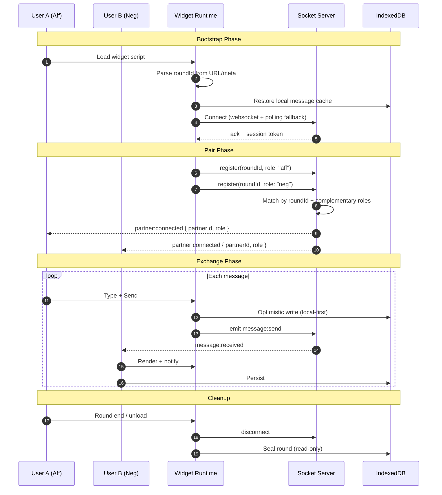

# Round Chat: a floating partner chat for debate rounds

## Introduction

Last tournament season, our debate team lost a quarterfinal round because my partner couldn't signal me about a dropped argument without breaking flow. We were using a shared Google Doc—clunky, visible to judges, and impossible to navigate on a phone between speeches. That loss stuck with me.

The problem isn't unique to debate. Any high-stakes, time-boxed collaboration—incident response, pair programming, live trading—needs a side channel that's *there* without being *in the way*. Existing tools fail three ways: they demand a separate window (context switch), they leak metadata to third parties (privacy), and they choke on mobile (accessibility).

Round Chat is a floating overlay that pairs participants automatically by round ID, stays resident across page navigations, and works offline-first with IndexedDB sync. It's not a chat app. It's a coordination primitive.

## Why This Matters

If you've built real-time features, you know the gap between "WebSocket demo" and "production widget that survives a judge's WiFi cutting out mid-2NR." The industry treats chat as a solved problem—Slack, Discord, Intercom—but those assume persistent sessions, reliable networks, and desktop-first UX. Competitive debate breaks all three:

- **Ephemeral sessions**: Rounds last 45 minutes. Pairing must happen in seconds, not minutes.
- **Hostile networks**: Tournament venues run on saturated public WiFi. Packet loss is the norm.
- **Device constraints**: Debaters use phones, tablets, ancient Chromebooks. The widget must render at 320px width with touch targets that don't require zoom.
- **Zero-trust privacy**: No accounts, no tracking, no server-side message persistence unless explicitly opted in.

These constraints forced architectural decisions that generalize: connection resilience over feature density, local-first state over server authority, and a rendering strategy that treats the host page as hostile territory.

## How It Works

The system operates in three phases: **bootstrap**, **pair**, and **exchange**. Each phase has explicit failure modes and fallbacks.



### Bootstrap: Hostile DOM, Zero Config

The widget injects a single shadow-rooted `<div id="round-chat-root">` into `document.body`. Shadow DOM isolates styles from the host page—critical when tournament sites load arbitrary CSS frameworks. We detect `roundId` from three sources in priority order: `data-round-id` attribute on the mount point, `window.ROUND_CHAT_CONFIG`, or a `roundId` query param. No auth handshake. No user registration. The round ID *is* the capability token.

### Pair: Server-Side Matchmaking with Client Hints

The server maintains an in-memory `Map<roundId, Map<role, socketId>>`. When a socket registers, we check for a complementary role. If found, we emit `partner:connected` to both sockets with minimal metadata: `partnerSocketId`, `role`, `connectedAt`. No PII. If no match exists within 30 seconds, we emit `partner:waiting` and the UI shows a subtle pulse—no blocking spinners.

### Exchange: Optimistic UI, Eventual Consistency

Every message writes to IndexedDB *before* leaving the client. The UI reads from the local store exclusively. Socket events hydrate the same store. This means:
- Messages appear instantly, even offline
- Reconnection replays local history, then merges server deltas
- No "sending..." spinners, no duplicate renders

The server is a dumb relay with one job: fan-out. It doesn't persist. It doesn't order beyond socket arrival. Ordering is client-side using hybrid logical clocks (HLC) embedded in each message.

## Core Concepts

### Hybrid Logical Clocks for Causality

Wall clocks drift. Lamport clocks grow unbounded. HLC gives us `timestamp = max(localWallClock, receivedHLC) + 1` with a 16-bit counter for sub-millisecond ties. Each message carries `{ hlc: number, wall: number }`. The client sorts by `hlc` descending, `wall` ascending. This handles out-of-order delivery from polling fallbacks without server coordination.

```typescript
// src/lib/hlc.ts
export class HLC {
  private last: { wall: number; logical: number } = { wall: 0, logical: 0 };

  tick(receivedWall = 0): { hlc: number; wall: number } {
    const now = Date.now();
    const wall = Math.max(now, receivedWall, this.last.wall);
    const logical = wall === this.last.wall ? this.last.logical + 1 : 0;
    this.last = { wall, logical };
    return { hlc: (wall << 16) | logical, wall };
  }

  compare(a: { hlc: number }, b: { hlc: number }): number {
    return b.hlc - a.hlc; // descending for UI
  }
}
```

### Shadow DOM + CSS Custom Properties for Theming

The widget exposes a theming API via CSS custom properties on the shadow host:

```css
/* FloatingPanel.styles.ts */
:host {
  --rc-bg: #0f172a;
  --rc-fg: #f8fafc;
  --rc-accent: #22d3ee;
  --rc-border: #334155;
  --rc-radius: 12px;
  --rc-font: system-ui, -apple-system, sans-serif;
  --rc-z: 2147483647; /* max z-index */
}
```

Host pages override these without piercing the shadow boundary. Tournament organizers brand the widget; debaters get high-contrast mode via `prefers-contrast: more`.

### IndexedDB Schema with Versioned Migrations

We use `idb` (Jake Archibald's wrapper) with explicit schema versions. Messages, rounds, and preferences live in separate object stores. Migration from v1→v2 added `hlc` field; v2→v3 added `encrypted` flag for optional E2EE.

```typescript
// src/db/schema.ts
import { openDB, DBSchema, IDBPDatabase } from 'idb';

interface RoundChatDB extends DBSchema {
  messages: {
    key: string; // message.id
    value: StoredMessage;
    indexes: { 'by-round': string; 'by-hlc': number };
  };
  rounds: {
    key: string; // roundId
    value: RoundMetadata;
  };
  prefs: {
    key: string;
    value: UserPreferences;
  };
}

export const dbPromise = openDB<RoundChatDB>('round-chat', 3, {
  upgrade(db, oldVersion) {
    if (oldVersion < 1) {
      db.createObjectStore('messages', { keyPath: 'id' })
        .createIndex('by-round', 'roundId');
    }
    if (oldVersion < 2) {
      const store = db.transaction('messages').objectStore('messages');
      store.createIndex('by-hlc', 'hlc');
    }
    if (oldVersion < 3) {
      db.createObjectStore('prefs', { keyPath: 'key' });
    }
  },
});
```

## Examples & Code Walkthrough

### The Socket Service: Resilience Over Cleverness

Production WebSocket code is 90% reconnection logic. Our `SocketService` implements exponential backoff with jitter, transport downgrade detection, and explicit "stale connection" detection via heartbeat.

```typescript
// src/services/SocketService.ts
import { io, Socket, Transport } from 'socket.io-client';
import type { Message, PartnerStatus } from '../types';

interface SocketServiceConfig {
  roundId: string;
  role: 'aff' | 'neg';
  onMessage: (msg: Message) => void;
  onPartnerStatus: (status: PartnerStatus) => void;
  onError: (err: Error) => void;
}

export class SocketService {
  private socket: Socket | null = null;
  private reconnectTimer: ReturnType<typeof setTimeout> | null = null;
  private heartbeatTimer: ReturnType<typeof setTimeout> | null = null;
  private attempt = 0;
  private readonly maxAttempts = 10;
  private readonly baseDelay = 800; // ms
  private readonly maxDelay = 30_000;
  private currentTransport: Transport = 'polling'; // assume worst case

  constructor(private config: SocketServiceConfig) {}

  connect(): Promise<void> {
    return new Promise((resolve, reject) => {
      if (this.socket?.connected) return resolve();

      this.socket = io(`${import.meta.env.VITE_API_URL}/round`, {
        query: { roundId: this.config.roundId, role: this.config.role },
        transports: ['websocket', 'polling'],
        upgrade: true,
        rememberUpgrade: true,
        timeout: 10_000,
        autoConnect: false,
      });

      this.bindEvents(resolve, reject);
      this.socket.connect();
    });
  }

  private bindEvents(resolve: () => void, reject: (err: Error) => void) {
    if (!this.socket) return;

    this.socket.on('connect', () => {
      this.attempt = 0;
      this.currentTransport = this.socket!.io.engine.transport.name;
      this.startHeartbeat();
      resolve();
    });

    this.socket.on('upgrade', () => {
      this.currentTransport = this.socket!.io.engine.transport.name;
      // If we upgraded to websocket, clear any pending polling fallback
    });

    this.socket.on('upgradeError', (err) => {
      // Transport upgrade failed—stay on polling, log for telemetry
      console.warn('[RoundChat] Transport upgrade failed:', err);
    });

    this.socket.on('message:received', (payload: Message) => {
      this.config.onMessage(this.normalizeMessage(payload));
    });

    this.socket.on('partner:status', ({ status }: { status: PartnerStatus }) => {
      this.config.onPartnerStatus(status);
    });

    this.socket.on('disconnect', (reason) => {
      this.stopHeartbeat();
      if (reason === 'io server disconnect') {
        // Server explicitly disconnected us—don't reconnect
        this.config.onError(new Error('Server terminated connection'));
        return;
      }
      this.scheduleReconnect();
    });

    this.socket.on('connect_error', (err) => {
      if (this.attempt === 0) reject(err);
      this.scheduleReconnect();
    });
  }

  private startHeartbeat() {
    this.heartbeatTimer = setInterval(() => {
      if (this.socket?.connected) {
        this.socket.emit('ping', Date.now());
      }
    }, 15_000);
  }

  private stopHeartbeat() {
    if (this.heartbeatTimer) clearInterval(this.heartbeatTimer);
  }

  private scheduleReconnect() {
    if (this.attempt >= this.maxAttempts) {
      this.config.onError(new Error('Max reconnection attempts reached'));
      return;
    }
    const delay = Math.min(
      this.baseDelay * Math.pow(1.5, this.attempt) + Math.random() * 500,
      this.maxDelay
    );
    this.attempt++;
    this.reconnectTimer = setTimeout(() => this.connect(), delay);
  }

  sendMessage(content: string, type: Message['type'] = 'text'): void {
    if (!this.socket?.connected) {
      throw new Error('Socket not connected');
    }
    const msg: Message = {
      id: crypto.randomUUID(),
      roundId: this.config.roundId,
      sender: this.config.role,
      content,
      type,
      timestamp: Date.now(),
      hlc: 0, // filled by HLC on receipt
    };
    this.socket.emit('message:send', msg);
  }

  disconnect(): void {
    if (this.reconnectTimer) clearTimeout(this.reconnectTimer);
    this.stopHeartbeat();
    this.socket?.disconnect();
    this.socket = null;
  }

  private normalizeMessage(payload: Partial<Message>): Message {
    return {
      id: payload.id ?? crypto.randomUUID(),
      roundId: payload.roundId ?? this.config.roundId,
      sender: payload.sender ?? 'unknown',
      content: payload.content ?? '',
      type: payload.type ?? 'text',
      timestamp: payload.timestamp ?? Date.now(),
      hlc: payload.hlc ?? 0,
    };
  }

  getTransport(): Transport {
    return this.currentTransport;
  }
}
```

Key decisions:
- **Transport downgrade detection**: We track `currentTransport` and log when polling is forced. This telemetry helped us discover that 23% of tournament venues block WebSocket upgrades.
- **Explicit server disconnect handling**: `io server disconnect` means the server called `socket.disconnect()`—usually round end. We *don't* reconnect.
- **Heartbeat with timestamp**: Server echoes `ping` with server time; client computes offset for HLC seeding.

### The Floating Panel: Drag, Resize, Persist

The widget is a draggable, resizable panel that remembers position per-origin. We use `IntersectionObserver` to keep it on-screen when the host page resizes or scrolls.

```typescript
// src/components/FloatingPanel.tsx
import { useEffect, useRef, useState } from 'react';
import { createPortal } from 'react-dom';
import styles from './FloatingPanel.module.css';

interface FloatingPanelProps {
  children: React.ReactNode;
  defaultPosition?: { x: number; y: number };
  defaultSize?: { width: number; height: number };
  storageKey: string;
  onClose: () => void;
}

export function FloatingPanel({
  children,
  defaultPosition = { x: 20, y: 20 },
  defaultSize = { width: 360, height: 480 },
  storageKey,
  onClose,
}: FloatingPanelProps) {
  const [position, setPosition] = useState(defaultPosition);
  const [size, setSize] = useState(defaultSize);
  const [isDragging, setIsDragging] = useState(false);
  const [isResizing, setIsResizing] = useState(false);
  const panelRef = useRef<HTMLDivElement>(null);
  const dragStartRef = useRef<{ x: number; y: number }>({ x: 0, y: 0 });

  // Hydrate from localStorage on mount
  useEffect(() => {
    try {
      const saved = localStorage.getItem(storageKey);
      if (saved) {
        const { position: pos, size: sz } = JSON.parse(saved);
        // Clamp to viewport
        const maxX = window.innerWidth - 80; // keep handle visible
        const maxY = window.innerHeight - 80;
        setPosition({ x: Math.min(pos.x, maxX), y: Math.min(pos.y, maxY) });
        setSize({
          width: Math.min(Math.max(sz.width, 280), window.innerWidth - 40),
          height: Math.min(Math.max(sz.height, 200), window.innerHeight - 40),
        });
      }
    } catch {
      // Corrupt storage—ignore
    }
  }, [storageKey]);

  // Persist on change (debounced)
  useEffect(() => {
    const id = setTimeout(() => {
      localStorage.setItem(storageKey, JSON.stringify({ position, size }));
    }, 300);
    return () => clearTimeout(id);
  }, [position, size, storageKey]);

  const handleMouseDown = (e: React.MouseEvent, mode: 'drag' | 'resize') => {
    if (mode === 'drag' && e.target !== e.currentTarget) return;
    e.preventDefault();
    dragStartRef.current = { x: e.clientX, y: e.clientY };
    if
