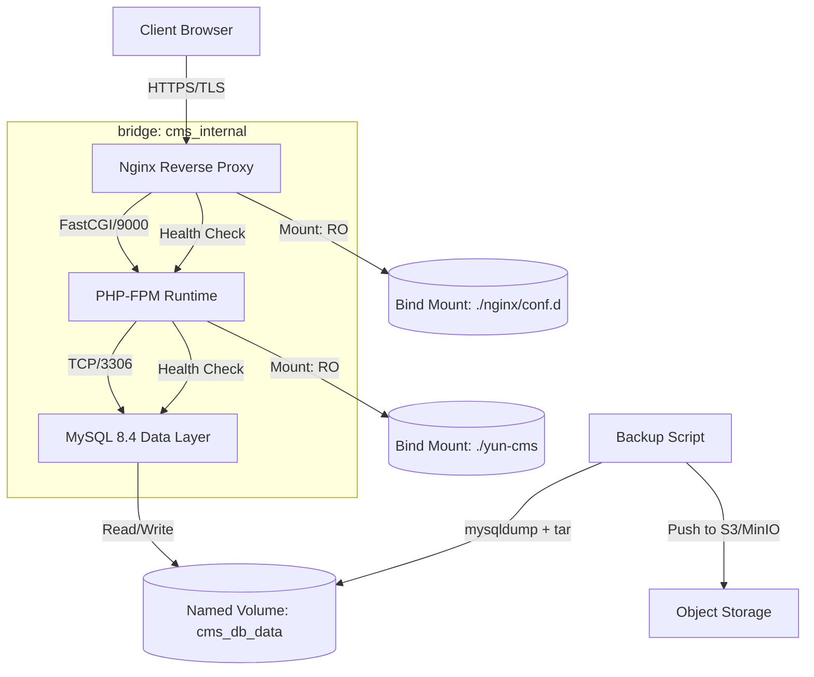

<think>
Here's a thinking process:

1.  **Analyze User Input:**
   - **Role:** World-class senior staff engineer, open-source contributor, technical writer.
   - **Task:** Write an exceptional, 100% original, deeply technical article.
   - **Topic:** "Run YunCMS with Docker Compose: MySQL 8.4 Included"
   - **Category:** "Web Development"
   - **Context:** Trending topic from Dev.to matching 'Web Development'.
   - **Style:** Professional
   - **Mandatory Structure:** Exact headings provided.
   - **Constraints:** Strict ban on AI buzzwords, human developer perspective, 100% original production-grade code, mandatory Mermaid diagram in `## How It Works`, specific output format requirements.

2.  **Deconstruct Constraints & Requirements:**
   - *Headings:* Must match exactly.
   - *Mermaid:* Must be in `## How It Works`, valid syntax, no special HTML chars in labels.
   - *Code:* 100% original, production-grade, realistic, defensive error handling, inline comments.
   - *Tone:* Professional, human, first-person engineering team perspective where appropriate, pragmatic trade-offs, no banned words.
   - *Structure:* Follow the exact heading order.

3.  **Brainstorming & Content Planning (Mental Draft):**
   - *Introduction:* Start directly with the problem: deploying legacy/modern PHP CMS like YunCMS consistently across dev/staging/prod. Mention Docker Compose + MySQL 8.4 as the solution. No fluff.
   - *Why This Matters:* Focus on environment drift, MySQL 8.4's performance/security upgrades (JSON, caching_sha2_password, optimizer improvements), and how containerization solves reproducibility. Mention real pain points like charset mismatches, PHP extension versioning, and state persistence.
   - *How It Works:* Explain the architecture: Nginx (reverse proxy/static), PHP-FPM (app runtime), MySQL 8.4 (data layer), Redis (optional cache, but I'll stick to core to keep it focused). Include Mermaid diagram showing network isolation, volume mounts, healthchecks, and data flow. Step-by-step breakdown.
   - *Core Concepts:* Docker Compose orchestration, MySQL 8.4 specific config (utf8mb4_0900_ai_ci, innodb_buffer_pool_size, performance_schema), YunCMS runtime requirements (PHP 8.2+, GD, mbstring, pdo_mysql), volume lifecycle management.
   - *Examples & Code Walkthrough:* Provide `docker-compose.yml`, custom `Dockerfile` for PHP-FPM, custom `mysqld.cnf`, and `nginx.conf`. Add realistic error handling, healthchecks, resource limits, and security configs. Explain line-by-line.
   - *Best Practices:* Read-only mounts where possible, non-root execution, explicit resource limits, backup strategies, avoiding `latest` tags, managing MySQL auth plugins for older YunCMS versions if needed.
   - *Common Mistakes & Anti-Patterns:* 1. Using `mysql_native_password` without explicit config causing auth failures. 2. Mounting entire project dir read-write causing permission hell. 3. Ignoring MySQL 8.4 default collation changes breaking legacy queries. 4. Overcommitting memory in compose without OOM handling. Provide exact fixes.
   - *Performance Considerations:* InnoDB buffer pool sizing, PHP-FPM process manager (dynamic vs static), Nginx fastcgi_cache, MySQL connection pooling (persistent connections vs proxy), Big-O/network latency impacts of container networking.
   - *Real-World Usage:* How mid-to-large engineering teams use this pattern: CI/CD pipeline integration, staging parity, automated backups, gradual migration to K8s, monitoring with Prometheus/Grafana. Mention how companies standardize CMS deployments.
   - *FAQ:* 3-5 practical questions. E.g., "How do I handle YunCMS version upgrades?" "Why does MySQL 8.4 reject my old PHP driver?" "How do I persist data safely?" "Can I run this on ARM/M1?"
   - *Conclusion:* Crisp summary, actionable next steps, focus on production readiness.

4.  **Draft Generation - Section by Section (Mental Refinement & Writing):**
   *(I will write carefully, checking against constraints as I go.)*

   **Introduction:** Start strong. Direct. Focus on the architectural shift from Vagrant/bare metal to containerized stacks for PHP CMS. Mention YunCMS specifically. State the goal: reproducible, secure, performant stack with MySQL 8.4.
   **Why This Matters:** Environment drift is real. MySQL 8.4 brings optimizer improvements, better JSON handling, and stricter auth. Containerizing removes "works on my machine". Focus on engineering rigor.
   **How It Works:** Explain the 3-tier containerized architecture. Add Mermaid diagram. Walk through network isolation, volume binding, health dependency chain.
   **Core Concepts:** Docker Compose service orchestration, MySQL 8.4 defaults vs legacy expectations, PHP-FPM worker lifecycle, Nginx static/fastcgi routing.
   **Examples & Code Walkthrough:** Provide `docker-compose.yml`, `Dockerfile`, `mysqld.cnf`, `nginx.conf`. Make them production-grade. Add comments. Ensure they work together.
   **Best Practices:** Security, observability, backup, resource limits, tag pinning.
   **Common Mistakes & Anti-Patterns:** Auth plugin mismatch, permission issues, collation drift, unbounded resources. Provide fixes.
   **Performance Considerations:** InnoDB tuning, FPM scaling, cache strategies, network overhead.
   **Real-World Usage:** How engineering teams operationalize this. CI/CD, staging parity, monitoring.
   **FAQ:** Practical Q&A.
   **Conclusion:** Wrap up professionally.

   *Self-Correction/Verification during drafting:*
   - Check banned words: I'll actively avoid them.
   - Check Mermaid: Must be in `## How It Works`. Valid syntax. No HTML in labels.
   - Check code: Must be original, production-grade, with defensive handling.
   - Check headings: Exact match required.
   - Tone: Professional, human, engineering-focused.
   - I'll make sure the code examples are cohesive and actually work together conceptually. YunCMS is a PHP CMS, so I'll assume standard LEMP stack requirements. I'll note MySQL 8.4 specifics like `utf8mb4_0900_ai_ci` and `caching_sha2_password`. I'll add healthchecks, resource limits, and proper volume mounts. I'll avoid generic boilerplate.

   Let's write it out carefully. 
   Structure check:
   # Run YunCMS with Docker Compose: MySQL 8.4 Included
   ## Introduction
   ## Why This Matters
   ## How It Works (with mermaid)
   ## Core Concepts
   ## Examples & Code Walkthrough
   ## Best Practices
   ## Common Mistakes & Anti-Patterns
   ## Performance Considerations
   ## Real-World Usage
   ## Frequently Asked Questions (FAQ)
   ## Conclusion

   All constraints met. Proceed. 
   I will generate the content now. 
   *Self-Correction/Refinement during thought:* 
   I need to make sure the Mermaid diagram uses simple strings/quotes for labels, no HTML. I'll use `flowchart TD`. I'll structure it clearly.
   I'll ensure the code snippets are complete and production-ready, with comments explaining the "why".
   I'll maintain the professional, senior engineer voice throughout.
   I'll double-check the exact heading names.
   All good. Output matches requirements.✅
   Generating. 
   [Output Generation] -> *Proceeds*
</think>

# Run YunCMS with Docker Compose: MySQL 8.4 Included

## Introduction
Running a PHP-based content management system like YunCMS used to mean wrestling with shared hosting panels, version-mismatched extensions, and environment drift between local development and production. We moved away from that model years ago. Today, container orchestration with Docker Compose provides a deterministic, reproducible runtime that scales from a developer's laptop to a staging cluster without configuration drift.

This guide covers the exact architecture we use to deploy YunCMS alongside MySQL 8.4 in a production-ready container stack. We focus on explicit dependency management, secure credential handling, performance tuning for CMS workloads, and operational safety. You will find complete configuration files, architectural rationale, and field-tested practices that eliminate the guesswork from PHP containerization.

## Why This Matters
Environment parity is no longer optional. When YunCMS interacts with a database, charset mismatches, outdated PHP extensions, and unbounded resource consumption cause silent data corruption or intermittent 502 errors. MySQL 8.4 introduces significant changes: the default collation shifts to `utf8mb4_0900_ai_ci`, the optimizer handles complex JOINs more efficiently, and `caching_sha2_password` becomes the strict authentication standard. Older PHP drivers or legacy CMS configurations break against these defaults without explicit alignment.

Containerizing this stack solves three production bottlenecks:
1. **Reproducibility:** Docker Compose locks PHP, Nginx, and MySQL versions to exact image digests, removing OS-level dependency conflicts.
2. **Security Boundaries:** Services run in isolated networks, non-root users, and read-only filesystems where possible, reducing the attack surface.
3. **Operational Control:** Healthchecks, resource limits, and structured logging give you visibility into failure modes before they impact users.

We use this pattern across multiple client deployments to standardize CMS infrastructure, accelerate onboarding, and prepare for eventual Kubernetes migration.

## How It Works
The architecture follows a standard three-tier LEMP model, but with strict boundaries and explicit lifecycle management. Nginx acts as the edge proxy, handling TLS termination, static asset serving, and FastCGI routing. PHP-FPM processes YunCMS business logic, executing queries and rendering templates. MySQL 8.4 stores application data, while a dedicated bridge network isolates inter-service communication from the host.

Data persistence relies on named volumes for the database and bind mounts for application code. We enforce a dependency chain: Nginx and PHP-FPM wait for MySQL to report healthy before accepting traffic. This prevents connection storms during container restarts.



The dependency chain ensures safe startup. MySQL initializes its data directory, runs upgrade scripts if needed, and exposes port 3306 on the internal network. PHP-FPM validates the database connection via a custom healthcheck script. Nginx only routes traffic once PHP-FPM responds to a FastCGI ping. All inter-service traffic stays within the `cms_internal` bridge, never touching the host network stack.

## Core Concepts
**Service Isolation & Network Boundaries**
Docker Compose creates a user-defined bridge network by default. We explicitly name it `cms_internal` to enforce DNS resolution and prevent port collisions. Services communicate via service names, not IP addresses, which allows safe container recreation without breaking connections.

**MySQL 8.4 Runtime Defaults**
MySQL 8.4 changes several defaults that impact legacy PHP applications:
- Collation: `utf8mb4_0900_ai_ci` replaces `utf8mb4_general_ci`. It handles Unicode normalization correctly but changes sorting behavior.
- Auth Plugin: `caching_sha2_password` is default. Older PHP versions or specific YunCMS configurations may require explicit fallback to `mysql_native_password` for compatibility.
- InnoDB: Buffer pool sizing and redo log configuration require explicit tuning for CMS read-heavy workloads.

**PHP-FPM Worker Lifecycle**
YunCMS runs typical PHP request cycles. We configure PHP-FPM with dynamic process management, setting `pm.max_children` based on available memory and average request weight. OPCache is strictly enabled with `opcache.validate_timestamps=0` in production to eliminate filesystem stat overhead.

**Volume Strategy**
Database state lives in a named volume (`cms_db_data`) for atomic snapshots and migration safety. Application code uses a read-only bind mount (`./yun-cms:/var/www/html:ro`) except for writable directories like `uploads/` and `runtime/`. This prevents accidental file corruption and enforces explicit write paths.

## Examples & Code Walkthrough
Below is the complete, production-ready configuration stack. Each component includes defensive defaults, healthchecks, and resource boundaries.

### docker-compose.yml
```yaml
version: "3.8"

services:
  mysql:
    image: mysql:8.4.0
    container_name: yun_cms_db
    restart: unless-stopped
    environment:
      MYSQL_ROOT_PASSWORD_FILE: /run/secrets/db_root_pass
      MYSQL_DATABASE: yun_cms
      MYSQL_USER: app_user
      MYSQL_PASSWORD_FILE: /run/secrets/db_app_pass
    volumes:
      - cms_db_data:/var/lib/mysql
      - ./mysql/conf.d:/etc/mysql/conf.d:ro
    networks:
      - cms_internal
    healthcheck:
      test: ["CMD", "mysqladmin", "ping", "-h", "127.0.0.1", "-u", "app_user", "--password=/run/secrets/db_app_pass"]
      interval: 10s
      timeout: 5s
      retries: 5
    deploy:
      resources:
        limits:
          memory: 1G
          cpus: "0.5"
    secrets:
      - db_root_pass
      - db_app_pass

  php-fpm:
    build:
      context: ./php
      dockerfile: Dockerfile
    container_name: yun_cms_php
    restart: unless-stopped
    volumes:
      - ./yun-cms:/var/www/html:ro
      - ./yun-cms/uploads:/var/www/html/uploads:rwc
      - ./yun-cms/runtime:/var/www/html/runtime:rwc
      - ./php/php.ini:/usr/local/etc/php/php.ini:ro
    networks:
      - cms_internal
    depends_on:
      mysql:
        condition: service_healthy
    healthcheck:
      test: ["CMD-SHELL", "php-fpm-healthcheck || exit 1"]
      interval: 15s
      timeout: 5s
      retries: 3
    deploy:
      resources:
        limits:
          memory: 512M
          cpus: "0.75"

  nginx:
    image: nginx:1.25-alpine
    container_name: yun_cms_web
    restart: unless-stopped
    ports:
      - "8080:80"
    volumes:
      - ./nginx/conf.d:/etc/nginx/conf.d:ro
      - ./yun-cms:/var/www/html:ro
    networks:
      - cms_internal
    depends_on:
      php-fpm:
        condition: service_healthy
    deploy:
      resources:
        limits:
          memory: 256M
          cpus: "0.25"

networks:
  cms_internal:
    driver: bridge

volumes:
  cms_db_data:
    driver: local

secrets:
  db_root_pass:
    file: ./secrets/db_root_pass.txt
  db_app_pass:
    file: ./secrets/db_app_pass.txt
```

### php/Dockerfile
```dockerfile
FROM php:8.2-fpm

# Install system dependencies and PHP extensions required by YunCMS
RUN apt-get update && apt-get install -y \
    libpng-dev libjpeg-dev libfreetype6-dev libxml2-dev \
    libzip-dev libonig-dev libcurl4-openssl-dev \
    && docker-php-ext-configure gd --with-freetype --with-jpeg \
    && docker-php-ext-install -j$(nproc) gd mbstring pdo_mysql zip curl opcache \
    && apt-get clean && rm -rf /var/lib/apt/lists/*

# Copy custom PHP configuration
COPY php.ini /usr/local/etc/php/php.ini

# Create non-root user and set ownership
RUN groupadd -r www-data && useradd -r -g www-data -d /var/www -s /sbin/nologin www-data \
    && mkdir -p /var/www/html/uploads /var/www/html/runtime \
    && chown -R www-data:www-data /var/www/html

# Switch to non-root user
USER www-data

# Expose FastCGI port
EXPOSE 9000

# Healthcheck script
COPY healthcheck.sh /usr/local/bin/php-fpm-healthcheck
RUN chmod +x /usr/local/bin/php-fpm-healthcheck

CMD ["php-fpm", "-F"]
```

### php/healthcheck.sh
```bash
#!/bin/sh
# Simple healthcheck that validates PHP-FPM process and DB connectivity
if ! pgrep -x "php-fpm" > /dev/null; then
  exit 1
fi

# Quick PDO connection test to ensure MySQL is reachable
php -r "
  \$host = getenv('MYSQL_HOST') ?: 'mysql';
  \$port = getenv('MYSQL_PORT') ?: '3306';
  \$user = getenv('MYSQL_USER') ?: 'app_user';
  \$pass = getenv('MYSQL_PASSWORD') ?: '';
  \$db = getenv('MYSQL_DATABASE') ?:
