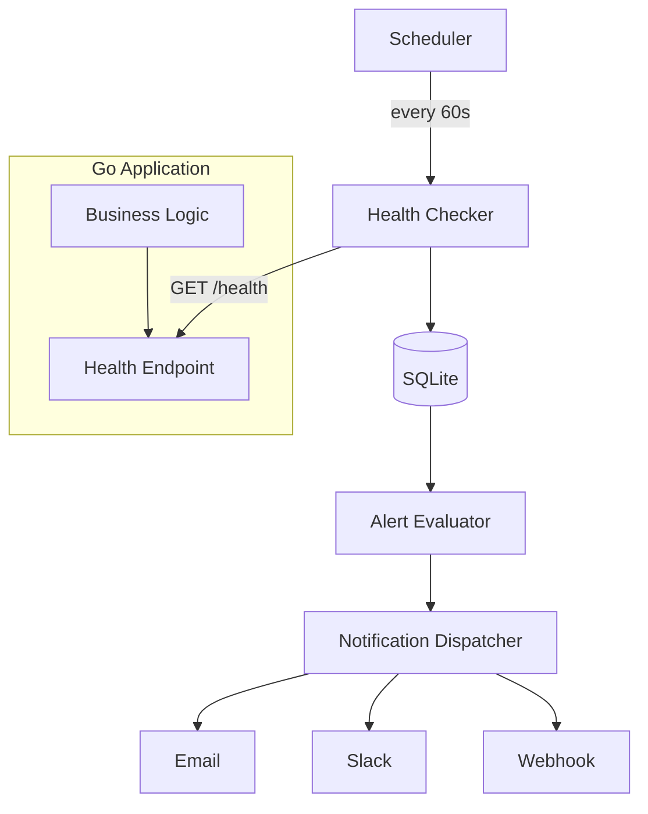

# Self-Hosted vs SaaS Uptime Monitoring for Small Go Apps (EU Cron Alerting)

## Introduction
Running a Go service in production requires knowing when it goes down. For small teams, the choice between building an internal monitor or relying on a SaaS platform influences cost, control, and compliance. This post compares both approaches, with an emphasis on European data residency and cron‑based alerting.

## Why This Matters
Without reliable alerts, outages can go unnoticed, leading to lost revenue and eroded trust. In a self‑hosted setup you own the data path, which simplifies GDPR compliance. A SaaS solution offloads maintenance but introduces network hops that may cross borders, potentially creating legal and latency concerns.

## How It Works
The system operates in four stages: a scheduler triggers periodic health checks, a collector records the outcome, an evaluator decides when an incident warrants notification, and a dispatcher sends alerts through configured channels.



1. **Scheduler** – A goroutine ticks at a fixed interval, invoking the health checker.
2. **Health Checker** – Performs an HTTP request to the application’s `/health` endpoint.
3. **Result Store** – Persists the status code and latency in a lightweight SQLite database.
4. **Alert Evaluator** – Compares the result against a configurable failure threshold; if exceeded, it creates an incident record.
5. **Notification Dispatcher** – Sends the incident details via email, Slack, or a custom webhook.

## Core Concepts
- **Health Check Endpoint** – A simple HTTP handler returning `200 OK` when the service is ready to serve traffic.
- **Failure Threshold** – The number of consecutive failures required before raising an alert.
- **Incident Lifecycle** – States include *open*, *acknowledged*, and *resolved*.
- **Notification Channels** – Extensible set of delivery mechanisms (SMTP, Slack webhook, generic HTTP POST).

## Examples & Code Walkthrough
Below is a self‑contained Go program that implements the four stages. It reads configuration from environment variables and stores results in SQLite.

```go
package main

import (
	"database/sql"
	"encoding/json"
	"log"
	"net/http"
	"os"
	"time"

	_ "github.com/mattn/go-sqlite3"
)

// Config holds runtime parameters.
type Config struct {
	TargetURL      string        // URL of the Go app's health endpoint
	Interval       time.Duration // How often to check
	FailureThreshold int         // Consecutive failures before alert
	EmailTo        string        // Recipient for email alerts
	SlackWebhook   string        // Slack incoming webhook URL
	WebhookURL     string        // Generic webhook for custom integrations
}

func loadConfig() Config {
	return Config{
		TargetURL:      os.Getenv("MONITOR_TARGET_URL"),
		Interval:       parseDuration(os.Getenv("MONITOR_INTERVAL"), 60*time.Second),
		FailureThreshold: parseInt(os.Getenv("MONITOR_FAILURE_THRESHOLD"), 3),
		EmailTo:        os.Getenv("MONITOR_EMAIL_TO"),
		SlackWebhook:   os.Getenv("MONITOR_SLACK_WEBHOOK"),
		WebhookURL:     os.Getenv("MONITOR_WEBHOOK_URL"),
	}
}

func parseDuration(s string, def time.Duration) time.Duration {
	if s == "" {
		return def
	}
	d, err := time.ParseDuration(s)
	if err != nil {
		log.Printf("invalid duration %q, using default %v", s, def)
		return def
	}
	return d
}

func parseInt(s string, def int) int {
	if s == "" {
		return def
	}
	n, err := parseInt(s)
	if err != nil {
		log.Printf("invalid integer %q, using default %d", s, def)
		return def
	}
	return n
}

// Monitor encapsulates the checking logic.
type Monitor struct {
	cfg   Config
	db    *sql.DB
	client *http.Client
}

// NewMonitor initializes the monitor and ensures the schema exists.
func NewMonitor(cfg Config, db *sql.DB) *Monitor {
	return &Monitor{
		cfg:   cfg,
		db:    db,
		client: &http.Client{Timeout: 10 * time.Second},
	}
}

func (m *Monitor) initSchema() error {
	_, err := m.db.Exec(`
		CREATE TABLE IF NOT EXISTS health_checks (
			id INTEGER PRIMARY KEY AUTOINCREMENT,
			timestamp DATETIME DEFAULT CURRENT_TIMESTAMP,
			status_code INTEGER,
			latency_ms INTEGER,
			is_failure BOOLEAN DEFAULT 0
		);
		CREATE TABLE IF NOT EXISTS incidents (
			id INTEGER PRIMARY KEY AUTOINCREMENT,
			started_at DATETIME DEFAULT CURRENT_TIMESTAMP,
			resolved_at DATETIME,
			notification_sent BOOLEAN DEFAULT 0
		);
	`)
	return err
}

// check performs a single health check and stores the result.
func (m *Monitor) check() error {
	start := time.Now()
	resp, err := m.client.Get(m.cfg.TargetURL)
	latency := time.Since(start).Milliseconds()
	if err != nil {
		return err
	}
	defer resp.Body.Close()

	isFailure := resp.StatusCode >= 400
	_, err = m.db.Exec(`
		INSERT INTO health_checks (status_code, latency_ms, is_failure)
		VALUES (?, ?, ?)
	`, resp.StatusCode, latency, isFailure)
	return err
}

// evaluate looks at recent failures and opens an incident if needed.
func (m *Monitor) evaluate() error {
	var consecutiveFailures int
	err := m.db.QueryRow(`
		SELECT COUNT(*) FROM health_checks
		WHERE is_failure = 1
		AND timestamp >= datetime('now', '-1 minute')
	`).Scan(&consecutiveFailures)
	if err != nil {
		return err
	}

	if consecutiveFailures >= m.cfg.FailureThreshold {
		// Check if there is already an open incident
		var openID int
		err = m.db.QueryRow(`
			SELECT id FROM incidents
			WHERE resolved_at IS NULL
		)LIMIT 1
		`).Scan(&
