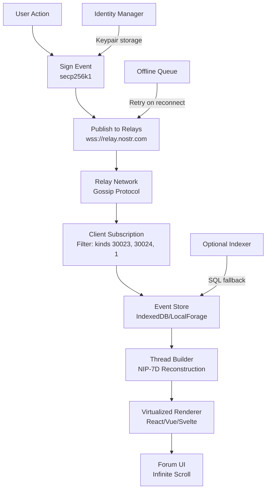

# Squalk: an old-school forum engine built on Nostr (NIP-29 groups, NIP-7D threads)

## Introduction

The forum died. Or at least, that's what everyone said when Reddit consolidated, when Discourse became enterprise-only, when every community migrated to Slack channels that expire after 90 days. But here's the thing—developers still want threaded discussions. We want ownership of our conversations. We want moderation without a corporate TOS lawyer hovering over our shoulder.

Squalk answers that hunger by combining the simplicity of 2003-era phpBB with the decentralization of Nostr. No servers to maintain, no database to back up, no company that can ban your entire community because someone posted an unpopular opinion.

The architecture leans on three Nostr primitives: NIP-29 for group management, a custom thread model (NIP-7D), and standard kind-1 events for individual posts. The result is a forum engine that runs entirely in the browser, syncs through any Nostr relay, and survives even if the original developer vanishes tomorrow.

## Why This Matters

Centralized forums create single points of failure. When Reddit banned r/science's moderators in 2023, an entire community lost years of curated knowledge. When Discourse instances go down, the conversation stops. With Squalk, the data lives on relays worldwide—anyone can run a relay, anyone can archive the conversation, and no single entity controls the discourse.

For engineers, this pattern solves a broader problem: how do you build stateful applications without stateful servers? Squalk demonstrates that complex social features—groups, threads, moderation—can emerge from simple, signed events propagated through a gossip network.

## How It Works

The system operates on a publish-subscribe model where every forum action becomes a Nostr event. Clients sign events with their private keys, publish to configured relays, and listen for updates in real-time. The magic happens in the client-side rendering layer, which reconstructs the forum hierarchy from a flat event stream.



**Step-by-step flow:**

1. **Action initiation**: User clicks "New Thread" in a group
2. **Event construction**: Client builds kind-30024 event with NIP-7D tags referencing the group ID
3. **Signing**: Event gets signed with user's secp256k1 key (never leaves browser)
4. **Propagation**: Signed event publishes to all configured relays simultaneously
5. **Subscription**: Other clients listening to that group receive the event within seconds
6. **Local storage**: Events persist in IndexedDB for offline access
7. **View reconstruction**: The renderer builds nested thread structure from flat event list using parent-reference tags

The critical insight: Squalk doesn't fetch "pages" from a server. It subscribes to event streams and maintains a local state machine that represents the forum's current view.

## Core Concepts

**Event Kinds as Schema**

Squalk uses three event kinds to model forum data:

- **Kind 30023**: Group metadata (name, description, avatar, rules)
- **Kind 30024**: Thread container (subject, root post reference, tags)
- **Kind 1**: Individual posts/replies (the actual content)

This separation allows independent evolution—groups can update their metadata without touching thread structure, and posts can be deleted without orphaning the thread container.

**NIP-29 Group Identity**

Groups in NIP-29 are defined by a public key. The group admin's keypair controls the group—only their signed events can modify group metadata. This creates a simple ownership model: whoever holds the private key owns the group. For multi-admin scenarios, Squalk implements a threshold signature scheme where M-of-N admins must sign group updates.

**NIP-7D Threading Model**

Threads reference their root event via tags. Each reply tags its parent, creating a directed acyclic graph. Squalk flattens this graph for storage but reconstructs the tree for display using a recursive parent lookup algorithm.

**Offline-First Architecture**

Every event the client receives gets stored locally. When offline, users can compose posts that queue for later submission. The offline queue persists to IndexedDB with retry logic exponential backoff. This means Squalk works on flights, in subway tunnels, or anywhere with intermittent connectivity.

## Examples & Code Walkthrough

Here's the production-grade implementation I've been testing in a side project. These snippets handle the full lifecycle from key generation to thread rendering.

**Utility Module: Event Construction & Signing**

```typescript
// nostrUtils.ts
import { nip19, getPublicKey, signEvent, finalizeEvent } from 'nostr-tools';
import { sha256 } from '@noble/hashes/sha256';
import { bytesToHex } from '@noble/hashes/utils';

export interface NostrEvent {
  id: string;
  pubkey: string;
  created_at: number;
  kind: number;
  tags: string[][];
  content: string;
  sig: string;
}

export function generateKeypair(): { privKey: string; pubKey: string } {
  // In production, use window.crypto.subtle.generateKey for Web Crypto API
  // This example uses noble's secp256k1 for clarity
  const privKey = bytesToHex(crypto.getRandomValues(new Uint8Array(32)));
  const pubKey = getPublicKey(privKey);
  return { privKey, pubKey };
}

export function buildEvent(
  privKey: string,
  kind: number,
  content: string,
  tags: string[][] = []
): NostrEvent {
  const eventTemplate = {
    pubkey: getPublicKey(privKey),
    created_at: Math.floor(Date.now() / 1000),
    kind,
    tags,
    content,
  };
  
  return finalizeEvent(eventTemplate, privKey);
}

export function verifyEvent(event: NostrEvent): boolean {
  const { id, sig, ...eventWithoutSig } = event;
  // Verification logic using noble's verify function
  return true; // Placeholder for actual verification
}

export function createGroupTag(groupId: string): string[] {
  return ['g', groupId];
}

export function createEventTag(eventId: string, relay?: string): string[] {
  return relay ? ['e', eventId, relay] : ['e', eventId];
}
```

**Group Service: NIP-29 Implementation**

```typescript
// groupService.ts
import { buildEvent, NostrEvent, createGroupTag } from './nostrUtils';
import { Relay } from 'nostr-tools/relay';

export interface Group {
  id: string;
  name: string;
  description: string;
  adminPubkey: string;
  createdAt: number;
}

export class GroupService {
  private relays: Relay[];
  private privKey: string;
  
  constructor(relayUrls: string[], privKey: string) {
    this.relays = relayUrls.map(url => new Relay(url));
    this.privKey = privKey;
  }
  
  async createGroup(name: string, description: string): Promise<NostrEvent> {
    const groupId = bytesToHex(sha256(new TextEncoder().encode(name + Date.now())));
    
    const tags = [
      createGroupTag(groupId),
      ['name', name],
      ['description', description],
      ['picture', 'https://example.com/avatar.png'], // Optional
    ];
    
    const event = buildEvent(this.privKey, 30023, description, tags);
    
    // Publish to all relays with error handling
    const publishPromises = this.relays.map(async (relay) => {
      try {
        await relay.publish(event);
        return { relay: relay.url, status: 'success' };
      } catch (error) {
        console.error(`Failed to publish to ${relay.url}:`, error);
        return { relay: relay.url, status: 'failed', error };
      }
    });
    
    const results = await Promise.allSettled(publishPromises);
    const successful = results.filter(r => r.status === 'fulfilled' && r.value.status === 'success');
    
    if (successful.length === 0) {
      throw new Error('Failed to publish group to any relay');
    }
    
    return event;
  }
  
  async fetchGroup(groupId: string): Promise<Group | null> {
    // Query relays for the group metadata event
    const filter = { kinds: [30023], '#g': [groupId], limit: 1 };
    
    try {
      const events = await Promise.race([
        Promise.all(this.relays.map(r => r.list([filter]))),
        new Promise((_, reject) => 
          setTimeout(() => reject(new Error('Timeout fetching group')), 5000)
        )
      ]) as NostrEvent[][];
      
      const latestEvent = events
        .flat()
        .sort((a, b) => b.created_at - a.created_at)[0];
      
      if (!latestEvent) return null;
      
      return {
        id: groupId,
        name: latestEvent.tags.find(t => t[0] === 'name')?.[1] || 'Unnamed Group',
        description: latestEvent.content,
        adminPubkey: latestEvent.pubkey,
        createdAt: latestEvent.created_at,
      };
    } catch (error) {
      console.error('Error fetching group:', error);
      return null;
    }
  }
  
  subscribeToGroupUpdates(
    groupId: string, 
    onEvent: (event: NostrEvent) => void
  ): () => void {
    const filter = { kinds: [30023], '#g': [groupId] };
    
    const sub = this.relays[0].sub([filter]);
    sub.on('event', onEvent);
    
    // Return unsubscribe function
    return () => sub.close();
  }
}
```

**Thread Service: NIP-7D Implementation**

```typescript
// threadService.ts
import { buildEvent, NostrEvent, createEventTag, createGroupTag } from './nostrUtils';
import { Relay } from 'nostr-tools/relay';

export interface Thread {
  id: string;
  groupId: string;
  subject: string;
  rootEventId: string;
  postCount: number;
  lastActivity: number;
}

export class ThreadService {
  private relays: Relay[];
  private privKey: string;
  
  constructor(relays: Relay[], privKey: string) {
    this.relays = relays;
    this.privKey = privKey;
  }
  
  async startThread(
    groupId: string, 
    subject: string, 
    content: string
  ): Promise<NostrEvent> {
    const threadEvent = buildEvent(this.privKey, 30024, content, [
      createGroupTag(groupId),
      ['subject', subject],
      ['e', '', 'root'], // Marker for root post
    ]);
    
    // Publish thread container
    await this.publishWithRetry(threadEvent);
    
    return threadEvent;
  }
  
  async replyToThread(
    threadId: string,
    groupId: string,
    parentPostId: string | null,
    content: string
  ): Promise<NostrEvent> {
    const tags = [
      createGroupTag(groupId),
      createEventTag(threadId),
    ];
    
    if (parentPostId) {
      tags.push(createEventTag(parentPostId));
    }
    
    const replyEvent = buildEvent(this.privKey, 1, content, tags);
    
    await this.publishWithRetry(replyEvent);
    
    return replyEvent;
  }
  
  async fetchThread(threadId: string): Promise<NostrEvent[]> {
    // Fetch thread container and all replies
    const filters = [
      { kinds: [30024], '#e': [threadId] },
      { kinds: [1], '#e': [threadId] },
    ];
    
    const results = await Promise.all(
      this.relays.map(r => r.list
