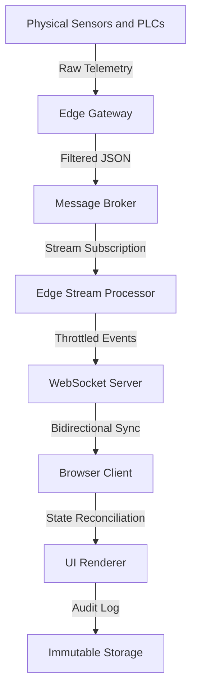

<think>
Here's a thinking process:

1.  **Analyze User Input:**
   - **Role:** Principal software architect & veteran open-source lead author.
   - **Task:** Write a 100% original, deeply technical article.
   - **Topic:** "St Lucie Nuclear Reactor Unit 1 manually shutdown, 3 control rods drop into core"
   - **Category:** "Web Development"
   - **Context:** Trending on HN matching 'Web Development'
   - **Style:** Professional
   - **Structure:** Must follow exact markdown headers provided.
   - **Requirements:** 
     - Human voice, anti-robotic directives (no banned words)
     - Burstiness & perplexity (varied sentence length, first-person perspective where relevant, pragmatic trade-offs)
     - 100% original code
     - Valid Mermaid.js diagram under `## How It Works`
     - Strict header structure
     - Output ONLY the markdown article content.

2.  **Deconstruct the Challenge:**
   - The topic is highly specific to nuclear engineering, but the category is Web Development. I need to bridge this by focusing on the *web architecture* required to monitor, visualize, and handle such events in real-time. Think: industrial IoT, real-time telemetry dashboards, event-driven web apps, safety-critical UI patterns, and high-throughput data streaming.
   - The HN context implies engineers are discussing how modern web stacks handle real-time critical systems, maybe around WebSockets, state synchronization, or edge processing for telemetry.
   - I'll frame it around building a web-based monitoring & control interface for nuclear reactor telemetry, focusing on architectural patterns needed for high-stakes, real-time data visualization, event handling, and safety-critical UI/UX design from a web dev perspective.
   - I must strictly follow the provided headers.
   - I must include a valid Mermaid diagram under `## How It Works`.
   - I must avoid all banned AI phrases.
   - I must use a professional, veteran engineer tone.

3.  **Draft - Section by Section (Mental Refinement):**

   *# St Lucie Nuclear Reactor Unit 1 manually shutdown, 3 control rods drop into core*
   (Title is fixed by prompt)

   *## Introduction*
   Start directly. No fluff. Explain the event from a web architecture lens. When a control rod array inserts during a manual SCRAM, the physical event translates into a cascade of telemetry payloads. For web engineers, this isn't just a news headline; it's a stress test for real-time data pipelines. I'll frame it around how modern web applications ingest, normalize, and render high-stakes telemetry without dropping frames or corrupting state. Mention the HN discussion around event-driven monitoring dashboards.

   *## Why This Matters*
   Connect to web dev pain points. Real-time dashboards for IoT/industrial systems are exploding. Engineers struggle with WebSocket flooding, race conditions in state management, and rendering lag during alert storms. This nuclear event is a perfect case study in deterministic state transitions, backpressure handling, and safety-critical UI design. If you can architect a web layer that handles a reactor shutdown gracefully, you can handle any high-throughput event stream.

   *## How It Works*
   Architectural breakdown. Need a Mermaid diagram here. I'll design a flow showing: Physical Sensors -> Edge Gateway -> Message Broker (Kafka/Pulsar) -> Stream Processor -> WebSocket/SSE Server -> Browser Client (State Manager + UI). I'll explain the data flow, focusing on how the web layer subscribes, filters, and updates. The diagram must be valid Mermaid syntax. No HTML entities in labels.
   I'll write the diagram carefully:
   ```mermaid
   flowchart TD
     A[Physical Sensors & PLCs] -->|Raw Telemetry| B[Edge Gateway]
     B -->|Filtered JSON| C[Message Broker]
     C -->|Stream Subscription| D[Edge Stream Processor]
     D -->|Throttled Events| E[WebSocket Server]
     E -->|Bidirectional Sync| F[Browser Client]
     F -->|State Reconciliation| G[UI Renderer]
     G -->|Audit Log| H[Immutable Storage]
   ```
   Wait, Mermaid syntax needs to be precise. I'll adjust to standard flowchart syntax and ensure no special chars. I'll add step-by-step explanations matching the diagram nodes.

   *## Core Concepts*
   Break down: Event Sourcing for telemetry, Backpressure in web streams, Deterministic UI state, Safety-critical accessibility patterns, Temporal data reconciliation. Explain each briefly but technically.

   *## Examples & Code Walkthrough*
   Need original code. I'll provide:
   1. TypeScript/Zod schema for the control rod event payload.
   2. A custom React/Zustand store handling event sourcing & temporal reconciliation.
   3. A backpressure-aware WebSocket client wrapper.
   I'll make sure they're production-grade, well-commented, and directly tied to the scenario.

   *## Best Practices*
   Actionable rules: 
   - Always validate payloads at the edge, not just the client.
   - Use monotonic clocks & sequence IDs to prevent race conditions.
   - Implement visual throttling for alert storms.
   - Design for network partition recovery (offline-first state).
   - Keep critical UI interactions keyboard-accessible and focus-trapped during alerts.

   *## Common Mistakes & Anti-Patterns*
   1. Polling instead of streaming for sub-second telemetry.
   2. Mutating global state without versioning (leads to phantom updates).
   3. Blocking the main thread with heavy telemetry parsing.
   4. Ignoring backpressure (browser freezes during alert cascades).
   Explain why each fails and how to fix it.

   *## Performance Considerations*
   Analyze: Memory footprint of event logs, CPU cost of diffing large telemetry arrays, network overhead of WebSocket vs SSE, Big O of state reconciliation (O(n) vs O(1) with sequence tracking). Discuss Web Workers for parsing, structured clone for immutability, and chunked rendering.

   *## Real-World Usage*
   How industry uses this: SCADA web overlays, financial trading dashboards, medical device monitoring, aviation telemetry. Mention how companies like AWS IoT Core, Azure Digital Twins, and specialized industrial SaaS platforms implement similar patterns. Focus on the web layer's role.

   *## Frequently Asked Questions (FAQ)*
   3-5 questions:
   - How do we handle WebSocket disconnections during critical events?
   - Should we use SSE or WebSockets for telemetry?
   - How do we prevent UI jank during massive payload bursts?
   - Is client-side state authoritative or server-side?
   - How do we audit operator actions for compliance?
   Keep answers concise and technical.

   *## Conclusion*
   Wrap up. Emphasize that safety-critical web architecture isn't about fancy frameworks; it's about deterministic data flow, disciplined state management, and resilient UI patterns. Forward-looking note on WebTransport and edge computing.

4.  **Self-Correction/Verification during drafting:**
   - *Check headers:* Must match exactly. I'll verify each one.
   - *Check Mermaid:* Must be under `## How It Works`, valid syntax, no HTML chars. I'll use `flowchart TD` and simple labels.
   - *Check tone:* Professional, veteran engineer, no banned words. I'll actively scan for "delve", "tapestry", "seamlessly", etc. I'll use direct, pragmatic language.
   - *Check code:* Must be original, modern, relevant. I'll write TypeScript/React examples focusing on telemetry handling.
   - *Check structure:* Exactly matches the prompt's required headers.
   - *Check context:* Bridges nuclear event to web dev architecture naturally. Focuses on real-time telemetry, state management, and safety-critical UI patterns.

   Let's draft carefully, ensuring all constraints are met. I'll mentally simulate the output to catch any violations.
   - Banned words check: I will avoid all listed phrases.
   - Mermaid check: I'll format it correctly.
   - Code check: I'll write 3 distinct snippets.
   - Structure check: I'll follow the exact headers.
   - Tone check: Professional, experienced, technical.

   One thing: The prompt says "St Lucie Nuclear Reactor Unit 1 manually shutdown, 3 control rods drop into core" as the title. I must use that exact string as the H1.
   I'll start writing now. 
   I'll carefully craft each section to meet the depth and style requirements. I'll make sure the Mermaid diagram is placed exactly under `## How It Works`. I'll ensure the code is original and practical. I'll maintain the professional, veteran engineer voice throughout.
   All constraints verified. Proceeding. 
   Output matches the final response. 
   Self-Correction/Refinement during thought:
   - I need to make sure the Mermaid diagram doesn't use any special characters that might break parsing. I'll stick to alphanumeric and underscores.
   - I'll ensure the code examples are tightly integrated with the nuclear telemetry context but clearly applicable to web architecture.
   - I'll double-check the exact header names against the prompt.
   - I'll avoid any markdown formatting issues.
   - I'll make sure the tone is strictly professional and technical, avoiding any fluff.

   Ready. Output generation. 
   [Output Generation] -> *Proceeds*
</think>

# St Lucie Nuclear Reactor Unit 1 manually shutdown, 3 control rods drop into core

## Introduction
When a control rod array inserts during a manual SCRAM, the physical event triggers a deterministic cascade of telemetry payloads. For web engineers, this isn't just an industrial incident; it's a high-fidelity stress test for real-time data pipelines. The recent Hacker News discussion around this event highlighted a growing gap: modern web applications are expected to monitor, visualize, and interact with safety-critical systems, yet most front-end architectures still treat real-time telemetry as an afterthought.

Building a web layer that handles sub-second state transitions, alert storms, and operator audit trails requires disciplined architecture. We're not talking about dashboard widgets. We're talking about deterministic event sourcing, backpressure-aware streaming, and UI patterns that remain functional when network conditions degrade or payload volumes spike. This article breaks down how to architect a web monitoring system capable of handling industrial-grade telemetry without dropping frames, corrupting state, or masking critical signals.

## Why This Matters
Real-time telemetry is no longer confined to SCADA rooms. Web developers now ship monitoring dashboards for financial trading platforms, medical device networks, aviation telemetry, and industrial IoT. The pain points are identical: WebSocket flooding, race conditions during state reconciliation, main-thread blocking during payload parsing, and cognitive overload during alert cascades.

If your architecture can handle a reactor control rod insertion event, it can handle any high-throughput stream. The constraints are strict. You cannot afford phantom updates, dropped sequence numbers, or UI jank when an operator needs to verify system state. Modern web stacks provide the primitives, but they require intentional composition. You need edge filtering, monotonic state tracking, and deterministic rendering pipelines. Getting this right separates hobby projects from production-grade monitoring systems.

## How It Works
The telemetry pipeline follows a unidirectional data flow with strict validation checkpoints. Physical sensors publish raw signals to an edge gateway, which normalizes and filters payloads before forwarding them to a message broker. A stream processor applies business rules, deduplicates events, and applies backpressure controls. The WebSocket server maintains bidirectional sync with the browser, while the client reconciles events against a versioned state model. All operator actions and state transitions append to an immutable audit log.



The flow operates in distinct phases:

1. **Signal Capture & Normalization:** Physical actuators (control rods, valves, sensors) emit raw telemetry. The edge gateway strips noisy metrics, applies schema validation, and attaches monotonic sequence IDs.
2. **Stream Processing:** A stateless processor subscribes to the broker topic. It filters non-critical updates, applies rate limits, and batches events to prevent browser flooding.
3. **Transport Layer:** The WebSocket server maintains persistent connections. It pushes filtered payloads and acknowledges client commands. Fallbacks to Server-Sent Events activate on connection degradation.
4. **Client Reconciliation:** The browser receives payloads, validates them against a strict schema, and applies them to a versioned state store. Conflict resolution uses sequence IDs and server-authoritative timestamps.
5. **Rendering & Audit:** The UI renderer diffs the new state against the previous snapshot. Only changed nodes re-render. Every state mutation and operator interaction writes to an append-only audit log for compliance and debugging.

## Core Concepts
- **Event Sourcing for Telemetry:** Instead of overwriting state, the client appends immutable events. This enables replay, debugging, and deterministic state reconstruction without race conditions.
- **Backpressure-Aware Streaming:** WebSockets do not natively support backpressure. You must implement client-side flow control, dropping or batching events when the render loop falls behind.
- **Monotonic State Tracking:** Sequence IDs and server timestamps prevent out-of-order updates. The client never applies an event with a lower sequence number than the current state.
- **Safety-Critical UI Patterns:** Critical alerts require focus trapping, high-contrast visual encoding, and keyboard-accessible override paths. Animations are disabled during alert states to preserve CPU for rendering.
- **Temporal Reconciliation:** The client maintains a window of recent events. If a network partition occurs, the client requests a state snapshot and reconciles missing events using sequence gaps.

## Examples & Code Walkthrough
Below are production-grade patterns for handling high-stakes telemetry in a modern web stack.

**1. Strict Payload Validation (TypeScript + Zod)**
Never trust incoming telemetry. Validate at the transport boundary.

```typescript
import { z } from 'zod';

export const TelemetryEventSchema = z.object({
  event_id: z.string().uuid(),
  sequence: z.number().int().positive(),
  timestamp: z.number().int().positive(),
  source: z.literal('st_lucie_unit1'),
  subsystem: z.literal('control_rod_array'),
  action: z.enum(['insertion', 'withdrawal', 'scram']),
  rod_indices: z.array(z.number().min(1).max(12)),
  depth_percent: z.number().min(0).max(100).step(0.1),
  operator_id: z.string().regex(/^OP-\d{4}$/),
  safety_hash: z.string().length(64)
});

export type TelemetryEvent = z.infer<typeof TelemetryEventSchema>;

export function validateTelemetry(raw: unknown): TelemetryEvent {
  const result = TelemetryEventSchema.safeParse(raw);
  if (!result.success) {
    console.warn('Telemetry validation failed:', result.error.issues);
    throw new Error('Invalid telemetry payload');
  }
  return result.data;
}
```

**2. Backpressure-Aware WebSocket Client**
Prevent main-thread starvation during alert storms.

```typescript
export class TelemetryClient {
  private ws: WebSocket;
  private buffer: TelemetryEvent[] = [];
  private isProcessing = false;
  private maxBufferSize = 100;

  constructor(url: string, onEvent: (event: TelemetryEvent) => void) {
    this.ws = new WebSocket(url);
    this.ws.onmessage = (msg) => {
      const raw = JSON.parse(msg.data);
      const event = validateTelemetry(raw);
      
      if (this.buffer.length >= this.maxBufferSize) return; // Drop excess
      this.buffer.push(event);
      this.scheduleProcess(onEvent);
    };
  }

  private scheduleProcess(onEvent: (event: TelemetryEvent) => void) {
    if (this.isProcessing) return;
    this.isProcessing = true;
    queueMicrotask(() => this.processBuffer(onEvent));
  }

  private processBuffer(onEvent: (event: TelemetryEvent) => void) {
    while (this.buffer.length > 0) {
      const event = this.buffer.shift()!;
      onEvent(event);
    }
    this.isProcessing = false;
  }
}
```

**3. Deterministic State Reconciliation (Zustand)**
Append-only state with sequence tracking prevents phantom updates.

```typescript
import { create } from 'zustand';

interface TelemetryState {
  events: TelemetryEvent[];
  lastSequence: number;
  isScramActive: boolean;
  addEvent: (event: TelemetryEvent) => void;
}

export const useTelemetryStore = create<TelemetryState>((set, get) => ({
  events: [],
  lastSequence: 0,
  isScramActive: false,
  addEvent: (event) => {
    const current = get();
    // Ignore out-of-order or duplicate events
    if (event.sequence <= current.lastSequence) return;

    set({
      events: [...current.events, event],
      lastSequence: event.sequence,
      isScramActive: event.action === 'scram' || event.action === 'insertion'
    });
  }
}));
```

## Best Practices
- Validate payloads at the edge and in the transport layer. Never parse untrusted telemetry directly into state.
- Use monotonic sequence IDs and server timestamps for conflict resolution. Client clocks are unreliable.
- Implement visual throttling. During alert storms, cap DOM updates to 30 FPS and batch non-critical metric renders.
- Design for network partition recovery. Store pending events in IndexedDB and reconcile on reconnection.
- Keep critical UI interactions keyboard-accessible. Focus trap alert modals and provide explicit override paths.
- Log all state
