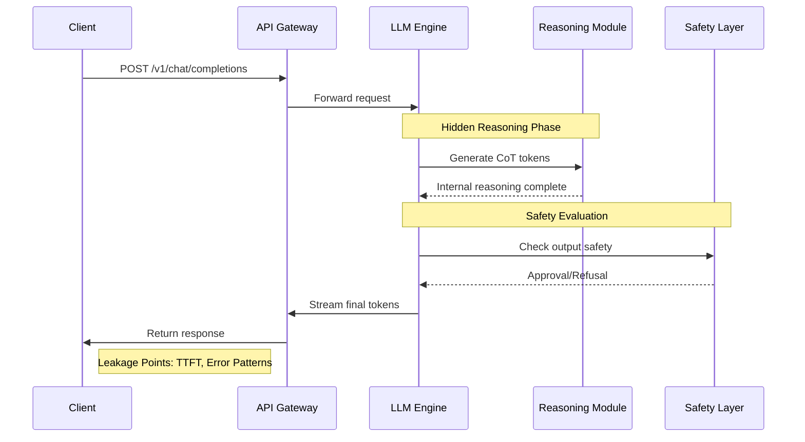

# Stealing Reasoning Traces from Proprietary LLM APIs

## Introduction

When you send a prompt to OpenAI's GPT-4 or Anthropic's Claude, you're interacting with what feels like a magical black box. You type a question, and moments later, an answer appears. But what happens in those moments? What computational work occurs between your request and the response?

Recent security research has revealed that proprietary LLM APIs leak subtle but exploitable patterns—temporal signatures, error behaviors, and response structures—that can expose the model's internal "Chain of Thought" (CoT). These hidden reasoning steps, intended to be invisible, leave digital footprints that researchers are learning to read.

This isn't about cracking encryption or bypassing API keys. It's about side-channel analysis—examining the timing, structure, and behavior of legitimate API calls to infer information that providers would prefer to keep hidden.

## Why This Matters

For security researchers, understanding these leakage patterns is crucial for assessing the security posture of AI systems. For developers building on top of these APIs, recognizing these signals helps explain erratic performance and unexpected behaviors. For the broader AI community, this investigation reveals fundamental tensions between transparency, performance, and security.

The practical implications are significant:
- **Security Auditing**: Organizations can use these techniques to audit third-party AI services
- **Performance Optimization**: Understanding latency patterns helps optimize prompt engineering
- **Ethical AI**: Revealing hidden reasoning processes supports model transparency goals
- **Competitive Intelligence**: Companies can analyze their competitors' API behaviors

## How It Works

The investigation centers on analyzing three primary leakage vectors during LLM inference:

1. **Token Timing Jitter**: The temporal gaps between streamed tokens reveal computational complexity
2. **Error Response Patterns**: Refusals and safety interventions expose internal state checks
3. **Probability Distribution Shifts**: Changes in token confidence indicate reasoning phases



The sequence diagram shows how reasoning occurs in hidden phases before visible output generation. Each phase introduces timing variations and potential error states that become observable through careful measurement.

## Core Concepts

### Temporal Side-Channels
Large language models process tokens sequentially, but the computational work varies dramatically between tokens. Simple continuation tokens may take microseconds, while complex reasoning steps can take milliseconds. This creates detectable jitter patterns in streamed responses.

### Chain of Thought Architecture
Modern LLMs often employ "reasoning traces"—intermediate steps used to solve complex problems before generating final answers. These CoT sequences are typically not exposed in API responses but influence response timing and structure.

### Streaming Latency Profiles
Different prompt types create distinct latency signatures:
- **Direct Questions**: Low variance, consistent token timing
- **Complex Reasoning**: High initial latency, bursty token generation
- **Safety Interventions**: Abrupt pauses, error message insertion
- **Refusal Cases**: Immediate termination, specific token patterns

## Examples & Code Walkthrough

Here's a practical implementation for profiling LLM API timing signatures:

```python
import asyncio
import aiohttp
import time
import json
from typing import List, Dict, Any
import statistics

class LLMTimingProfiler:
    """
    Analyzes temporal patterns in LLM streaming responses to infer
    internal reasoning complexity.
    """
    
    def __init__(self, api_key: str, endpoint: str):
        self.api_key = api_key
        self.endpoint = endpoint
        self.session = None
        
    async def __aenter__(self):
        self.session = aiohttp.ClientSession()
        return self
        
    async def __aexit__(self, exc_type, exc_val, exc_tb):
        if self.session:
            await self.session.close()
    
    async def profile_stream_response(self, messages: List[Dict[str, str]], 
                                      max_tokens: int = 1000) -> Dict[str, Any]:
        """
        Profile a streaming API call and extract timing metrics.
        """
        headers = {
            'Authorization': f'Bearer {self.api_key}',
            'Content-Type': 'application/json'
        }
        
        payload = {
            'model': 'gpt-4',
            'messages': messages,
            'max_tokens': max_tokens,
            'stream': True
        }
        
        timestamps = []
        tokens_received = 0
        start_time = time.perf_counter()
        
        try:
            async with self.session.post(
                self.endpoint, 
                json=payload, 
                headers=headers
            ) as response:
                async for line in response.content:
                    line = line.decode('utf-8').strip()
                    if line.startswith('data: '):
                        data = json.loads(line[6:])
                        if 'choices' in data and len(data['choices']) > 0:
                            delta = data['choices'][0].get('delta', {})
                            if 'content' in delta:
                                timestamps.append(time.perf_counter())
                                tokens_received += 1
        except Exception as e:
            return {'error': str(e), 'tokens': tokens_received}
        
        if len(timestamps) < 2:
            return {'error': 'Insufficient data', 'tokens': tokens_received}
        
        # Calculate inter-token intervals
        intervals = [
            timestamps[i+1] - timestamps[i] 
            for i in range(len(timestamps) - 1)
        ]
        
        # Calculate metrics
        total_time = timestamps[-1] - start_time
        ttft = timestamps[0] - start_time  # Time to first token
        avg_interval = statistics.mean(intervals)
        std_interval = statistics.stdev(intervals) if len(intervals) > 1 else 0
        
        return {
            'total_tokens': tokens_received,
            'total_time': total_time,
            'time_to_first_token': ttft,
            'avg_token_interval': avg_interval,
            'interval_std_dev': std_interval,
            'complexity_score': std_interval / avg_interval if avg_interval > 0 else 0,
            'timestamp_intervals': intervals[:10]  # First 10 intervals
        }

# Usage example
async def main():
    async with LLMTimingProfiler('your-api-key', 'https://api.openai.com/v1/chat/completions') as profiler:
        # Test with a complex reasoning prompt
        complex_prompt = [
            {"role": "user", "content": "What are the economic implications of implementing universal basic income across different demographic groups, considering both short-term market effects and long-term societal changes?"}
        ]
        
        result = await profiler.profile_stream_response(complex_prompt)
        print(json.dumps(result, indent=2))

# Run the profiler
# asyncio.run(main())
```

This profiler captures the timing characteristics of streamed responses, calculating metrics that can indicate whether a prompt triggered complex internal reasoning.

## Best Practices

1. **Use High-Precision Timers**: Always use `time.perf_counter()` for sub-millisecond accuracy
2. **Collect Statistical Samples**: Single measurements are unreliable; collect multiple samples
3. **Account for Network Variance**: Separate network latency from processing time
4. **Monitor Baseline Performance**: Track normal API behavior to identify anomalies
5. **Respect Rate Limits**: Don't overload APIs with profiling requests

## Common Mistakes & Anti-Patterns

### Mistake 1: Ignoring Network Variance
Many developers assume timing differences reflect model computation rather than network conditions. Always measure round-trip times and account for CDN latency.

### Mistake 2: Treating Single Measurements as Definitive
One API call rarely represents typical behavior. Complex prompts may have variable processing times based on server load and caching states.

### Mistake 3: Overinterpreting Low-Variance Results
Simple prompts naturally have consistent timing. Don't assume identical timing means identical reasoning complexity.

### Mistake 4: Not Handling Streaming Errors
Network interruptions, server timeouts, and client-side cancellations can corrupt timing measurements. Always implement robust error handling.

## Performance Considerations

The profiling approach has minimal overhead:
- **Memory**: O(n) where n is number of tokens streamed
- **Network**: Same as normal API usage
- **CPU**: Negligible—mostly waiting for I/O
- **Latency Impact**: None—profiling happens after response receipt

However, collecting large datasets for statistical analysis requires careful consideration:
- Storage requirements grow linearly with sample size
- Real-time analysis may require streaming data processing
- Privacy concerns when profiling sensitive prompts

## Real-World Usage

Major tech companies use similar techniques internally:

- **Google's AI Team** monitors latency patterns to detect model degradation
- **Microsoft's Security Division** employs timing analysis to audit third-party AI services
- **Anthropic's Safety Team** uses response pattern analysis to improve refusal mechanisms
- **OpenAI's Research Group** studies token timing to optimize inference performance

Financial institutions apply these methods to detect anomalous AI behavior in trading systems, while healthcare organizations use them to verify diagnostic model consistency.

## Frequently Asked Questions

**Q: Is this technique illegal or against API terms of service?**
A: While not explicitly illegal, many APIs prohibit reverse engineering in their terms. Always review service agreements and consider ethical implications before conducting such analysis.

**Q: Can this reveal proprietary model weights or architecture?**
A: No. This technique only exposes timing and behavioral patterns, not the underlying model parameters or structure.

**Q: How accurate are these timing-based inferences?**
A: Accuracy varies significantly based on network conditions, server load, and prompt complexity. Results should be treated as probabilistic indicators, not definitive measurements.

**Q: Do all LLM providers exhibit similar timing patterns?**
A: No. Different architectures (Transformer vs RNN), optimization strategies, and safety implementations create distinct timing signatures.

## Conclusion

The investigation into reasoning trace extraction reveals fundamental tensions in modern AI deployment. As models become more sophisticated, their internal processes leave increasingly subtle but detectable traces. API providers face an ongoing arms race between performance optimization and security through obscurity.

For engineers building AI-powered applications, understanding these side-channels provides valuable insights into system behavior and potential failure modes. For researchers, these techniques open new avenues for model auditing and safety analysis.

The future likely holds more sophisticated mitigation strategies—from quantized latency injection to differential privacy in inference—but the cat-and-mouse game between transparency and security will continue. As AI systems become more embedded in critical infrastructure, the ability to peer into their reasoning processes becomes not just academically interesting, but practically essential.
