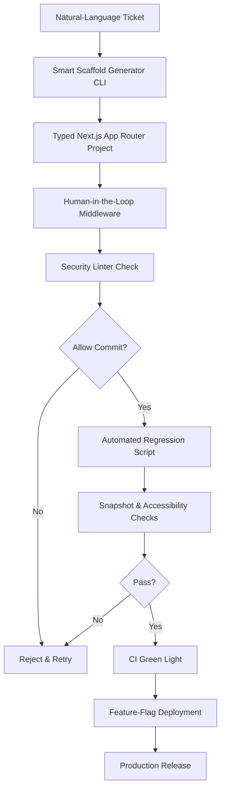

# Supercharging PoC Development with AI: A Smarter, Faster Approach

## Introduction  
We start with a simple observation: every engineering team has built a prototype to validate an idea, only to find the code is a tangled mess of quick fixes. The same prototype often becomes a technical debt anchor when the decision to keep or discard it is delayed. This article walks through a concrete pipeline that keeps the speed of a prototype while enforcing the discipline of production‑grade code.

## Why This Matters  
Prototyping is a necessary risk‑ mitigation step. Without it, we ship features that users never need. At the same time, a poorly structured prototype can stall a product roadmap. The balance is not just a matter of tools; it is about creating a repeatable workflow that lets AI generate scaffolding, but still gives the team control over security, quality, and maintainability. The approach described below reduces the time from ticket to a runnable demo from days to hours, while keeping the resulting code lint‑clean and testable.

## How It Works  
The pipeline can be visualized as a feedback loop where AI supplies initial code, humans validate and steer, and automated checks guarantee baseline quality before any merge.



The diagram shows the handoff from a plain ticket description to a fully checked and deployable prototype. Each arrow represents a step where either AI or a human decision point occurs, ensuring that the prototype never bypasses essential validation.

## Core Concepts  
The system rests on three pillars:

1. **Scaffold Generation** – A CLI that parses a ticket description and writes a canonical Next.js App Router layout, complete with shadcn/ui components and a mock service worker. The output is a fully typed project ready for local development.
2. **Human‑in‑the‑Loop Gate** – A TypeScript middleware that sits in front of the commit pipeline. It tracks token usage per endpoint, runs a configurable security linter (e.g., ESLint with custom rules), and only proceeds if the checks pass.
3. **Automated Regression** – A Python script that launches a headless browser, captures a snapshot of each generated React component, and flags visual regressions or accessibility anti‑patterns such as missing `alt` attributes or keyboard traps.

The handoff protocol defines how to promote a prototype to production: feature flags isolate the new code, migrations are generated automatically, and the mock service layer is swapped for real APIs without rewriting the client logic.

## Examples & Code Walkthrough  

### Smart Scaffold Generator (Node.js CLI)  
```typescript
// scaffold-gen.ts
import { execSync } from 'child_process';
import fs from 'fs';
import path from 'path';
import yargs from 'yargs';
import { hideBin } from 'yargs/helpers';

interface Ticket {
  title: string;
  description: string;
  components?: string[];
}

const argv = yargs(hideBin(process.argv))
  .option('ticket', { type: 'string', demandOption: true })
  .parseSync();

const ticket: Ticket = JSON.parse(argv.ticket);

const projectRoot = path.join(process.cwd(), ticket.title.replace(/\s+/g, '-'));
fs.mkdirSync(projectRoot, { recursive: true });

/**
 * Creates a basic next.config.js for App Router.
 */
fs.writeFileSync(
  path.join(projectRoot, 'next.config.js'),
  `
/ /** @type {import('next').NextConfig} */
const nextConfig = {
  experimental: { appDir: true },
  eslint: { dirs: ['src'] },
};

module.exports = nextConfig;
`
);

/**
 * Generates package.json with required scripts and dependencies.
 */
const pkg = {
  name: ticket.title.toLowerCase().replace(/\s+/g, '-'),
  version: '0.1.0',
  private: true,
  scripts: {
    dev: 'next dev',
    build: 'next build',
    start: 'next start',
    lint: 'eslint src',
    test: 'jest',
  },
  dependencies: {
    next: '14.0.4',
    react: '18.2.0',
    'react-dom': '18.2.0',
    '@radix-ui/react-slot': '1.0.2',
    classnames: '2.3.2',
  },
  devDependencies: {
    eslint: '8.53.0',
    'eslint-config-next': '14.0.4',
    typescript: '5.3.2',
    '@types/node': '20.9.0',
    '@types/react': '18.2.37',
    '@types/react-dom': '18.2.17',
    jest: '29.7.0',
    '@jest/globals': '29.7.0',
  },
};
fs.writeFileSync(
  path.join(projectRoot, 'package.json'),
  JSON.stringify(pkg, null, 2)
);

/**
 * Creates src/pages/_app.tsx with shadcn/ui theme provider.
 */
const appContent = `
import '@/styles/globals.css';
import { ThemeProvider } from '@/components/theme-provider';
import type { AppProps } from 'next/app';

export default function App({ Component, pageProps }: AppProps) {
  return (
    <ThemeProvider>
      <Component {...pageProps} />
    </ThemeProvider>
  );
}
`;
fs.writeFileSync(path.join(projectRoot, 'src', 'pages', '_app.tsx'), appContent);

/**
 * Generates a simple dashboard page based on ticket description.
 */
const pageContent = `
import { Card, CardContent, CardHeader, CardTitle } from '@/components/ui/card';
import { useEffect, useState } from 'react';

export default function Dashboard() {
  const [notifications, setNotifications] = useState([]);

  useEffect(() => {
    // Mock service worker will intercept /api/notifications
    fetch('/api/notifications')
      .then((r) => r.json())
      .then(setNotifications)
      .catch(console.error);
  }, []);

  return (
    <div className="p-6">
      <Card>
        <CardHeader>
          <CardTitle>Real‑time Notifications</CardTitle>
        </CardHeader>
        <CardContent>
          <ul>
            {notifications.map((n: any) => (
              <li key={n.id}>{n.message}</li>
            ))}
          </ul>
        </CardContent>
      </Card>
    </div>
  );
}
`;
fs.mkdirSync(path.join(projectRoot, 'src', 'pages'), { recursive: true });
fs.writeFileSync(path.join(projectRoot, 'src', 'pages', 'index.tsx'), pageContent);

/**
 * Creates a mock service worker for /api/*
 */
fs.mkdirSync(path.join(projectRoot, 'src', 'mocks'), { recursive: true });
fs.writeFileSync(
  path.join(projectRoot, 'src', 'mocks', 'worker.ts'),
  `
import { setupWorker } from 'msw';
import { rest } from 'msw';

export const handlers = [
  rest.get('/api/notifications', (req, res, ctx) => {
    return res(
      ctx.json([
        { id: 1, message: 'Welcome to the prototype!' },
        { id: 2, message: 'AI generated this page.' },
      ])
    );
  }),
];

const worker = setupWorker(...handlers);
worker.start();
`
);

console.log(\`Project \${ticket.title} bootstrapped at \${projectRoot}\`);
```

The CLI expects a JSON string of the ticket via `--ticket`. It creates a fully typed Next.js App Router project with a dashboard page, a theme provider, and a mock service worker that serves dummy notifications. The generated code is ready for `npm run dev`.

### Human‑in‑the‑Loop Gate (TypeScript Middleware)  
```typescript
// src/middleware/hitl-gate.ts
import { Request, Response, NextFunction } from 'express';
import { execSync } from 'child_process';
import fs from 'fs';
import path from 'path';

/**
 * Middleware that validates AI‑generated routes before committing.
 * Logs token consumption per endpoint and runs a security linter.
 */
export function hitlGate(req: Request, res: Response, next: NextFunction) {
  const routePath = req.path; // e.g., /api/users
  const repoRoot = process.env.REPO_ROOT ?? process.cwd();

  // 1. Log token usage (simplified: read from .ai-usage.json)
  const usageFile = path.join(repoRoot, '.ai-usage.json');
  let usage = {};
  if (fs.existsSync(usageFile)) {
    usage = JSON.parse(fs.readFileSync(usageFile, 'utf8'));
  }
  const current = (usage[routePath] || 0) + 1;
  usage[routePath] = current;
  fs.writeFileSync(usageFile, JSON.stringify(usage, null, 2));

  // 2. Run security linter (ESLint with custom rule set)
  try {
    // Assumes ESLint is installed and configured at repoRoot/.eslintrc.json
    execSync('npx eslint src --fix', { cwd: repoRoot, stdio: 'pipe' });
  } catch (err) {
    // Lint failures abort the pipeline
    console.error('Security linter failed for', routePath, err);
    return res.status(400).json({
      error: 'Security linting failed',
      details: (err as Error).message,
