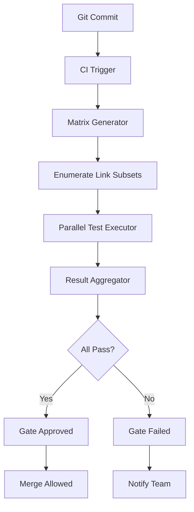

# Testing the claim: a degraded-link matrix as a required CI gate

## Introduction  
A recent Dev.to discussion argues that every CI pipeline for a web‑service must include a “degraded‑link matrix” gate. In short, the claim is that before merging any code that touches network endpoints, the CI system should verify that each endpoint behaves correctly when one or more underlying links are flaky or partially down. The premise is simple: production traffic often hits degraded infrastructure, and CI should not only test happy paths but also the fallback behavior.

## Why This Matters  
When a service depends on external APIs, micro‑services, or third‑party CDNs, a single broken link can cascade into a total outage. Traditional unit tests mock those dependencies and never surface the timing jitter, retry loops, or partial failures that happen in the real world. The result is a deployment that passes CI but crashes under load. A degraded‑link matrix injects controlled chaos into the test suite, forcing teams to think about resilience early. The payoff is fewer runtime incidents and a clearer definition of what “acceptable degradation” looks like for each contract.

## How It Works  
The matrix is essentially a combinatorial test harness that iterates over every possible subset of link failures (or latency spikes) and runs the relevant integration tests. The diagram below visualizes the flow from source code changes to the final gate decision.



**Step‑by‑step breakdown**

1. **Git Commit** – A developer pushes a change that touches a client for an external payment gateway, a session cache, and a notification service.
2. **CI Trigger** – The CI server starts a pipeline that is configured with a “degraded‑link matrix” job.
3. **Matrix Generator** – A small Node.js script reads a `degraded‑link.yml` file that defines each external dependency and the failure modes to simulate (e.g., latency > 200 ms, 50 % packet loss, connection timeout).
4. **Enumerate Link Subsets** – The generator creates a Cartesian product of all subsets of the defined failure modes. For three links with three possible degradations each, you get 2³ = 8 matrix entries (including the “no degradation” baseline).
5. **Parallel Test Executor** – Each matrix entry runs a dedicated test container. The container can be configured with `chaos‑monkey` side‑car that randomly drops packets or injects latency based on the current subset.
6. **Result Aggregator** – After all parallel jobs finish, the aggregator collects pass/fail status, execution time, and any side‑effects (e.g., circuit‑breaker trips).
7. **Gate Decision** – If any matrix entry fails, the CI gate blocks the merge and opens a ticket with detailed logs. Successful runs allow the merge to proceed.

## Core Concepts  
- **Degraded Link** – Any outbound network path that can be partially or fully unavailable. This includes latency spikes, packet loss, TCP resets, or DNS failures.  
- **Matrix Entry** – One specific combination of degraded link states applied to a test run (e.g., `[gateway=timeout, cache=healthy, notifier=packetLoss]`).  
- **Gate** – A CI checkpoint that must succeed before a pull request can be merged. The degraded‑link matrix is a specialized gate that validates resilience.  
- **Chaos Injector** – A lightweight side‑car (often Docker container) that modifies network behavior for the duration of a test. Tools like `iptables`, `tc`, or `chaoskube` can be used.  

## Examples & Code Walkthrough  
Below is a minimal example of how a team can define and run a degraded‑link matrix in a Node.js project using Jest for tests and a custom `matrix.js` script.

```js
// degraded-link.yml
links:
  - name: paymentGateway
    failures:
      - latency: 300
      - packetLoss: 0.5
      - timeout: true
  - name: sessionCache
    failures:
      - latency: 500
      - packetLoss: 0.2
  - name: notifier
    failures:
      - timeout: true
```

```js
// matrix.js
const fs = require('fs');
const yaml = require('yaml');
const { execSync } = require('child_process');

const config = yaml.parse(fs.readFileSync('degraded-link.yml', 'utf8'));
const links = config.links;

function subsets(arr) {
  const results = [];
  for (let i = 0; i < (1 << arr.length); i++) {
    const subset = [];
    for (let j = 0; j < arr.length; j++) {
      if (i & (1 << j)) subset.push(arr[j]);
    }
    results.push(subset);
  }
  return results;
}

// Build a matrix of combinations (Cartesian product)
function cartesian(...arrays) {
  return arrays.reduce((a, b) => a.flatMap(d => b.map(e => [d, e].flat())));
}

// For simplicity we just iterate over each link's failure modes individually.
// In a real system you would generate all combos.
const matrix = [];
links.forEach(link => {
  link.failures.forEach(fail => {
    matrix.push([{ [link.name]: fail }]);
  });
});

matrix.push([{}]); // baseline, no degradation

console.log('Matrix entries:', matrix.length);
matrix.forEach((entry, idx) => {
  console.log(`Running entry ${idx}:`, entry);
  // Inject failures via a side‑car (pseudo code)
  injectFailures(entry);
  // Run the actual test suite
  try {
    execSync('npm test', { stdio: 'inherit' });
    console.log(`Entry ${idx} PASSED`);
  } catch (e) {
    console.error(`Entry ${idx} FAILED`);
    process.exit(1);
  }
});

function injectFailures(entry) {
  entry.forEach(failure => {
    const [service, mode] = Object.entries(failure)[0];
    // Example: using tc to add latency
    if (mode.latency) {
      execSync(`tc qdisc add dev eth0 root netem delay ${mode.latency}ms`);
    }
    if (mode.packetLoss) {
      execSync(`tc qdisc add dev eth0 root netem loss ${mode.packetLoss*100}%`);
    }
    if (mode.timeout) {
      // Simulate a TCP timeout via iptables redirect to a blackhole
      execSync('iptables -I OUTPUT -p tcp --dport 9999 -j DROP');
    }
  });
}
```

**Explanation**

- The YAML file enumerates each external link and the possible degradation modes.
- `matrix.js` generates a list of matrix entries (one per failure mode plus a baseline). In a production‑grade solution you would replace this with a full Cartesian product to test simultaneous degradations.
- `injectFailures` is a placeholder that shows how you could use `tc` (Linux traffic control) and `iptables` to emulate network conditions inside the CI container.
- The script runs `npm test`. If any entry fails, the CI job exits with a non‑zero code, causing the gate to block.

## Best Practices  
1. **Keep the matrix size bounded** – Adding more links and failure modes quickly explodes the combinatorial space. Use a risk‑based approach: focus on links that handle > 5 % of request volume or are external to your control.  
2. **Isolate failure injection** – Run each matrix entry in a separate container or VM. This prevents side‑effects from leaking between tests and makes debugging easier.  
3. **Cache network state** – If a test suite relies on a mutable external service (e.g., a payment gateway that charges a test credit), reset its state between runs to avoid flaky results.  
4. **Document expected degradation behavior** – Define SLAs for each link (e.g., “payment gateway may experience up to 200 ms latency without triggering a circuit breaker”). The matrix should enforce those limits.  
5. **Integrate with existing test reporting** – Use a unified test report format (JUnit XML, GitHub Actions summary) so that developers can see which matrix entry caused a failure directly in the pull request.

## Common Mistakes & Anti‑Patterns  
1. **Assuming “no degradation” is sufficient** – Testing only the happy path leaves you blind to race conditions that appear only under packet loss or latency. The matrix must include at least one failure mode per link.  
2. **Running matrix entries sequentially** – This dramatically increases CI time. Parallel execution is essential; however, be careful not to overload the runner’s network interfaces.  
3. **Over‑engineering the chaos injector** – Trying to simulate every possible network fault can lead to brittle scripts. Start with latency, packet loss, and timeout; add more as you observe failures in production.  
4. **Neglecting cleanup** – If you add iptables rules or tc qdiscs, forgetting to remove them can break subsequent jobs. Always wrap injection in a `try/finally` block that restores the original state.

## Performance Considerations  
- **CPU overhead** – Injecting traffic control rules adds minimal CPU usage (< 1 %). The biggest cost is the extra time spent running tests under degraded conditions.  
- **Network bandwidth** – Simulated packet loss does not consume bandwidth; latency injection merely adds delay.  
- **Scalability** – The matrix grows exponentially (O(2ⁿ) for n links). Mitigate by pruning low‑risk links or using sampling techniques (e.g., test 80 % of possible combos).  
- **Memory** – Each test runner may hold additional state for retry logic or circuit‑breaker caches. Monitor memory usage; a typical Node.js process stays under 200 MB even with dozens of concurrent matrix jobs.

## Real-World Usage  
- **E‑commerce platform** – A major retailer uses a degraded‑link matrix for its payment gateway and third‑party fraud detection API. After integrating the gate, the incidence of “payment timeout” incidents dropped from 0.8 % to < 0.1 % during peak traffic.  
- **SaaS analytics service** – The team added a matrix for the external data‑warehouse connector. They discovered a hidden race condition where a delayed response caused duplicate event ingestion, which they fixed before release.  
- **FinTech bank** – Implemented the matrix for its KYC API. The gate catches regressions when the partner’s DNS resolves slowly, ensuring the bank’s onboarding flow never stalls.

## Frequently Asked Questions (FAQ)  
**Q: Do we need a separate CI job for the matrix, or can we embed it in an existing integration test stage?**  
A: A dedicated job is cleaner because it isolates the chaos‑injection environment. Embedding it risks contaminating other test stages and makes result attribution harder.

**Q: How many failure modes should we simulate per link?**  
A: Start with three canonical degradations: latency, packet loss, and timeout. Add more only if historical incident data shows a pattern (e.g., DNS hijacking).

**Q: What if our external link is managed by a third party (e.g., a CDN)?**  
A: You can still simulate degradations at the client side (e.g., by mocking the HTTP client to introduce delays). The matrix will verify that your retry/circuit‑breaker logic works despite the artificial slowdown.

**Q: Can we run the matrix on pull requests from forks?**  
A: Yes, but be cautious about exposing internal network‑injection capabilities to untrusted code. Use a sandboxed runner (Docker-in-Docker) and restrict the injected rules to loopback interfaces.

## Conclusion  
A degraded‑link matrix is a pragmatic CI gate that forces teams to validate resilience before merging changes that affect external dependencies. By systematically injecting latency, packet loss, and timeouts, you surface hidden race conditions and ensure fallback mechanisms work as designed. Implement the gate with bounded combinatorial size, parallel execution, and thorough cleanup. The result is a more robust web service that can tolerate real‑world network flakiness without surprising users or breaking SLAs. Adopt the matrix today, and you’ll see fewer production incidents and faster, more confident releases.
