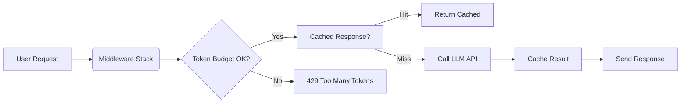

# The Hidden Taxes of Prompt-Only AI

## Introduction

Last month, a startup launched a chatbot feature that went viral on Product Hunt. Within six hours, their cloud bill had spiked by $4,000. There was no caching, no rate limiting, and certainly no token budgeting. Just `fetch()` calls to OpenAI, one after another, each one billed per token.

This isn't an isolated incident. It's a pattern I've seen across dozens of teams adopting LLMs naively—what I call **prompt-only AI**.

What is prompt-only AI? It's when developers treat the LLM like a simple API endpoint, sending raw prompts directly from route handlers without any architectural buffering, observability, or resource management. Sounds familiar?

Let's break down why this approach fails in production—and what you can do instead.

## Why This Matters

If you're building web applications that integrate with LLMs, you're probably thinking about prompts, models, and maybe even fine-tuning. But are you thinking about cost control, latency mitigation, or semantic caching?

Prompt-only AI leads to three major production failures:

1. **Cost explosions**: Without token budgets or usage tracking, every request hits your wallet.
2. **Latency debt**: Cold starts and unbounded context windows make users wait.
3. **Operational blindness**: No metrics, no retries, no fallbacks means debugging nightmares.

These aren't theoretical concerns—they’re happening right now in production clusters.

## How It Works

To understand the problem—and the solution—we need to look at how LLM integrations should be architected versus how they often are.

### The Problem: Naive Prompt Flow


This flow lacks:
- Token estimation before dispatch
- Caching layers
- Retry logic
- Observability hooks

### The Fix: Buffered LLM Pipeline



Here’s what changes:
- Middleware inspects payloads for token counts
- Cache intercepts repeated queries
- Background refresh keeps data fresh
- Metrics track spend per endpoint

Each layer adds resilience and visibility into the system.

## Core Concepts

Before diving into code, let’s define the core components of a robust LLM pipeline:

| Component              | Purpose                                      |
|-----------------------|----------------------------------------------|
| Token Estimator       | Predicts input/output length                 |
| Budget Enforcer       | Limits tokens by route/user/session          |
| Semantic Cache        | Stores results keyed by prompt hash          |
| Streaming Adapter     | Handles chunked responses efficiently        |
| Observability Hook    | Logs metrics like cost, latency, errors      |

Together, these form a defensive stack that prevents runaway costs and improves UX.

## Examples & Code Walkthrough

Let’s build two critical pieces: token budgeting and semantic caching.

### 1. Token Budget Enforcement

We’ll create a middleware that estimates tokens and enforces limits per route.

```javascript
const crypto = require('crypto');

class TokenBudgetMiddleware {
  constructor(options = {}) {
    this.limitPerRoute = options.limitPerRoute || 4096;
    this.counters = new Map();
  }

  // Rough estimate: ~4 chars/token
  estimateTokens(text) {
    return Math.ceil((text || '').length / 3.7);
  }

  async inspect(req, res, next) {
    const route = req.route?.path || req.path || 'unknown';
    const prompt = req.body?.prompt || '';

    const tokens = this.estimateTokens(prompt);
    const currentUsage = (this.counters.get(route) || 0) + tokens;

    this.counters.set(route, currentUsage);

    if (currentUsage > this.limitPerRoute) {
      req.llmBlocked = true;
      return res.status(429).json({
        error: 'Token budget exceeded',
        route,
        used: currentUsage,
        limit: this.limitPerRoute,
        suggestion: 'Reduce prompt size or upgrade plan.'
      });
    }

    req.tokenEstimate = tokens;
    next();
  }

  resetCounter(route) {
    this.counters.delete(route);
  }
}
```

Usage:
```javascript
app.use('/chat', new TokenBudgetMiddleware({ limitPerRoute: 2048 }));
```

### 2. Stale-While-Revalidate Cache Layer

Next, we implement a cache that serves stale responses while refreshing in the background.

```javascript
const fs = require('fs').promises;
const path = require('path');

class LLMCacheLayer {
  constructor(backend, ttlMs = 300_000, staleMs = 3_600_000) {
    this.backend = backend; // e.g., Redis client
    this.ttl = ttlMs;
    this.stale = staleMs;
    this.store = new Map();
  }

  keyFor(prompt) {
    return crypto
      .createHash('sha256')
      .update(prompt.trim().toLowerCase())
      .digest('hex')
      .slice(0, 16);
  }

  async complete(prompt) {
    const k = this.keyFor(prompt);
    const entry = this.store.get(k);
    const now = Date.now();

    if (!entry) return await this._fresh(k, prompt);

    if (now - entry.ts < this.ttl) {
      return { ...entry, hit: true };
    }

    if (now - entry.ts < this.stale) {
      this._bgRefresh(k, prompt);
      return { ...entry, hit: true, stale: true };
    }

    return await this._fresh(k, prompt);
  }

  async _fresh(k, prompt) {
    try {
      const result = await this.backend.complete(prompt);
      const entry = {
        ts: Date.now(),
        value: result,
        hit: false
      };
      this.store.set(k, entry);
      return entry;
    } catch (err) {
      console.error(`[CACHE] Failed to fetch fresh response: ${err.message}`);
      return null;
    }
  }

  _bgRefresh(k, prompt) {
    setImmediate(async () => {
      try {
        const updated = await this._fresh(k, prompt);
        if (updated) {
          console.log(`[CACHE] Refreshed entry for key: ${k}`);
        }
      } catch (err) {
        console.warn(`[CACHE] Background refresh failed: ${err.message}`);
      }
    });
  }
}
```

This design ensures fast replies even under high load, with graceful degradation during failures.

## Best Practices

Here are actionable guidelines for production-grade LLM pipelines:

1. **Always estimate tokens upfront** – Never send a prompt without knowing its cost impact.
2. **Use TTL-based caches aggressively** – Even approximate matches help reduce redundant calls.
3. **Implement circuit breakers** – If the LLM service flaps, don’t cascade failure downstream.
4. **Log everything** – Spans, latencies, token usage—all must feed into dashboards.
5. **Rate-limit aggressively** – Users shouldn’t hammer endpoints beyond fair usage.

## Common Mistakes & Anti-Patterns

### 1. Raw Prompt Injection

❌ Bad:
```javascript
res.json(await openai.chat({ messages: [{ role: 'user', content: req.query.text }] }));
```

✅ Good:
```javascript
const sanitized = sanitizeInput(req.query.text);
const prompt = formatPrompt(template, sanitized);
const response = await llmClient.send(prompt);
```

### 2. Infinite Context Growth

❌ Bad:
```javascript
messages.push({ role: 'user', content: userInput });
// Never trimmed – grows forever
```

✅ Good:
```javascript
if (messages.length > MAX_HISTORY) {
  messages.splice(1, messages.length - MAX_HISTORY);
}
```

### 3. Missing Observability

❌ Bad:
```javascript
await openai.embeddings(input);
```

✅ Good:
```javascript
const start = Date.now();
const embedding = await openai.embeddings(input);
metrics.histogram('llm_call_duration_seconds', (Date.now() - start) / 1000);
```

## Performance Considerations

LLM pipelines introduce unique constraints:

- **CPU overhead**: Hashing prompts, serializing JSON
- **Memory pressure**: Large embeddings stored in-process
- **Network latency**: Round-trip time dominates small payloads
- **Scalability ceiling**: Most providers cap concurrent requests (~100–500 RPS)

For high-throughput systems, offload work to queues or worker pools.

## Real-World Usage

Top companies handle this differently:

- **Netflix**: Uses internal LLM gateways with strict SLAs, automatic retries, and shadow traffic replay.
- **Uber**: Implements multi-region failover with fallback to deterministic rules when LLMs fail.
- **Cloudflare**: Runs inference inside workers with aggressive caching and edge-level controls.

All avoid direct prompt-only flows—they always insert middleware layers.

## Frequently Asked Questions (FAQ)

**Q: Should I cache all LLM responses?**  
A: Not blindly—use semantic similarity checks to decide relevance. Exact-match caching works for FAQs but not dynamic queries.

**Q: How do I prevent prompt injection attacks?**  
A: Sanitize inputs, validate schema, and never trust user-supplied instructions.

**Q: Can I run LLMs locally for better control?**  
A: Yes, but consider model size vs. performance trade-offs. Smaller models may lack accuracy.

**Q: What’s the best way to monitor LLM costs?**  
A: Tag each call with metadata (user ID, feature flag) and export to analytics tools.

## Conclusion

Prompt-only AI looks easy until it breaks your budget or your SLA.

By inserting smart middleware—token budgeting, caching, observability—you gain control over cost, latency, and reliability. These aren’t optional add-ons; they’re foundational to scalable LLM-powered apps.

Start implementing these patterns today. Your finance team—and your users—will thank you.
