# The Kubernetes Checklist for Teams Without a Platform Team

## Introduction

Running a containerized application out in open source doesn't mean you have to wrestle with every infrastructure detail manually. Many web development groups spin up a Kubernetes cluster to get the benefits of orchestration, auto-scaling, and rolling updates—but they don't have a dedicated platform team to maintain the plumbing. That creates friction at the team level: developers spend time troubleshooting config drift, hitting quota walls, or waiting for someone else to provision a new namespace. This checklist walks you through a pragmatic, step-by-step process that lets you work safely within a Kubernetes environment even without a formal platform group. It balances safety with speed, giving you enough guardrails to ship confidently while keeping operational debt low.

## Why This Matters

Teams without a platform team face a particular set of pressures. There's usually limited budget for external tools, which means every dollar spent on infrastructure matters. When a developer tries to scale their service beyond expected traffic, they encounter resource exhaustion—CPU throttling, memory pressure, or pod evictions—that stem from missing quotas or misconfigured limits. At the same time, inconsistent deployment practices lead to subtle bugs that surface only after production goes live. A few well-chosen checks can prevent these common pain points before they become emergencies. The goal isn't to replicate what a large platform team would do exhaustively—it's to embed just enough discipline into your daily workflow so that the cluster stays healthy, predictable, and secure without requiring constant hand-holding.

## How It Works

The essence of this approach is layered validation and enforcement. Before you submit any workload, you verify that the cluster is reachable and that your connection details are still valid. Then you define boundaries with resource quotas so no single team can monopolize resources. Finally, you deploy a minimal service using standard manifests that the cluster controller can manage automatically. The architecture feels straightforward because each layer handles a distinct concern: connectivity checks provide quick feedback; quotas distribute capacity fairly; and declarative deployment files make every change auditable and reversible.

The following diagram captures the core flow of a request and its associated pod lifecycle inside the cluster.

```mermaid
flowchart LR
    A[Developer Submits Change] --> B[CI Build Pipeline]
    B --> C[Container Image Scanned]
    C --> D[Registry Push]
    D --> E[Create Namespace with Quotas]
    E --> F[Scheduler Places Pod]
    F --> G[Workload Runs on Node]
    G --> H[Observability Collector]
    H --> I[Metrics Displayed]
    style A fill:#f9f,stroke:#333,stroke-width:2px
    style I fill:#e1f5fe,stroke:#333,stroke-width:2px
```



Each box represents a logical stage in the journey. The left side shows the workflow steps you execute locally or in automation; the right side shows how the cluster state evolves and is monitored. By treating each stage independently yet connected, you can iterate quickly while maintaining safety.

## Core Concepts

Understanding a handful of foundational ideas makes the checklist feel natural rather than arbitrary. **Namespaces** isolate environments—think of them as separate rentals for different projects—so your dev team can experiment without affecting production. **ResourceQuotas** act like a ceiling on consumption, preventing one namespace from eating all available CPU or memory. The **control plane**, consisting of the scheduler, controller manager, and other services, decides which pod runs on which node based on those rules. When a pod starts, the scheduler picks an available node, the controller watches for changes, and liveness probes keep the application responsive. Knowing these pieces reduces the cognitive load when configuring your first release.

## Examples & Code Walkthrough

Below are three concrete artifacts you can drop into a repository to start enforcing safe operations immediately. Each snippet is written from scratch to avoid accidental plagiarism.

### Health Verification Script

Before touching any cluster, confirm that your client has a working reference to the cluster and that the local tools are up to date. The following Bash script performs a series of sanity checks in a clean, non-destructive way.

```bash
#!/usr/bin/env bash
# cluster‑health.sh – quick sanity check for ad‑hoc Kubernetes usage
set -euo pipefail

# Verify kubectl is installed and reachable
kubectl version --client --output=yaml > /dev/null 2>&1 \
  && echo "✅ kubectl present" \
  || { echo "❌ kubectl not found"; exit 1; }

# Identify the active context and extract the cluster endpoint
current_ctx=$(kubectl config current-context)
cluster_endpoint=$(kubectl config view -o jsonpath='{.contexts[?(@.name=="${current_ctx}")].context.cluster}')
echo "Current context: ${current_ctx}"
echo "Cluster endpoint: ${cluster_endpoint}"

# Confirm the API server is reachable and at least one node exists
if kubectl get nodes --limit=1 > /dev/null 2>&1; then
  echo "✅ Cluster is reachable – at least one node reported"
else
  echo "❌ Unable to contact the API server – check networking or provider status"
  exit 2
fi
```

Run this script on a laptop or CI runner early in the development cycle. It gives immediate confidence that your connection is solid before you start building anything.

### Resource Quota Definition

Quotas stop noisy neighbors and give you predictability. The example below creates a `prod` namespace with explicit limits on CPU, memory, and pod count. Adjust the numbers to match your team's SLAs and observed growth patterns.

```yaml
# namespace‑quota.yaml
apiVersion: v1
kind: ResourceQuota
metadata:
  name: webteam-quota
  namespace: prod
spec:
  hard:
    requests.cpu: "8"          # Total CPU cores allowed per project
    requests.memory: "16Gi"    # Default memory requests
    limits.cpu: "12"           # Burst ceiling for spikes
    limits.memory: "24Gi"      # Burst memory limit
    pods: "20"                 # Maximum number of pods in this namespace
```

Applying this file with `kubectl apply -f namespace-quota.yaml` writes the policy into the cluster. Any attempt to exceed the defined limits will be rejected by the scheduler until you adjust the policy. This single artifact replaces dozens of CLI flags scattered across Helm charts or Terraform modules.

### Minimal Service Deployment

For demonstration, imagine a small Node.js web service that talks to a SQLite database running inside the same pod. Below is a two-stage Dockerfile followed by a deployment manifest. Both are intentionally kept simple so you can see exactly what happens behind the scenes.

#### Dockerfile

```dockerfile
# Builder stage – compile dependencies
FROM node:20-alpine AS builder
WORKDIR /src
COPY package*.json ./
RUN npm ci --ignore-scripts

# Copy source code and perform any pre‑build steps
COPY . .

# Run the build target that creates the production bundle
RUN npm run build

# Runtime stage – lean container with only the app binary
FROM node:20-alpine AS runtime
RUN apk add --no-cache sqlite-libs
WORKDIR /app
COPY --from=builder /src/dist ./dist
COPY --from=builder /src/package*.json ./
RUN npm ci --only=production

EXPOSE 3000
CMD ["node", "dist/server.js"]
```

The multi‑stage build keeps the final image small and removes the build tools that aren't needed at runtime.

#### Deployment Manifest

```yaml
apiVersion: apps/v1
kind: Deployment
metadata:
  name: webservice
  namespace: prod
spec:
  replicas: 3
  selector:
    matchLabels:
      app: webservice
  template:
    metadata:
      labels:
        app: webservice
    spec:
      containers:
        - name: webservice
          image: registry.example.com/webservice:latest
          ports:
            - containerPort: 3000
          envFrom:
            - secretRef:
                name: db-secret   # Holds SQLite path and credentials
          resources:
            requests:
              cpu: "1"
              memory: "512Mi"
            limits:
              cpu: "2"
              memory: "1Gi"
          readinessProbe:
            httpGet:
              path: /health
              port: 3000
            initialDelaySeconds: 10
            periodSeconds: 10
          livenessProbe:
            httpGet:
              path: /health
              port: 3000
            initialDelaySeconds: 30
            periodSeconds: 15
---
apiVersion: v1
kind: Service
metadata:
  name: webservice-svc
  namespace: prod
spec:
  type: ClusterIP
  selector:
    app: webservice
  ports:
    - protocol: TCP
      port: 80
      targetPort: 3000
```

The deployment declares three identical pods, each with a request limit equal to the burst ceiling defined earlier. The service exposes the application internally; external access would come through an Ingress if you wire one up later. The liveness and readiness probes give the control plane clear signals about pod health, enabling automatic recovery when the container crashes or stalls.

## Best Practices

Adopting this checklist works best when you treat it as part of your definition of done. Here are some proven habits:

- **Apply quotas early.** Don't wait until a project hits its limit and then panic. Set quotas during the planning phase alongside your story mapping.
- **Never bypass the health check.** If you skip the `cluster‑health.sh` verification, you risk breaking the cluster while assuming the script was correct. Treat it as a gate, not a suggestion.
- **Use declarative manifests everywhere.** Even a small service should be represented by YAML files. Tools like `kubectl diff` make it easy to spot unintended changes before applying.
- **Document the rationale.** When you create a new deployment or modify a quota, write a short comment explaining why. Future you will thank future you.
- **Automate testing.** Add unit tests that verify your manifests conform to expectations—e.g., ensuring a Service always routes to a matching Deployment.

## Common Mistakes & Anti-Patterns

One frequent error is over‑quoting. Setting limits too low prevents legitimate bursts during traffic spikes, forcing developers to fight the system instead of adapting. Conversely, leaving quotas unchecked leads to noisy neighbor problems that degrade performance for everyone.

Another trap is relying on manual interventions for configuration. When a team member forgets to update a Secret or misidentifies a namespace, the cluster can become opaque. Enforce the habit of changing anything in the cluster through a consistent workflow—ideally a Git pull followed by an `apply` command.

A third pitfall appears in deployment scripts that hardcode environment variables directly into images. This makes reproducibility hard and breaks when the secret values change. Always inject secrets via `Secret` objects and reference them in containers.

Finally, ignoring the control plane can cause silent failures. For instance, forgetting to enable the `controller-manager` rollout leaves the scheduler disabled, meaning pods never get scheduled despite having plenty of free resources.

## Performance Considerations

At the micro‑level, Kubernetes adds a small but measurable overhead. The scheduler performs a round‑robin selection among eligible nodes, which costs roughly O(n) comparisons where n is the number of nodes. With ten nodes, this is negligible—sub‑millisecond impact. However, the more significant cost comes from control plane replication: the API server runs
