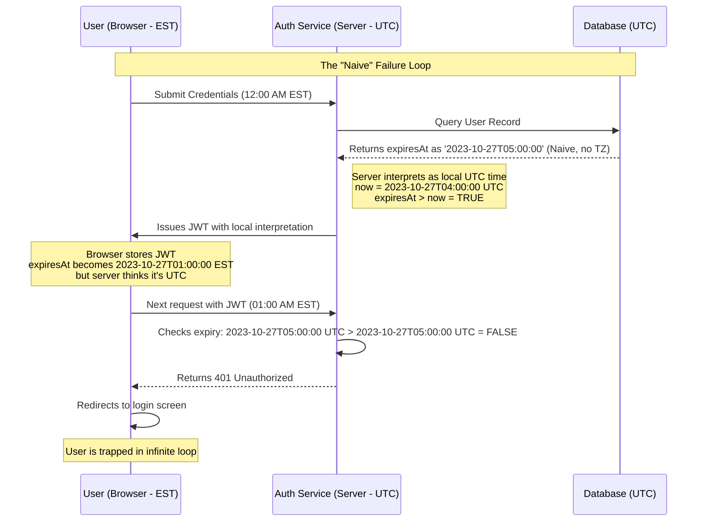

# The Login Loop of Doom: How a Naive datetime Held Our Users Hostage

## Introduction

It started with a Slack alert at 9 AM. Then another. And another. Within thirty minutes, our entire engineering team was staring at a live dashboard showing a 15% spike in failed login attempts. But here's the twist: these weren't failed logins due to typos or forgotten passwords. These were users who had entered their credentials correctly, received a valid JWT, and then—poof—were immediately bounced back to the login screen.

We called it the "Login Loop of Doom." And it was entirely caused by a single line of code that treated time like it was a local variable.

## Why This Matters

Time handling isn't just a developer's chore—it's a silent saboteur. In distributed systems, where clients, servers, and databases operate across multiple timezones, treating timestamps as if they're universally understood is a recipe for chaos. This isn't theoretical. It's a real-world issue that affects authentication, scheduling, billing, caching, and any system that relies on temporal logic.

If you're building web applications that serve users globally, you *will* encounter timezone-related bugs. The question is: will they be subtle enough to slip into production, or will you catch them in staging?

## How It Works

Let me walk you through the exact sequence of events that led to our outage. Here's the failure loop in action:



Here's what happened in plain English:

1. **User authenticates**: A user in New York (EST) logs in at midnight local time.
2. **Server issues JWT**: Our Node.js backend creates a session with a 1-hour expiry. The server is configured in UTC, so it stores `expiresAt: '2023-10-27T05:00:00'` in the database.
3. **Database returns naive timestamp**: PostgreSQL returns the timestamp as a string without timezone information. Our application treats this as local server time (UTC).
4. **Client-side confusion**: The browser receives the JWT and interprets the expiry time based on the client's local timezone. To the browser in EST, `2023-10-27T05:00:00` looks like 1 AM, not 5 AM.
5. **The trap snaps shut**: When the user makes their next request at 1 AM EST, the server compares the expiry (`05:00 UTC`) against the current time (`05:00 UTC`). Since they're equal, the session is considered expired.
6. **Infinite loop begins**: The user gets redirected to login, logs in again, gets another JWT with the same flawed expiry, and the cycle repeats.

## Core Concepts

### Naive vs. Aware Datetimes

A **naive datetime** is a timestamp that has no concept of timezone or offset. It's just a date and time—nothing more. Think of it as writing "3 PM" on a piece of paper without specifying what timezone that 3 PM refers to.

An **aware datetime** includes timezone information. It knows whether it's 3 PM in New York, London, or Tokyo. In programming terms, this means storing UTC timestamps with explicit timezone metadata.

### The Temporal Logic Trap

Most developers think of time as linear and absolute. In reality, time is relative—and that relativity breaks naive comparisons. When you compare `2023-10-27T05:00:00` (interpreted as UTC) against `2023-10-27T05:00:00` (interpreted as EST), you're not comparing the same moments in time. You're comparing two different points on the timeline that happen to share the same string representation.

### The JWT Time Bomb

JSON Web Tokens encode timestamps as Unix epochs (seconds since January 1, 1970 UTC). However, when applications store and retrieve these timestamps using naive datetime objects, the conversion chain becomes fragile. A millisecond mistake in timezone handling can invalidate a perfectly valid token.

## Examples & Code Walkthrough

### The Naive Implementation (The Villain)

Here's the code that nearly cost us our weekend:

```typescript
// ❌ DANGEROUS: Relies on implicit timezone assumptions
import { PrismaClient } from '@prisma/client';
import jwt from 'jsonwebtoken';

const prisma = new PrismaClient();

interface UserSession {
  id: string;
  userId: string;
  expiresAt: Date; // Stored as TIMESTAMP WITHOUT TIME ZONE
}

async function createSession(userId: string): Promise<string> {
  const expiresAt = new Date(Date.now() + 60 * 60 * 1000); // 1 hour expiry
  
  // Database stores this as a naive timestamp
  const session = await prisma.userSession.create({
    data: { userId, expiresAt },
  });

  // JWT encodes the expiry as a number (Unix timestamp)
  const token = jwt.sign(
    { sessionId: session.id, exp: Math.floor(expiresAt.getTime() / 1000) },
    process.env.JWT_SECRET!
  );

  return token;
}

async function validateSession(token: string): Promise<boolean> {
  try {
    const decoded = jwt.verify(token, process.env.JWT_SECRET!) as any;
    
    // Fetch session from database
    const session = await prisma.userSession.findUnique({
      where: { id: decoded.sessionId },
    });

    if (!session) return false;

    // ❌ BUG: Compares server-local time against database-naive time
    const now = new Date(); // Server interprets this as UTC
    return session.expiresAt > now; // Naive comparison fails across timezones
  } catch (error) {
    return false;
  }
}
```

The problem here is subtle but devastating. When `expiresAt` is stored in PostgreSQL as a `TIMESTAMP WITHOUT TIME ZONE`, the database doesn't store timezone information. When retrieved, the application assumes it's in the server's local timezone (UTC in our case). But when the JWT is decoded and verified on the client side, the browser converts timestamps based on the user's local timezone, creating a mismatch.

### The Robust Implementation (The Hero)

Here's how we fixed it:

```typescript
// ✅ ROBUST: Enforces UTC at every boundary
import { PrismaClient } from '@prisma/client';
import jwt from 'jsonwebtoken';
import { DateTime } from 'luxon';

const prisma = new PrismaClient();

// Enforce UTC in database schema
/*
model UserSession {
  id        String   @id @default(cuid())
  userId    String
  expiresAt DateTime @db.Timestamptz // WITH TIME ZONE
  createdAt DateTime @default(now())
}
*/

interface SessionValidationResult {
  isValid: boolean;
  reason?: string;
}

class SessionManager {
  private static readonly JWT_EXPIRY_SECONDS = 3600; // 1 hour

  /**
   * Creates a session with strict UTC enforcement
   */
  static async createSession(userId: string): Promise<string> {
    // Always work in UTC
    const now = DateTime.utc();
    const expiresAt = now.plus({ seconds: this.JWT_EXPIRY_SECONDS });

    // Store with timezone awareness
    const session = await prisma.userSession.create({
      data: {
        userId,
        expiresAt: expiresAt.toJSDate(), // Luxon ensures UTC
      },
    });

    // JWT uses standard Unix timestamp (always UTC)
    const token = jwt.sign(
      {
        sessionId: session.id,
        userId: session.userId,
        iat: Math.floor(now.toSeconds()),
        exp: Math.floor(expiresAt.toSeconds()),
      },
      process.env.JWT_SECRET!,
      { issuer: 'your-app-name' }
    );

    return token;
  }

  /**
   * Validates session with timezone-aware comparisons
   */
  static async validateSession(token: string): Promise<SessionValidationResult> {
    try {
      const decoded = jwt.verify(token, process.env.JWT_SECRET!, {
        issuer: 'your-app-name',
      }) as jwt.JwtPayload;

      const session = await prisma.userSession.findUnique({
        where: { id: decoded.sessionId },
      });

      if (!session) {
        return { isValid: false, reason: 'Session not found' };
      }

      // Convert everything to UTC for comparison
      const now = DateTime.utc();
      const expiry = DateTime.fromJSDate(session.expiresAt).setZone('UTC');

      if (!expiry.isValid) {
        return { isValid: false, reason: 'Invalid expiry timestamp' };
      }

      // Safe comparison: both values are explicitly UTC
      if (expiry <= now) {
        return { isValid: false, reason: 'Session expired' };
      }

      return { isValid: true };
    } catch (error) {
      if (error instanceof jwt.TokenExpiredError) {
        return { isValid: false, reason: 'Token expired' };
      }
      if (error instanceof jwt.JsonWebTokenError) {
        return { isValid: false, reason: 'Invalid token' };
      }
      return { isValid: false, reason: 'Validation error' };
    }
  }

  /**
   * Decorator for automatic UTC normalization
   */
  static withUtcNormalization<T extends object>(target: T): T {
    return new Proxy(target, {
      get(obj, prop) {
        const value = obj[prop as keyof T];
        if (value instanceof Date) {
          return DateTime.fromJSDate(value).setZone('UTC').toJSDate();
        }
        return value;
      },
    });
  }
}

// Usage example
async function handleLogin(req: any, res: any) {
  // ... authentication logic ...
  
  const token = await SessionManager.createSession(userId);
  res.json({ token });
}

async function handleAuthenticatedRequest(req: any, res: any) {
  const token = req.headers.authorization?.split(' ')[1];
  if (!token) {
    return res.status(401).json({ error: 'No token provided' });
  }

  const result = await SessionManager.validateSession(token);
  if (!result.isValid) {
    return res.status(401).json({ error: result.reason });
  }

  // Proceed with authenticated request
  res.json({ message: 'Access granted' });
}
```

### Database Schema Migration

We also updated our database schema to enforce timezone awareness:

```sql
-- PostgreSQL migration
ALTER TABLE user_sessions 
ALTER COLUMN expires_at TYPE TIMESTAMPTZ USING expires_at AT TIME ZONE 'UTC';

-- Add timezone-aware columns
ALTER TABLE user_sessions 
ADD COLUMN issued_at TIMESTAMPTZ NOT NULL DEFAULT NOW(),
ADD COLUMN last_validated_at TIMESTAMPTZ;
```

## Best Practices

1. **Always store timestamps in UTC**: Never rely on server-local time for persistence. Convert to UTC before writing to any database.

2. **Use timezone-aware data types**: In PostgreSQL, prefer `TIMESTAMPTZ` over `TIMESTAMP`. In MySQL, use `TIMESTAMP` (which is timezone-aware) over `DATETIME`.

3. **Normalize at boundaries**: Convert all incoming timestamps to UTC at your API layer, before they reach business logic.

4. **Validate timezone information**: When parsing datetime strings, always check for timezone offsets. Reject naive timestamps in API inputs.

5. **Use dedicated datetime libraries**: Libraries like Luxon, date-fns, or java.time provide robust timezone handling that built-in Date objects lack.

6. **Log timezone context**: Include timezone information in your logs. When debugging temporal issues, knowing the server's timezone setting is crucial.

7. **Test across timezones**: Use tools like `jest.useFakeTimers()` combined with timezone mocking to simulate different client environments.

## Common Mistakes & Anti-Patterns

### 1. Mixing Server Time and UTC

The most common mistake is assuming that `new Date()` in Node.js gives you UTC time. While JavaScript Date objects internally store UTC, methods like `getHours()` return local time based on the server's timezone setting.

```typescript
// ❌ WRONG: Assumes server is in UTC
const now = new Date();
console.log(now.getHours()); // Returns local time, not UTC

// ✅ CORRECT: Explicitly request UTC
const now = DateTime.utc();
console.log(now.hour); // Always UTC regardless of server location
```

### 2. Ignoring Client-Side Timezone Differences

Frontend applications often assume that timestamps from the server are in the user's local timezone. This leads to incorrect display and validation logic.

```typescript
// ❌ WRONG: Assumes server timestamp is local
const expiry = new Date(jwtPayload.exp * 1000);
const timeLeft = expiry - new Date(); // Incorrect calculation

// ✅ CORRECT: Work in UTC throughout
const expiry = DateTime.fromSeconds(jwtPayload.exp, { zone: 'UTC' });
const now = DateTime.utc();
const timeLeft = expiry.diff(now).as('seconds');
```

### 3. Using String Parsing for Timezone Conversion

Parsing datetime strings manually is error-prone. Different formats, missing timezone information, and locale differences can cause silent failures.

```typescript
// ❌ WRONG: Manual string parsing
const parseTimestamp = (str: string) => {
  const parts = str.split('T');
  const dateParts = parts[0].split('-');
  const timeParts = parts[1].split(':');
  return new Date(
    parseInt(dateParts[0]),
    parseInt(dateParts[1]) - 1,
    parseInt(dateParts[2]),
    parseInt(timeParts[0]),
    parseInt(timeParts[1]),
    parseInt(timeParts[2])
  );
};

// ✅ CORRECT: Use ISO 8601 parsing with timezone awareness
const parseTimestamp = (str: string) => {
  const dt = DateTime.fromISO(str, { zone: 'UTC' });
  if (!dt.isValid) {
    throw new Error(`Invalid timestamp: ${str}`);
  }
  return dt;
};
```

### 4. Trusting Database Defaults

Many databases default to storing timestamps without timezone information. Relying on these defaults can create silent timezone bugs.

```sql
-- ❌ WRONG: Database stores without timezone
CREATE TABLE sessions (
  id SERIAL PRIMARY KEY,
  expires_at TIMESTAMP -- No timezone support
);

-- ✅ CORRECT: Explicit timezone support
CREATE TABLE sessions (
  id SERIAL PRIMARY KEY,
  expires_at TIMESTAMPTZ NOT NULL DEFAULT NOW()
);
```

## Performance Considerations

### Memory Overhead

Using timezone-aware datetime libraries adds minimal memory overhead. Luxon's DateTime objects are slightly larger than native Date objects, but the difference is negligible in most applications (<1KB per instance).

### CPU Cost

Timezone conversions involve mathematical operations, but modern libraries are highly optimized. The performance impact of converting timestamps to UTC is typically less than 0.1ms per operation, which is insignificant compared to database queries or network latency.

### Network Latency

ISO 8601 formatted timestamps are slightly longer than naive datetime strings, adding a few bytes to API payloads. However, this overhead is negligible compared to the cost of debugging timezone-related bugs.

### Scalability Impact

Enforcing UTC at the application boundary actually improves scalability by eliminating timezone-dependent branching logic. Cache keys, database indexes, and comparison operations become deterministic when all timestamps are normalized to UTC.

```typescript
// Efficient cache key generation with UTC normalization
function generateCacheKey(userId: string, timestamp: DateTime): string {
  // Deterministic key regardless of server timezone
  const utcTimestamp = timestamp.setZone('UTC').toISO();
  return `user:${userId}:session:${utcTimestamp}`;
}
```

## Real-World Usage

Major technology companies have learned these lessons the hard way:

- **Google** uses TrueTime API to handle clock uncertainty across distributed systems
- **Amazon** enforces UTC in all AWS services and provides timezone conversion utilities
- **Stripe** stores all timestamps in UTC and converts to local timezones only for display
- **GitHub** uses a combination of UTC storage and client-side timezone detection for commit timestamps

These companies invest heavily in timezone-aware infrastructure because the cost of getting it wrong—lost revenue, user frustration, and engineering time—is far greater than the cost of doing it right from the start.

## Frequently Asked Questions (FAQ)

### Q: Should I always convert to UTC before storing in the database?
**A:** Yes, absolutely. Store all timestamps in UTC. Convert to local timezones only when displaying data to users. This ensures consistency across all systems and eliminates ambiguity.

### Q
