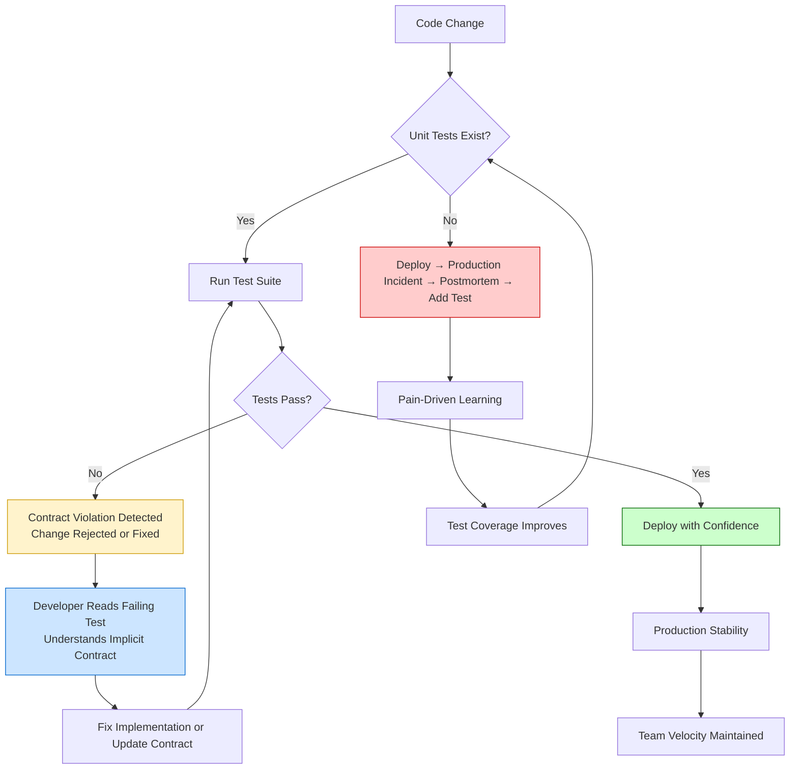

# "the main purpose of unit tests is keeping your code from being violently sh*t on by others"

## Introduction

Six months ago, a junior engineer on my team pushed a "simple refactor" to our payment reconciliation service. Two lines changed. Both looked harmless—just extracting a helper method and renaming a variable for clarity. The PR had two approvals. CI passed. We deployed on a Tuesday afternoon.

By Wednesday morning, we'd double-charged 3,400 customers $47.50 each.

The bug wasn't in the changed lines. It was in a downstream consumer that *assumed* the helper method preserved a specific side effect—mutating a shared DTO's `processed_at` timestamp. The original code did this accidentally. The refactor didn't. No test caught it because no test existed for that implicit contract.

This is what the Reddit thread got right: unit tests aren't primarily about verifying correctness. They're about **encoding the invisible contracts that hold your system together** so the next person—whether it's a teammate, a future you, or a bot running Dependabot updates—doesn't accidentally violate them.

## Why This Matters

Every production system accumulates **implicit contracts**—assumptions about behavior that exist nowhere in documentation, type signatures, or API specs. They live in:

- Side effects that callers depend on accidentally
- Timing guarantees nobody wrote down but everyone relies on
- Error message formats that downstream parsers expect
- Null-handling behaviors that became de facto APIs
- Performance characteristics (O(1) vs O(n)) that callers built around

When someone "violently sh*ts on" your code, they're usually not malicious. They're making a reasonable change based on visible information, unaware of the invisible contract they're breaking. Unit tests make those contracts visible and enforceable.

The alternative is **archaeology-driven development**: every change requires reading 5,000 lines of call sites to reconstruct what the code *actually* promises. That doesn't scale.

## How It Works

Think of unit tests as **executable interface specifications**. They capture not just "what does this return?" but "what must remain true for the system to function?"



**The mechanism works in three layers:**

1. **Detection**: A test fails when an implicit contract is violated. The failure message *is* the documentation.
2. **Localization**: Good unit tests pinpoint *which* contract broke, not just *that* something broke.
3. **Resolution**: The developer either restores the contract (fixes the bug) or deliberately evolves it (updates the test), making the change explicit.

## Core Concepts

### Contract vs. Implementation Tests

Most teams write **implementation tests**—verifying that a specific algorithm produces expected outputs for given inputs. These are brittle and often useless for refactoring.

**Contract tests** verify *behavioral guarantees* that callers depend on:

```python
# BAD: Implementation test - breaks when algorithm changes
def test_calculate_discount_percentage():
    assert calculate_discount(100, "PREMIUM") == 15.0

# GOOD: Contract test - captures what callers actually rely on
def test_discount_contract_for_premium_tier():
    # Contract: PREMIUM tier always gets >= 10% discount
    # Contract: Discount never exceeds 50% (business rule)
    # Contract: Same input always produces same output (idempotent)
    
    price = 100
    discount1 = calculate_discount(price, "PREMIUM")
    discount2 = calculate_discount(price, "PREMIUM")
    
    assert discount1 == discount2  # Idempotency
    assert discount1 >= 10.0       # Minimum guarantee
    assert discount1 <= 50.0       # Maximum guarantee
    assert discount1 > calculate_discount(price, "BASIC")  # Tier ordering
```

### The "Violent Sh*tting" Threat Model

Who violates your contracts?

| Actor | Motivation | Typical Damage |
|-------|------------|----------------|
| **Future You** | "I'll just clean this up" | Removes "unused" side effect that 3 services depend on |
| **New Hire** | "This variable name is confusing" | Renames field that external webhook payloads expect |
| **Dependabot** | "Security update available" | Upgrades library that changed error message format |
| **Platform Team** | "Migrating to new infra" | Changes latency profile breaking timeout assumptions |
| **Malicious Actor** | Actually malicious | Rare. Most damage is well-intentioned. |

### Test as Living Documentation

A well-written test answers three questions for the next maintainer:

1. **What does this promise?** (The assertions)
2. **Why does it matter?** (The test name and comments)
3. **What would break if this changed?** (The scenario being tested)

```python
class TestPaymentReconciliationContract:
    """
    Contract: Reconciliation must be idempotent for the same 
    (merchant_id, settlement_date) pair. Downstream billing 
    system retries on 5xx and expects duplicate calls to be no-ops.
    
    Violation impact: Double-billing merchants (SEV-1).
    """
    
    def test_idempotent_reconciliation_for_same_settlement(self, db, reconciliation_service):
        merchant_id = "MERCH_123"
        settlement_date = date(2024, 1, 15)
        
        # First call - processes normally
        result1 = reconciliation_service.reconcile(merchant_id, settlement_date)
        assert result1.status == "COMPLETED"
        assert result1.transactions_processed == 42
        
        # Second call - must be no-op, not reprocess
        result2 = reconciliation_service.reconcile(merchant_id, settlement_date)
        assert result2.status == "COMPLETED"
        assert result2.transactions_processed == 0  # Key contract!
        
        # Verify no duplicate billing records created
        billing_records = db.query(BillingRecord).filter(
            BillingRecord.merchant_id == merchant_id,
            BillingRecord.settlement_date == settlement_date
        ).all()
        assert len(billing_records) == 1
```

## Examples & Code Walkthrough

Let's build a realistic example: an **order allocation service** that assigns inventory to orders. This is where implicit contracts kill companies.

### The Domain Model

```python
# domain/models.py
from dataclasses import dataclass, field
from datetime import datetime
from enum import Enum
from typing import Optional
import uuid

class AllocationStatus(Enum):
    PENDING = "PENDING"
    ALLOCATED = "ALLOCATED"
    FAILED = "FAILED"
    PARTIAL = "PARTIAL"

@dataclass
class InventoryItem:
    sku: str
    quantity_available: int
    quantity_reserved: int = 0
    warehouse_id: str = "DEFAULT"
    last_updated: datetime = field(default_factory=datetime.utcnow)
    
    @property
    def quantity_free(self) -> int:
        return self.quantity_available - self.quantity_reserved
    
    def reserve(self, qty: int) -> bool:
        """Attempt reservation. Returns True if successful."""
        if self.quantity_free >= qty:
            self.quantity_reserved += qty
            self.last_updated = datetime.utcnow()
            return True
        return False
    
    def release(self, qty: int) -> None:
        """Release reservation. Idempotent - safe to call multiple times."""
        self.quantity_reserved = max(0, self.quantity_reserved - qty)
        self.last_updated = datetime.utcnow()

@dataclass
class OrderLine:
    sku: str
    quantity: int
    allocated_qty: int = 0

@dataclass
class Order:
    id: str = field(default_factory=lambda: str(uuid.uuid4()))
    lines: list[OrderLine] = field(default_factory=list)
    status: AllocationStatus = AllocationStatus.PENDING
    created_at: datetime = field(default_factory=datetime.utcnow)
    allocated_at: Optional[datetime] = None
```

### The Service With Implicit Contracts

```python
# services/allocation.py
from domain.models import Order, InventoryItem, AllocationStatus
from typing import Protocol
import logging

logger = logging.getLogger(__name__)

class InventoryRepository(Protocol):
    def get(self, sku: str) -> Optional[InventoryItem]: ...
    def save(self, item: InventoryItem) -> None: ...

class OrderRepository(Protocol):
    def get(self, order_id: str) -> Optional[Order]: ...
    def save(self, order: Order) -> None: ...

class AllocationService:
    """
    Allocates inventory to order lines.
    
    IMPLICIT CONTRACTS (enforced by tests below):
    1. Idempotency: Calling allocate() twice with same order_id 
       must not double-reserve inventory.
    2. Atomicity per order: Either all lines allocate or none do.
       No partial allocations left in DB.
    3. Reservation ordering: Lines processed in SKU order for 
       deterministic behavior (prevents deadlocks under concurrency).
    4. Status transition: Order status only moves PENDING -> 
       ALLOCATED/FAILED. Never backwards.
    5. Inventory consistency: quantity_reserved never exceeds 
       quantity_available.
    """
    
    def __init__(
        self, 
        inventory_repo: InventoryRepository, 
        order_repo: OrderRepository
    ):
        self.inventory_repo = inventory_repo
        self.order_repo = order_repo
    
    def allocate(self, order_id: str) -> AllocationStatus:
        order = self.order_repo.get(order_id)
        if not order:
            logger.warning("Order not found: %s", order_id)
            return AllocationStatus.FAILED
        
        # Contract: Idempotency - already allocated orders are no-ops
        if order.status == AllocationStatus.ALLOCATED:
            logger.info("Order %s already allocated, skipping", order_id)
            return AllocationStatus.ALLOCATED
        
        if order.status == AllocationStatus.FAILED:
            # Allow retry on failed orders
            logger.info("Retrying failed order: %s", order_id)
        elif order.status != AllocationStatus.PENDING:
            logger.error("Invalid status for allocation: %s", order.status)
            return AllocationStatus.FAILED
        
        # Contract: Deterministic SKU ordering prevents deadlocks
        sorted_lines = sorted(order.lines, key=lambda l: l.sku)
        
        # Track reservations for potential rollback
        reservations: list[tuple[InventoryItem, int]] = []
        
        try:
            for line in sorted_lines:
                item = self.inventory_repo.get(line.sku)
                if not item:
                    logger.warning("SKU not found: %s", line.sku)
                    raise AllocationError(f"SKU {line.sku} not found")
                
                needed = line.quantity - line.allocated_qty
                if needed <= 0:
                    continue  # Already satisfied
                
                if not item.reserve(needed):
                    raise AllocationError(
                        f"Insufficient inventory for {line.sku}: "
                        f"need {needed}, have {item.quantity_free}"
                    )
                
                reservations.append((item, needed))
                line.allocated_qty += needed
            
            # All lines succeeded - commit
            order.status = AllocationStatus.ALLOCATED
            order.allocated_at = datetime.utcnow()
            
            for item, _ in reservations:
                self.inventory_repo.save(item)
            self.order_repo.save(order)
            
            logger.info("Order %s fully allocated", order_id)
            return AllocationStatus.ALLOCATED
            
        except AllocationError:
            # Contract: Atomicity - rollback all reservations
            for item, qty in reservations:
                item.release(qty)
                self.inventory_repo.save(item)
            
            order.status = AllocationStatus.FAILED
            self.order_repo.save(order)
            logger.warning("Order %s allocation failed, rolled back", order_id)
            return AllocationStatus.FAILED


class AllocationError(Exception):
    pass
```

### The Contract Tests

```python
# tests/test_allocation_contracts.py
import pytest
from datetime import datetime
from unittest.mock import Mock, MagicMock
from domain.models import Order, OrderLine, InventoryItem, AllocationStatus
from services.allocation import AllocationService, AllocationError

class TestAllocationContracts:
    """Contract tests for AllocationService.
    
    These tests encode the implicit contracts that, if violated,
    cause production incidents. Each test name describes the contract.
    """
    
    @pytest.fixture
    def inventory_repo(self):
        return Mock()
    
    @pytest.fixture
    def order_repo(self):
        return Mock()
    
    @pytest.fixture
    def service(self, inventory_repo, order_repo):
        return AllocationService(inventory_repo, order_repo)
    
    def _setup_order(self, order_repo, lines: list[OrderLine], status=AllocationStatus.PENDING):
        order = Order(lines=lines, status=status)
        order_repo.get.return_value = order
        return order
    
    def _setup_inventory(self, inventory_repo, items: dict[str, InventoryItem]):
        def get_item(sku):
            return items.get(sku)
        inventory_repo.get.side_effect = get_item
        return items
    
    # CONTRACT 1: Idempotency
    def test_allocate_is_idempotent_for_already_allocated_order(
        self, service, inventory_repo, order_repo
    ):
        """
        Contract: Calling allocate() twice must not double-reserve.
        
        Violation scenario: Webhook retry, client retry, or manual 
        re-run of allocation job. Without this, inventory goes negative.
        """
        order = self._setup_order(order_repo, [
            OrderLine(sku="WIDGET-A", quantity=5)
        ], status=AllocationStatus.ALLOCATED)
        
        item = InventoryItem(sku="WIDGET-A", quantity_available=100, quantity_reserved=5)
        self._setup_inventory(inventory_repo, {"WIDGET-A": item})
        
        # First call
        result1 = service.allocate(order.id)
        # Second call (simulating retry)
        result2 = service.allocate(order.id)
        
        assert result1 == AllocationStatus.ALLOCATED
        assert result2 == AllocationStatus.ALLOCATED
        
        # Critical: reserve() should NEVER be called on second invocation
        item.reserve.assert_not_called()
        # Inventory should not be saved again
        assert inventory_repo.save.call_count == 0
    
    # CONTRACT 2: Atomicity - all or nothing
    def test_allocation_rolls_back_all_reservations_on_partial_failure(
        self, service, inventory_repo, order_repo
    ):
        """
        Contract: If any line fails, ALL reservations are released.
        
        Violation scenario: Order with 10 lines, line 7 OOM. Lines 1-6
        stay reserved but order shows FAILED. Inventory leaked forever.
        """
        order = self._setup_order(order_repo, [
            OrderLine(sku="SKU-1", quantity=10),
            OrderLine(sku="SKU-2", quantity=10),
            OrderLine(sku="SKU-3", quantity=10),  # This will fail
            OrderLine(sku="SKU-4", quantity=10),
        ])
        
        items = {
            "SKU-1": InventoryItem(sku="SKU-1", quantity_available=50, quantity_reserved=0),
            "SKU-2": InventoryItem(sku="SKU-2", quantity_available=50, quantity_reserved=0),
            "SKU-3": InventoryItem(sku="SKU-3", quantity_available=5, quantity_reserved=0),  # Only 5 available!
            "SKU-4": InventoryItem(sku="SKU-4", quantity_available=50, quantity_reserved=0),
        }
        self._setup_inventory(inventory_repo, items)
