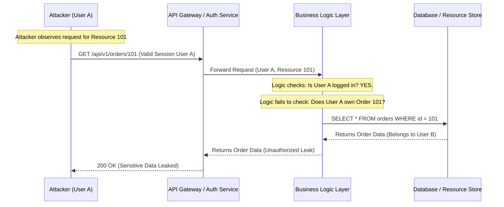

# The Ultimate IDOR Testing Checklist (2026 Edition)

## Introduction

In the early days of web security, Insecure Direct Object Reference (IDOR) was simple: you changed `user_id=123` to `user_id=124` in a URL, and you had access to someone else's profile. It was a "low-hanging fruit" vulnerability that scanners caught easily.

Fast forward to 2026. We are dealing with distributed microservices, GraphQL resolvers, nested JSON payloads, and complex multi-tenant architectures. An IDOR today isn't just a numeric increment; it's a logical flaw where an attacker manipulates a complex object reference—perhaps a UUID, a composite key, or a tenant-scoped resource ID—to bypass authorization boundaries. If you are relying on automated scanners to find these, you've already lost. IDOR is a business logic flaw, and business logic requires human-centric testing.

## Why This Matters

Modern applications are built on the assumption of "Zero Trust," yet the implementation of authorization often lags behind the speed of feature deployment. When an engineer adds a new API endpoint to support a mobile feature but forgets to verify that the `account_id` in the request body actually belongs to the authenticated `session_user`, they've opened a door.

For a SaaS provider, an IDOR isn't just a bug; it's a catastrophic breach of contract. One leaked `invoice_id` can expose the entire financial history of a corporate client. In healthcare or fintech, it's a regulatory nightmare. As we move toward more granular, attribute-based access control (ABAC), the surface area for these logical errors expands exponentially.

## How It Works

IDOR occurs when the application uses an identifier to access a resource directly without an intermediate check to ensure the user has the right to that specific resource.

In a modern architecture, the request flows through several layers. The vulnerability usually manifests when the "Authorization Layer" checks *if* a user is logged in (Authentication), but fails to check *if* the user owns the specific object being requested (Authorization).



The breakdown happens at the **Business Logic Layer**. The Auth Service correctly identifies the user, but the service layer assumes that if a valid `user_id` is present in the JWT, any subsequent `resource_id` provided in the request must be legitimate.

## Core Concepts

To test for IDOR effectively, you must understand the three pillars of modern resource referencing:

1.  **The Identifier (The "What"):** This is the target. It could be a sequential integer, a predictable UUIDv1, or a high-entropy UUIDv4. Even with non-guessable UUIDs, IDOR is possible if the ID can be leaked via other endpoints (like a search function or a public profile).
2.  **The Subject (The "Who"):** The authenticated entity. In 2026, this is usually a JWT containing claims like `sub`, `tenant_id`, and `roles`.
3.  **The Relationship (The "Permission"):** The mapping that defines if Subject X has access to Object Y. This is where the testing happens. We are looking for a failure in the validation of this relationship.

## Examples & Code Walkthrough

### 1. The Vulnerable Pattern (Python/FastAPI)
Here is a classic example of how an engineer might accidentally introduce an IDOR in a modern asynchronous framework.

```python
from fastapi import FastAPI, Depends, HTTPException, status
from sqlalchemy.orm import Session

app = FastAPI()

# VULNERABLE ENDPOINT
@app.get("/api/v1/documents/{doc_id}")
async def get_document(doc_id: str, current_user: User = Depends(get_current_user), db: Session = Depends(get_db)):
    # ERROR: We check if the user is authenticated, 
    # but we don't check if the document belongs to the user.
    document = db.query(Document).filter(Document.id == doc_id).first()
    
    if not document:
        raise HTTPException(status_code=404, detail="Document not found")
        
    return document
```

### 2. The Secure Pattern (The "Ownership Check")
The fix is to always include the `owner_id` (or `tenant_id`) in the database query itself.

```python
# SECURE ENDPOINT
@app.get("/api/v1/documents/{doc_id}")
async def get_document_secure(doc_id: str, current_user: User = Depends(get_current_user), db: Session = Depends(get_db)):
    # FIX: We scope the query to the current_user.id
    document = db.query(Document).filter(
        Document.id == doc_id,
        Document.owner_id == current_user.id  # Mandatory ownership check
    ).first()
    
    if not document:
        # We return 404 instead of 403 to prevent ID enumeration
        raise HTTPException(status_code=404, detail="Document not found")
        
    return document
```

### 3. Automated IDOR Detection Script (Python)
When performing a manual pentest, you can use a script to iterate through resource IDs using two different session tokens (User A and User B).

```python
import requests

def check_idor(base_url, target_endpoint, user_a_token, user_b_token, resource_id):
    """
    Attempts to access User B's resource using User A's token.
    """
    headers_a = {"Authorization": f"Bearer {user_a_token}"}
    url = f"{base_url}{target_endpoint}/{resource_id}"
    
    print(f"[*] Testing access to {resource_id} with User A token...")
    response = requests.get(url, headers=headers_a)
    
    if response.status_code == 200:
        print(f"[!] IDOR DETECTED: Resource {resource_id} is accessible to User A!")
    elif response.status_code == 404 or response.status_code == 403:
        print(f"[+] Success: Access denied for User A (Status: {response.status_code})")
    else:
        print(f"[-] Unexpected status code: {response.status_code}")

# Usage
# check_idor("https://api.target.com", "/api/v1/orders", "TOKEN_USER_A", "TOKEN_USER_B", "order_999")
```

## Best Practices

To prevent IDOR, stop treating authorization as a "gate" at the entrance and start treating it as a "filter" at the data layer.

*   **Use Indirect References:** Instead of exposing database primary keys, use temporary, session-specific mapping tokens for sensitive operations.
*   **Scope Queries by Ownership:** Never do `SELECT * FROM table WHERE id =?`. Always do `SELECT * FROM table WHERE id =? AND tenant_id =?`.
*   **Prefer 404 over 403:** When a user requests a resource they don't own, return a `404 Not Found`. Returning a `403 Forbidden` confirms that the resource exists, allowing attackers to enumerate your database.
*   **Centralize Authorization Logic:** Don't write `if user.id == resource.owner_id` in every single controller. Use a dedicated authorization service or middleware (like Open Policy Agent - OPA) to handle complex logic.

## Common Mistakes & Anti-Patterns

1.  **The "Authenticated is Enough" Fallacy:** The most common mistake. Engineers assume that because a user has a valid JWT, they are allowed to interact with any ID they can guess.
2.  **Relying on Obscurity (UUIDs):** Thinking "the IDs are long UUIDs, so no one can guess them." This is false. UUIDs can be leaked via logs, browser history, or other API responses. An ID is a reference, not a secret.
3.  **Ignoring the Verb:** Developers often secure `GET` requests but forget `PUT`, `POST`, or `DELETE`. An attacker might not be able to *view* your data, but they might be able to *delete* it by manipulating the ID in a `DELETE` request.

## Performance Considerations

Adding ownership checks to every database query introduces a slight overhead due to the extra `WHERE` clause. However, in modern indexed databases, the performance impact is negligible (O(log n) for indexed lookups).

The real performance cost comes from **Centralized Authorization Services**. If every single microservice makes a network call to a central Auth service for every request, you'll hit a bottleneck. To mitigate this, use **Sidecar patterns** (like in a Service Mesh) or **Policy-as-Code** where policies are cached locally within the service.

## Real-World Usage

High-scale SaaS companies (like Salesforce or Slack) do not use simple `if` statements for authorization. They use **Relationship-Based Access Control (ReBAC)**. They maintain a graph of "who has what relationship to what." When a request comes in, they perform a graph traversal to see if a path exists between the `User` node and the `Resource` node. This allows for incredibly complex permissions (e.g., "User A can edit this document because they are a member of Group B, which has 'Editor' rights on Folder C").

## Frequently Asked Questions (FAQ)

**Q: Can automated scanners find IDOR?**
A: Rarely. Scanners are great at finding known patterns and misconfigurations, but they don't understand the "ownership" logic of your business. They don't know that `order_123` belongs to User A and not User B.

**Q: Is GraphQL immune to IDOR?**
A: Absolutely not. In fact, GraphQL can make IDORs harder to find because the data is often nested deep within resolvers. You must secure every single resolver that fetches an object.

**Q: Should I use UUIDs instead of integers?**
A: Yes, for preventing enumeration, but no, for preventing IDOR. UUIDs make it harder to guess the next ID, but they do not replace the need for an authorization check.

## Conclusion

IDOR remains one of the most critical vulnerabilities in the modern web stack. As we move further into the era of microservices and complex data relationships, the complexity of authorization grows. The takeaway for 2026 is simple: **Never trust an ID provided by a client. Always validate the relationship between the subject and the object at the data layer.**

If you aren't testing for IDOR during your development lifecycle, you aren't finished with your feature.
