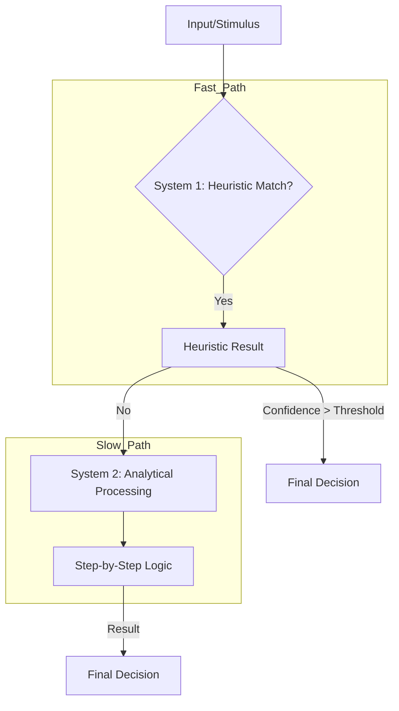

# Thinking and Decision Making: Cognitive Processes Explained  

## Introduction  
When building software, we often assume users behave predictably. After all, code is deterministic—inputs lead to specific outputs. But humans aren’t like that. Our decisions, choices, and interactions are messy, fast, and often irrational. This mismatch is why user experiences (UX) frequently fail: developers treat users as predictable state machines when they’re actually complex, distributed systems in their own right.  

The core idea here is radical: *model human decision-making as a distributed system*. Just as a microservices architecture delegates tasks to independent services, the human brain splits cognition into specialized layers. By mapping System 1 (intuitive, fast) and System 2 (analytical, slow) thinking to software architecture patterns, we can build interfaces that align with how humans actually work.  

---

## Why This Matters  
Imagine a user filling out a form. A developer might design a linear flow: click "Next," validate, submit. But humans don’t always follow this path. They might glance at a field, skip it, revisit it later, or make decisions based on gut feelings. This is System 1 in action—fast, heuristic-driven. When the form requires complex rules (e.g., tax calculations), System 2 kicks in, demanding focus and time.  

The problem arises when software ignores these layers. If a UI forces users to engage System 2 for trivial tasks (e.g., password resets), it causes frustration. Conversely, if critical decisions rely solely on heuristics (e.g., recommending a product without validation), risks emerge. By understanding these cognitive layers, we can design systems that escalate complexity gracefully, reduce cognitive load, and minimize errors.  

---

## How It Works  
Let’s break this down architecturally. The brain isn’t a single processor; it’s a hierarchy of modules working in parallel. Here’s how we map that to software:  

### The Cognitive Stack  
1. **Layer 1: System 1 (Heuristics & Pattern Recognition)**  
   - *Cognitive concept:* Instinct, intuition, pattern matching.  
   - *Software parallel:* Edge caching, precomputed data, or rule-based filters.  
   - *Example:* A user quickly recognizes a button’s purpose without reading labels.  

2. **Layer 2: System 2 (Analytical Reasoning)**  
   - *Cognitive concept:* Logic, step-by-step processing.  
   - *Software parallel:* Complex business logic, ACID transactions, or database queries.  
   - *Example:* A user carefully reviews terms before clicking “Agree.”  

3. **Layer 3: Conflict Resolution**  
   - *Cognitive concept:* Cognitive dissonance, bias.  
   - *Software parallel:* Distributed consistency models (e.g., CRDTs).  
   - *Example:* A user’s gut feeling contradicts logical evidence (e.g., “This deal seems too good to be true”).  

This stack isn’t linear. Layer 1 and Layer 2 operate asynchronously, often in conflict. The brain (or our software) must decide when to trust heuristics and when to escalate to analysis.  



---

## Core Concepts  
### System 1: The Heuristic Engine  
System 1 operates automatically. It’s why you can drive a car while thinking about dinner. In software terms, this is equivalent to caching or precomputed rules. For example:  
- A search engine might pre-rank results based on past behavior.  
- A form might auto-fill fields based on prior inputs.  

The downside? Heuristics are error-prone. If the cached data is stale or biased, decisions suffer.  

### System 2: The Analytical Core  
System 2 is deliberate and resource-intensive. It’s triggered when uncertainty or complexity arises. In software, this maps to heavy computations or validation logic. The cost? Cognitive fatigue. Just as a CPU context switch slows performance, forcing users to switch between intuitive and analytical modes drains mental energy.  

### Conflict Resolution: CRDTs in the Brain  
When System 1 and System 2 disagree, the brain resolves conflicts like a distributed system. For instance:  
- A user might heuristically trust a recommendation (System 1) but later doubt it after reading terms (System 2).  
- In code, this could look like a `Strategy Pattern` with fallbacks:  

```typescript
interface CognitiveStrategy {
  execute(context: DecisionContext): Promise<{ value: any; confidence: number }>;
}

class HeuristicStrategy implements CognitiveStrategy {
  async execute(context) {
    // Fast path: pattern matching
    return { value: "Fast-Result", confidence: 0.6 };
  }
}

class AnalyticalStrategy implements CognitiveStrategy {
  async execute(context) {
    // Slow path: deep logic
    return { value: "Accurate-Result", confidence: 0.95 };
  }
}

class DecisionEngine {
  private heuristics = new HeuristicStrategy();
  private analytics = new AnalyticalStrategy();

  async decide(context: DecisionContext) {
    const heuristicResult = await this.heuristics.execute(context);
    
    if (heuristicResult.confidence >= context.threshold) {
      return heuristicResult.value; // Trust heuristics
    }
    
    return await this.analytics.execute(context); // Escalate to analysis
  }
}
```

---

## Examples & Code Walkthrough  
Let’s apply this to a real-world scenario: a payment form.  

### Scenario: Credit Card Validation  
1. **System 1 (Heuristics):** The form auto-completes the card number as the user types. It flags invalid characters instantly.  
2. **System 2 (Analytics):** On submission, it runs a fraud detection algorithm (e.g., checking against CVV, address).  

If the heuristic fails (e.g., user types “1234” as a card number), System 2 escalates. The code might look like:  

```typescript
class PaymentValidator {
  validate(card: CardData) {
    // System 1: Quick regex check
    if (!this.isValidFormat(card.number)) {
      throw new Error("Invalid format");
    }
    
    // System 2: Fraud check (expensive)
    return this.fraudDetector.check(card);
  }
}
```

### Best Practice: Confidence Thresholds  
Always pair heuristics with a confidence score. For example:  
- A heuristic might suggest a product match with 70% confidence.  
- If the user’s threshold is 80%, escalate to analytics.  

This mirrors how the brain balances speed and accuracy.  

---

## Common Mistakes & Anti-Patterns  
1. **Over-reliance on Heuristics:**  
   - Example: A search engine showing irrelevant results because it trusts cached rankings.  
   - Fix: Always validate heuristic outputs with analytics when stakes are high.  

2. **Forcing System 2 for Trivial Tasks:**  
   - Example: A password reset form requiring users to solve a math puzzle.  
   - Fix: Use heuristics for low-stakes actions (e.g., auto-suggesting passwords).  

3. **Ignoring Cognitive Load:**  
   - Example: A dashboard cluttered with metrics forcing users to analyze every field.  
   - Fix: Progressive disclosure—show only critical info initially.  

---

## Performance Considerations  
- **Latency:** Heuristics should be sub-100ms. If analytical logic takes seconds, users will abandon the task.  
- **Memory:** Cached heuristics must be invalidated when data changes (e.g., stock prices).  
- **Scalability:** Distributed systems (like the brain) handle failure gracefully. If one layer fails, others compensate.  

---

## Real-World Usage  
Companies like Amazon and Google use cognitive models in their UIs:  
- **Amazon:** Recommends products based on heuristics (browsing history) but escalates to analytics for high-value items.  
- **Google Search:** Uses cached results (System 1) but runs complex algorithms (System 2) for ambiguous queries.  

---

## Frequently Asked Questions (FAQ)  
**Q: How does this apply to frontend development?**  
A: By modeling heuristics as UI states (e.g., autocomplete) and analytics as backend services, you can create faster, more intuitive interactions.  

**Q: What’s the trade-off between heuristics and analytics?**  
A: Heuristics are fast but error-prone; analytics are accurate but slow. Balance depends on the use case.  

**Q: Can this model work for backend systems?**  
A: Absolutely. For example, a payment gateway might use heuristics for initial approvals and analytics for fraud checks.  

---

## Conclusion  
Human cognition isn’t a linear process. It’s a distributed system of heuristics and analysis, prone to conflict and fatigue. By mapping this to software architecture—using patterns like the Strategy Pattern, caching, and conflict resolution—we can build interfaces that respect how humans think. The goal isn’t to make software “smarter” than humans but to align it with their inherent strengths and weaknesses.  

As engineers, our role is to become cognitive architects: designing systems that reduce friction, escalate complexity thoughtfully, and ultimately make users’ lives easier—not harder.
