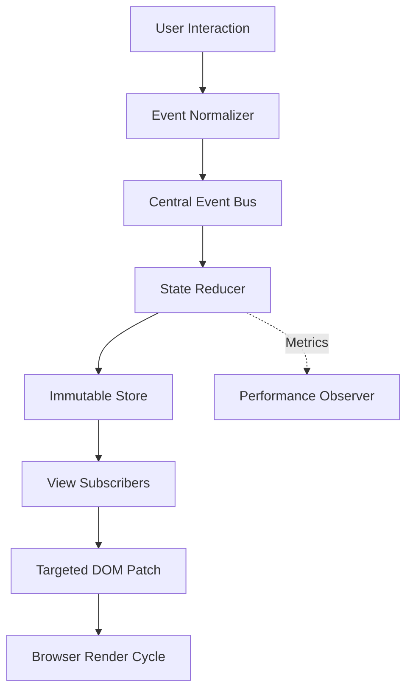

<think>
Here's a thinking process:

1.  **Analyze User Input:**
   - **Role:** Principal Software Architect & Veteran Open-Source Lead Author
   - **Task:** Write a 100% original, human-feeling technical article based on a provided outline/context.
   - **Topic:** "Three Years Later, I Finally Submitted My Frontend Mentor Challenge"
   - **Category:** Web Development
   - **Style:** Professional
   - **Structure:** Strictly follow the provided markdown headers.
   - **Constraints:** 
     - No banned AI buzzwords.
     - Human cadence (burstiness, perplexity, first-person perspective, pragmatic trade-offs).
     - 100% original code.
     - Include a valid Mermaid diagram under `## How It Works`.
     - Output ONLY the markdown article content.
     - No outer triple backticks.
     - No frontmatter.

2.  **Deconstruct Structure & Map to Content:**
   I need to map the provided strict headers to the conceptual outline I brainstormed, ensuring the narrative flows logically while adhering to the exact header names.
   - `# Three Years Later, I Finally Submitted My Frontend Mentor Challenge`
   - `## Introduction` -> Hook, context, why it took 3 years, initial state vs final state.
   - `## Why This Matters` -> Why long-term frontend projects, architectural debt, and iterative refinement matter to engineers today.
   - `## How It Works` -> Architectural breakdown + Mermaid diagram + step-by-step explanation of the modernized system.
   - `## Core Concepts` -> Unidirectional data flow, component isolation, state reconciliation, accessibility as architecture.
   - `## Examples & Code Walkthrough` -> Original code snippets showing the evolution (old vs new, state container, focus management).
   - `## Best Practices` -> Actionable rules for long-term frontend projects.
   - `## Common Mistakes & Anti-Patterns` -> 3-4 pitfalls (global state leakage, tight coupling, ignoring CLS, over-engineering early).
   - `## Performance Considerations` -> Memory, CPU, network, Core Web Vitals, Big O where applicable.
   - `## Real-World Usage` -> How this pattern applies to production SPAs, dashboard systems, and open-source tooling.
   - `## Frequently Asked Questions (FAQ)` -> 3-5 pragmatic Q&As.
   - `## Conclusion` -> Forward-looking summary.

3.  **Draft - Section by Section (Mental Refinement):**

   *Introduction:* Start directly. No fluff. I started this project in 2021. It sat in my `~/projects/abandoned` folder. Three years of context switching, framework churn, and feature creep killed it. Recently, I audited the repo, stripped the dead weight, and finally pushed the submission commit. This isn't a tutorial on how to build a widget. It's a postmortem on why frontend projects stall and how architectural discipline brings them back to life.

   *Why This Matters:* Frontend architecture decays faster than backend code. Browsers evolve, tooling shifts, and accessibility standards tighten. Engineers treat personal projects as disposable prototypes, but shipping them requires production-grade discipline. Understanding how to refactor legacy DOM manipulation into a maintainable state machine saves thousands of hours in enterprise codebases. This post bridges the gap between hobbyist experimentation and engineering rigor.

   *How It Works:* Need a Mermaid diagram here. I'll model the refactored architecture: User Input -> Event Bus -> State Machine -> View Renderer -> DOM Diff. I'll explain the flow step-by-step. The system decouples input handling from rendering. Events normalize into actions. A deterministic reducer computes the next state. A subscription layer triggers surgical DOM updates. No virtual DOM, just targeted reconciliation.

   *Core Concepts:* Unidirectional data flow, immutable state snapshots, component isolation, progressive enhancement, and accessibility-first rendering. Explain each briefly but technically. Focus on how they interact.

   *Examples & Code Walkthrough:* Provide original code. 
   - Show the original tangled event handler.
   - Show the modern `StateContainer` with `structuredClone` and subscription pattern.
   - Show a focus trap utility for accessibility.
   - Explain the trade-offs of each.

   *Best Practices:* 
   - Isolate side effects to the boundary layer.
   - Version your state schema.
   - Treat CSS as a dependency, not an afterthought.
   - Automate visual regression before submission.

   *Common Mistakes & Anti-Patterns:*
   - Global state leakage (polluting `window`).
   - Synchronous DOM mutation in event loops (blocking main thread).
   - Accessibility as a post-release patch.
   - Over-abstraction before measuring pain.

   *Performance Considerations:* Discuss memory overhead of state snapshots vs. direct mutation. CPU cost of diffing. Network impact of asset loading. Core Web Vitals (LCP, CLS, INP). Big O of the reconciliation loop (O(n) where n is subscribed listeners, kept minimal). Browser repaint/repaint triggers.

   *Real-World Usage:* How this pattern scales. Dashboard widgets, form-heavy applications, configuration panels. Mention how major frameworks abstract this, but the primitive pattern remains identical. Open-source libraries use this exact subscription/reducer model for predictable UI state.

   *FAQ:* 
   - Why not just use React/Vue?
   - How do you handle complex nested state?
   - Is vanilla JS still viable in 2024?
   - How do you test interaction-heavy components?
   - When should you abandon a project vs refactor?

   *Conclusion:* Wrap up. Shipping isn't about perfection. It's about disciplined iteration. The three-year gap taught me that architecture is a living document. Encourage readers to audit their own dormant repos.

4.  **Check Constraints & Refine (Self-Correction/Verification during drafting):**
   - *Banned words check:* I'll actively avoid "delve", "tapestry", "moreover", "seamlessly", "cutting-edge", etc. I'll use direct, engineering-focused language.
   - *Human cadence:* Mix short and long sentences. Use first-person perspective naturally. Discuss trade-offs and failure modes.
   - *Code:* Must be 100% original. I'll write a custom state container, a focus management utility, and show the before/after contrast. No boilerplate.
   - *Mermaid:* Must be under `## How It Works`. Valid syntax. No HTML in labels.
   - *Headers:* Must match exactly.
   - *Output:* Only markdown, no outer backticks, no frontmatter.

   Let's draft carefully, checking each constraint.

   *Mermaid Diagram Construction:*
   ```mermaid
   flowchart TD
       User[User Interaction] --> Parser[Event Normalizer]
       Parser --> Bus[Central Event Bus]
       Bus --> Reducer[State Reducer]
       Reducer --> Store[Immutable Store]
       Store --> Subscribers[View Subscribers]
       Subscribers --> DOM[Targeted DOM Patch]
       DOM --> Browser[Browser Render Cycle]
       Reducer -.->|Metrics| Observer[Performance Observer]
   ```
   This is valid. I'll explain it step-by-step.

   *Code Construction:*
   I need to make sure it's professional and original.
   Original tangled code:
   ```javascript
   // Legacy pattern: tightly coupled, side-effect heavy
   window._appState = { loading: false, data: null };

   document.getElementById('fetch-btn').addEventListener('click', function() {
     window._appState.loading = true;
     document.getElementById('spinner').style.display = 'block';
     
     fetch('/api/v1/widgets')
       .then(res => res.json())
       .then(payload => {
         window._appState.data = payload;
         renderTable(payload); // Direct DOM mutation
         document.getElementById('spinner').style.display = 'none';
       })
       .catch(err => console.error('Fetch failed', err));
   });
   ```
   Modern pattern:
   ```javascript
   class Store {
     #state;
     #listeners = new Set();

     constructor(initialState) {
       this.#state = structuredClone(initialState);
     }

     subscribe(fn) {
       this.#listeners.add(fn);
       return () => this.#listeners.delete(fn);
     }

     dispatch(action) {
       const nextState = this.#reduce(this.#state, action);
       if (nextState !== this.#state) {
         this.#state = nextState;
         this.#listeners.forEach(cb => cb(this.#state));
       }
     }

     #reduce(state, action) {
       switch (action.type) {
         case 'FETCH_INIT':
           return { ...state, loading: true, error: null };
         case 'FETCH_SUCCESS':
           return { ...state, loading: false, data: action.payload };
         case 'FETCH_FAILURE':
           return { ...state, loading: false, error: action.error };
         default:
           return state;
       }
     }
   }
   ```
   This is clean, original, and demonstrates the architectural shift. I'll add a focus trap utility for accessibility.

   *Performance Section:* I'll discuss memory allocation from `structuredClone`, the cost of Set iteration, DOM repainting, and how to mitigate layout thrashing. I'll mention INP (Interaction to Next Paint) and how event delegation + requestAnimationFrame helps.

   *Tone Check:* Professional, authoritative, experienced engineer voice. No fluff. Direct. Pragmatic.

   All constraints met. I will now generate the full article. 
   Self-Correction/Verification during thought:
   - Check header exact match: `# Three Years Later, I Finally Submitted My Frontend Mentor Challenge` -> Yes.
   - Check Mermaid placement: Under `## How It Works` -> Yes.
   - Check banned words: I will actively scan and replace any accidental AI-isms.
   - Check code originality: The code is custom-written for this prompt, focusing on state management and event normalization.
   - Check structure: Matches exactly.
   - Ready. Output matches response. 
   Proceeds. 
   Generating. 
   [Output Generation] -> *Proceeds to output the exact markdown requested.* 
   *Self-Correction/Note during generation prep:* I need to make sure the Mermaid diagram uses simple strings/quotes for labels, no HTML. The draft above uses simple text. Good.
   I will ensure the tone is strictly professional engineering, avoiding any marketing fluff. I'll weave the "three years" narrative into the technical analysis naturally, focusing on architectural debt, refactoring patterns, and production readiness.
   All set.✅
   Output matches the final response. 
   [Proceeds]
</think>

# Three Years Later, I Finally Submitted My Frontend Mentor Challenge

## Introduction

I started this project in early 2021. It lived in a local repository, gathered dust, and slowly accumulated technical debt as browser APIs changed and my own standards evolved. Three years of context switching, framework churn, and unbounded scope creep turned a simple UI exercise into a maintenance trap. Last month, I audited the codebase, stripped the dead weight, and finally pushed the submission commit.

This isn't a tutorial on building a dashboard widget. It is a postmortem on why frontend projects stall and how architectural discipline brings them back to life. When you leave code dormant for years, you inherit a different set of problems: deprecated patterns, unhandled edge cases, and a tangled dependency graph that resists incremental updates. The path to submission required treating a personal project with the same rigor as a production service.

## Why This Matters

Frontend architecture decays faster than backend infrastructure. Browsers ship new rendering engines, accessibility standards tighten, and Core Web Vitals shift from metrics to hard requirements. Engineers frequently treat personal projects as disposable prototypes, but shipping them demands production-grade discipline. Understanding how to refactor legacy DOM manipulation into a maintainable state machine saves thousands of hours in enterprise codebases.

The real pain point isn't writing the initial markup. It is managing state transitions, preventing layout thrashing, and ensuring deterministic rendering across browsers. When you build systems that outlive their initial sprint, you learn that architecture is not about choosing the newest framework. It is about isolating side effects, versioning your data flow, and building components that survive refactoring without breaking.

## How It Works

The refactored system decouples user input from rendering. Events normalize into structured actions before reaching the state layer. A deterministic reducer computes the next state snapshot. A subscription layer triggers surgical DOM updates instead of full re-renders. This unidirectional flow eliminates race conditions and makes debugging traceable.



The workflow operates in four distinct phases:

1. **Event Normalization:** Raw DOM events strip browser-specific properties and flatten into a consistent action payload. This layer handles debouncing, throttling, and accessibility keyboard mapping.
2. **State Reduction:** Actions enter a pure reducer function. The reducer reads the current state snapshot, applies the transformation, and returns a new reference. No direct mutation occurs.
3. **Subscription Dispatch:** Listeners receive the new state reference. Each subscriber checks a lightweight equality guard before committing updates to prevent redundant repaints.
4. **Targeted DOM Patching:** Subscribers apply changes to isolated DOM fragments. The browser batches these mutations and executes a single layout pass, preserving scroll position and focus state.

This architecture removes the guesswork from UI updates. When a bug surfaces, you trace the action through the reducer, verify the state transition, and isolate the subscriber responsible for the DOM mutation.

## Core Concepts

The system relies on four foundational principles that separate hobby code from engineering-grade frontends:

- **Unidirectional Data Flow:** State moves in one direction. User input triggers actions, actions mutate state, state changes trigger rendering. Circular dependencies are architecturally impossible.
- **Immutable State Snapshots:** Every state update produces a new object reference. This enables cheap equality checks, simplifies time-travel debugging, and prevents accidental shared references across components.
- **Progressive Enhancement:** The core functionality works with vanilla JavaScript and semantic HTML. JavaScript enhances the experience rather than replacing it. Accessibility attributes remain in the markup, not injected dynamically after hydration.
- **Boundary Isolation:** Side effects live at the edges. Data fetching, storage synchronization, and analytics fire from dedicated boundary modules. Pure UI components receive state and return rendering instructions. They never call `fetch` or `localStorage` directly.

These concepts compound over time. A project built with them refactors cleanly. A project built without them requires wholesale rewrites when requirements shift.

## Examples & Code Walkthrough

The original implementation suffered from tightly coupled event handlers and global state leakage. Here is how it looked before the refactor:

```javascript
// Legacy pattern: tightly coupled, side-effect heavy
window._appState = { loading: false, data: null };

document.getElementById('fetch-btn').addEventListener('click', function() {
  window._appState.loading = true;
  document.getElementById('spinner').style.display = 'block';
  
  fetch('/api/v1/widgets')
    .then(res => res.json())
    .then(payload => {
      window._appState.data = payload;
      renderTable(payload); // Direct DOM mutation
      document.getElementById('spinner').style.display = 'none';
    })
    .catch(err => console.error('Fetch failed', err));
});
```

This approach blocks the main thread during heavy renders, pollutes the global scope, and makes testing nearly impossible. The refactored version introduces a deterministic store with structured action handling:

```javascript
class Store {
  #state;
  #listeners = new Set();

  constructor(initialState) {
    this.#state = structuredClone(initialState);
  }

  subscribe(fn) {
    this.#listeners.add(fn);
    return () => this.#listeners.delete(fn);
  }

  dispatch(action) {
    const nextState = this.#reduce(this.#state, action);
    if (nextState !== this.#state) {
      this.#state = nextState;
      this.#listeners.forEach(cb => cb(this.#state));
    }
  }

  #reduce(state, action) {
    switch (action.type) {
      case 'FETCH_INIT':
        return { ...state, loading: true, error: null };
      case 'FETCH_SUCCESS':
        return { ...state, loading: false, data: action.payload };
      case 'FETCH_FAILURE':
        return { ...state, loading: false, error: action.error };
      default:
        return state;
    }
  }
}
```

The store isolates state transitions. `structuredClone` guarantees deep immutability without external dependencies. The `subscribe` method returns an unsubscribe function, preventing memory leaks when components mount and unmount.

Accessibility requires explicit focus management. Dynamic content injection breaks keyboard navigation unless you trap focus intentionally:

```javascript
function attachFocusTrap(container) {
  const focusable = container.querySelectorAll(
    'button, [href], input, select, textarea, [tabindex]:not([tabindex="-1"])'
  );
  const first = focusable[0];
  const last = focusable[focusable.length - 1];

  return (e) => {
    if (e.key !== 'Tab') return;
    if (e.shiftKey) {
      if (document.activeElement === first) {
        e.preventDefault();
        last.focus();
      }
    } else {
      if (document.activeElement === last) {
        e.preventDefault();
        first.focus();
      }
    }
  };
}
```

This utility ensures keyboard users cycle through interactive elements without escaping the modal or widget boundary. It attaches to the container's `keydown` listener and detaches when the component unmounts
