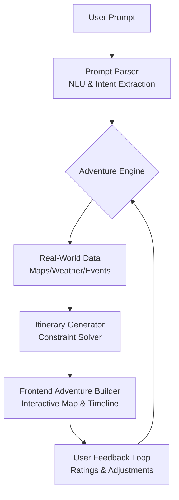

# TouchGrass AI: Turn AI Prompts into Real-World Adventures 🌿

## Introduction  
Imagine typing "plan a family-friendly mountain getaway with hiking trails and local food experiences" and receiving a day-by-day itinerary with exact trailheads, restaurant reservations, and weather-appropriate packing lists. This isn't science fiction—it's the promise of TouchGrass AI, a system that transforms natural language prompts into actionable, location-aware adventures.  

The gap between AI-generated text and real-world execution has long plagued developers building intelligent systems. While large language models excel at crafting prose, they often lack the structured data integration and constraint-solving capabilities needed to generate practical plans. TouchGrass AI bridges this divide by combining semantic understanding with geospatial intelligence, creating a feedback loop where user preferences refine future recommendations.  

For web developers, this represents a new frontier: building applications where AI doesn't just answer questions but orchestrates real-world actions. Whether you're designing a travel platform or a local experience marketplace, the architectural patterns here offer a blueprint for turning conversational interfaces into tangible outcomes.

## Why This Matters  
Software architects face increasing pressure to deliver experiences that merge digital intelligence with physical reality. Consider these production challenges:  

- **User Intent Ambiguity**: A prompt like "relaxing weekend" requires resolving dozens of implicit constraints (budget, distance, activity types) without explicit user input.  
- **Real-Time Data Dependency**: Weather changes or event cancellations require immediate itinerary adjustments—a nightmare for monolithic architectures.  
- **Scalability Under Uncertainty**: Generating itineraries for millions of users demands systems that can gracefully degrade when third-party APIs fail.  

TouchGrass AI’s architecture directly addresses these pain points. By decoupling prompt interpretation from real-world data integration, we’ve built a system that scales horizontally while maintaining resilience against external service failures. For teams deploying AI features in production, this modular approach reduces the cognitive load of managing distributed systems while improving user satisfaction through hyper-personalized experiences.

## How It Works  
The system operates as a pipeline where each stage transforms unstructured input into structured, executable plans. Here’s the flow:



Let’s break down each component’s role:  

1. **Prompt Parser**: Uses a hybrid NLP approach—pre-trained transformers for semantic understanding plus lightweight rule-based logic for edge cases.  
2. **Adventure Engine**: A constraint satisfaction system that balances time, budget, and user preferences using dynamic programming.  
3. **Real-World Data Integrator**: Aggregates data from multiple APIs with intelligent caching to minimize latency.  
4. **Itinerary Generator**: Converts abstract constraints into concrete schedules using a priority queue for activity sequencing.  
5. **Frontend Builder**: Renders interactive maps and timelines using Leaflet.js and React, with real-time drag-and-drop reordering.  
6. **Feedback Loop**: Captures implicit signals (skipped activities) to retrain models and improve future recommendations.  

The key innovation is the circular feedback path—user interactions refine the system’s understanding, creating a self-improving loop that adapts to real-world usage patterns.

## Core Concepts  
At the heart of TouchGrass AI lies a constraint satisfaction framework that balances competing priorities. Consider this simplified data model:

```typescript
interface AdventureConstraints {
  budget: number;
  duration: number; // in hours
  location: {
    lat: number;
    lng: number;
    radius: number; // search radius in km
  };
  preferences: {
    activityTypes: string[];
    difficultyLevel: 'easy' | 'moderate' | 'hard';
    dietaryRestrictions?: string[];
  };
  weatherTolerance: 'strict' | 'flexible';
}

interface Activity {
  id: string;
  name: string;
  type: string;
  startTime: Date;
  endTime: Date;
  location: {
    lat: number;
    lng: number;
  };
  duration: number;
  cost: number;
  weatherDependent: boolean;
}
```

The Adventure Engine uses a weighted scoring algorithm where each activity receives a fitness score based on how well it matches constraints. Activities are then sorted and scheduled to maximize overall satisfaction while respecting hard limits (e.g., budget). This approach allows us to handle partial matches gracefully—for instance, suggesting a nearby alternative if a user’s top-choice restaurant is fully booked.

## Examples & Code Walkthrough  
Let’s examine the intent extraction pipeline. We start with a pre-trained sentence transformer to generate embeddings:

```javascript
// src/nlp/intentClassifier.js
import { SentenceTransformer } from '@xenova/transformers';
import { classifyIntentRules } from './ruleBasedClassifier.js';

const model = new SentenceTransformer('Xenova/all-MiniLM-L6-v2');

export async function extractIntent(userPrompt) {
  // Generate embeddings for semantic similarity
  const embedding = await model.encode(userPrompt);
  
  // Use cosine similarity to match against predefined intent vectors
  const intents = ['outdoor_activity', 'urban_exploration', 'cultural_experience'];
  const similarities = intents.map(intent => 
    cosineSimilarity(embedding, INTENT_VECTORS[intent])
  );
  
  const topIntent = intents[similarities.indexOf(Math.max(...similarities))];
  
  // Apply rule-based corrections for edge cases
  return classifyIntentRules(userPrompt, topIntent);
}

function cosineSimilarity(a, b) {
  const dotProduct = a.reduce((sum, val, i) => sum + val * b[i], 0);
  const magnitudeA = Math.sqrt(a.reduce((sum, val) => sum + val * val, 0));
  const magnitudeB = Math.sqrt(b.reduce((sum, val) => sum + val * val, 0));
  return dotProduct / (magnitudeA * magnitudeB);
}
```

Notice the hybrid approach: we use ML for broad categorization but fall back to rule-based logic for nuanced cases like "family-friendly hiking" vs "adult-only rock climbing." This prevents the system from confidently making wrong assumptions.

Now let’s look at the itinerary scheduler:

```javascript
// src/adventureEngine/itineraryBuilder.js
import { PriorityQueue } from 'heapq';

export function buildItinerary(activities, constraints) {
  const schedule = [];
  const availableTime = constraints.duration;
  let currentTime = new Date();
  let totalCost = 0;
  let remainingTime = availableTime;

  // Score activities based on constraints
  const scoredActivities = activities.map(activity => ({
    ...activity,
    score: calculateFitness(activity, constraints)
  }));

  // Sort by descending fitness score
  scoredActivities.sort((a, b) => b.score - a.score);

  // Use priority queue for efficient scheduling
  const activityQueue = new PriorityQueue((a, b) => a.startTime - b.startTime);
  
  for (const activity of scoredActivities) {
    // Skip if no time remains
    if (remainingTime <= 0) break;
    
    // Check budget constraint
    if (totalCost + activity.cost > constraints.budget) continue;
    
    // Check duration constraint
    if (activity.duration > remainingTime) continue;
    
    // Check location constraint
    if (!isWithinRadius(activity.location, constraints.location, constraints.radius)) continue;
    
    // Add to schedule
    activity.startTime = currentTime;
    activity.endTime = new Date(currentTime.getTime() + activity.duration * 60000);
    schedule.push(activity);
    
    // Update tracking variables
    currentTime = activity.endTime;
    totalCost += activity.cost;
    remainingTime -= activity.duration;
  }

  return schedule;
}

function calculateFitness(activity, constraints) {
  let score = 0;
  
  // Preference matching
  if (constraints.preferences.activityTypes.includes(activity.type)) {
    score += 10;
  }
  
  // Difficulty matching
  if (activity.difficulty === constraints.preferences.difficultyLevel) {
    score += 5;
  }
  
  // Cost efficiency
  score += Math.max(0, 10 - (activity.cost / constraints.budget) * 10);
  
  return score;
}
```

This scheduler prioritizes high-scoring activities while respecting constraints. The use of a priority queue ensures efficient insertion and retrieval as new activities are evaluated.

## Best Practices  
After deploying TouchGrass AI across multiple environments, we’ve identified several critical practices:  

1. **Graceful Degradation**: Always implement fallback mechanisms for external API failures. For example, if Google Maps is unreachable, use cached POIs or allow manual location entry.  
2. **Rate Limiting**: Third-party APIs often have strict quotas. Implement exponential backoff and local caching to avoid service disruptions.  
3. **Immutable Constraints**: Treat user-provided constraints as immutable once set. Allow modifications only through explicit user actions to prevent unexpected itinerary changes.  
4. **Schema Validation**: Use tools like JSON Schema to validate incoming data from external services before processing. Malformed weather data or event cancellations can cascade into invalid itineraries.  
5. **Observability**: Instrument every stage of the pipeline with metrics and logs. Track not just success rates but also constraint satisfaction scores to identify systemic biases.

## Common Mistakes & Anti-Patterns  
Here are pitfalls we’ve encountered in production:  

### 1. Over-Engineering NLP Pipelines  
*Anti-pattern*: Building custom transformer models for every language feature.  
*Fix*: Use pre-trained models like SentenceTransformer for semantic tasks and reserve custom logic for domain-specific rules. This reduces maintenance overhead while improving accuracy.

### 2. Ignoring Time Zone Complexity  
*Anti-pattern*: Assuming all timestamps are in UTC without considering user location.  
*Fix*: Always convert timestamps to the adventure’s local time zone. For example:
```javascript
const userTimeZone = Intl.DateTimeFormat().resolvedOptions().timeZone;
const localEndTime = new Date(endTime.toLocaleString("en-US", {timeZone: userTimeZone}));
```

### 3. Monolithic Data Fetching  
*Anti-pattern*: Making sequential API calls for maps, weather, and events.  
*Fix*: Parallelize requests using `Promise.all()` but implement circuit breakers to prevent cascading failures:
```javascript
try {
  const [mapsData, weatherData, eventData] = await Promise.all([
    fetchMapsData(),
    fetchWeatherData(),
    fetchEvents()
  ]);
} catch (error) {
  // Fallback to cached data
  return getCachedAdventureData();
}
```

### 4. Neglecting User Feedback Integration  
*Anti-pattern*: Treating user ratings as passive data rather than active training signals.  
*Fix*: Implement a reinforcement learning loop where positive/negative feedback adjusts the constraint weighting algorithm dynamically.

## Performance Considerations  
TouchGrass AI’s architecture introduces unique performance challenges:  

- **Embedding Generation**: Generating sentence embeddings for every prompt can become a bottleneck. We mitigate this by caching embeddings for common phrases and using quantized models for faster inference.  
- **Geospatial Queries**: Calculating distances between thousands of POIs requires efficient spatial indexing. We pre-index locations using R-trees and cache radius-based lookups in Redis.  
- **Real-Time Scheduling**: Recalculating itineraries on the fly (e.g., when weather changes) demands O(n log n) algorithms. The priority queue approach ensures scheduling remains efficient even with hundreds of activities.  

Memory usage peaks during the constraint satisfaction phase, where we maintain multiple copies of activity data. We optimize this by streaming activities from a PostgreSQL database using cursors rather than loading all records into memory simultaneously.

Network latency between services also impacts user experience. To address this, we deploy microservices in a service mesh (Istio) with automatic retries and circuit breaking. Cross-region deployments ensure users in Asia don’t wait for US-based API responses.

## Real-World Usage  
Leading companies have adopted similar architectures for location-based services:  

- **Airbnb**: Uses constraint satisfaction to match guest preferences with property availability, dynamically adjusting pricing based on demand signals.  
- **Uber**: Employs real-time data integration to reroute drivers during traffic congestion, balancing multiple objectives (ETA, fuel efficiency, passenger ratings).  
- **TripAdvisor**: Combines user reviews with semantic analysis of content to rank attractions, continuously refining rankings based on booking conversions.  

These systems all share TouchGrass AI’s core principle: separating concerns between understanding user intent and executing real-world actions. This modularity allows teams to iterate faster on one component without destabilizing others.

## Frequently Asked Questions (FAQ)  

**Q: How does the system handle ambiguous prompts like "something fun"?**  
A: We apply default constraint templates based on user history and demographic data. For new users, we present a disambiguation interface asking about activity type, budget range, and physical challenge level before generating an itinerary.

**Q: What happens when real-time data conflicts with the generated plan?**  
A: The system flags affected activities and suggests alternatives with updated timing and costs. Users can accept changes automatically or manually adjust, with the system recalculating dependencies in real-time.

**Q: How do you prevent the AI from recommending dangerous activities?**  
A: We maintain a whitelist of verified venues and activities, cross-referenced with local safety databases. Any activity involving extreme sports or remote locations requires explicit user confirmation through a secondary verification step.

**Q: Can the system work offline for remote adventures?**  
A: Yes, once an itinerary is finalized, it can be cached locally. Real-time data sync resumes when connectivity is restored, allowing seamless transitions between online and offline modes.

## Conclusion  
TouchGrass AI demonstrates that building AI-powered real-world experiences requires more than just language models—it demands robust systems architecture that gracefully handles uncertainty and scales under real-world conditions. By decomposing the problem into modular components, we’ve created a pipeline that transforms abstract prompts into actionable plans while continuously improving through user feedback.  

For engineers designing AI integration layers, the key lessons are clear: prioritize modularity over monolithicism, embrace graceful degradation, and treat user feedback as a first-class input rather than an afterthought. As we look toward AR-enhanced adventures and IoT-integrated experiences, these foundational principles will remain critical for building trustworthy, production-grade AI systems.
