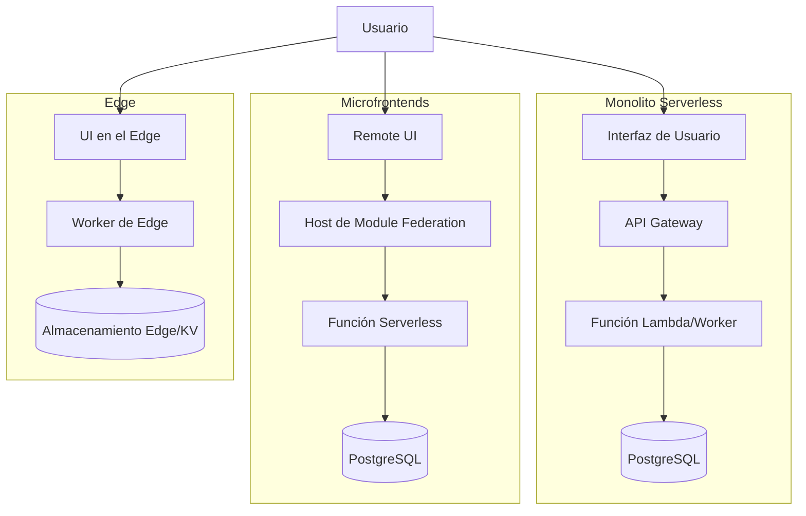

# Tres proyectos, tres formas distintas de romperme la cabeza

## Introduction
En los últimos años he tenido la oportunidad de liderar tres iniciativas web que, aunque persiguen objetivos similares de entrega de valor al usuario, nos obligaron a tomar decisiones arquitectónicas muy distintas. Cada una puso a prueba nuestra capacidad para equilibrar complejidad técnica, autonomía de equipos y costos operativos. En este artículo describo los problemas que enfrentamos, las soluciones que adoptamos y las lecciones que extrajimos de cada camino.

## Why This Matters
Los arquitectos hoy deben decidir no solo qué tecnología usar, sino cómo estructurar el sistema para que evolucione sin fricción. Un mal ajuste entre patrón y contexto genera sobrecarga operativa, latencia inesperada o dificultades para escalar equipos. Comprender los trade‑offs de cada enfoque permite tomar decisiones informadas antes de que el código se vuelva un lastre en producción.

## How It Works
A continuación muestro, mediante un diagrama, cómo se organizan los tres casos de estudio. Cada bloque representa un límite de responsabilidad y las flechas indican el flujo de datos típico.



**Monolito Serverless**  
Una única función manejará todo el tráfico API detrás de un gateway. La base de datos relacional es compartida y la lógica de negocio reside dentro de esa función.

**Microfrontends**  
El alojamiento (host) carga en tiempo de ejecución varios remotos mediante Module Federation. Cada remote posee su propio pipeline de build y se comunica con una capa de servicios compartida (también serverless).

**Edge First**  
El request llega primero a un worker en la periferia. Ese worker puede renderizar una vista, leer activos estáticos de un bucket edge (R2) y, solo si es necesario, reenviar peticiones al origen.

## Core Concepts
- **Límite de despliegue**: unidad que se versiona y se despliega de forma independiente (función, remote, worker).
- **Acoplamiento**: grado en que un cambio en un componente obliga a modificar otros.
- **Estado**: dónde se persiste la información (base de datos central, caché edge, almacenamiento objeto).
- **Latencia de red**: tiempo que tarda una petición en cruzar los límites entre cliente, edge y origen.
- **Coste operativo**: combinación de invocaciones, tiempo de cómputo y transferencia de datos.

## Examples & Code Walkthrough
A continuación comparto fragmentos reales que usamos en cada proyecto. Los he simplificado para proteger información sensible, pero conservan los patrones de manejo de errores, configuración y observabilidad que resultaron críticos.

### 1. Monolito Serverless – Función Lambda con Prisma
```javascript
// src/handler.js
import { PrismaClient } from '@prisma/client';
import { middyfy } from './libs/middyfy'; // wrapper para logging y trazado

const prisma = new PrismaClient();

export const handler = middyfy(async (event) => {
  try {
    // Asumimos que el path contiene el ID del recurso
    const { id } = event.pathParameters || {};
    if (!id) {
      return { statusCode: 400, body: JSON.stringify({ error: 'Missing id' }) };
    }

    const item = await prisma.item.findUnique({
      where: { id: Number(id) },
      select: { id: true, name: true, createdAt: true },
    });

    if (!item) {
      return { statusCode: 404, body: JSON.stringify({ error: 'Not found' }) };
    }

    return {
      statusCode: 200,
      body: JSON.stringify(item),
    };
  } catch (err) {
    // En producción enviamos a un servicio de errores (Sentry, Datadog)
    console.error('Error inesperado:', err);
    return { statusCode: 500, body: JSON.stringify({ error: 'Internal error' }) };
  } finally {
    // Prisma mantiene conexiones; cerramos explícitamente en entornos serverless
    await prisma.$disconnect();
  }
});
```
**Puntos a observar**  
- El wrapper `middyfy` agrega enriquecimiento de logs y captura de trazas sin ensuciar la lógica de negocio.  
- Se cierra la conexión de Prisma en el `finally` para evitar agotamiento de pools en contenedores reutilizados.  
- Validación temprana de parámetros evita llamadas innecesarias a la base de datos.

### 2. Microfrontend Remote – Exposición de un hook mediante Module Federation
```javascript
// webpack.remote.js
const { ModuleFederationPlugin } = require('webpack').container;
const deps = require('./package.json').dependencies;

module.exports = {
  name: 'dashboardRemote',
  filename: 'remoteEntry.js',
  exposes: {
    './useApp': './src/hooks/useApp.js', // hook que encapsula lógica de estado y llamadas API
  },
  shared: {
    react: { singleton: true, eager: true, requiredVersion: deps.react },
    'react-dom': { singleton: true, eager: true, requiredVersion: deps['react-dom'] },
  },
};
```

```javascript
// src/hooks/useApp.js
import { useState, useEffect } from 'react';
import { fetchDashboardData } from '../api/dashboard';

export function useApp() {
  const [data, setData] = useState(null);
  const [loading, setLoading] = useState(true);
  const [error, setError] = useState(null);

  useEffect(() => {
    let cancelled = false;
    async function load() {
      try {
        setLoading(true);
        const result = await fetchDashboardData();
        if (!cancelled) setData(result);
      } catch (e) {
        if (!cancelled) setError(e);
      } finally {
        if (!cancelled) setLoading(false);
      }
    }
    load();
    return () => { cancelled = true; };
  }, []);

  return { data, loading, error };
}
```
**Puntos a observar**  
- El remote exporta únicamente el hook; el host lo importa mediante `import('dashboardRemote/useApp')`.  
- Las dependencias de React y React‑DOM se declaran como `singleton` para evitar duplicados y problemas de versiones.  
- El hook incorpora cancelación de peticiones para evitar race conditions cuando el componente se desmonta antes de que la respuesta llegue.

### 3. Edge Worker – Renderizado con Worktop y lectura de R2
```javascript
// worker.js
import { WorkerEntrypoint } from 'cloudflare:workers';
import { renderToString } from 'react-dom/server';
import App from './components/App'; // componente React universal
import { getFromR2 } from './r2';   // helper que usa la API de R2

export default {
  async fetch(request, env, ctx) {
    const url = new URL(request.url);
    const path = url.pathname;

    // 1️⃣ Intento servir un activo estático desde R2 (imágenes, CSS, etc.)
    if (path.match(/\.(png|jpe?g|svg|css|js)$/)) {
      const asset = await getFromR2(env, path);
      if (asset) {
        return new Response(asset.body, {
          headers: { 'Content-Type': asset.contentType },
        });
      }
    }

    // 2️⃣ Renderizamos la aplicación React en el edge
    let html;
    try {
      const appProps = { initialPath: path };
      const reactElement = <App {...appProps} />;
      html = await renderToString(reactElement);
    } catch (e) {
      // En caso de error de renderizado devolvemos una página genérica
      return new Response('<h1>Error interno</h1>', { status: 500 });
    }

    // 3️⃣ Inyectamos el HTML en una plantilla mínima
    const fullPage = `
      <!doctype html>
      <html lang="es">
        <head>
          <meta charset="utf-8"><title>Mi App</title>
          <link rel="stylesheet" href="/styles/main.css">
        </head>
        <body>
          <div id="root">${html}</div>
          <script src="/bundle.js" defer></script>
        </body>
      </html>
    `;

    return new Response(fullPage, {
      headers: { 'Content-Type': 'text/html; charset=utf-8' },
    });
  },
};
```
**Puntos a observar**  
- El worker primero intenta servir activos estáticos desde R2, evitando ir al origen para recursos cacheables.  
- El renderizado React se ejecuta totalmente dentro del límite de tiempo del worker (actualmente 30 s para workers pagados).  
- Se captura cualquier excepción de renderizado para devolver una respuesta de error controlada en lugar de caer en una caída del worker.  

## Best Practices
1. **Define límites de despliegue claros** antes de escribir la primera línea de código. Un límite demasiado amplio genera acoplamiento; uno demasiado estrecho aumenta la sobrecarga operativa.  
2. **Invierte en observabilidad temprana**. En serverless y edge, los logs y las métricas son la única visión que tienes del comportamiento en producción. Usa wrappers de middleware o plugins que añadan request ID y distribución de trazas.  
3. **Versiona las dependencias compartidas con cuidado**. En microfrontends, un `singleton` mal configurado puede provocar versiones duales de React y provocar errores hidratación. Usa herramientas como `module-federation-plugin` con `requiredVersion` fijada al rango que pruebes en integración.  
4. **Preferir lecturas edge para datos de lectura‑escritura baja**. Si la información es relativamente estática (configuración, contenido estático, perfiles de usuario poco frecuente), almacénala en KV o R2 y evita viajes al origen.  
5. **Implementa circuit breakers en llamadas al origen** desde el edge o desde funciones serverless. Un fallo en la base de datos no debe derribar todo el edge; devuelve una respuesta estática o una versión degradada.  

## Common Mistakes & Anti-Patterns
| Anti‑patrón | Por qué ocurre | Solución concreta |
|-------------|----------------|-------------------|
| **Función monolítica sin separación de preocupaciones** | Se reutiliza el mismo código para múltiples endpoints, dificultando pruebas unitarias. | Dividir la lógica en servicios independientes (p.e., capa de servicio, capa de acceso a datos) y exponerlos mediante funciones delgadas que solo orchestran. |
| **Remotos que dependen de versiones diferentes de una biblioteca UI** | Cada equipo actualiza su paquete sin coordinar, provocando múltiples copias de React en el bundle. | Declarar las bibliotecas UI como `shared` con `singleton: true` en la configuración de Module Federation y validar en CI que el bundle resultante no duplique esos paquetes. |
| **Worker que realiza operaciones de I/O síncrono** | Se usa `fetch` dentro de un bucle bloqueante o se llama a una API que no soporta async/await, superando el límite de CPU. | Revisar que todas las llamadas sean `await fetch` y usar `Promise.all` solo cuando sea necesario; medir el tiempo de CPU con `wrangler dev --profile`. |
| **Ignorar la métrica de cold start en serverless** | Se asume que la función siempre está caliente, lo que lleva a SLA incumplidos en tráfico esporádico. | Implementar provisioned concurrency para rutas críticas o usar un warming ping (CloudWatch Events) que invoque la función cada 5 min. |
| **Almacenar estado de sesión en el edge sin estrategia de replicación** | El worker guarda datos en memoria local; si la petición es atendida por otra instancia, el estado se pierde. | Usar KV o Durable Objects para estado que debe ser compartido entre instancias, y limitar el worker a datos de solo lectura o a caché de corto plazo. |

## Performance Considerations
- **Latencia de red**: En el caso edge, la mayor parte del tiempo se gasta en el viaje cliente‑edge (< 20 ms en la mayoría de regiones). El tiempo de cómputo del worker suele estar bajo 5 ms para renderizado simple, pero crece linealmente con el tamaño del árbol de React.  
- **Escalabilidad de funciones**: Las plataformas serverless escalan por invocación; sin embargo, el límite de concurrencia por cuenta puede convertirse en cuello de botella si se disparan picos inesperados. Monitorear `ConcurrentExecutions` y ajustar el límite o usar provisioned concurrency.  
- **Tamaño de bundle en microfrontends**: Cada remote descarga su propio entrypoint. Si los remotos comparten dependencias grandes (p.e., lodash), el peso total puede superar el de una SPA monolítica. Medir con `webpack-bundle-analyzer` y aplicar `externals` o `shared` para evitar duplicación.  
- **Coste de lecturas edge**: Cada lectura de R2 tiene un costo por operación y por GB transferido. Para datos de alta frecuencia, considerar caching en la propia memoria del worker (con límite de 128 MB) y actualizar mediante KV cuando cambie.  

## Real-World Usage
- **Netflix** utiliza una combinación de funciones Lambda para orquestar flujos de trabajo de micro‑servicios y un edge basado en sus propios dispositivos para entregar manifestos de video personalizados.  
- **Spotify** ha publicado cómo migra parte de su frontend a micro‑
