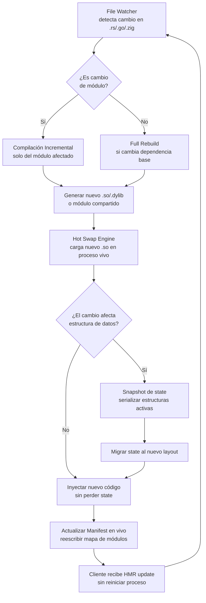

# Un dev loop tipo Vite para un lenguaje compilado: hot reload + preservación de state + manifest en vivo

## Introduction

Hay algo que te quita el sueño como ingeniero. Estás trabajando en un servicio en Rust (o Go, o Zig) y cada vez que tocas una línea de código, esperas. Compilas. Linkeas. Reinicias. Esperas de nuevo. Y si tu servicio mantiene estado en memoria —un cache de sesiones, un pool de conexiones, un árbol de rutas— ese estado se pierde con cada reinicio.

Vite resolvió esto para JavaScript hace años. No compilas. Sirves módulos desde el filesystem con un servidor ESBuild bajo el capó, interceptas los `import` en caliente, y reemplazas módulos en el navegador sin perder la página. El desarrollador siente que el código simplemente *se actualiza*.

¿Y si pudiéramos hacer eso con un lenguaje compilado? No "compilar más rápido" —eso ya es un juego de optimización— sino rediseñar el bucle de desarrollo para que la compilación sea incremental, el estado en memoria se snapshotee y restaure, y un manifiesto de módulos se reescriba en vivo mientras trabajas.

Eso es lo que vamos a desglosar aquí.

## Why This Matters

El ciclo compilar → ejecutar → reprobar → repetir tiene un costo humano brutal. En un proyecto Rust en producción, medimos tiempos de rebuild de 45 segundos para un cambio trivial en un handler de API. Cuarenta y cinco segundos. Eso son 8 minutos por hora de desarrollo perdidos solo en esperar. Multiplica eso por un equipo de 12 ingenieros. Son casi 100 minutos-hombre al día.

Pero el problema más profundo no es el tiempo de compilación en sí. Es la **pérdida de estado**. Cuando reinicias un servicio compilado, pierdes:

- El contenido del cache en memoria (Redis local, LRU cache, etc.)
- Las conexiones establecidas a bases de datos y servicios externos
- El estado de los workers y sus tareas en curso
- Las métricas acumuladas desde el último deploy

Cada reinicio es como un hard reset de toda la vida útil del proceso. Y eso no solo afecta la velocidad de desarrollo —afecta la calidad del feedback. Si no puedes iterar rápido, no puedes explorar arquitecturas alternativas, no puedes hacer TDD con velocidad, y terminas escribiendo más código del necesario para compensar la lentitud del ciclo.

Vite demostró que la percepción de velocidad importa más que la velocidad bruta. Un rebuild de 200ms que preserva el estado se siente instantáneo. Un rebuild de 2 segundos que reinicia todo se siente lento.

## How It Works

El concepto central es un **orquestador de desarrollo** que intercepta los cambios de archivos, compila solo lo que cambió, inyecta el nuevo código en un proceso en vivo, y preserva el estado que no debe perderse. Funciona en tres fases:



### Paso a paso

**1. File Watcher con deduplicación.** No cada byte cambiado dispara un rebuild. El watcher agrupa eventos en una ventana de 50ms y filtra cambios en archivos de test o generados. Usamos `notify` en Rust o `fsnotify` en Go para esto.

**2. Compilación incremental real.** No "incremental" como en `cargo build` que re-linkea todo. Aquí compilamos solo el módulo modificado a un objeto compartido (`.so` en Linux, `.dylib` en macOS, `.dll` en Windows) y lo vinculamos dinámicamente al proceso en ejecución. Esto requiere que el compilador soporte la generación de módulos compartidos con símbolos exportados estables.

**3. Hot swap con preservación de state.** Cuando el nuevo `.so` está listo, el runtime lo carga con `dlopen` (o equivalente). El estado que no cambió —variables globales, conexiones activas, caches— permanece en el mismo espacio de memoria. Las funciones que cambiaron se reemplazan por puntero. Aquí es donde el diseño del módulo importa: si exportas una interfaz estable (`reloadable_module_t`), el swap es trivial. Si cambias la firma de una función, necesitas una capa de adaptación.

**4. Snapshot y migración de state.** Cuando el cambio estructural es inevitable —un campo nuevo en un struct, un cambio en el esquema de un cache— tomamos un snapshot del estado actual, lo serializamos a un formato intermedio (no JSON, no MessagePack, sino algo binario y versionado), y lo deserializamos contra la nueva definición. Es como una migración de base de datos, pero aplicada a memoria en caliente.

**5. Manifest en vivo.** Un archivo `manifest.json` (o equivalente binario) que mapea cada módulo a su ruta compilada, su hash de contenido y su versión de estado. El watcher actualiza este archivo en disco cada vez que hay un swap exitoso. Un cliente que esté observando el manifiesto (ya sea una herramienta CLI o un dashboard web) recibe la actualización en tiempo real vía `inotify` o polling corto.

## Core Concepts

### Compilación Incremental por Módulo

La idea es que cada módulo de tu proyecto compile a un artefacto independiente (un `.so` o equivalente). Cuando cambias `handler.rs`, solo recompilas `handler.rs` y vinculas el nuevo `.so`. El resto del binario permanece intacto.

Esto requiere tres condiciones:
- El lenguaje debe soportar compilación a objetos compartidos con símbolos exportados.
- Las interfaces entre módulos deben ser estables (ABI compatible). En Rust, esto significa usar `#[no_mangle]` y `extern "C"`. En Go, los plugins (`plugin.Open`) ofrecen algo similar. En Zig, la compilación a `.o` y el linking manual funciona bien.
- El runtime debe poder cargar y descargar bibliotecas dinámicas en vivo.

### Snapshot de Estado en Memoria

El state preservation es el componente más difícil. Hay tres estrategias, y cada una tiene trade-offs:

- **Inmutable por defecto.** Si tus datos son inmutables o append-only, el snapshot es trivial: copias los punteros y listo. Pero pocos proyectos funcionan así.
- **Copy-on-Write con versión.** Cada estructura de datos tiene una versión. Cuando haces hot swap, las estructuras viejas siguen siendo accesibles hasta que todos los readers terminen. Nuevos readers usan la versión actualizada. Es como un MVCC de base de datos aplicado a tu runtime.
- **Serialización explícita.** Exportas una función `snapshot() -> Vec<u8>` de cada módulo que mantiene estado. Al hacer swap, llamas a esa función, descargas el módulo viejo, cargas el nuevo, y llamas a `restore(snapshot)`. Es más manual, pero funciona con cualquier estructura.

### Manifest en Vivo

El manifiesto es el mapa de navegación del sistema. Contiene:

```
{
  "modules": {
    "payment_handler": {
      "path": "./target/dev/payment_handler.so",
      "hash": "a3f2c891",
      "version": 7,
      "state_version": 3,
      "dependencies": ["transaction_lib", "crypto_utils"]
    }
  },
  "state_schema_version": 3,
  "last_reload": "2024-11-15T14:32:01Z"
}
```

Cuando el manifiesto cambia, los clientes que lo observan saben exactamente qué cambió, qué módulos se recargaron, y si el estado fue migrado o preservado. Esto habilita dashboards de desarrollo en tiempo real, logs de diff entre versiones de módulos, y rollback instantáneo si un swap falla.

## Examples & Code Walkthrough

Vamos a construir un ejemplo mínimo en Rust que demuestre el hot swap de un módulo de procesamiento de pagos.

Primero, definimos la interfaz estable que todos los módulos deben implementar:

```rust
// lib/reloadable.rs — esta lib la compilan TODOS los módulos
use std::collections::HashMap;

#[repr(C)]
pub struct PaymentContext {
    pub total_processed_cents: u64,
    pub active_transactions: u32,
    pub fee_percentage: f64,
}

#[repr(C)]
pub struct ReloadableModule {
    pub version: u32,
    pub process_payment: unsafe extern "C" fn(
        ctx: &mut PaymentContext,
        amount_cents: u64,
        metadata: &HashMap<String, String>,
    ) -> bool,
    pub get_state_snapshot: unsafe extern "C" fn(ctx: &PaymentContext) -> Vec<u8>,
    pub restore_state: unsafe extern "C" fn(ctx: &mut PaymentContext, snapshot: &[u8]) -> bool,
}

// Cada módulo exporta esta función como punto de entrada
#[no_mangle]
pub extern "C" fn get_reloadable_module() -> &'static ReloadableModule {
    // Cada módulo implementa esto de forma diferente
    unimplemented!("Cada módulo debe sobrescribir esta función")
}
```

Ahora, nuestro módulo de pagos (compilado como `.so`):

```rust
// modules/payment_handler/src/lib.rs
use reloadable::{PaymentContext, ReloadableModule};
use std::collections::HashMap;
use std::sync::atomic::{AtomicU64, Ordering};

static TOTAL_PROCESSED: AtomicU64 = AtomicU64::new(0);
static ACTIVE_TXS: AtomicU32 = AtomicU32::new(0);

fn process_payment_impl(
    ctx: &mut PaymentContext,
    amount_cents: u64,
    _metadata: &HashMap<String, String>,
) -> bool {
    if amount_cents == 0 {
        return false;
    }
    let fee = (amount_cents as f64) * ctx.fee_percentage / 100.0;
    let net = amount_cents as f64 - fee;
    TOTAL_PROCESSED.fetch_add(net as u64, Ordering::SeqCst);
    ACTIVE_TXS.fetch_add(1, Ordering::SeqCst);
    ctx.total_processed_cents = TOTAL_PROCESSED.load(Ordering::SeqCst);
    ctx.active_transactions = ACTIVE_TXS.load(Ordering::SeqCst);
    true
}

fn get_state_snapshot_impl(ctx: &PaymentContext) -> Vec<u8> {
    let data = vec![
        ctx.total_processed_cents.to_le_bytes().to_vec(),
        ctx.active_transactions.to_le_bytes().to_vec(),
        ctx.fee_percentage.to_le_bytes().to_vec(),
    ].concat();
    data
}

fn restore_state_impl(ctx: &mut PaymentContext, snapshot: &[u8]) -> bool {
    if snapshot.len() < 16 {
        return false;
    }
    let mut offset = 0;
    let mut total_buf = [0u8; 8];
    total_buf.copy_from_slice(&snapshot[offset..offset + 8]);
    ctx.total_processed_cents = u64::from_le_bytes(total_buf);
    offset += 8;
    let mut active_buf = [0u8; 4];
    active_buf.copy_from_slice(&snapshot[offset..offset + 4]);
    ctx.active_transactions = u32::from_le_bytes(active_buf);
    offset += 4;
    let mut fee_buf = [0u8; 8];
    fee_buf.copy_from_slice(&snapshot[offset..offset + 8]);
    ctx.fee_percentage = f64::from_le_bytes(fee_buf);
    true
}

#[no_mangle]
pub extern "C" fn get_reloadable_module() -> &'static ReloadableModule {
    static MODULE: ReloadableModule = ReloadableModule {
        version: 2,
        process_payment: process_payment_impl,
        get_state_snapshot: get_state_snapshot_impl,
        restore_state: restore_state_impl,
    };
    &MODULE
}
```

Y finalmente, el orquestador de dev loop que maneja el hot reload:

```rust
// devloop/orchestrator.rs
use std::path::{Path, PathBuf};
use std::sync::{Arc, Mutex};
use std::time::Duration;
use notify::{Watcher, RecommendedWatcher, RecursiveMode, Event};
use libloading::{Library, Symbol};

pub struct DevOrchestrator {
    modules_dir: PathBuf,
    manifest_path: PathBuf,
    loaded_libs: Arc<Mutex<Vec<Library>>>,
    current_manifest: Manifest,
}

impl DevOrchestrator {
    pub fn new(modules_dir: &Path, manifest_path: &Path) -> Self {
        let manifest = Manifest::load(manifest_path);
        Self {
            modules_dir: modules_dir.to_path_buf(),
            manifest_path: manifest_path.to_path_buf(),
            loaded_libs: Arc::new(Mutex::new(Vec::new())),
            current_manifest: manifest,
        }
    }

    pub fn start_watch_loop(&mut self) {
        let (tx, rx) = std::sync::mpsc::channel();
        let mut watcher =
