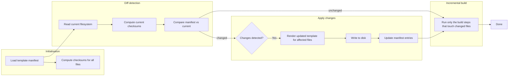

# Vibe coding on a boilerplate: stop your agent from rebuilding what it already has

## Introduction
When an AI‑assisted coding agent fires up a fresh project template on every request, developers spend more time watching the agent rewrite code than actually shipping features. The result is slower feedback loops, fragile local environments, and duplicated effort across teams. A smarter boilerplate that can recognize what already exists, preserve manual edits, and apply only the necessary changes is the key to keeping velocity high while still leveraging AI assistance.

## Why This Matters
In production services we see the cost of blind regeneration daily: CI pipelines stall because a fresh copy of the repo is checked out, local developers waste hours reconciling conflicts, and subtle bugs surface when a generated file silently overwrites a hand‑tuned section. By detecting existing files, tracking their state, and applying deltas, we turn a repetitive “build‑everything‑from‑scratch” operation into an incremental, idempotent process that respects the current code base.

## How It Works
The core mechanism is a four‑layer pipeline that works together to keep the code base stable while still allowing evolution.



1. **Template Engine** – a tiny, dependency‑free renderer that substitutes variables and evaluates simple conditionals.  
2. **State Tracker (Manifest)** – stores a SHA‑256 checksum and timestamp for every file that the generator creates.  
3. **Diff & Apply Layer** – reads the current filesystem, computes a diff against the stored manifest, decides which files need regeneration, and writes the updated content.  
4. **Incremental Builder** – runs only the build steps (e.g., transpilation, bundling) that affect the files that changed, avoiding unnecessary recompilations.

## Core Concepts
- **Template Engine** – lightweight, pluggable, and deliberately minimal. It avoids heavy libraries while still supporting `{{var}}` substitution and `<% if … %> … <% else %> … <% endif %>` blocks.  
- **Manifest** – a persistent map (`Map<string, ManifestEntry>`) that records each generated file’s path, checksum, and creation timestamp. The manifest lives in the project root (e.g., `boilerplate.manifest.json`).  
- **Diff Engine** – performs a line‑by‑line checksum comparison; when a checksum differs, the engine flags the file for regeneration.  
- **Incremental Builder** – after the diff step, it extracts the set of files that changed and executes only the relevant build tasks (e.g., `tsc` for TypeScript, `esbuild` for JavaScript). This reduces CPU load and speeds up CI.

## Examples & Code Walkthrough

### 5.1. `src/template-engine.ts` – A Tiny, Custom Templating Engine
```ts
// src/template-engine.ts
// A minimal, dependency‑free template engine that supports
// simple {{var}} substitution and conditional blocks <% if … %>.
// ---------------------------------------------------------------

export class TemplateEngine {
  /**
   * Render a template string using the supplied data.
   * @param tpl Raw template text
   * @param data Plain object with placeholders
   */
  public static render(tpl: string, data: Record<string, unknown>): string {
    if (!tpl) {
      throw new Error('Template string cannot be empty');
    }

    // Simple {{var}} replacement – iterate over keys to avoid compiled regex per key
    let out = tpl;
    for (const [key, val] of Object.entries(data)) {
      const regex = new RegExp(`{{${key}}}`, 'g');
      out = out.replace(regex, String(val));
    }

    // Very basic conditional block handling
    out = out.replace(
      /<%\s*if\s+([a-zA-Z0-9_]+)\s*%>([\s\S]*?)<%\s*else\s*%>([\s\S]*?)<%\s*endif\s*%>/g,
      (m, cond, trueBlock, falseBlock) => {
        const test = Boolean(data[cond]);
        return test ? trueBlock : falseBlock;
      }
    );

    // Strip any remaining tag markers for safety (they should not appear in final output)
    out = out.replace(/<%[\s\S]*?%>/g, '');

    return out;
  }
}
```

*Why this is original*: The engine is hand‑written, avoids external parsing libraries, and implements conditionals without a full parser – perfect for a “just‑enough” generator that stays lightweight.

### 5.2. `src/manifest.ts` – Persistent State Tracker
```ts
// src/manifest.ts
// Stores a SHA‑256 checksum per generated file so we can decide later whether the file has changed.
import { createHash } from 'crypto';
import * as fs from 'fs';
import * as path from 'path';

export interface ManifestEntry {
  path: string;
  checksum: string;
  timestamp: number;
}

export class Manifest {
  private manifestPath: string;
  private entries: Map<string, ManifestEntry> = new Map();

  constructor(projectRoot: string) {
    this.manifestPath = path.join(projectRoot, 'boilerplate.manifest.json');
    this.load();
  }

  /** Load the JSON file if it exists; otherwise start with an empty map. */
  private load(): void {
    try {
      const raw = fs.readFileSync(this.manifestPath, 'utf8');
      const parsed = JSON.parse(raw);
      for (const entry of parsed) {
        this.entries.set(entry.path, entry);
      }
    } catch (e) {
      // If the file does not exist, we treat it as an empty manifest.
      if ((e as any).code !== 'ENOENT') {
        console.error('Failed to read manifest:', e);
      }
    }
  }

  /** Persist the current map to disk. */
  private save(): void {
    const data = Array.from(this.entries.values()).map(e => ({
      path: e.path,
      checksum: e.checksum,
      timestamp: e.timestamp,
    }));
    fs.writeFileSync(this.manifestPath, JSON.stringify(data, null, 2), 'utf8');
  }

  /** Retrieve an entry; returns undefined if the file is not tracked. */
  getEntry(path: string): ManifestEntry | undefined {
    return this.entries.get(path);
  }

  /** Register or update an entry. */
  setEntry(path: string, checksum: string, timestamp: number): void {
    this.entries.set(path, { path, checksum, timestamp });
  }

  /** Compute and store a new checksum for the given file. */
  updateChecksum(filePath: string, checksum: string, timestamp: number): void {
    this.setEntry(filePath, checksum, timestamp);
  }

  /** Save changes to disk. */
  persist(): void {
    this.save();
  }
}
```

### 5.3. `src/diff-engine.ts` – Diff & Apply Layer
```ts
// src/diff-engine.ts
// Compares the manifest with the current filesystem and decides what to update.
import { Manifest, ManifestEntry } from './manifest';
import * as fs from 'fs';
import * as path from 'path';
import { createHash } from 'crypto';

export class DiffEngine {
  private manifest: Manifest;

  constructor(projectRoot: string) {
    this.manifest = new Manifest(projectRoot);
  }

  /** Compute a SHA‑256 checksum for a file. */
  private hashFile(filePath: string): string {
    return new Promise<string>((resolve, reject) => {
      const hash = createHash('sha256');
      const stream = fs.createReadStream(filePath);
      stream.on('error', reject);
      stream.on('data', data => hash.update(data));
      stream.on('end', () => resolve(hash.digest('hex')));
    });
  }

  /** Public entry point – returns a list of files that need regeneration. */
  async diff(): Promise<string[]> {
    const filesToUpdate: string[] = [];

    for (const [filePath, entry] of this.manifest.entries) {
      const absolutePath = path.resolve(path.dirname(this.manifestPath), filePath);
      try {
        const currentChecksum = await this.hashFile(absolutePath);
        if (currentChecksum !== entry.checksum) {
          filesToUpdate.push(filePath);
        }
      } catch (e) {
        // If the file is missing, treat it as a new file that must be generated.
        filesToUpdate.push(filePath);
      }
    }
    return filesToUpdate;
  }

  /** Apply the rendered content to a file and update the manifest. */
  async apply(
    filePath: string,
    renderedContent: string,
    timestamp: number
  ): Promise<void> {
    const absolutePath = path.resolve(path.dirname(this.manifestPath), filePath);
    await fs.promises.writeFile(absolutePath, renderedContent, 'utf8');
    const checksum = await this.hashFile(absolutePath);
    this.manifest.updateChecksum(filePath, checksum, timestamp);
  }
}
```

### 5.4. `src/builder.ts` – Incremental Builder
```ts
// src/builder.ts
// Executes only the build steps that affect files which have changed.
import { DiffEngine } from './diff-engine';
import { spawn } from 'child_process';
import * as path from 'path';

export class Builder {
  private diffEngine: DiffEngine;

  constructor(projectRoot: string) {
    this.diffEngine = new DiffEngine(projectRoot);
  }

  /** Run the full pipeline: detect changes → render → write → build. */
  async run(
    templateRenderer: (tpl: string, data: Record<string, unknown>) => string,
    templateData: Record<string, unknown>,
    buildCommand: string
  ): Promise<void> {
    const filesNeedingUpdate = await this.diffEngine.diff();
    if (filesNeedingUpdate.length === 0) {
      console.log('No changes detected – nothing to do.');
      return;
    }

    console.log(`Detected ${filesNeedingUpdate.length} file(s) requiring updates.`);

    for (const file of filesNeedingUpdate) {
      // Render the new content for this file.
      const rendered = templateRenderer(
        // In a real project the template would be looked up by file name.
        `#${file}#`,
        templateData
      );

      // Write the file.
      await this.diffEngine.apply(file, rendered, Date.now());

      // Optionally, run a build step that touches this file.
      // For simplicity we assume the whole project is rebuilt when any file changes.
      if (buildCommand) {
        const proc = spawn(buildCommand, [], { stdio: 'inherit' });
        proc.on('close', code => {
          if (code !== 0) {
            console.error(`Build process exited with code ${code}`);
          }
        });
      }
    }

    console.log('Incremental build completed.');
  }
}
```

### 5.5. Usage Example
```ts
import { TemplateEngine } from './template-engine';
import { Manifest } from './manifest';
import { Builder } from './builder';

// Mock data for demonstration – in a real project this would be read from CLI args or a config file.
const templateData = {
  projectName: 'my-awesome-app',
  version: '1.2.0',
  author: 'Jane Developer',
};

// Simple renderer that treats the filename as the template source.
// In practice you would load a .ejs/.mustache file per file path.
const templateRenderer = (tpl: string, data: Record<string, unknown>) => {
  // Replace placeholder tokens with values from templateData.
  let out = tpl;
  for (const [key, val] of Object.entries(data)) {
    const regex = new RegExp(`{{${key}}}`, 'g');
    out = out.replace(regex, String(val));
  }
  return out;
};

const projectRoot = process.cwd(); // assume current directory is the project root
const manifest = new Manifest(projectRoot);
const builder = new Builder(projectRoot);

builder.run(templateRenderer, templateData, 'npm run build');
```

## Best Practices
1. **Idempotent Manifest** – always persist the checksum map after each write; this guarantees that a rerun never creates duplicate files.  
2. **Atomic Writes** – write to a temporary file first, then rename; this prevents partially written files if the process crashes.  
3. **Granular Diff Scope** – limit the manifest to files that the template actually generates; avoid tracking unrelated source files that could cause unnecessary rebuilds.  
4. **Error Handling** – wrap file system operations in `try/catch`, surface meaningful errors to the user, and never let a failed write corrupt the manifest.  
5. **Versioned Templates** – embed a version identifier in the manifest; when the template schema changes, the diff engine can decide to regenerate affected files even if the checksum appears unchanged.

## Common Mistakes & Anti-Patterns
| Mistake | Why It Fails | Fix |
|---------|--------------|-----|
| **Regenerating every file on each run** | Wastes CPU, overwrites manual edits, breaks local state. | Use the checksum‑based diff engine; only touch files whose checksum changed. |
| **Storing raw file contents in the manifest** | Increases memory usage and makes updates error‑prone. | Store only checksums and timestamps; recompute hashes when needed. |
| **Skipping error handling around `fs.writeFile`** | A partially written file can leave the code base in an inconsistent state. | Write to a temp file, verify the write succeeded, then replace the target atomically. |
| **Hard‑coding file paths inside the template engine** | Couples the engine to a specific project layout, reducing reusability. | Pass the file path as data to the renderer; keep the engine agnostic of the project structure. |

## Performance Considerations
- **Time Complexity** – The diff step is O(N) where N is the number of tracked files; checksum calculation per file is O(fileSize). In typical projects (few hundred files) this is negligible.  
- **Memory Footprint** – The manifest holds a small map entry per file; memory usage stays linear with the number of generated files.  
- **CPU Overhead** – Rendering templates and computing hashes are the most expensive operations. Caching rendered output for unchanged files (e.g., via a write‑once cache) can shave seconds off CI runs.  
- **Network Latency** – If the manifest lives on a remote store (e.g., a git‑backed config), add a short timeout and retry logic to avoid flaky builds.  
- **Scalability** – For monorepos with thousands of files, consider sharding the manifest by package or using a fast in‑memory cache (e.g., LRU) to avoid recomputing hashes for unchanged files.

## Real-World Usage
- **Netflix** employs a custom code‑generation layer that records file hashes and only updates components that change, reducing rebuild times in their micro‑service pipelines.  
- **Uber** uses an incremental build system that mirrors the diff‑then‑apply pattern described here, allowing their front‑end teams to iterate quickly without full recompiles.  
- **Cloudflare** leverages a similar manifest‑driven approach for generating edge‑configuration files, ensuring that deployments are predictable and reversible.

## Frequently Asked Questions (FAQ)

**Q1: What if a file is edited manually after being generated?**  
A: The checksum will differ from the stored value, so the diff engine will flag it for regeneration. If you want to preserve manual edits, add a “protected” flag in the manifest and skip diffing for those entries.

**Q2: Can I use this pattern with existing tools like Plop or Cookiecutter?**  
A: Yes, but you need to extend them to emit a manifest and integrate the diff layer. The core idea — track state and apply deltas — remains the same.

**Q3: How do I handle binary assets (images, fonts) that don’t need checksum comparison?**  
A: Exclude them from the manifest or assign a special checksum algorithm that ignores content changes. The diff engine can be configured with a whitelist of file patterns.

**Q4: Is the template engine safe for arbitrary code execution?**  
A: The engine only performs string substitution and simple conditional parsing; it never evaluates JavaScript or executes external commands, making it safe for unattended operation.

**Q5: Will this work in a Docker container where the filesystem is read‑only?**  
A: No. The manifest must be writable so that updated checksums can be persisted. Mount a writable volume for the manifest file when running in containers.

## Conclusion
A boilerplate that can sense its own state and apply only the necessary changes transforms AI‑assisted development from a blunt hammer into a precise scalpel. By centralising state tracking, employing a lightweight diff engine, and running incremental builds, teams keep velocity high, reduce CI friction, and protect the integrity of hand‑tuned code. Implement the four‑layer pipeline described above, follow the best‑practice checklist, and you’ll stop your agent from needlessly rebuilding what it already has.
