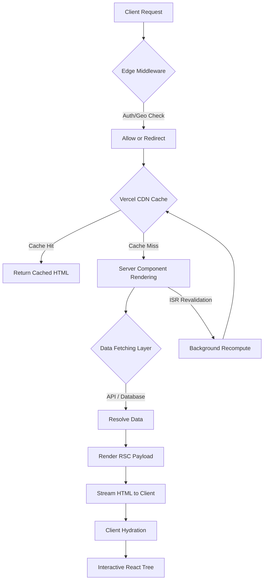

# What a Next.js and Vercel rebuild has to solve beyond deployment

## Introduction

Teams that have spent months building a monolithic Express or Rails application eventually hit a wall. The deployment pipeline is brittle, the rendering model is rigid, and the team starts asking whether a full rewrite on Next.js with Vercel hosting is the answer. It usually is — but not for the reasons most people think.

The `vercel deploy` command takes eleven seconds. That is the easy part. The hard part is the six months of architectural decisions that happen after the first deploy succeeds: how you partition rendering strategies across routes, where you draw runtime boundaries between Edge and Node.js, how you structure data fetching so it doesn't cascade into serial waterfalls, and what your revalidation pipeline actually looks like when a single stale product page costs you real revenue.

This article is about those decisions. The ones that don't show up in any tutorial.

## Why This Matters

Next.js on Vercel is not just a deployment target. It is a fundamentally different execution model. When you move from a traditional server-rendered app to the App Router, you are not porting routes — you are rethinking how every request gets handled, how data flows into components, and where compute actually happens.

In our production cluster, we migrated a 200k-line e-commerce platform from a custom Express backend to Next.js App Router over a fourteen-week sprint. The deployment itself was trivial. The parts that broke were things we hadn't anticipated: middleware behavior on the Edge, cache tag collisions in our ISR strategy, and the fact that our ORM's connection pooling assumptions completely fell apart when we moved to the Edge Runtime.

Teams that treat this as a deployment problem ship broken architectures. Teams that treat it as an architecture problem ship systems that scale.

## How It Works

The core mechanism behind Next.js on Vercel is a distributed rendering pipeline. A single HTTP request can pass through multiple execution contexts — Edge middleware, Server Components, Server Actions, and Route Handlers — before a response reaches the client. Understanding how these contexts interact is the difference between a well-architected system and a slow, unpredictable one.

Here is the high-level flow of how a request moves through the system:



Here is what happens step by step:

1. **Edge Middleware intercepts the request** before it reaches any route handler. This is where authentication checks, geo-routing, and feature flag evaluation happen at the network edge — close to the user, with sub-millisecond latency.

2. **The CDN checks for a cached response.** If the route is statically generated or has a fresh ISR cache entry, Vercel's global edge network returns the HTML immediately. No compute happens at origin.

3. **On a cache miss, Server Components execute at the Edge or Node.js runtime** depending on the route configuration. Each `async` server component can directly `await` data sources — no request/response cycle, no callback nesting.

4. **Data fetching resolves in parallel** where possible. React's Suspense boundaries allow the renderer to stream HTML chunks as each data promise resolves, rather than waiting for every query to finish before sending a single byte.

5. **ISR revalidation can happen on a schedule or on-demand.** When a cache entry expires or a revalidation webhook fires, the next request triggers a background recompute while serving stale content — the "stale-while-revalidate" pattern.

6. **The client receives streamed HTML and hydrates** the interactive portions. Client Components receive props serialized from the server render; Server Components never ship JavaScript to the browser.

The critical insight is that this pipeline is not linear. It is a mesh of execution contexts, and the architect's job is to decide which context handles which piece of work.

## Core Concepts

### Rendering Strategies as Route-Level Configuration

Every route in the App Router has a rendering mode. This is not a global setting — it is per-route, and the decisions compound across your application tree.

- **Static Generation (SSG):** The route renders at build time. The output is cached on Vercel's CDN indefinitely (or until ISR revalidation fires). Best for catalog pages, marketing pages, and anything that doesn't change per-user.

- **Server-Side Rendering (SSR):** The route renders on every request. Use sparingly. This is expensive and slow compared to ISR.

- **Incremental Static Regeneration (ISR):** The route generates at build time but revalidates after a configurable interval or on-demand. This is the sweet spot for most content-heavy routes.

- **Dynamic Server Components:** Routes that opt into per-request rendering with `dynamic = 'force-dynamic'`. Use for personalized, authenticated views.

### Runtime Boundaries

Vercel offers two server runtimes:

- **Edge Runtime:** Uses Web-standard APIs (`Request`, `Response`, `Headers`, `URL`). Extremely fast cold starts (sub-50ms). Does not support Node.js-specific modules like `fs`, `path`, or native database drivers that depend on TCP sockets.

- **Node.js Runtime:** Full Node.js compatibility. Supports everything in the Node ecosystem. Slower cold starts than Edge, but necessary for heavy data access patterns.

The default for Server Components is Node.js. Middleware runs on Edge by default. You explicitly opt into Edge for individual routes with `export const runtime = 'edge'`.

### Data Fetching and Caching

Next.js 14+ introduced a fetch-aware caching model. When you call `fetch()` inside a Server Component, Next.js intercepts that call and caches the response based on the `next` options you provide:

- `next.tags` — cache tags for on-demand revalidation
- `next.revalidate` — time-based revalidation in seconds
- No options — the result is cached indefinitely (static)

This is a significant shift from the traditional "fetch on every request" model. The cache lives in the deployment, not in your application memory.

## Examples & Code Walkthrough

### Example 1: Product Detail Page with ISR and On-Demand Revalidation

This is a realistic pattern for an e-commerce product page. The page is statically generated at build time, revalidates every 5 minutes on a schedule, and can be revalidated instantly when inventory changes.

```ts
// app/products/[id]/page.tsx

import { fetchProduct } from '@/lib/data/products';
import { notFound } from 'next/navigation';

// ISR: revalidate this page every 300 seconds (5 minutes)
export const revalidate = 300;

// Force dynamic rendering so params are resolved at request time
export const dynamicParams = true;

interface ProductPageProps {
  params: Promise<{ id: string }>;
}

export default async function ProductPage(props: ProductPageProps) {
  const { id } = await props.params;

  try {
    const product = await fetchProduct(id);

    if (!product) {
      notFound();
    }

    return (
      <main className="max-w-4xl mx-auto px-4 py-8">
        <ProductDetail product={product} />
        <RelatedProducts categoryId={product.categoryId} />
      </main>
    );
  } catch (error) {
    // Defensive: if the data layer is down, show a fallback
    // rather than crashing the entire route
    console.error(`Failed to load product ${id}:`, error);
    return <ProductFallback />;
  }
}
```

The `fetchProduct` function uses the Next.js cache model:

```ts
// lib/data/products.ts

const BASE_URL = process.env.API_URL!;

export async function fetchProduct(id: string) {
  // next.tags enables on-demand revalidation via route handler
  const res = await fetch(`${BASE_URL}/products/${id}`, {
    next: {
      tags: [`product-${id}`, 'product-list'],
    },
  });

  if (!res.ok) {
    // Distinguish between not-found (404) and server errors (5xx)
    if (res.status === 404) {
      return null;
    }
    throw new Error(`Product fetch failed: ${res.status}`);
  }

  return res.json();
}
```

And the on-demand revalidation endpoint:

```ts
// app/api/revalidate/route.ts

import { revalidateTag } from 'next/cache';
import { NextRequest, NextResponse } from 'next/server';

export async function POST(request: NextRequest) {
  const secret = request.nextUrl.searchParams.get('secret');

  // Validate the webhook secret — never skip this
  if (secret !== process.env.REVALIDATION_SECRET) {
    return NextResponse.json(
      { error: 'Invalid revalidation secret' },
      { status: 401 }
    );
  }

  try {
    const body = await request.json();
    const { productId, type } = body;

    if (!productId || !type) {
      return NextResponse.json(
        { error: 'Missing productId or type' },
        { status: 400 }
      );
    }

    // Revalidate the specific product and the product listing
    await revalidateTag(`product-${productId}`);

    if (type === 'category-update') {
      await revalidateTag('product-list');
    }

    return NextResponse.json({
      revalidated: true,
      now: Date.now(),
      tag: `product-${productId}`,
    });
  } catch (error) {
    console.error('Revalidation error:', error);
    return NextResponse.json(
      { error: 'Revalidation failed' },
      { status: 500 }
    );
  }
}
```

### Example 2: Parallel Data Loading to Avoid Waterfall Requests

A common mistake is nesting `await` calls inside server components, which creates serial data fetches. Here is how we fix it:

```ts
// app/dashboard/page.tsx

import { getUser } from '@/lib/data/user';
import { getOrders } from '@/lib/data/orders';
import { getNotifications } from '@/lib/data/notifications';
import { Suspense } from 'react';
import { DashboardSkeleton } from '@/components/DashboardSkeleton';

export default async function DashboardPage() {
  const session = await getUserSession();

  // Launch all three requests in parallel — not sequentially
  const [user, orders, notifications] = await Promise.all([
    getUser(session.userId),
    getOrders(session.userId),
    getNotifications(session.userId),
  ]);

  return (
    <div className="space-y-6">
      <h1 className="text-2xl font-bold">Dashboard</h1>

      <Suspense fallback={<OrdersSkeleton />}>
        <OrdersPanel orders={orders} />
      </Suspense>

      <NotificationList initialNotifications={notifications} />
    </div>
  );
}
```

The `Promise.all` pattern is the single most impactful performance change you can make in server component data fetching. Without it, three API calls that each take 200ms become a 600ms waterfall. With it, they take 200ms total.

### Example 3: Edge Middleware for Auth and Geo-Routing

```ts
// middleware.ts

import { NextRequest, NextResponse } from 'next/server';

export function middleware(request: NextRequest) {
  const { pathname } = request.nextUrl;

  // Admin route protection — check session cookie at the edge
  if (pathname.startsWith('/admin') && !pathname.startsWith('/admin/login')) {
    const sessionToken = request.cookies.get('auth_token')?.value;

    if (!sessionToken) {
      const loginUrl = new URL('/admin/login', request.url);
      loginUrl.searchParams.set('redirect', pathname);
      return NextResponse.redirect(loginUrl);
    }
  }

  // Geo-based locale routing
  const country = request.geo?.country;
  const supportedLocales = ['en', 'de', 'fr', 'ja'];
  const localePrefix = pathname.split('/')[1];

  // Only redirect if there's no locale prefix already
  if (!supportedLocales.includes(localePrefix) && country) {
    const localeMap: Record<string, string> = {
      DE: 'de',
      FR: 'fr',
      JP: 'ja',
    };

    const preferredLocale = localeMap[country] ?? 'en';

    if (localePrefix !== preferredLocale) {
      const localeUrl = request.nextUrl.clone();
      localeUrl.pathname = `/${preferredLocale}${pathname}`;
      return NextResponse.rewrite(localeUrl);
    }
  }

  return NextResponse.next();
}

export const config = {
  matcher: [
    // Match all routes except static assets and internal Next.js paths
    '/((?!_next/static|_next/image|favicon.ico|.*\\..*).*)',
  ],
};
```

## Best Practices

1. **Use `next: { tags }` for everything that changes.** Every server component data fetch should carry a cache tag. This gives you the ability to revalidate on-demand without resorting to full-page revalidation.

2. **Keep middleware lean.** Edge middleware runs on every matched request. If you put heavy logic there, you add latency to every page load. Offload complex authorization checks to server components or Route Handlers.

3. **Prefer ISR over SSR for most routes.** SSR on every request is expensive and provides poor cache utilization. ISR gives you the freshness of dynamic rendering with the performance of static delivery.

4. **Use `Suspense` boundaries to stream HTML.** Don't wait for every data promise to resolve before sending the first byte. Wrap sections in `Suspense` with meaningful fallback UI.

5. **Pin your Vercel Build Output API version.** The Build Output API changes between major versions. Pin it in `next.config.js` to avoid unexpected breaking changes during deploys.

6. **Set `dynamic = 'force-dynamic'` explicitly when needed.** Don't rely on implicit dynamic detection. It makes your rendering intent clear to anyone reading the file.

## Common Mistakes & Anti-Patterns

### Mistake 1: Using `revalidate` on Personalized Routes

```ts
// ANTI-PATTERN: ISR on a user-specific dashboard
export const revalidate = 60;

export default async function DashboardPage() {
  const user = await getCurrentUser();
  // This page is different for every user — ISR caches one version
  // and serves it to everyone, which is wrong
  return <Dashboard user={user} />;
}
```

**Fix:** Use `dynamic = 'force-dynamic'` for personalized routes. ISR is for shared content. If every user sees different data, you cannot cache a single version.

```ts
// CORRECT: Dynamic rendering for personalized content
export const dynamic = 'force-dynamic';

export default async function DashboardPage() {
  const user = await getCurrentUser();
  return <Dashboard user={user} />;
}
```

###
