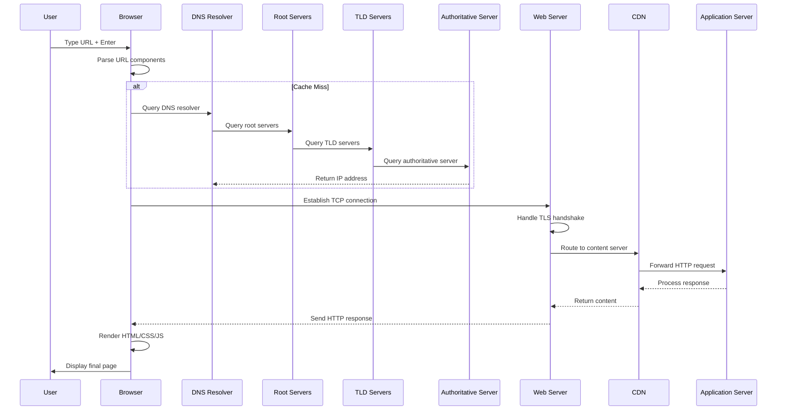

# # What Actually Happens When You Type a URL Into Your Browser?

## Introduction
You hit enter after typing `https://pypi.org/project/django`. Your screen flashes white, then the Django package page loads. Simple, right?

Not even close.

That single keystroke triggers a cascade of network protocols, cryptographic handshakes, and distributed database queries spanning multiple continents. Most developers touch none of these systems directly, but understanding them separates competent coders from those who build resilient, performant applications.

Let me walk you through what actually happens—and why it matters more than you think.

## Why This Matters
Browser networking isn't academic. It's the foundation of every web application you build.

When you optimize API calls, implement caching, or debug slow load times, you're making decisions based on how this pipeline behaves. Misunderstanding DNS resolution leads to unnecessary latency. Ignoring connection reuse burns through file descriptors. Poor TLS configuration creates security vulnerabilities.

I've seen teams waste weeks debugging "slow database queries" that were actually DNS timeouts. Others shipped apps that couldn't scale because they opened new connections for every request instead of pooling them.

This knowledge isn't optional—it's essential for building systems that work at scale.

## How It Works


The journey breaks down into distinct phases:

1. **Input Processing**: Browser parses and validates the URL
2. **Name Resolution**: Converts domain to IP via DNS
3. **Connection Setup**: Establishes TCP/TLS channels
4. **Request Transmission**: Sends HTTP request
5. **Response Handling**: Receives and processes data
6. **Rendering**: Constructs DOM and displays content

Each phase involves complex protocols working in concert.

## Core Concepts
Understanding these fundamentals helps you make better engineering decisions:

**URI vs URL vs URN**
- URI (Uniform Resource Identifier): Broad category including both URLs andURNs
- URL (Uniform Resource Locator): Specifies location and access method
- URN (Uniform Resource Name): Persistent identifier within a namespace

**DNS Resolution Hierarchy**
1. Browser cache (fastest, stores recent lookups)
2. OS cache (system-level DNS cache)
3. Local network resolver (ISP or corporate DNS)
4. Recursive queries up to root servers

**TCP Connection States**
Connections go through SYN_SENT → ESTABLISHED → FIN_WAIT → CLOSED. Understanding these states helps debug connection leaks and timeouts.

**HTTP/2 Multiplexing**
Multiple requests share single TCP connections, reducing latency compared to HTTP/1.1's sequential approach.

## Examples & Code Walkthrough
Here's a practical DNS resolution simulation showing how browsers actually resolve domains:

```python
import socket
import time
from typing import Optional, Dict, List
from dataclasses import dataclass
from enum import Enum

class ResolutionStage(Enum):
    CACHE_HIT = "cache_hit"
    LOCAL_DNS = "local_dns"
    RECURSIVE_QUERY = "recursive_query"
    TIMEOUT = "timeout"

@dataclass
class DNSRecord:
    domain: str
    ip_address: str
    ttl: int
    resolved_at: float
    stage: ResolutionStage

class BrowserDNSResolver:
    """Simulates browser DNS resolution with caching and fallback strategies."""
    
    def __init__(self):
        self._cache: Dict[str, DNSRecord] = {}
        self._max_cache_size = 1000
        
    def resolve(self, domain: str, timeout: float = 5.0) -> Optional[str]:
        # Check browser cache first
        if domain in self._cache:
            record = self._cache[domain]
            if time.time() - record.resolved_at < record.ttl:
                return record.ip_address
        
        # Attempt system DNS resolution
        try:
            start_time = time.time()
            ip_address = socket.gethostbyname(domain)
            resolution_time = time.time() - start_time
            
            # Cache successful resolution
            self._cache[domain] = DNSRecord(
                domain=domain,
                ip_address=ip_address,
                ttl=min(300, max(60, int(300 / max(1, resolution_time)))),  # Dynamic TTL
                resolved_at=time.time(),
                stage=ResolutionStage.LOCAL_DNS
            )
            
            return ip_address
        except socket.gaierror:
            return None
    
    def batch_resolve(self, domains: List[str]) -> Dict[str, Optional[str]]:
        """Resolve multiple domains efficiently."""
        results = {}
        for domain in domains:
            results[domain] = self.resolve(domain)
        return results

# Usage example
resolver = BrowserDNSResolver()
ip = resolver.resolve("httpbin.org")
print(f"Resolved httpbin.org to {ip}")
```

This demonstrates how browsers balance speed (caching) with reliability (fallback mechanisms).

## Best Practices
Apply these rules when working with browser networking:

1. **Always validate URLs before processing**
   ```python
   from urllib.parse import urlparse
   import re
   
   def safe_url_parse(url: str) -> dict:
       """Parse and sanitize URL components safely."""
       if not url or len(url) > 2048:  # Browser URL length limits
           raise ValueError("Invalid URL length")
       
       parsed = urlparse(url.strip())
       if not parsed.scheme in ['http', 'https']:
           raise ValueError("Only HTTP/HTTPS schemes supported")
       
       return {
           'scheme': parsed.scheme,
           'host': parsed.hostname or '',
           'port': parsed.port or (443 if parsed.scheme == 'https' else 80),
           'path': parsed.path or '/',
           'query': parsed.query
       }
   ```

2. **Implement proper connection pooling**
   ```python
   import urllib3
   
   # Reuse connections across requests
   http_pool = urllib3.PoolManager(
       num_pools=10,
       maxsize=20,
       block=True
   )
   ```

3. **Use DNS prefetching hints**
   ```html
   <link rel="dns-prefetch" href="//api.example.com">
   <link rel="preconnect" href="https://cdn.example.com">
   ```

4. **Handle timeouts gracefully**
   ```python
   response = http_pool.request(
       'GET', 
       'https://api.example.com/data',
       timeout=urllib3.Timeout(connect=2.0, read=5.0),
       retries=0  # Fail fast rather than retry endlessly
   )
   ```

## Common Mistakes & Anti-Patterns
Here are critical errors I see repeatedly in production code:

**Mistake #1: Bypassing URL validation**
```python
# BAD - Direct string manipulation
url = user_input.replace(' ', '')

# GOOD - Proper parsing and sanitization
parsed = urlparse(user_input)
if not parsed.scheme:
    url = f"https://{parsed.path}"
```

**Mistake #2: Creating new connections per request**
```python
# BAD - Connection leak waiting to happen
for item in items:
    conn = http.client.HTTPSConnection("api.example.com")
    conn.request("GET", f"/item/{item}")
    response = conn.getresponse()
    conn.close()  # Often forgotten!

# GOOD - Connection pooling
pool = urllib3.PoolManager()
for item in items:
    resp = pool.request('GET', f"https://api.example.com/item/{item}")
```

**Mistake #3: Ignoring DNS caching**
```python
# BAD - Repeated DNS lookups
ips = [socket.gethostbyname('service.cluster.local') for _ in range(1000)]

# GOOD - Cache resolution
ip = socket.gethostbyname('service.cluster.local')
ips = [ip] * 1000
```

**Mistake #4: No timeout handling**
```python
# BAD - Requests hang indefinitely
response = requests.get('https://slow-api.example.com/data')

# GOOD - Explicit timeouts
response = requests.get(
    'https://slow-api.example.com/data',
    timeout=(3.05, 27)  # (connect_timeout, read_timeout)
)
```

## Performance Considerations
Network operations are typically I/O bound, not CPU bound. Optimize accordingly:

**DNS Resolution Timing**
- Browser cache: ~0ms
- System resolver: 1-50ms
- Recursive DNS query: 50-200ms
- Failed resolution: 5-30 seconds (timeout)

**Connection Overhead**
TCP handshake: 1 RTT
TLS negotiation: 2-3 RTTs
HTTP/1.1: 1 RTT per request
HTTP/2: 1 RTT for all multiplexed requests

**Memory Impact**
Each connection consumes ~8KB kernel memory. 10,000 concurrent connections = 80MB just for socket buffers.

**Scalability Limits**
- File descriptor limits (~65K per process on Linux)
- Ephemeral port exhaustion (32K available)
- Kernel TCP buffer memory pressure

For high-throughput services, implement connection pooling and consider HTTP/2 or HTTP/3 (QUIC).

## Real-World Usage
Major platforms optimize this pipeline extensively:

**Cloudflare's Argo Smart Routing**
Uses real-time network intelligence to choose optimal paths between data centers, reducing latency by 10-50% globally.

**Google's Public DNS**
Implements aggressive caching and anycast routing, achieving 99.99% availability with sub-10ms response times.

**Netflix's Edge Architecture**
Deploys DNS resolvers at edge locations to minimize lookup latency for streaming content delivery.

**AWS CloudFront**
Prefetches DNS records and maintains persistent connections to reduce cold-start penalties for dynamic content.

These companies invest millions in infrastructure because every millisecond costs revenue.

## Frequently Asked Questions (FAQ)

**Q: How does HTTP/3 improve performance over HTTP/2?**
A: HTTP/3 runs over QUIC (UDP-based), eliminating TCP head-of-line blocking. It also integrates TLS 1.3 directly into the transport layer, saving 1-2 RTTs during connection establishment.

**Q: What's the difference between prefetch and preconnect?**
A: `<link rel="dns-prefetch">` only resolves DNS. `<link rel="preconnect">` establishes full TCP/TLS connections. Use prefetch for third-party domains, preconnect for same-origin resources you know you'll need.

**Q: How long do browsers actually cache DNS records?**
A: Browsers respect TTL values but cap them. Chrome typically caps at 2 minutes for regular sites, up to 30 minutes for pinned certificates. Firefox uses similar heuristics.

**Q: Can I force browsers to bypass DNS caching?**
A: Not reliably. Modern browsers aggressively cache DNS results. To test DNS changes, clear browser cache entirely or use incognito mode (though even that may retain some cached entries).

## Conclusion
That simple URL you typed triggered dozens of protocols, cryptographic operations, and distributed database queries. Understanding this pipeline transforms how you approach web development.

Key takeaways:
- Always validate and sanitize URLs before processing
- Implement proper connection pooling and timeout handling  
- Leverage DNS prefetching and preconnect hints
- Monitor actual network performance, not just application metrics
- Design systems assuming network failures are normal

The next time your app feels slow, remember: it might not be your code. It might be DNS. It might be TCP handshakes. It might be TLS negotiation.

Now you know where to look.
